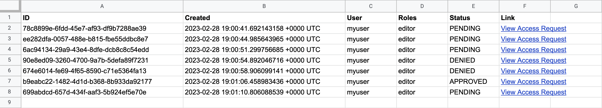

With Teleport [Access Requests](../access-controls/access-requests/access-requests.mdx), you can
assign Teleport users to less privileged roles by default and allow them to
temporarily escalate their privileges. Reviewers can grant or deny Access
Requests within your organization's existing communication workflows (e.g.,
Slack, email, and PagerDuty) using [Access Request
plugins](../access-controls/access-request-plugins/access-request-plugins.mdx).

You can use Teleport's API client library to build an Access Request plugin that
integrates with your organization's unique workflows. 

In this guide, we will explore a number of Teleport's API client libraries by
showing you how to write a plugin that lets you manage Access Requests via
Google Sheets. The plugin lists new Access Requests in a Google Sheets
spreadsheet, with links to allow or deny each request. 



<Admonition type="danger">

The plugin we will build in this guide is intended as a learning tool. **Do not
connect it to your production Teleport cluster.**  Use a demo cluster instead.

</Admonition>

## Prerequisites

(!docs/pages/includes/commercial-prereqs-tabs.mdx!)

- Go version (=teleport.golang=)+ installed on your workstation. See the [Go
  download page](https://go.dev/dl/). You do not need to be familiar with Go to
  complete this guide, though Go knowledge is required if you want to build your
  own Access Request plugin.

You will need the following in order to set up the demo plugin, which requires
authenticating to the Google Sheets API:

- A Google Cloud project with permissions to create service accounts.
- A Google account that you will use to create a Google Sheets spreadsheet. We
  will grant permissions to edit the spreadsheet to the service account used for
  the plugin.

<Admonition type="tip">

Even if you do not plan to set up the demo project, you can follow this guide to see
which libraries, types, and functions you can use to develop an Access Request
plugin. 

The demo is a minimal working example, and you can see fully fledged plugins in
the
[`gravitational/teleport`](https://github.com/gravitational/teleport/tree/v(=teleport.version=)/integrations/access).
repository on GitHub.

</Admonition>

## Step 1/5. Set up your Go project

Download the source code for our minimal Access Request plugin:

```code
$ git clone https://github.com/gravitational/teleport -b branch/v(=teleport.major_version=)
$ cd teleport/examples/access-plugin-minimal
```

For the rest of this guide, we will show you how to set up this plugin and
explore the way the plugin uses Teleport's API to integrate Access Requests with
a particular workflow.

## Step 2/5. Set up the Google Sheets API

Access Request plugins typically communicate with two APIs. They receive Access
Request events from the Teleport Auth Service's gRPC API, and use the data to
interact with the API of your chosen messaging or collaboration tool.

In this section, we will enable the Google Sheets API, create a Google Cloud
service account for the plugin, and use the service account to authenticate the
plugin to Google Sheets.

### Enable the Google Sheets API

Enable the Google Sheets API by visiting the following Google Cloud console URL:

https://console.cloud.google.com/apis/enableflow?apiid=sheets.googleapis.com

Ensure that your Google Cloud project is the one you intend to use. 

Click **Next** > **Enable**.

### Create a Google Cloud service account for the plugin

Visit the following Google Cloud console URL:

https://console.cloud.google.com/iam-admin/serviceaccounts

Click **Create Service Account**.

For **Service account name**, enter "Teleport Google Sheets Plugin". Google
Cloud will populate the **Service account ID** field for you.

Click **Create and Continue**. When prompted to grant roles to the service
account, click **Continue** again. We will create our service account without
roles. Skip the step to grant users access to the service account, clicking
**Done**.

The console will take you to the **Service accounts** view. Click the name of
the service account you just created, then click the **Keys** tab. Click **Add
Key**, then **Create new key**. Leave the **Key type** as "JSON" and click
**Create**.

Save your Google Cloud credentials file as `credentials.json` in your Go project
directory.

Your plugin will use this JSON file to authenticate to Google Sheets.

### Create a Google Sheets spreadsheet

Visit the following URL and make sure you are authenticated as the correct user:

https://sheets.new

Name your spreadsheet.

Give the plugin access to the spreadsheet by clicking **Share**. In the **Add
people and groups** field, enter
`teleport-google-sheets-plugin@PROJECT_NAME.iam.gserviceaccount.com`, replacing
`PROJECT_NAME` with the name of your project. Make sure that the service account
has "Editor" permissions. Click **Share**, then **Share anyway** when prompted
with a warning.

By authenticating to Google Sheets with the service account you created, the
plugin will have access to modify your spreadsheet.

Next, ensure that the following is true within your spreadsheet:

- There is only one sheet
- The sheet includes the following columns:

|ID|Created|User|Roles|Status|Link|
|---|---|---|---|---|---|

After we write our Access Request plugin, it will populate the spreadsheet with
data automatically.

## Step 3/5. Set up Teleport RBAC

In this section, we will set up Teleport roles that enable creating and
reviewing Access Requests, plus another Teleport role that can generate
credentials for your Access Request plugin to authenticate to Teleport.

### Create a user and role for the plugin

(!docs/pages/includes/plugins/rbac.mdx!)

(!/docs/pages/includes/plugins/rbac-impersonate.mdx!)

### Export the access plugin identity

You will use the `tctl auth sign` command to request the credentials that the
`access-plugin` needs to connect to your Teleport cluster.

The following `tctl auth sign` command impersonates the `access-plugin` user,
generates signed credentials, and writes an identity file to the local
directory:

```code
$ tctl auth sign --user=access-plugin --out=auth.pem
```

Teleport's Access Request plugins listen for new and updated Access Requests by
connecting to the Teleport Auth Service's gRPC endpoint over TLS.

The identity file, `auth.pem`, includes both TLS and SSH credentials. Your
Access Request plugin uses the SSH credentials to connect to the Proxy Service,
which establishes a reverse tunnel connection to the Auth Service. The plugin
uses this reverse tunnel, along with your TLS credentials, to connect to the
Auth Service's gRPC endpoint.

You will refer to this file later when configuring the plugin.

### Set up Role Access Requests

In this guide, we will use our plugin to manage Role Access Requests. For this
to work, we will set up Role Access Requests in your cluster.

(!/docs/pages/includes/plugins/editor-request-rbac.mdx!)

## Step 4/5. Write the Access Request plugin

In this step, we will walk you through the structure of the Access Request
plugin in `examples/access-plugin-minimal/main.go`. You can use the example here
to write your own Access Request plugin.

### Imports

Here are the packages our Access Request plugin will import from Go's standard
library:

|Package|Description|
|---|---|
|`context`|Includes the `context.Context` type. `context.Context` is an abstraction for controlling long-running routines, such as connections to external services, that might fail or time out. Programs can cancel contexts or assign them timeouts and metadata. |
|`errors`|Working with errors.|
|`fmt`|Formatting data for printing, strings, or errors.|
|`strings`|Manipulating strings.|

The plugin imports the following third-party code:

|Package|Description|
|---|---|
|`github.com/gravitational/teleport/api/client`|A library for authenticating to the Auth Service's gRPC API and making requests.|
|`github.com/gravitational/teleport/api/types`|Types used in the Auth Service API, e.g., Access Requests.|
|`github.com/gravitational/trace`|Presenting errors with more useful detail than the standard library provides.|
|`google.golang.org/api/option`|Settings for configuring Google API clients.|
|`google.golang.org/api/sheets/v4`|The Google Sheets API client library, aliased as `sheets` in our program.|
|`google.golang.org/grpc`|The gRPC client and server library.|

### Configuration

First, we declare two constants that you need to configure for your environment:

```go
(!examples/access-plugin-minimal/config.go!)
```

`proxyAddr` indicates the hostname and port of your Teleport Proxy Service or
Teleport Enterprise Cloud tenant. Assign it to the address of your own Proxy
Service, e.g., `mytenant.teleport.sh:443`.

Assign `spreadSheetID` to the ID of the spreadsheet you created earlier. To find
the spreadsheet ID, visit your spreadsheet in Google Drive. The ID will be in
the URL path segment called `SPREADSHEET_ID` below:

```text
https://docs.google.com/spreadsheets/d/SPREADHSEET_ID/edit#gid=0
```

### The `AccessRequestPlugin` type

The `plugin.go` file declares types that we will use to organize our Access
Request plugin code:

```go
(!examples/access-plugin-minimal/plugin.go!)
```

The `AccessRequestPlugin` type represents a generic Access Request plugin, and
you can use this type to build your own plugin. It contains a Teleport API
client and an `EventHandler`, any Go type that implements a `HandleEvent`
method.

In our case, the type that implements `HandleEvent` is `googleSheetsClient`, a
struct type that contains an API client for Google Sheets.

### Prepare row data

Whether creating a new row of the spreadsheet or updating an existing one, we
need a way to extract data from an Access Request in order to provide it to
Google Sheets. We achieve this with the `makeRowData` method:

```go
(!examples/access-plugin-minimal/makerowdata.go!)
```

The `sheets.RowData` type makes extensive use of pointers to strings, so we
introduce a utility function called `stringPtr` that returns the pointer to the
provided string. This makes it easier to assign the values of cells in the
`sheets.RowData` using chains of function calls.

`makeRowData` is a method of the `googleSheetsClient` type. (The `*` before
`googleSheetsClient` indicates that the method receives a *pointer* to a
`googleSheetsClient`.) It takes a `types.AccessRequest`, which Teleport's API
library uses to represent the fields within an Access Request.

The Google Sheets client library defines a `sheets.RowData` type that we
include in requests to update a spreadsheet. This function converts a
`types.AccessRequest` into a `*sheets.RowData` (another pointer). 

Access Requests have one of four states: approved, denied, pending, and none.
We obtain the request states from Teleport's `types` library and map them to
strings in the `requestStates` map.

When extracting the data, we use the `types.AccessRequest.GetName()` method to
retrieve the ID of the Access Request as a string we can include in the
spreadsheet. 

Users can review an Access Request by visiting a URL within the Teleport Web UI
that corresponds to the request's ID. `makeRowData` assembles a `=HYPERLINK`
formula that we can insert into the spreadsheet as a link to this URL.

### Create a row

The following function submits a request to the Google Sheets API to create a
new row based on an incoming Access Request, using the data returned by
`makeRowData`. It returns an error if the attempt to create a row failed:

```go
(!examples/access-plugin-minimal/createrow.go!)
```

`createRow` assembles a `sheets.BatchUpdateSpreadsheetRequest` and sends it to
the Google Sheets API using `g.sheetsClient.BatchUpdate()`, returning errors
encountered while sending the request.

We log unexpected HTTP status codes without returning an error since these may
be transient server-side issues. A production Access Request plugin would handle
these situations in a more sophisticated way, e.g., storing the request so it
can retry it later.

### Update a row

The code for updating a row is similar to the code for creating a new row: 

```go
(!examples/access-plugin-minimal/updaterow.go!)
```

The only difference between `updateRow` and `createRow` is that we send a
`&sheets.UpdateCellsRequest` instead of a `&sheets.AppendCellsRequest`. This
function takes the number of a row within the spreadsheet to update and sends a
request to update that row with information from the provided Access Request.

### Determine where to update the spreadsheet

When our program receives an event that updates an Access Request, it needs a
way to look up the row in the spreadsheet that corresponds to the Access Request
so it can update the row:

```go
(!examples/access-plugin-minimal/updatespreadsheet.go!)
```

`updateSpreadSheet` takes a `types.AccessRequest`, gets the latest data from
your spreadsheet, determines which row to update, and calls `updateRow`
accordingly. It uses linear search to look up the first column within each row
of the sheet and check whether that column matches the ID of the Access Request.
It then calls `updateRow` with the Access Request and the row's number.

### Handle incoming Access Requests

The plugin calls a handler function when it receives an event. To set this up,
we use the `Run` method of our generic `AccessRequestPlugin` type, which
contains the main loop of the plugin:

```go
(!examples/access-plugin-minimal/watcherjob.go!)
```

As we described above, the `AccessRequestPlugin` type's `EventHandler` field is
assigned to an interface with a `HandleEvent` method. In this case, the
implementation is `*googleSheetsClient.HandleEvent`. This method checks whether
an Access Request is in a pending state, i.e., whether the request is new. If
so, it calls `createRow`. If not, it calls `updateSpreadsheet`.

The Teleport API client type, `client.Client`, has a `NewWatcher` method that
listens for new audit events from the Auth Service API via a gRPC stream. The
second parameter of the method indicates the type of audit event to watch for,
in this case, events having to do with Access Requests.

The result of `NewWatcher`, a `types.Watcher`, enables `Run` to respond to new
audit events by calling the `Events` method. This returns a Go **channel**, a
runtime abstraction that allows concurrent routines to communicate. Another
channel, returned by `Done`, indicates when the watcher has finished.

In a `for` loop, the `Run` method receives from either the `Done` channel or
`Events` channel, whichever is ready to send first. If it receives from the
`Events` channel, it calls the `HandleEvent` method to process the event.

### Initialize the API clients

Now we have all the code we need to use the Teleport and Google Sheets API
clients to listen for Access Request events and use them to maintain a
spreadsheet. The final step is to start our program by initializing the API
clients:

```go
(!examples/access-plugin-minimal/main.go!)
```

The `main` function, the entrypoint to our program, initializes an
`AccessRequestPlugin` and `googleSheetsClient` and uses them run the plugin. 

The function creates a Google Sheets API client by loading the credentials file
you downloaded earlier at the relative path `credentials.json`.

`client` is Teleport's library for setting up an API client. Our plugin does so
by calling `client.LoadIdentityFile` to obtain a `client.Credentials`. It then
uses the `client.Credentials` to call `client.New`, which connects to the
Teleport Proxy Service specified in the `Addrs` field using the provided
identity file.

In this example, we are passing the `grpc.WithReturnConnectionError()` function
call to `client.New`, which instructs the gRPC client to return more detailed
connection errors.

<Admonition type="warning">

This program does not validate your credentials or Teleport cluster address.
Make sure that: 

- The identity file you exported earlier does not have an expired TTL
- The value you supplied for the `proxyAddr` constant includes both the host
  **and** the web port of your Teleport Proxy Service, e.g.,
  `mytenant.teleport.sh:443`

</Admonition>

## Step 5/5. Test your plugin

Run the plugin to forward Access Requests from your Teleport cluster to Google
Sheets. Execute the following command from within
`examples/access-plugin-minimal`:

```code
$ go run teleport-sheets
```

Now that the plugin is running, create an Access Request:

(!docs/pages/includes/plugins/create-request.mdx!)

You should see the new Access Request in your spreadsheet with the `PENDING`
state.

In your spreadsheet, click "View Access Request" next to your new request. Sign
into the Teleport Web UI as your original user. When you submit your review,
e.g., deny the request, the new status will appear within the spreadsheet.

<Admonition type="danger">

Access Request plugins must not enable reviewing Access Requests via the plugin,
and must always refer a reviewer to the Teleport Web UI to complete the review.
Otherwise, an unauthorized party could spoof traffic to the plugin and escalate
privileges. 

</Admonition>

## Next steps

In this guide, we showed you how to set up an Access Request plugin using
Teleport's API client libraries. To go beyond the minimal plugin we demonstrate
in this guide, you can use the Teleport API to set up more sophisticated
workflows that take full advantage of your communication and project management
tools. 

### Manage state

While the plugin we developed in this guide is stateless, updating Access
Request information by searching all rows of a spreadsheet, real-world Access
Request plugins typically need to manage state. You can use the
[`plugindata`](https://pkg.go.dev/github.com/gravitational/teleport/api/types#PluginData)
package to make it easier for your Access Request plugin to do this. 

### Consult the examples

Explore the
[`gravitational/teleport`](https://github.com/gravitational/teleport/tree/v(=teleport.version=)/integrations/access).
repository on GitHub for examples of plugins developed at Teleport. You can see
how these plugins use the packages we discuss in this guide, as well as how they
add more complete functionality like configuration validation and state
management.

### Provision the plugin with short-lived credentials

In this example, we used the `tctl auth sign` command to fetch credentials for
the plugin. For production usage, we recommend provisioning short-lived
credentials via Machine ID, which reduces the risk of these credentials becoming
stolen. View our [Machine ID documentation](../../enroll-resources/machine-id/introduction.mdx) to
learn more.

