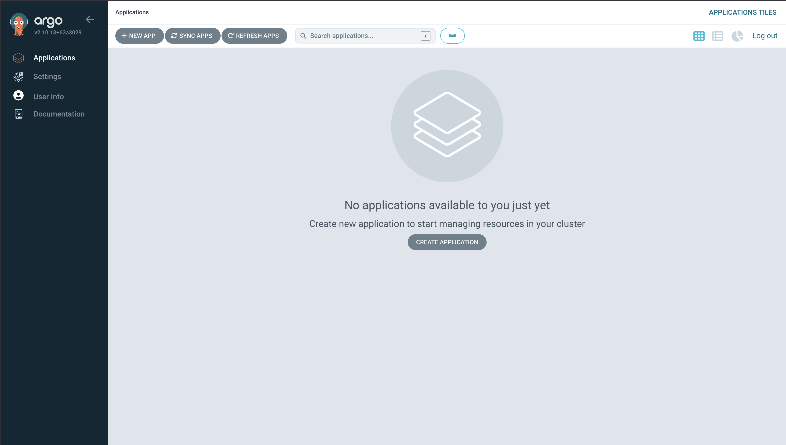
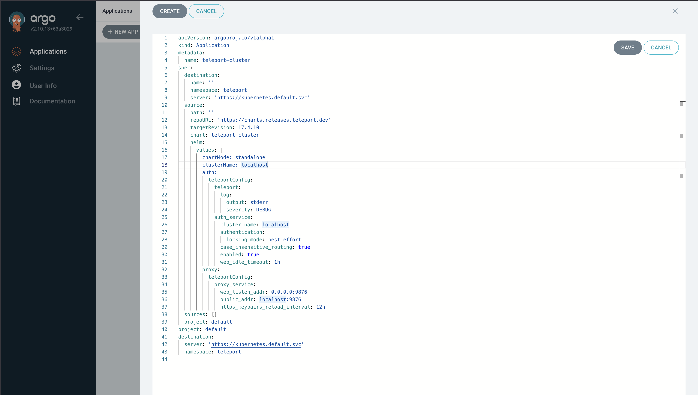
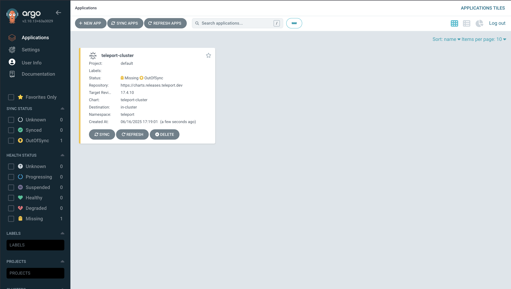
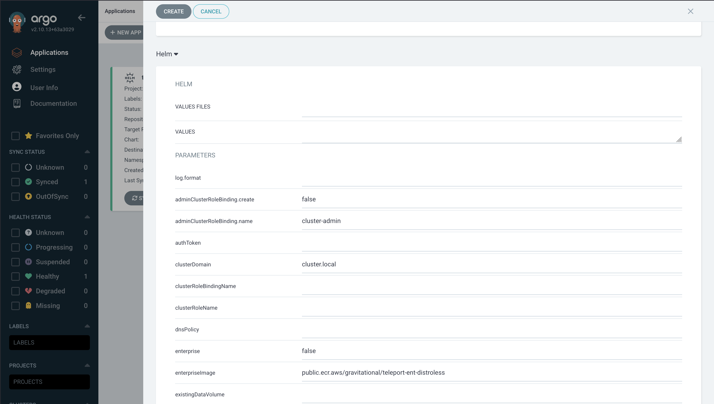

Teleport can provide secure, unified access to your Kubernetes clusters. This
guide will show you how to deploy Teleport on a Kubernetes cluster using Helm
and ArgoCD.

## How it works

While completing this guide, you will deploy one Teleport pod each for the Auth
Service and Proxy Service in your Kubernetes cluster, and a load balancer that
forwards outside traffic to your Teleport cluster. Users can then access your
Kubernetes cluster via the Teleport cluster running within it.

## Prerequisites

- A registered domain name. This is required for Teleport to set up TLS via
  Let's Encrypt and for Teleport clients to verify the Proxy Service host.

- A Kubernetes cluster hosted by a cloud provider, which is required for the
  load balancer we deploy in this guide. We recommend following this guide on a
  non-production cluster to start.

- A persistent volume that the Auth Service can use for storing cluster state.
  Make sure your Kubernetes cluster has one available.
  
  
  ```code
  $ kubectl get pv
  ```

  If there are no persistent volumes available, you will need to either provide
  one or enable [dynamic volume
  provisioning](https://kubernetes.io/docs/concepts/storage/dynamic-provisioning/#enabling-dynamic-provisioning)
  for your cluster. For example, in Amazon Elastic Kubernetes Service, you can
  configure the [Elastic Block Store Container Storage Interface driver
  add-on](https://docs.aws.amazon.com/eks/latest/userguide/managing-ebs-csi.html).

  To tell whether you have dynamic volume provisioning enabled, check for the
  presence of a default `StorageClass`:

  ```code
  $ kubectl get storageclasses
  ```

- The `tsh` client tool v(=teleport.version=)+ installed on your workstation.
  You can download this from our [installation page](../../../installation.mdx).
  
- ArgoCD version 2.10 or greater.

## Step 1/2. Install Teleport

1. Install the `teleport-cluster` Helm chart, which deploys the Teleport Auth
   Service and Proxy Service on your Kubernetes cluster.

### Install the `teleport-cluster` Helm chart

1. Create a namespace for Teleport and configure its Pod Security Admission,
   which enforces security standards on pods in the namespace:

   ```code
   $ kubectl create namespace teleport-cluster
   namespace/teleport-cluster created
   
   $ kubectl label namespace teleport-cluster 'pod-security.kubernetes.io/enforce=baseline'
   namespace/teleport-cluster labeled
   ```

2. Navigate to the 'Application Page in ArgoCD', then select 'New App'.




3. Then select 'Edit as YAML'



Example teleport-cluster configuration
``` yaml
apiVersion: argoproj.io/v1alpha1
kind: Application
metadata:
  name: teleport-cluster
spec:
  destination:
    name: ''
    namespace: teleport
    server: 'https://kubernetes.default.svc'
  source:
    path: ''
    repoURL: 'https://charts.releases.teleport.dev'
    targetRevision: 17.4.10
    chart: teleport-cluster
    helm:
      values: |-
        chartMode: standalone
        clusterName: localhost
        auth:
          teleportConfig:
            teleport:
              log:
                output: stderr
                severity: DEBUG
            auth_service:
              cluster_name: localhost
              authentication:
                locking_mode: best_effort
              case_insensitive_routing: true
              enabled: true
              web_idle_timeout: 1h
        proxy:
          teleportConfig:
            proxy_service:
              web_listen_addr: 0.0.0.0:9876
              public_addr: localhost:9876
              https_keypairs_reload_interval: 12h
  sources: []
  project: default
project: default
destination:
  server: 'https://kubernetes.default.svc'
  namespace: teleport
```

4. Edit this example configuration to match your needs.
More information on how to modify helm this the helm chart
and values can be found in the [Helm deployments guide](./helm-deployments.mdx).
5. Then select 'Sync' to apply the changes.




### Install the `teleport-kube-agent` Helm chart via ArgoCD

#### Prerequisites

- An existing Teleport cluster (at least proxy and auth services)
- A reachable proxy endpoint
- A reachable reverse tunnel port on the proxy.
  The address is automatically retrieved from the Teleport proxy configuration.
- A join token for the Teleport Cluster.

1. Follow the steps for creating a new app in ArgoCD as above.
   Using the following yaml as a template to configure the Kube agent.

``` yaml
apiVersion: argoproj.io/v1alpha1
kind: Application
metadata:
  name: teleport-kube-agent
spec:
  destination:
    name: ''
    namespace: teleport
    server: 'https://kubernetes.default.svc'
  source:
    path: ''
    repoURL: 'https://charts.releases.teleport.dev'
    targetRevision: 17.4.10
    chart: teleport-kube-agent
  sources: []
  project: default
```

2.	Additionally helm parameters can be set in the 'Create App'
	
3. Once you have finished configuring your the chart. Sync the state to apply the changes.
