In this guide, we'll go through how to set up a High Availability Teleport cluster with multiple replicas in Kubernetes
using Teleport Helm charts and Google Cloud Platform products (Firestore and Google Cloud Storage).

If you are already running Teleport on another platform, you can use your
existing Teleport deployment to access your Kubernetes cluster. [Follow our
guide](../../../enroll-resources/kubernetes-access/getting-started.mdx) to connect your Kubernetes
cluster to Teleport.

(!docs/pages/includes/cloud/call-to-action.mdx!)

## Prerequisites

(!docs/pages/includes/kubernetes-access/helm/teleport-cluster-prereqs.mdx!)

## Step 1/6. Add the Teleport Helm chart repository

(!docs/pages/includes/kubernetes-access/helm/helm-repo-add.mdx!)

<Admonition
  type="note"
  title="Note">
>
  The steps below apply to Google Cloud Google Kubernetes Engine (GKE) Standard deployments.
</Admonition>

## Step 2/6. Google Cloud IAM configuration

For Teleport to be able to create the Firestore collections, indexes, and the Google Cloud Storage bucket it needs,
you'll need to configure a Google Cloud service account with permissions to use these services.

### Create an IAM role granting the `storage.buckets.create` permission

Go to the "Roles" section of Google Cloud IAM & Admin.

1. Click the "Create Role" button at the top.

   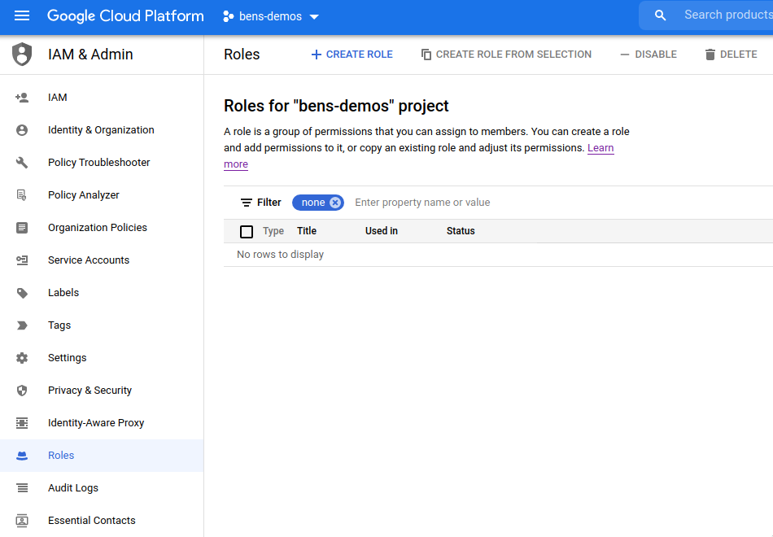

2. Fill in the details of a "Storage Bucket Creator" role (we suggest using the name `storage-bucket-creator-role`)

   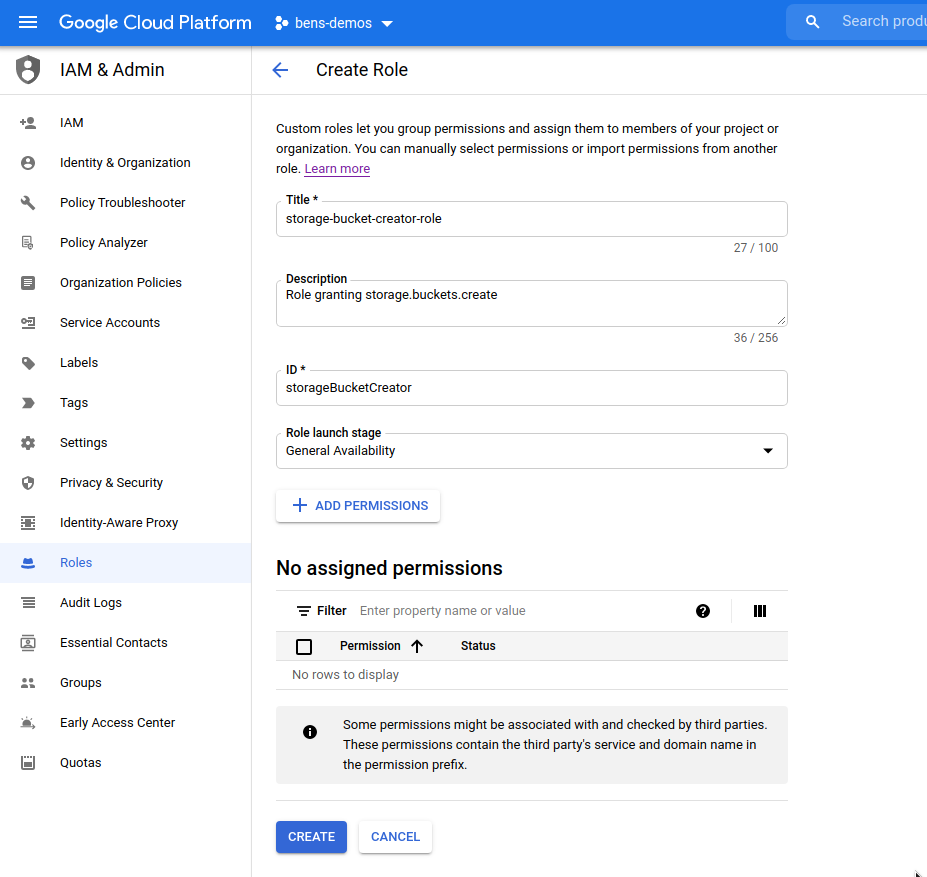

3. Click the "Add Permissions" button.

   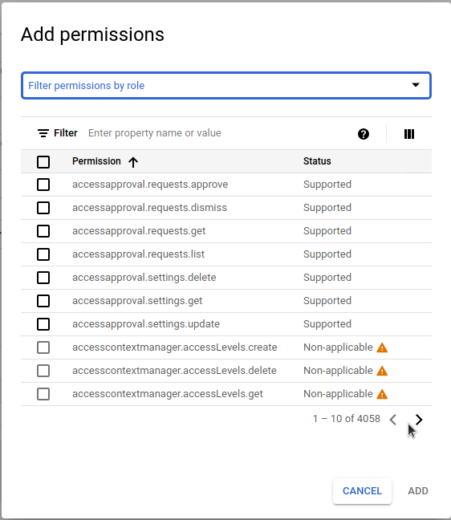

4. Use the "Filter" box to enter `storage.buckets.create` and select it in the list.

   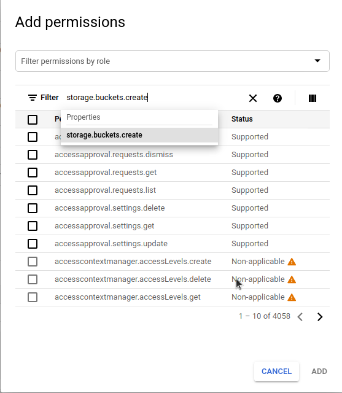

5. Check the `storage.buckets.create` permission in the list and click the "Add" button to add it to the role.

   

6. Once all these settings are entered successfully, click the "Create" button.

   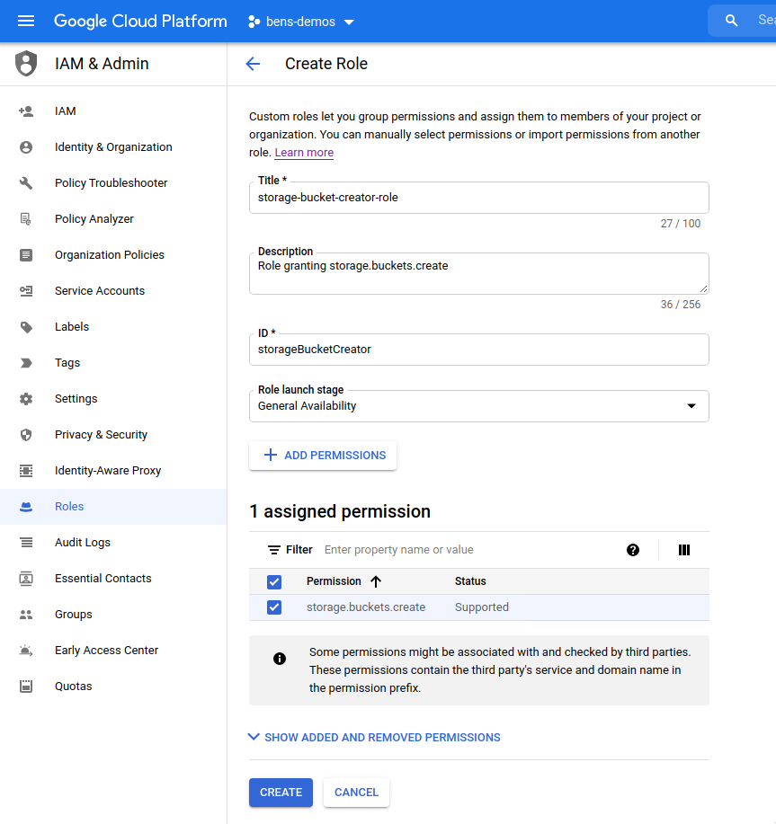

### Create an IAM role granting Cloud DNS permissions

Go to the "Roles" section of Google Cloud IAM & Admin.

1. Click the "Create Role" button at the top.

   

2. Fill in the details of a "DNS Updater" role (we suggest using the name `dns-updater-role`)

   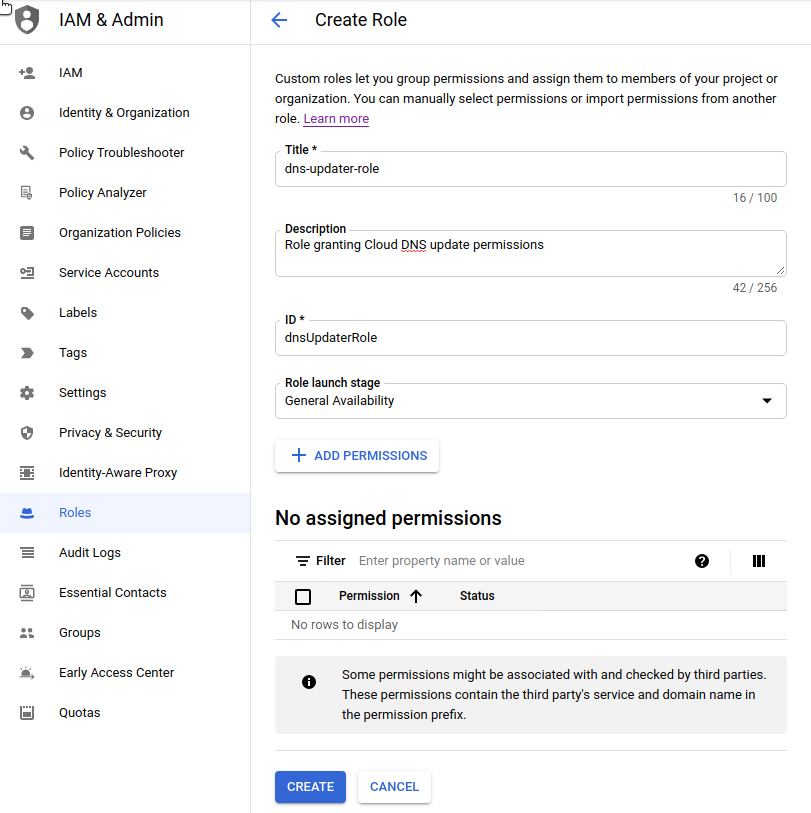

3. Click the "Add Permissions" button.

   

4. Use the "Filter" box to find each of the following permissions in the list
   and add it.  You can type things like `dns.resourceRecordSets.*` to quickly
   filter the list.

   ```console
   dns.resourceRecordSets.create
   dns.resourceRecordSets.delete
   dns.resourceRecordSets.list
   dns.resourceRecordSets.update
   dns.changes.create
   dns.changes.get
   dns.changes.list
   dns.managedZones.list
   ```

5. Once all these settings are entered successfully, click the "Create" button.

   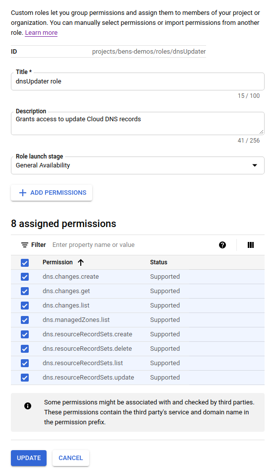

### Create a service account for the Teleport Helm chart

<Admonition type="note">
 If you already have a JSON private key for an appropriately-provisioned service account that you wish to use, you can skip this
 creation process and go to the ["Create the Kubernetes secret containing the JSON private key for the service account"](#create-the-kubernetes-secret-containing-the-json-private-key-for-the-service-account)
 section below.
</Admonition>

Go to the "Service Accounts" section of Google Cloud IAM & Admin.

1. Click the "Create Service Account" button at the top.

   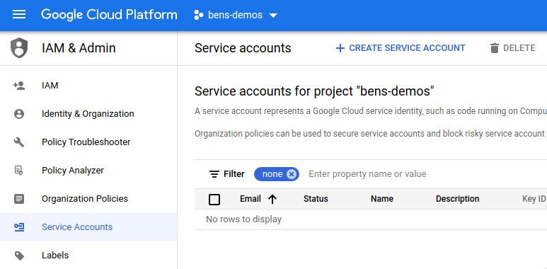

2. Enter details for the service account (we recommend using the name `teleport-helm`) and click the "Create" button.

   

3. In the "Grant this service account access to project" section, add these four roles:

| Role | Purpose |
| - | - |
| storage-bucket-creator-role | Role you just created allowing creation of storage buckets |
| dns-updater-role | Role you just created allowing updates to Cloud DNS records |
| Cloud Datastore Owner | Grants permissions to create Cloud Datastore collections |
| Storage Object Admin | Allows read/write/delete of Google Cloud storage objects |

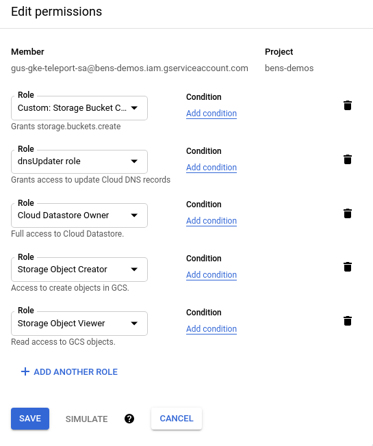

4. Click the "continue" button to save these settings, then click the "create" button to create the service account.

### Generate an access key for the service account

Go back to the "Service Accounts" view in Google Cloud IAM & Admin.

1. Click on the `teleport-helm` service account that you just created.

   

2. Click the "Keys" tab at the top and click "Add Key". Choose "JSON" and click "Create".

   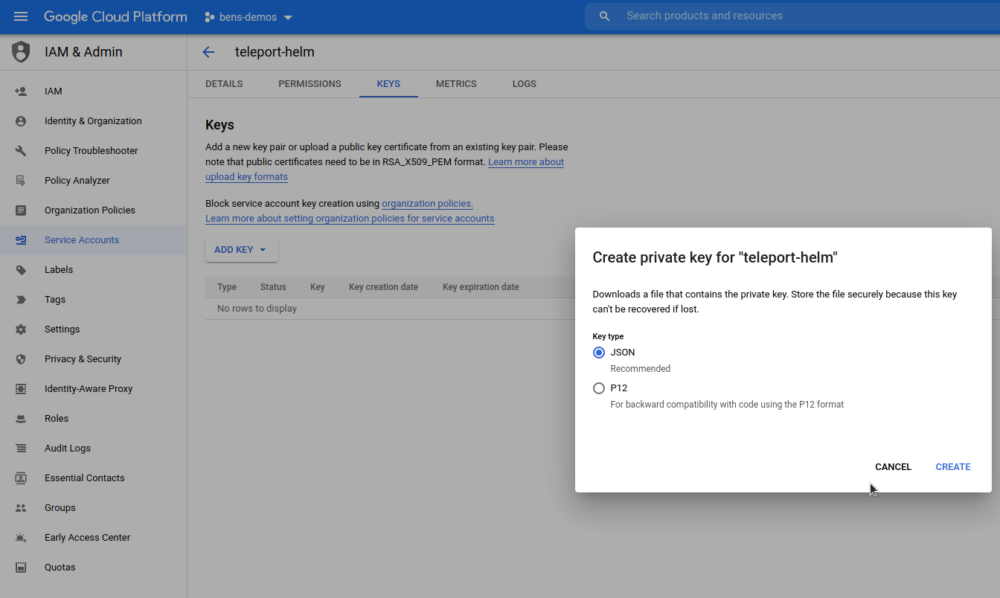

3. The JSON private key will be downloaded to your computer. Take note of the filename (`bens-demos-24150b1a0a7f.json` in this example)
   as you will need it shortly.

   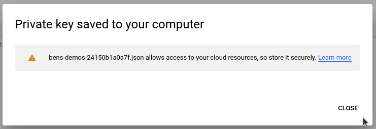

#### Create the Kubernetes secret containing the JSON private key for the service account

Find the path where the JSON private key was just saved (likely your browser's default "Downloads" directory).

Use `kubectl` to create the `teleport` namespace, set its security policy, and
create the secret using the path to the JSON private key:

```code
$ kubectl create namespace teleport
namespace/teleport created
$ kubectl label namespace teleport 'pod-security.kubernetes.io/enforce=baseline'
namespace/teleport labeled
$ kubectl --namespace teleport create secret generic teleport-gcp-credentials --from-file=gcp-credentials.json=/path/to/downloads/bens-demos-24150b1a0a7f.json
secret/teleport-gcp-credentials created
```

<Admonition type="tip">
  If you installed the Teleport chart into a specific namespace, the `teleport-gcp-credentials` secret you create must also be added to the same namespace.
</Admonition>

<Admonition type="note">
 The default name configured for the secret is `teleport-gcp-credentials`.

 If you already have a secret created, you can skip this creation process and specify the name of the secret using `gcp.credentialSecretName`.

 The credentials file stored in any secret used must have the key name `gcp-credentials.json`.
</Admonition>

## Step 3/6. Install and configure cert-manager

Reference the [cert-manager docs](https://cert-manager.io/docs/).

In this example, we are using multiple pods to create a High Availability Teleport cluster. As such, we will be using
`cert-manager` to centrally provision TLS certificates using Let's Encrypt. These certificates will be mounted into each
Teleport pod, and automatically renewed and kept up to date by `cert-manager`.

If you do not have `cert-manager` already configured in the Kubernetes cluster where you are installing Teleport,
you should add the Jetstack Helm chart repository which hosts the `cert-manager` chart, and install the chart:

```code
$ helm repo add jetstack https://charts.jetstack.io
$ helm repo update
$ helm install cert-manager jetstack/cert-manager \
--create-namespace \
--namespace cert-manager \
--set global.leaderElection.namespace=cert-manager \
--set installCRDs=true
```

Once `cert-manager` is installed, you should create and add an `Issuer`.

You'll need to replace these values in the `Issuer` example below:

| Placeholder value | Replace with |
| - | - |
| `email@address.com` | An email address to receive communications from Let's Encrypt |
| `example.com` | The name of the Cloud DNS domain hosting your Teleport cluster |
| `gcp-project-id` | GCP project ID where the Cloud DNS domain is registered |

```yaml
cat << EOF > gcp-issuer.yaml
apiVersion: cert-manager.io/v1
kind: Issuer
metadata:
  name: letsencrypt-production
  namespace: teleport
spec:
  acme:
    email: email@address.com                                # Change this
    server: https://acme-v02.api.letsencrypt.org/directory
    privateKeySecretRef:
      name: letsencrypt-production
    solvers:
    - selector:
        dnsZones:
          - "example.com"                                  # Change this
      dns01:
        cloudDNS:
          project: gcp-project-id                          # Change this
          serviceAccountSecretRef:
            name: teleport-gcp-credentials
            key: gcp-credentials.json
EOF
```

<Admonition type="note">
  The secret name under `serviceAccountSecretRef` here defaults to `teleport-gcp-credentials`.

  If you have changed `gcp.credentialSecretName` in your chart values, you must also make sure it matches here.
</Admonition>

After you have created the `Issuer` and updated the values, add it to your cluster using `kubectl`:

```code
$ kubectl --namespace teleport create -f gcp-issuer.yaml
```

## Step 4/6. Set values to configure the cluster

<Details title="License Secret" scopeOnly={false} scope={"enterprise"} opened={true}>

Before you can install Teleport Enterprise in your Kubernetes cluster, you will need to
create a secret that contains your Teleport license information.

(!docs/pages/includes/enterprise/obtainlicense.mdx!)

Create a secret from your license file. Teleport will automatically discover
this secret as long as your file is named `license.pem`.

```code
$ kubectl -n teleport create secret generic license --from-file=license.pem
```

</Details>

<Admonition type="note">
  If you are installing Teleport in a brand new GCP project, make sure you have enabled the
  [Cloud Firestore API](https://console.cloud.google.com/apis/api/firestore.googleapis.com/overview)
  and created a
  [Firestore Database](https://console.cloud.google.com/firestore/welcome)
  in your project before continuing.
</Admonition>

Next, configure the `teleport-cluster` Helm chart to use the `gcp` mode. Create a
file called `gcp-values.yaml` file and write the values you've chosen above to
it:

<Tabs>
<TabItem scope={["oss"]} label="Teleport Community Edition">

```yaml
chartMode: gcp
clusterName: teleport.example.com                 # Name of your cluster. Use the FQDN you intend to configure in DNS below
gcp:
  projectId: gcpproj-123456                       # Google Cloud project ID
  backendTable: teleport-helm-backend             # Firestore collection to use for the Teleport backend
  auditLogTable: teleport-helm-events             # Firestore collection to use for the Teleport audit log (must be different to the backend collection)
  auditLogMirrorOnStdout: false                   # Whether to mirror audit log entries to stdout in JSON format (useful for external log collectors)
  sessionRecordingBucket: teleport-helm-sessions  # Google Cloud Storage bucket to use for Teleport session recordings
highAvailability:
  replicaCount: 2                                 # Number of replicas to configure
  certManager:
    enabled: true                                 # Enable cert-manager support to get TLS certificates
    issuerName: letsencrypt-production            # Name of the cert-manager Issuer to use (as configured above)

# If you are running Kubernetes 1.23 or above, disable PodSecurityPolicies
podSecurityPolicy:
  enabled: false
```

</TabItem>
<TabItem scope={["enterprise"]} label="Teleport Enterprise">

```yaml
chartMode: gcp
clusterName: teleport.example.com                 # Name of your cluster. Use the FQDN you intend to configure in DNS below
gcp:
  projectId: gcpproj-123456                       # Google Cloud project ID
  backendTable: teleport-helm-backend             # Firestore collection to use for the Teleport backend
  auditLogTable: teleport-helm-events             # Firestore collection to use for the Teleport audit log (must be different to the backend collection)
  auditLogMirrorOnStdout: false                   # Whether to mirror audit log entries to stdout in JSON format (useful for external log collectors)
  sessionRecordingBucket: teleport-helm-sessions  # Google Cloud Storage bucket to use for Teleport session recordings
highAvailability:
  replicaCount: 2                                 # Number of replicas to configure
  certManager:
    enabled: true                                 # Enable cert-manager support to get TLS certificates
    issuerName: letsencrypt-production            # Name of the cert-manager Issuer to use (as configured above)
enterprise: true                                  # Indicate that this is a Teleport Enterprise deployment
```

</TabItem>

</Tabs>

Install the chart with the values from your `gcp-values.yaml` file using this command:

```code
$ helm install teleport teleport/teleport-cluster \
  --create-namespace \
  --namespace teleport \
  -f gcp-values.yaml
```

<Admonition type="note">
  You cannot change the `clusterName` after the cluster is configured, so make sure you choose wisely. We recommend using the fully-qualified domain name that you'll use for external access to your Teleport cluster.
</Admonition>

Once the chart is installed, you can use `kubectl` commands to view the deployment:

```code
$ kubectl --namespace teleport get all

NAME                                 READY   STATUS    RESTARTS   AGE
pod/teleport-auth-57989d4cbd-4q2ds   1/1     Running   0          22h
pod/teleport-auth-57989d4cbd-rtrzn   1/1     Running   0          22h
pod/teleport-proxy-c6bf55cfc-w96d2   1/1     Running   0          22h
pod/teleport-proxy-c6bf55cfc-z256w   1/1     Running   0          22h

NAME                        TYPE           CLUSTER-IP     EXTERNAL-IP     PORT(S)                                                                     AGE
service/teleport            LoadBalancer   10.40.11.180   34.138.177.11   443:30258/TCP,3023:31802/TCP,3026:32182/TCP,3024:30101/TCP,3036:30302/TCP   22h
service/teleport-auth       ClusterIP      10.40.8.251    <none>          3025/TCP,3026/TCP                                                           22h
service/teleport-auth-v11   ClusterIP      None           <none>          <none>                                                                      22h
service/teleport-auth-v12   ClusterIP      None           <none>          <none>                                                                      22h

NAME                             READY   UP-TO-DATE   AVAILABLE   AGE
deployment.apps/teleport-auth    2/2     2            2           22h
deployment.apps/teleport-proxy   2/2     2            2           22h

NAME                                       DESIRED   CURRENT   READY   AGE
replicaset.apps/teleport-auth-57989d4cbd   2         2         2       22h
replicaset.apps/teleport-proxy-c6bf55cfc   2         2         2       22h
```

## Step 5/6. Set up DNS

You'll need to set up a DNS `A` record for `teleport.example.com`.

<Details title="Using Application Access?">
(!docs/pages/includes/dns-app-access.mdx!)
</Details>

Here's how to do this using Google Cloud DNS:

```code
# Change these parameters if you altered them above
$ NAMESPACE=teleport
$ RELEASE_NAME=teleport

$ MYIP=$(kubectl --namespace ${NAMESPACE?} get service/${RELEASE_NAME?} -o jsonpath='{.status.loadBalancer.ingress[*].ip}')
$ MYZONE="myzone"
$ MYDNS="teleport.example.com"

$ gcloud dns record-sets transaction start --zone="${MYZONE?}"
$ gcloud dns record-sets transaction add ${MYIP?} --name="${MYDNS?}" --ttl="300" --type="A" --zone="${MYZONE?}"
$ gcloud dns record-sets transaction add ${MYIP?} --name="*.${MYDNS?}" --ttl="300" --type="A" --zone="${MYZONE?}"
$ gcloud dns record-sets transaction describe --zone="${MYZONE?}"
$ gcloud dns record-sets transaction execute --zone="${MYZONE?}"
```

## Step 6/6. Create a Teleport user

Create a user to be able to log into Teleport. This needs to be done on the Teleport auth server,
so we can run the command using `kubectl`:

<Tabs>
<TabItem scope={["oss"]} label="Teleport Community Edition">
```code
$ kubectl --namespace teleport exec deploy/teleport-auth -- tctl users add test --roles=access,editor

User "test" has been created but requires a password. Share this URL with the user to complete user setup, link is valid for 1h:
https://teleport.example.com:443/web/invite/91cfbd08bc89122275006e48b516cc68

NOTE: Make sure teleport.example.com:443 points at a Teleport proxy that users can access.
```
</TabItem>
<TabItem scope={["enterprise", "cloud"]} label="Commercial">
```code
$ kubectl --namespace teleport exec deploy/teleport-auth -- tctl users add test --roles=access,editor,reviewer

User "test" has been created but requires a password. Share this URL with the user to complete user setup, link is valid for 1h:
https://teleport.example.com:443/web/invite/91cfbd08bc89122275006e48b516cc68

NOTE: Make sure teleport.example.com:443 points at a Teleport proxy that users can access.
```
</TabItem>

</Tabs>

Load the user creation link to create a password and set up multi-factor authentication for the Teleport user via the web UI.

### High Availability

In this guide, we have configured 2 replicas. This can be changed after cluster creation by altering the `highAvailability.replicaCount`
value [using `helm upgrade` as detailed below](#upgrading-the-cluster-after-deployment).

## Upgrading the cluster after deployment

To make changes to your Teleport cluster after deployment, you can use `helm upgrade`.

Helm defaults to using the latest version of the chart available in the repo, which will also correspond to the latest
version of Teleport. You can make sure that the repo is up to date by running `helm repo update`.

If you want to use a different version of Teleport, set the [`teleportVersionOverride`](../../../reference/helm-reference/teleport-cluster.mdx) value.

Here's an example where we set the chart to use 3 replicas:

<Tabs>
  <TabItem label="Using values.yaml">
  Edit your `gcp-values.yaml` file from above and make the appropriate changes.

  Upgrade the deployment with the values from your `gcp-values.yaml` file using this command:

  ```code
  $ helm upgrade teleport teleport/teleport-cluster \
    --namespace teleport \
    -f gcp-values.yaml
  ```

  </TabItem>
  <TabItem label="Using --set via CLI">
  Run this command, editing your command line parameters as appropriate:

  ```code
  $ helm upgrade teleport teleport/teleport-cluster \
    --namespace teleport \
    --set highAvailability.replicaCount=3
  ```
  </TabItem>
</Tabs>

<Admonition type="note">
  To change `chartMode`, `clusterName` or any `gcp` settings, you must first uninstall the existing chart and then install
  a new version with the appropriate values.
</Admonition>

## Uninstalling Teleport

To uninstall the `teleport-cluster` chart, use `helm uninstall <release-name>`. For example:

```code
$ helm --namespace teleport uninstall teleport
```

### Uninstalling cert-manager

If you want to remove the `cert-manager` installation later, you can use this command:

```code
$ helm --namespace cert-manager uninstall cert-manager
```

## Next steps

Now that you have deployed a Teleport cluster, read the [Manage
Access](../../access-controls/access-controls.mdx) section to get started enrolling
users and setting up RBAC.

See the [high availability section of our Helm chart reference](../../../reference/helm-reference/teleport-cluster.mdx) for more details on high availability.

