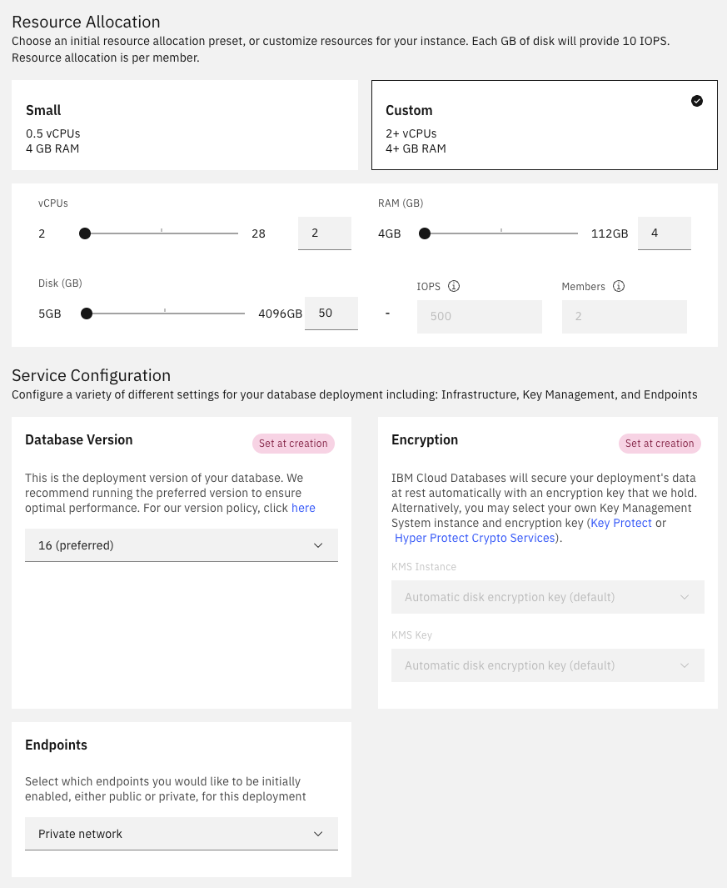
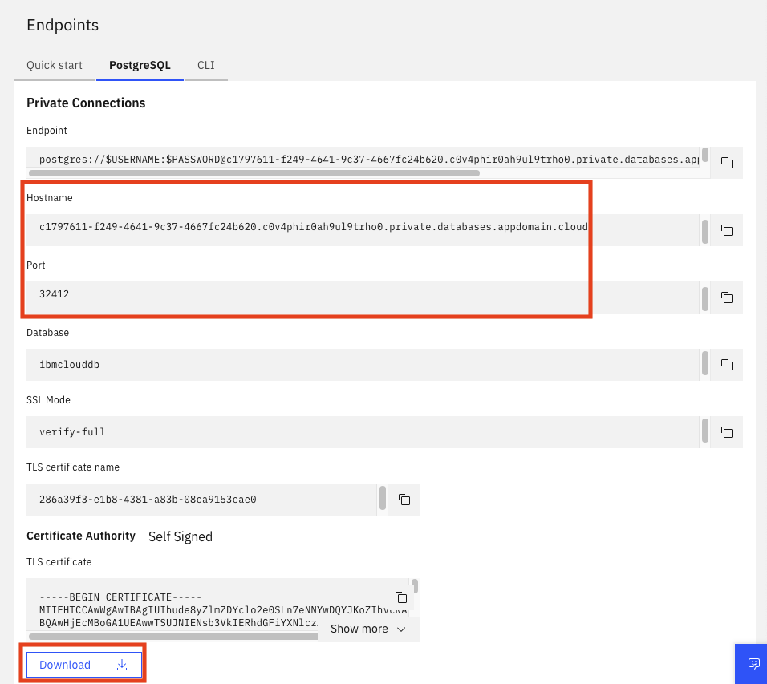
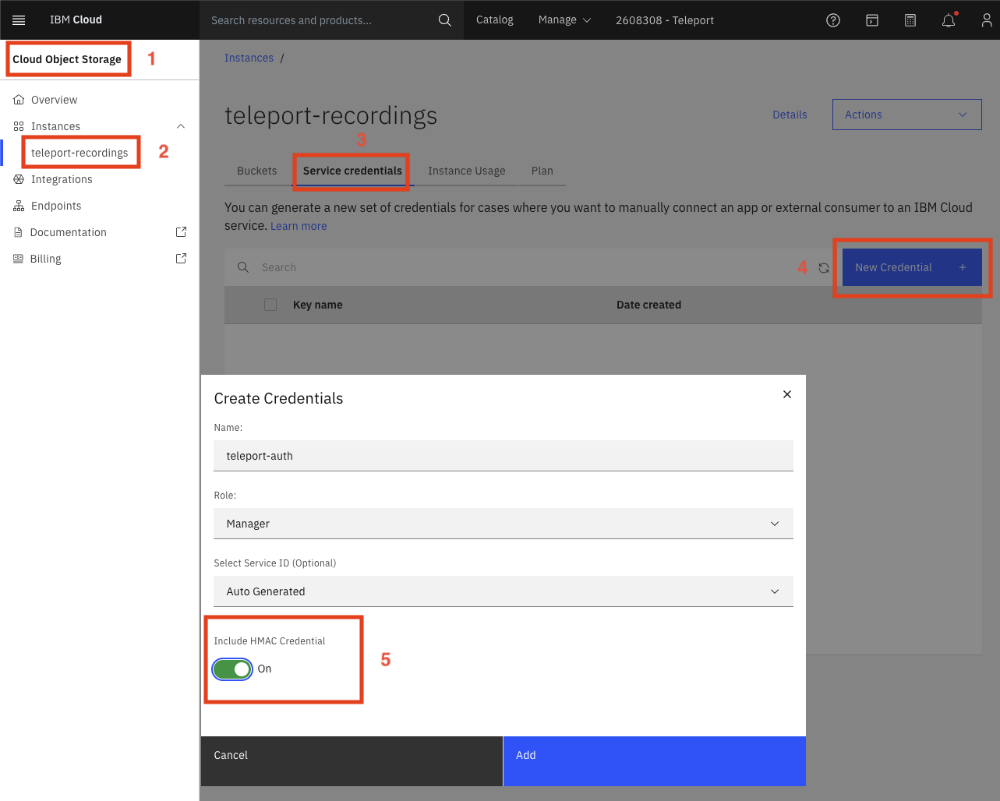

This guide describes how to set up Teleport on IBM Cloud.

We will use the following services to deploy Teleport on IBM cloud:
- [Compute: IBM Cloud Kubernetes Service](https://www.ibm.com/products/kubernetes-service)
  to deploy Teleport using the [`teleport-cluster` Helm chart](../../../reference/helm-reference/teleport-cluster.mdx)
- [Storage: IBM Cloud Databases for PostgreSQL](https://www.ibm.com/products/databases-for-postgresql)
  to store the Teleport cluster state, and the Teleport audit events (see []backends reference](../../../reference/backends.mdx)
  for more details).
- [Storage: IBM Cloud Object Storage](https://www.ibm.com/products/cloud-object-storage) to store the Teleport
  session recordings.
- [Network: IBM Cloud DNS Services](https://www.ibm.com/products/dns) to route Teleport


## Prerequisites

To follow this guide you will need:

- An [IBM Cloud](https://www.ibm.com/cloud) account
- An IBM Kubernetes cluster with functional networking (nodes must be able to access the Internet and pull public images)
- `kubectl` and `helm` installed and connected to your IBM Kubernetes cluster
- The `ibmcloud` CLI tool installed, logged in as your IBM Cloud user
- A domain you will use for the Teleport cluster, in this guide we'll use `teleport.example.com`
- A TLS certificate for the domain `teleport.example.com` (and `*.teleport.example.com` if you want to use App Access)

## Step 1/7. Create the Postgres database

In this step, we'll create the PostgreSQL database Teleport will use as a backend.

Select *Create Resource*, search *PostgreSQL*, and select *Databases for PostgreSQL*.
Fill the PostgreSQL creation form with the following settings:

- IBM Cloud-hosted PostgreSQL
- at least 2 vCPUs
- at least 4 GiB of memory
- at least 50 GiB of storage
- Postgres version 16
- Endpoints: Private
- Name: in this example, the database deployment name is `teleport-backend`



Wait until the provisioning is over and the database ready. This can take several minutes.

On the Postgres resource page:
- download the database TLS certificate, this will be used by Teleport to connect to Postgres
- copy the database hostname and port, we will need them to configure Teleport



## Step 2/7. Create the storage bucket

In this step, we'll create the object storage backend Teleport will use to store its session recordings.

Select *Create Resource*, search *object*, and select *Object Storage*.
Fill the storage creation form with the following settings:

- IBM Cloud-hosted storage
- Standard pricing plan

Then, chose *Create bucket*, *Create a Custom Bucket*, and fill the bucket creation form with the following settings:
- Regional Resiliency
- Smart Tier
- Disabled Object Versioning
- (Optional) configure your retention policy. This configures how long session recordings are kept. Leave empty for infinite retention.

Open the bucket *Configuration* and save the direct endpoint, this will be used to configure Teleport to use the bucket.

Navigate the object storage instance and create a new service credential with HMAC:


Open the credentials and save the content of the `access_key_id` and `secret_access_key` fields.
This will be needed later to authorize Teleport to read and write session recordings in the bucket.

## Step 3/7. Configure the Postgres database

In this step we will configure two users on the postgres database:
- a `teleport` user that will create and own the `teleport_backend` and `teleport_audit` databases
- a `repl` user, which is the only user allowed to read the stream of database changes. Teleport uses it to listen for
  database changes and synchronize the multiple Teleport Auth Service replicas.

Open a terminal and:
- install the `ibmcloud` database plugin
  ```code
  $ ibmcloud install plugin cdb
  ```
- recover the postgresql database deployment name
  ```code
  $ ibmcloud cdb deployments

  Name               Location   State
  teleport-backend   ca-tor     active
  ```
- configure the WAL settings of the database
  ```code
  $ ibmcloud cdb deployment-configuration teleport-backend '{"wal_level":"logical", "max_replication_slots":30, "max_wal_senders":30}'
  ```
- configure a password for the replication user
  ```code
  # generate a random password
  $ export POSTGRES_PASSWORD="$(tr -dc A-Za-z0-9_ < /dev/urandom | head -c 32 )"

  # display the password
  echo "$POSTGRES_PASSWORD"

  # set the password
  $ ibmcloud cdb deployment-user-password teleport-backend repl "$POSTGRES_PASSWORD"
  ```
- create a `teleport` user and set its password
  ```code
  # set the same password as the replication user
  ibmcloud cdb deployment-user-create teleport-backend teleport "$POSTGRES_PASSWORD"
  ```

## Step 4/7. Prepare the Kubernetes cluster

In this step we will create the Kubernetes resources the Teleport Helm chart will use:

- Create the namespace
  ```code
  $ kubectl create ns teleport-cluster
  namespace/teleport-cluster created
  ```
- (for enterprise) create the Teleport license
  ```code
  $ kubectl -n teleport-cluster create secret generic license --from-file=license.pem

  secret/license created
  ```
- Create the secret containing the TLS certificates
  ```code
  $ kubectl -n teleport-cluster create secret tls teleport-tls --cert=/path/to/cert/file --key=/path/to/key/file

  secret/teleport-tls created
  ```
- Create the secret containing the bucket credentials
  ```code
  $ kubectl -n teleport-cluster create secret generic bucket-creds \
    --from-literal=AWS_ACCESS_KEY_ID=<put the key id> \
    --from-literal=AWS_SECRET_ACCESS_KEY=<put the secret access key here>

  secret/bucket-creds created
  ```
- Create the configmap containing the PostgreSQL CA certificate
  ```code
  $ kubectl -n teleport-cluster create configmap postgres-ca \
    --from-file=cacert.pem=postgres-certs.pem

  configmap/postgres-ca created
  ```
- Create the secret containing the PostgreSQL password
  ```code
  $ kubectl -n teleport-cluster create secret generic postgres-pass \
    --from-literal=password="$POSTGRES_PASSWORD"

  secret/postgres-pass created
  ```

## Step 5/7. Configure and deploy Teleport

In this step we will deploy a Teleport cluster with the `teleport-cluster` Helm chart.

Create the following `values.yaml` file and replace the placeholders:
```yaml
chartMode: standalone
clusterName: teleport.example.com # replace this with your cluster domain
persistence:
  enabled: false
proxyListenerMode: multiplex

auth:
  teleportConfig:
    teleport:
      storage:
        type: postgresql
        # replace the database address and port with the values you saved during the PostgreSQL creation
        # the result should look like: "postgres://teleport@60d25e94-edf5-4494-a6cc-5fcae28aa7c2.c0v4ph4r0ah9ul9tr6o0.databases.appdomain.cloud:31766/teleport_backend?sslmode=verify-full&sslrootcert=/var/lib/postgres-ca/cacert.pem"
        conn_string: postgres://teleport@<DATABASE ADDRESS>:<DATABASE PORT>/teleport_backend?sslmode=verify-full&sslrootcert=/var/lib/postgres-ca/cacert.pem
        # replace the database address and port with the values you saved during the PostgreSQL creation
        change_feed_conn_string: postgresql://repl@<DATABASE ADDRESS>:<DATABASE PORT>/teleport_backend?sslmode=verify-full&sslrootcert=/var/lib/postgres-ca/cacert.pem
        audit_events_uri:
        # replace the database address and port with the values you saved during the PostgreSQL creation
          - "postgres://teleport@<DATABASE ADDRESS>:<DATABASE PORT>/teleport_audit?sslmode=verify-full&sslrootcert=/var/lib/postgres-ca/cacert.pem#disable_cleanup=false&retention_period=8766h"
        # replace the bucket name and endpoint with the values you saved during the bucket creation
        audit_sessions_uri: 's3://<BUCKET_NAME>/readonly/records?endpoint=<DIRECT ENDPOINT>&region=ibm'

  extraVolumes:
    - name: postgres-ca
      configMap:
        name: postgres-ca
  extraVolumeMounts:
    - name: postgres-ca
      mountPath: /var/lib/postgres-ca
      readOnly: true

  extraEnv:
    - name: AWS_ACCESS_KEY_ID
      valueFrom:
        secretKeyRef:
          name: bucket-creds
          key: AWS_ACCESS_KEY_ID
          optional: false
    - name: AWS_SECRET_ACCESS_KEY
      valueFrom:
        secretKeyRef:
          name: bucket-creds
          key: AWS_SECRET_ACCESS_KEY
          optional: false
    - name: PGPASSWORD
      valueFrom:
        secretKeyRef:
          name: postgres-pass
          key: password
          optional: false

tls:
  existingSecretName: teleport-tls

highAvailability:
  replicaCount: 2
```

Allow Helm to install charts that are hosted in the Teleport Helm repository:

```code
$ helm repo add teleport https://charts.releases.teleport.dev

"teleport" has been added to your repositories
```

Update the local chart cache so you can upgrade to all available releases:

```code
$ helm repo update

...Successfully got an update from the "teleport" chart repository
```

Create a release from the chart:
```code
$ helm upgrade --install -n teleport-cluster teleport teleport/teleport-cluster --version "TODO REPLACE ME" -f values.yaml

Release "teleport" does not exist. Installing it now.
NAME: teleport
LAST DEPLOYED: Mon Nov 11 16:09:15 2024
NAMESPACE: teleport-cluster
STATUS: deployed
REVISION: 1
TEST SUITE: None
```

Finally, validate that pods are running:
```code
$ kubectl -n teleport-cluster get pods
```

## Step 6/7. Create the DNS entry

Recover the teleport cluster IP address:

```code
$ kubectl get -n teleport-cluster services

NAME                TYPE           CLUSTER-IP      EXTERNAL-IP                          PORT(S)             AGE
teleport            LoadBalancer   172.21.130.11   45a6ca70-ca-tor.lb.appdomain.cloud   443:31421/TCP       4d2h
teleport-auth       ClusterIP      172.21.109.96   <none>                               3025/TCP,3026/TCP   4d2h
teleport-auth-v16   ClusterIP      None            <none>                               <none>              4d2h
teleport-auth-v17   ClusterIP      None            <none>                               <none>              4d2h
```

Create a CNAME DNS entry pointing to the service loadbalancer.
In out example, the DNS entry should look like:

```
teleport.example.com. 300 IN	CNAME	45a6ca70-ca-tor.lb.appdomain.cloud.
```

Wait for the domain name change to propagate, this can take a few minutes.
After propagation, you should be able to resolve your domain:

```code
$ dig teleport.example.com

;; ANSWER SECTION:
teleport.example.com. 300 IN	CNAME	45a6ca70-ca-tor.lb.appdomain.cloud.
45a6ca70-ca-tor.lb.appdomain.cloud. 120	IN A	163.66.86.161
45a6ca70-ca-tor.lb.appdomain.cloud. 120	IN A	163.74.84.35
```

## Step 7/7. Check that everything is working

In this step you will create a new user and access the web UI:

- create a new Teleport user:
  ```code
  $ kubectl exec -it -n teleport-cluster deployment/teleport-auth -- tctl users add myuser --roles=editor,auditor,access

  User "myuser" has been created but requires a password. Share this URL with the user to complete user setup, link is valid for 1h:
  https://teleport.example.com:443/web/invite/...
  ```
- open the registration link and follow the registration wizard
- your Teleport cluster is ready

## Next Steps

As next steps you can:
- enroll [servers](../../../enroll-resources/server-access/introduction.mdx),
  [Kubernetes clusters](../../../enroll-resources/kubernetes-access/introduction.mdx),
  [databases](../../../enroll-resources/database-access/getting-started.mdx),
  [applications](../../../enroll-resources/application-access/getting-started.mdx),
  or [Windows desktops](../../../enroll-resources/desktop-access/desktop-access.mdx) into your Teleport cluster
- check the [`teleport-cluster` Helm reference](../../../reference/helm-reference/teleport-cluster.mdx) for a list of supported values
- use [the Teleport Kubernetes operator(../../admin-guides/infrastructure-as-code/teleport-operator/teleport-operator.mdx) to control Teleport resources