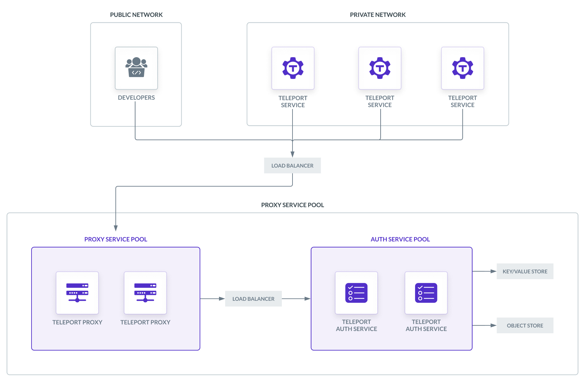

When deploying Teleport in production, you should design your deployment to
ensure that users can continue to access infrastructure during an incident in
your Teleport cluster. You should also make it possible to scale your Auth
Service and Proxy Service as you register more users and resources with
Teleport. 

In this guide, we will explain the components of a high-availability Teleport
deployment.

(!docs/pages/includes/cloud/call-to-action.mdx!)

## Overview

A high-availability Teleport cluster revolves around two pools of redundant
`teleport` processes, one running the Auth Service and one running the Proxy
Service, plus the infrastructure required to support each pool. 

Infrastructure components include:
- A **public Layer 4 load balancer** to direct traffic from users and services
  to an available Proxy Service instance.
- A **private Layer 4 load balancer** to direct traffic from the Proxy Service
  to the Auth Service's gRPC API, which is how Teleport manages the Auth
  Service's backend state and provides credentials to users and services in your
  cluster.
- A **cluster state backend**. This is a key-value store for cluster state and
  audit events that all Auth Service instances can access. This requires
  permissions for Auth Service instances to manage records within the key-value
  store.
- A **session recording backend**. This is an object storage service where the
  Auth Service uploads session recordings. The session recording backend
  requires permissions for `teleport` instances to manage objects within the
  storage service.
- A **TLS credential provisioning system**. You need a way to obtain TLS
  credentials from a certificate authority like Let's Encrypt (or an internal
  public key infrastructure), provision `teleport` instances with them, and
  renew them periodically. 
- A **DNS service** you can use to create records for the Teleport Proxy
  Service. If you are using Let's Encrypt for TLS credentials, the TLS
  credential provisioner will need to manage DNS records to demonstrate control
  over your domain name.



## Layer 4 load balancers

High-availability Teleport clusters require two load balancers:
- **Proxy Service load balancer:** A load balancer to receive traffic from
  outside the network where your Teleport cluster is running and forward it to
  an available Proxy Service instance. This load balancer handles TCP traffic
  from users and services in a variety of application-layer protocols.
- **Auth Service load balancer:** A load balancer to forward traffic from a
  Proxy Service instance to an available Auth Service instance. This handles TLS
  traffic to the Auth Service's gRPC endpoint.

Both load balancers must transparently forward the TCP traffic they receive,
without terminating TLS. In other words, these must be Layer 4 load balancers,
not Layer 7 (e.g., HTTP).

We recommend configuring your load balancers to route traffic across multiple
zones (if using a cloud provider) or data centers (if using an on-premise
solution) to ensure availability. 

### Configuring the Proxy Service load balancer

#### TLS Routing

The way you configure the Proxy Service load balancer depends on whether you
will enable [TLS Routing](../management/operations/tls-routing.mdx) in your
Teleport cluster.

With TLS Routing, the Teleport Proxy Service uses application-layer protocol
negotiation (ALPN) to handle all communication with users and services via the
HTTPS port, regardless of protocol. Without TLS Routing, the Proxy Service
listens on separate ports for each protocol.

The advantage of TLS Routing is its simplicity: you can expose only a single
port on the load balancer to the public internet.

The disadvantage of TLS Routing is that it is impossible to implement Layer 7
load balancing for HTTPS traffic, since traffic that reaches the HTTPS port can
use any supported protocol. 

The approach we describe in this guide uses only a Layer 4 load balancer to
minimize the infrastructure you will deploy, but users that require a separate
load balancer for HTTPS traffic should disable TLS Routing.

#### Open ports

Configure the Proxy Service load balancer to forward traffic from the following
ports on the load balancer to the corresponding port on an available Proxy
Service instance. The configuration depends on whether you will enable TLS
Routing:

<Tabs>
<TabItem label="TLS Routing">

| Load Balancer Port | Proxy Service Port | Description |
| - | - | - |
| `443` | `3080` | ALPN port for TLS Routing. |

</TabItem>
<TabItem label="Separate Ports">

These ports are required:

| Load Balancer Port | Proxy Service Port | Description |
| - | - | - |
| `3023` | `3023` | SSH port for clients connect to. |
| `3024` | `3024` | SSH port used to create reverse SSH tunnels from behind-firewall environments. |
| `443` | `3080` | HTTPS connections to authenticate `tsh` users into the cluster. The same connection is used to serve a Web UI. |

You can leave these ports closed if you are not using their corresponding
services:

| Port | Description |
| - | - |
| `3026` | HTTPS Kubernetes proxy |
| `3036` | MySQL port |
| `5432` | Postgres port |
| `27017` | Mongo port |

</TabItem>
</Tabs>

### Configuring the Auth Service load balancer

The Auth Service load balancer must forward traffic to the Auth Service's gRPC
port. In this guide, we are assuming that you have configured the Auth Service
load balancer to forward traffic from port `3025` to port `3025` on an available
Auth Service instance.

## Cluster state backend

The Teleport Auth Service stores cluster state (such as dynamic configuration
resources) and audit events as key/value pairs. In high-availability
deployments, you must configure the Auth Service to manage this data in a
key-value store that runs outside of your cluster of Teleport instances.

The Auth Service supports the following backends for cluster state and audit
events:

- Amazon DynamoDB
- Google Cloud Firestore
- PostgreSQL (Azure and self-hosted)
- etcd (cluster state only)

For Amazon DynamoDB, Google Cloud Firestore and PostgreSQL, your Teleport configuration
(which we will describe in more detail in the [Configuration](#configuration)
section) names the two tables or collections where Teleport stores cluster state
and audit events.

The Auth Service can also store cluster state in self-hosted
[etcd](https://etcd.io/) deployments. In this case, Teleport uses namespaces
within item keys to identify cluster state data.

When you configure the Teleport Auth Service to access a table or collection,
the Auth Service checks that the table or collection exists on startup. If it
does not, the Auth Service attempts to create it.

<Admonition type="info" title="Required permissions">

Make sure you configure your cloud provider's RBAC solution (e.g., AWS or Google
Cloud IAM) so that your Auth Service instances have permissions to read from and
write to your chosen key/value store. 

Unless you have a pre-existing table or collection to use, the Auth Service
must also have permissions to create tables and collections (if your key/value
store supports them).

</Admonition>

## Session recording backend

High-availability Teleport deployments use an object storage service for
persisting session recordings. The Teleport Auth Service supports two object
storage services:

- Amazon S3 (or an S3-compatible object store)
- Google Cloud Storage
- Azure Blob Storage

In your Teleport configuration (described in the [Configuration](#configuration)
section), you must name a bucket within Azure Blob Storage, Google Cloud Storage or an Amazon
S3-compatible service to use for managing session recordings. 

The Auth Service will check that the bucket exists on startup. If it does not,
the Auth Service attempts to create it.

<Admonition type="info" title="Required permissions">

In your cloud provider's RBAC solution, your Auth Service instances need
permissions to get buckets as well as to create, get, list, and update objects.

In Google Cloud Storage, Auth Service instances also need permissions to delete
objects. 

Unless you plan to configure the Auth Service to access a pre-existing bucket,
you must also assign Auth Service instances permissions to create buckets.

</Admonition>

## TLS credential provisioning 

High-availability Teleport deployments require a  system to fetch TLS
credentials from a certificate authority like Let's Encrypt, AWS Certificate
Manager, Digicert, or a trusted internal authority. The system must then
provision Teleport Proxy Service instances with these credentials and renew them
periodically. 

If you are running a single instance of the Teleport Auth Service and Proxy
Service, you can configure this instance to fetch credentials for itself from
Let's Encrypt using the [ACME ALPN-01
challenge](https://letsencrypt.org/docs/challenge-types/#tls-alpn-01), where
Teleport demonstrates that it controls the ALPN server at the HTTPS address of
your Teleport Proxy Service. Teleport also fetches a separate certificate for
each application you have registered with Teleport, e.g.,
`grafana.teleport.example.com`. 

For high-availability deployments that use Let's Encrypt to supply TLS
credentials to Teleport instances running behind a load balancer, you will need
to use the [ACME
DNS-01](https://letsencrypt.org/docs/challenge-types/#dns-01-challenge)
challenge to demonstrate domain name ownership to Let's Encrypt. In this
challenge, your TLS credential provisioning system creates a DNS TXT record with
a value expected by Let's Encrypt.

In the configuration we are demonstrating in this guide, each Teleport Proxy
Service instance expects TLS credentials for HTTPS to be available at the file
paths `/etc/teleport-tls/tls.key` (private key) and `/etc/teleport-tls/tls.crt`
(certificate).

## DNS service

Set up a DNS zone where you can create records for Teleport, e.g., an Amazon
Route 53 hosted zone or Google Cloud DNS zone.

### Teleport Proxy Service records

Users and services must be able to reach the Teleport Proxy Service in order to
connect to your Teleport cluster. Since a high availability setup runs Teleport
instances behind a load balancer, you must create a DNS record that points to
the load balancer. 

Depending on how your infrastructure's DNS is organized, this will be one of the
following, assuming your domain is `example.com`:

|Record Type|Domain Name|Value|
|---|---|---|
|A|teleport.example.com|The IP address of your load balancer|
|CNAME|teleport.example.com|The domain name of your load balancer|

### Registering applications with Teleport 

Teleport assigns a subdomain to each application you have connected to Teleport
(e.g., `grafana.teleport.example.com`), so you will need to ensure that a DNS
record exists for each application-specific subdomain so clients can access your
applications via Teleport. 

You should create either a separate DNS record for each subdomain or a single
record with a wildcard subdomain such as `*.teleport.example.com`. 

Create one of the following wildcard DNS records so you can register any
application with Teleport:

|Record Type|Domain Name|Value|
|---|---|---|
|A|*.teleport.example.com|The IP address of your load balancer|
|CNAME|*.teleport.example.com|The domain name of your load balancer|

<Admonition type="info" title="Required permissions">

If you are using Let's Encrypt to provide TLS credentials to your Teleport
instances, the TLS credential system we mentioned earlier needs permissions to
manage DNS records in order to satisfy Let's Encrypt's DNS-01 challenge. 

If you are using cloud-managed solutions, you should use your cloud provider's
RBAC system (e.g., AWS IAM) to grant a role to the Proxy Service to manage DNS
records. 

</Admonition>

## Teleport instances

Run the Teleport Auth Service and Proxy Service as two scalable groups of
compute resources, for example, using Kubernetes Deployments or AWS Auto
Scaling groups. This requires running the `teleport` binary on each Kubernetes
pod or virtual machine in your group. 

<Admonition type="tip">

If you plan to run Teleport on Kubernetes, the `teleport-cluster` Helm chart
deploys the Auth Service and Proxy Service pools for you. To see how to use this
Helm chart, read our [Helm Deployments](helm-deployments/helm-deployments.mdx) documentation.

</Admonition>

You should deploy your Teleport instances across multiple zones (if using a
cloud provider) or data centers (if using an on-premise solution) to ensure
availability.

### Proxy Service pool

#### Open ports

Ensure that, on each Proxy Service instance, the following ports allow traffic
from the Proxy Service load balancer. The Proxy Service uses these ports to
communicate with Teleport users and services.

As with your load balancer configuration, the ports you should open on your
Teleport instances depend on whether you will enable TLS Routing: 

<Tabs>
<TabItem label="TLS Routing">

| Port | Description |
| - | - |
| `3080` | ALPN port for TLS Routing. |

</TabItem>
<TabItem label="Separate Ports">

These ports are required:

| Port | Description |
| - | - |
| `3023` | SSH port for clients connect to. |
| `3024` | SSH port used to create reverse SSH tunnels from behind-firewall environments. |
| `3080` | HTTPS connections to authenticate `tsh` users into the cluster. The same connection is used to serve a Web UI. |

You can leave these ports closed if you are not using their corresponding
services:

| Port | Description |
| - | - |
| `3026` | HTTPS Kubernetes proxy |
| `3036` | MySQL port |
| `5432` | Postgres port |

</TabItem>
</Tabs>

*This is the same table of ports you used to configure the load balancer.*

#### Configuration

Create a configuration file and provide it to each of your Proxy Service
instances at `/etc/teleport.yaml`. We will explain the required configuration
fields for a high-availability Teleport deployment below. These are the minimum
requirements, and when planning your high-availability deployment, you will want
to follow a more specific [deployment guide](deployments/deployments.mdx) for your
environment. 

#### `proxy_service` and `auth_service`

The `proxy_service` section configures the Proxy Service. The configuration will
depend on whether you are enabling TLS Routing in your cluster:

<Tabs>
<TabItem label="TLS Routing">

To enable TLS Routing in your Teleport cluster, add the following to your
Teleport configuration:

```yaml
version: v3
auth_service:
  enabled: false
proxy_service:
  enabled: true
  public_addr: "mycluster.example.com:443"
  https_keypairs:
  - key_file: /etc/teleport-tls/tls.key
    cert_file: /etc/teleport-tls/tls.crt
```

This configuration has no fields specific to TLS Routing. In `v2`, the
configuration version we are using here, TLS Routing is enabled by default.

</TabItem>
<TabItem label="Separate Listeners">

To disable TLS Routing in your Teleport cluster, add the following to your
Teleport configuration:

```yaml
version: v3
auth_service:
  proxy_listener_mode: separate
  enabled: false
proxy_service:
  enabled: true
  listen_addr: 0.0.0.0:3023
  tunnel_listen_addr: 0.0.0.0:3024
  public_addr: "mycluster.example.com:443"
  https_keypairs:
  - key_file: /etc/teleport-tls/tls.key
    cert_file: /etc/teleport-tls/tls.crt
```

This configuration assigns `auth_service.proxy_listener_mode` to `separate` to
disable TLS Routing. It also explicitly assigns an SSH port (`listen_addr`) and
reverse tunnel port (`tunnel_listen_addr`) for the Proxy Service.

</TabItem>
</Tabs>

In the `proxy_service` section, we have enabled the Teleport Proxy Service
(`enabled`) and instructed it to find its TLS credentials in the
`/etc/teleport-tls` directory (`https_keypairs`).

We have set `auth_service.enabled` to `false` to disable the Auth Service, which
is enabled by default, on each Proxy Service instance.

#### `ssh_service`

The SSH Service is enabled by default. You can disable the SSH Service on each
Teleport instance by adding the following to each instance's configuration file: 

```yaml
version: v3
teleport:
  storage:
  # ...
auth_service:
# ...
proxy_service:
# ...
ssh_service:
  enabled: false
```

This is suitable for deploying Teleport on Kubernetes, where the `teleport` pod
should not have direct access to the underlying node. 

If you are deploying Teleport on a cluster of virtual machines, remove this line
to run the SSH Service and enable secure access to the host.

### Auth Service pool

#### Open ports

Ensure that, on each Auth Service instance, the following ports are open: 

| Port | Description |
| - | - |
| `3025` | gRPC port to open to Proxy Service instances.|

#### License file

If you are deploying Teleport Enterprise, you need to download a license file
and make it available to your Teleport Auth Service instances.

(!docs/pages/includes//enterprise/obtainlicense.mdx!)

The license file must be available to each Teleport Auth Service instance at
`/var/lib/teleport/license.pem`.

#### Configuration

Create a configuration file and provide it to each of your Auth Service
instances at `/etc/teleport.yaml`. We will explain the required configuration
fields for a high-availability Teleport deployment below. These are the minimum
requirements, and when planning your high-availability deployment, you will want
to follow a more specific [deployment guide](deployments/deployments.mdx) for your
environment.

#### `storage`

The first configuration section to write is the `storage` section, which
configures the cluster state backend and session recording backend for the Auth
Service:

```yaml
version: v3
teleport:
  storage:
    # ...
```

Consult our [Backends Reference](../../reference/backends.mdx) for the configuration
fields you should set in the `storage` section.

#### `auth_service` and `proxy_service`

The `auth_service` section configures the Auth Service:

```yaml
version: v3
teleport:
  storage:
  # ...
auth_service:
  enabled: true
  cluster_name: "mycluster.example.com"
  # Remove this if not using Teleport Enterprise
  license_file: "/var/lib/teleport/license.pem"
proxy_service:
  enabled: false
```

In the `auth_service` section, we have enabled the Teleport Auth Service
(`enabled`) and instructed it to find an Enterprise license file at
`/var/lib/teleport/license.pem` (`license_file`). Remove the `license_file` field
if you are deploying the open source edition of Teleport. 

Since we are running Proxy Service instances in a dedicated pool, we have
disabled the Proxy Service on our Auth Service instances by setting
`proxy_service.enabled` to `false`.

#### `ssh_service`

As with the Proxy Service pool, you can disable the SSH Service on each Teleport
instance by adding the following to each instance's configuration file: 

```yaml
version: v3
teleport:
  storage:
  # ...
auth_service:
# ...
proxy_service:
# ...
ssh_service:
  enabled: false
```

## Next steps

### Refine your plan

Now that you know the general principles behind a high-availability Teleport
deployment, read about how to design your own deployment on Kubernetes or a
cluster of virtual machines in your cloud of choice:

- [High-availability Teleport Deployments on Kubernetes with
  Helm](helm-deployments/helm-deployments.mdx)
- [Reference Deployments](deployments/deployments.mdx) for running Teleport on a cluster of
  virtual machines

### Ensure high performance

You should also get familiar with how to ensure that your Teleport deployment is
performing as expected:

- [Scaling a Teleport cluster](../management/operations/scaling.mdx)
- [Monitoring a Teleport cluster](../management/diagnostics/diagnostics.mdx)

### Deploy Teleport services

Once your high-availability Teleport deployment is up and running, you can add
resources by launching Teleport services. You can run these services in a
separate network from your Teleport cluster. 

To get started, read about registering:

- [Applications](../../enroll-resources/application-access/getting-started.mdx)
- [Servers](../../enroll-resources/server-access/getting-started.mdx)
- [Kubernetes clusters](../../enroll-resources/kubernetes-access/getting-started.mdx)
- [Databases](../../enroll-resources/database-access/getting-started.mdx)
- [Windows desktops](../../enroll-resources/desktop-access/introduction.mdx)
- [Bot users](../../enroll-resources/machine-id/getting-started.mdx)
