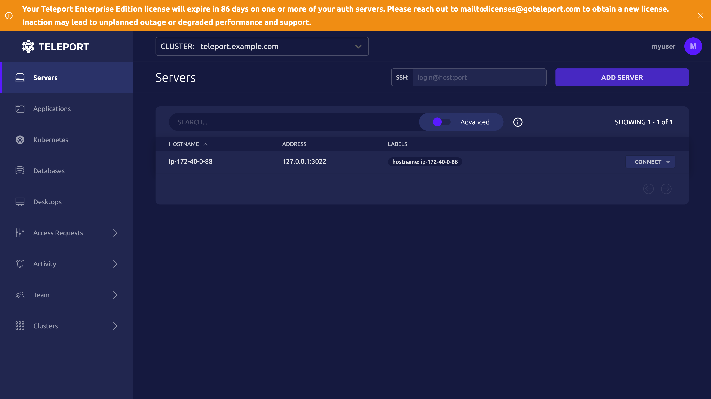
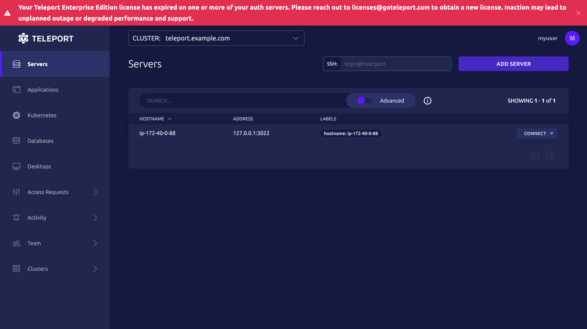

Self-hosted Teleport Enterprise subscriptions require a valid license. In this
guide, we will show you how to manage your Teleport Enterprise license file.

(!docs/pages/includes/cloud/call-to-action.mdx!)

## Managing your license file

In a self-hosted Teleport Enterprise cluster, the Teleport Auth Service reads a
license file in order to determine the scope and validity of your subscription.
Follow the steps below to give your Teleport Auth Service instances access to
your license file.

### Download your license file

Teleport provides a dedicated account dashboard where you can generate your
license and download enterprise binaries.

To obtain your license file, navigate to your Teleport account dashboard and log
in. You can start at [teleport.sh](https://teleport.sh) and enter your Teleport
account name (e.g. my-company). After logging in you will see a "GENERATE
LICENSE KEY" button, which will generate a new license file and allow you to
download it.

<Admonition type="tip" title="Use the same license on all clusters">
A new license file is produced each time you repeat this procedure.
It is important that you download the license file once and use the
same license across all of your clusters. This will ensure that your
subscription limits apply across all Teleport clusters and that you
are not double-counted.
</Admonition>


The Teleport license file contains an X.509 certificate and the corresponding
private key in PEM format.

### Add your license file to your Auth Service instances

Make your license file available to your Teleport Auth Service instances. The
way you will do this depends on whether you are running the Teleport Auth
Service on a Linux host or on Kubernetes:

<Tabs>
<TabItem label="Linux Host">

Place the downloaded file on each instance of the Teleport Auth Service you will
run in your cluster and set the `license_file` configuration parameter of your
`teleport.yaml` to point to the file location:

```yaml
auth_service:
    license_file: /var/lib/teleport/license.pem
```

The `license_file` path can be either absolute or relative to the configured
`data_dir`. If the license file path is not set, Teleport will look for the
`license.pem` file in the configured `data_dir`, which is `/var/lib/teleport` by
default.

</TabItem>
<TabItem label="Kubernetes">

Rename your license file to `license.pem`.

Create a secret called "license" in the namespace you are using to deploy
Teleport:

```code
$ kubectl -n teleport create secret generic license --from-file=license.pem
```

For the Teleport pod to load your license:

- The secret must be named `license`
- The secret must be in the same Kubernetes namespace as the Teleport pod
- The license file in the secret to be named `license.pem`

</TabItem>
</Tabs>

Only Auth Service instances require the license. Instances of other Teleport
services do not need a license file unless they are also running the Auth
Service.

### Check your license expiration date

Your Teleport Enterprise license contains an X.509 certificate that contains the
expiration date of your license.

Run the following command to inspect the expiration date of your license,
assuming your license is saved as `license.pem`:

```code
$ openssl x509 -text -in license.pem | grep "Not After"
             Not After : Dec 16 19:43:40 2022 GMT
```

### Renew or update your license

If you have changed your license agreement with Teleport, e.g., you have added
or removed support for a feature, you must obtain an updated license file and
replace your existing license file on all Teleport Auth Service instances. You
must also obtain a new license file after renewing your Teleport Enterprise
license.

Once you restart the Teleport Auth Service, any changes to the license will take
effect.

The Teleport Auth Service checks the expiration status of your license every
hour. This means that, after you replace your license file and restart your Auth
Service instances, it can take up to an hour to confirm the new license.

If you are running a self-hosted Teleport Enterprise cluster on Kubernetes using
the `teleport-cluster` Helm chart, complete the following steps to update your
license:

1. Download a new license file from your Teleport account using the instructions
   we provide [earlier in this guide](#download-your-license-file). We assume
   that the license file is called `license.pem`.

1. Delete the secret that stores your existing license. We assume that the
   secret is called `license`, but there may be a different secret name
   specified in the `licenseSecretName` field of the chart's values file.

   ```code
   $ kubectl delete secret license
   ```

1. Create a secret with the same name as the one you deleted:

   ```code
   $ kubectl create secret generic license --from-file license.pem
   ```

1. Restart the Auth Service deployment to load your new license:

   ```code
   $ kubectl rollout restart deployment teleport-cluster-auth
   ```

## When your license expires

At 90 days before your Teleport Enterprise license expires, users will see an
alert similar to the following when running `tsh login`, `tsh status`, or any
`tctl command`:

```text
Your Teleport Enterprise Edition license will expire in 90 days on one or more
of your auth servers. Please reach out to licenses@goteleport.com to obtain a
new license. Inaction may lead to unplanned outage or degraded performance and
support.
```

Users will see a similar message as a banner when accessing the Teleport Web UI:



You can close this banner to dismiss the message for the duration of your
session.

When your license expires, you will have a 30-day grace period before Teleport
Enterprise features become disabled.

`tsh` users will see warnings indicating that Enterprise features are no longer
available:

```text
Your Teleport Enterprise Edition license has expired on one or more of your auth
servers. Please reach out to licenses@goteleport.com to obtain a new license.
Inaction may lead to unplanned outage or degraded performance and support.
```

Teleport Web UI users will see an alert banner:



Enterprise features like Single Sign-On will fail.

## Unlicensed Teleport features

If users attempt to use a Teleport feature that your license does not allow,
they will see an error message. For example, if you attempt to use a SAML
authentication connector without a Teleport Enterprise license, you will see the
following error:

```text
SAML: this feature requires Teleport Enterprise
```
