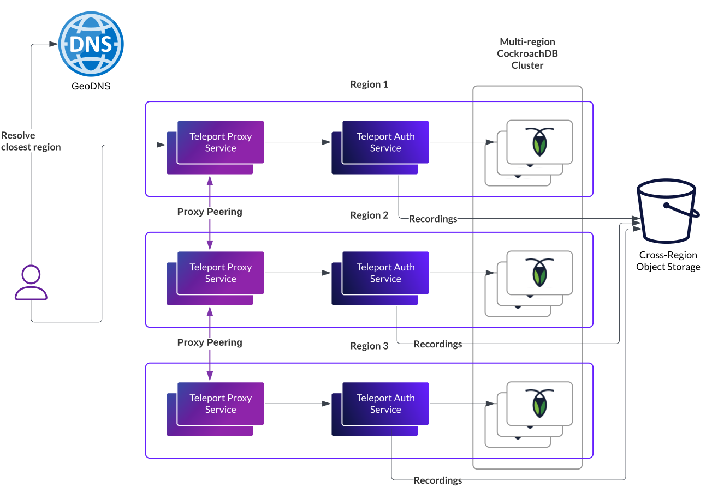

This page describes how to deploy a Teleport cluster in multiple regions to
improve resiliency and sustain regional failure. This is not a step-by-step
guide but a blueprint on how to build a multi-region Teleport cluster. This
blueprint must be adapted to work with your specific infrastructure and network
constraints.

## Important technical consideration

Before continuing, you must acknowledge the following warnings:

- This setup is not required for most Teleport users and customers.
  Single-region multi-zone deployments provide the best availability/cost ratio.
  For example, Amazon SLAs are 99.99% for both DynamoDB and EC2.
- This blueprint relies on many complex components. If you don't have the team
  capacity and expertise to deploy and operate such components, you will end
  up with a lower availability than a single-region multi-zone setup.
- You are responsible for deploying and maintaining the Teleport dependencies
  including the database, object storage, container runtime, network plugins
  and anything else which is required.

<Admonition type="tip">

For teams with limited bandwidth who need multi-region clusters, Teleport
offers to host cross-region clusters. You can benefit from the
setup described in this document without the operational costs and complexity,
see [the Teleport Enterprise (Cloud) getting started guide](../../get-started.mdx)
for more details.

</Admonition>

## Architecture overview

A multi-region Teleport deployment is composed of several regional Teleport
deployments. Teleport stores its state in a multi-region backend and uses
[Proxy Peering](../../admin-guides/management/operations/proxy-peering.mdx) to connect users to resources
hosted in a different region.

The recommended multi-region backend
is [the CockroachDB backend](../../reference/backends.mdx)
available in self-hosted Teleport Enterprise.



To run a multi-region Teleport deployment, you must have:

- **3 regions**. Teleport only needs 2, but CockroachDB needs 3 for its quorum mechanism.
- Teleport Proxy Service instances able to dial each other by IP address.
  This means you have **cross-region Pod/Instance connectivity**. This is typically
  achieved with VPC peering and/or service mesh.
- A **multi-region object storage** for session recordings.
- **GeoDNS** to route users and Teleport Agents to the closest Teleport cluster.
- A **multi-region CockroachDB cluster**. You can use the CockroachDB core
  for testing purposes, but only CockroachDB Enterprise is recommended for production
  because of [its multi-region features](https://www.cockroachlabs.com/docs/stable/enterprise-licensing).

## Implementing multi-region Teleport on Kubernetes

Teams with Kubernetes infrastructure will want to host Teleport in Kubernetes.
This section describes this setup in more detail.

### Teleport Dependencies

- Create 3 peered regional VPCs (e.g., on AWS) or 1 global VPC (e.g., on GKE).
- Create 1 Kubernetes cluster in each region, **Pod CIDRs must not overlap**.
- Ensure pod mesh connectivity. Proxy pods must be able to dial each other
  [on port 3021](../../reference/networking.mdx). The setup will vary
  based on your network and CNI plugin configuration:
  - If pods are using the native network layer (for example GKE, or AWS' vpc-cni addon)
    you can rely on pure VPC peering, routing, and firewall capabilities to
    connect pods from each Kubernetes cluster.
  - If pods are given non-native IP addresses, you can use the Cilium
    cluster-mesh capabilities to connect your pods. They
    provide [a step-by-step guide on how to mesh clusters](https://docs.cilium.io/en/stable/network/clustermesh/clustermesh/).
- Set up a multi region object storage:
  - on GCP, GCS has a multi-region location
  - on-prem, MinIO supports [multi-site bucket replication](https://min.io/docs/minio/linux/administration/bucket-replication/enable-server-side-multi-site-bucket-replication.html)
  - on AWS, you can [set up two-way-replication](https://docs.aws.amazon.com/AmazonS3/latest/userguide/mrap-create-two-way-replication-rules.html)
    between S3 buckets.
- Set up IAM to allow access to the object storage. See [S3 docs](../../reference/backends.mdx#s3-iam-policy) for the reference.
- Set up [a CockroachDB multi-region cluster](https://www.cockroachlabs.com/docs/v24.1/multiregion-overview)

### Teleport backend configuration

Create Teleport databases and user in CockroachDB:
  ```sql
  CREATE DATABASE teleport_backend;
  CREATE DATABASE teleport_audit;
  CREATE USER teleport;
  GRANT CREATE ON DATABASE teleport_backend TO teleport;
  GRANT CREATE ON DATABASE teleport_audit TO teleport;
  SET CLUSTER SETTING kv.rangefeed.enabled = true;
  ```

Then sign a certificate for the `teleport` user
with [the `cockroach certs` command](https://www.cockroachlabs.com/docs/stable/cockroach-cert).

You must end up with 3 files:
- `client.teleport.crt`
- `client.teleport.key`
- `ca.crt`

<Tabs>
<TabItem label="CockroachDB Enterprise">
For CockroachDB Enterprise you must declare both zones and regions to
CockroachDB and configure regional fault tolerance on the database.

```sql
ALTER DATABASE teleport_backend SET PRIMARY REGION <region1>;
ALTER DATABASE teleport_backend ADD REGION IF NOT EXISTS <region2>;
ALTER DATABASE teleport_backend SET SECONDARY REGION <region2>;
ALTER DATABASE teleport_backend SURVIVE REGION FAILURE;

ALTER DATABASE teleport_audit SET PRIMARY REGION <region1>;
ALTER DATABASE teleport_audit ADD REGION IF NOT EXISTS <region2>;
ALTER DATABASE teleport_audit SET SECONDARY REGION <region2>;
ALTER DATABASE teleport_audit SURVIVE REGION FAILURE;
```

<Admonition type="note" title="Impact of the CockroachDB regions">
    CockroachDB stores the Teleport data in two regions. If you only deploy two
    regional Teleport clusters, pick the same regions. If you deploy 3 Teleport
    clusters, the ones in the primary and secondary regions will experience
    lower database latency.

    If the primary and secondary regions are far from each other (for example,
    on different continents) this will make CockroachDB write operations
    slower.
</Admonition>

</TabItem>
<TabItem label="CockroachDB core">
On CockroachDB core you must declare the physical regions as CockroachDB
zones and configure zonal fault tolerance on the Teleport databases.

```sql
ALTER DATABASE teleport_backend SURVIVE ZONE FAILURE;
ALTER DATABASE teleport_audit SURVIVE ZONE FAILURE;
```

<Admonition type="note">
    CockroachDB core does not offer the regional features CockroachDB Enterprise
    does. The performance might be impacted. CockroachDB core is not recommended
    for production in multi-region setups.
</Admonition>
</TabItem>
</Tabs>


### Deploying Teleport

Once all Teleport dependencies are set up, you can deploy Teleport via the
`teleport-cluster` Helm chart. You need to create one release per Kubernetes cluster.
Here is an example of the values for one specific region:

```yaml
chartMode: standalone
clusterName: teleport-multi-region.example.org
persistence:
  enabled: false
enterprise: true

auth:
  teleportConfig:
    # Configure CockroachDB
    teleport:
      storage:
        type: cockroachdb
        # regional CockroachDB URL, if you followed the Cockroach docs it looks like
        # cockroachdb-public.<region>.svc.cluster.local
        conn_string: postgres://teleport@cockroachdb-public.<region>.svc.cluster.local:26257/teleport_backend?sslmode=verify-full&pool_max_conns=20
        audit_events_uri:
          - "postgres://teleport@cockroachdb-public.<region>.svc.cluster.local:26257/teleport_audit?sslmode=verify-full"
        # replace this with the URI of your regional object storage (S3, GCS, MinIO) and IAM role configured for the object storage access
        # set complete_initiators param to ensure Teleport will only complete uploads initiated by itself
        audit_sessions_uri: "uri://to-your-regional-bucket?complete_initiators=<teleport-iam-role>"
        ttl_job_cron: '*/20 * * * *'
    
    # Configure proxy peering
    auth_service:
      tunnel_strategy:
        type: proxy_peering
        agent_connection_count: 2

  # Mount the CockroachDB certs and have Teleport use them (via default env vars)
  extraVolumes:
    - name: db-certs
      secret:
        secretName: cockroach-certs
  extraVolumeMounts:
    - name: db-certs
      mountPath: /var/lib/db-certs
      readOnly: true
  extraEnv:
    - name: PGSSLROOTCERT
      value: /var/lib/db-certs/ca.crt
    - name: PGSSLCERT
      value: /var/lib/db-certs/client.teleport.crt
    - name: PGSSLKEY
      value: /var/lib/db-certs/client.teleport.key

# Pass the TLS certificate to be used by the proxy
# This can be omitted if you use cert-manager and set `highAvailability.certManager`
tls:
  existingSecretName: proxy-cert

highAvailability:
  replicaCount: 2
```

### GeoDNS Setup

Finalize the deployment by setting up GeoDNS to route the users to the closest
Teleport deployment. The setup will differ from one DNS provider to another. Use
short TTLs to ensure you can steer traffic off a region if needed.

When possible, configure healthchecks on `/v1/webapi/ping` so a broken/faulty
Teleport region is automatically removed from the DNS records and users are
routed to the closest working Teleport deployment.

## Update strategy

Updating Teleport on multi-region setups poses several challenges.
Strictly following Teleport compatibility guarantees requires downscaling to a
single auth before updating. In a multi-region setup, this requires:

- relying on a single region for auth during the update
- suspending two regions, or allowing proxies to connect to auths from a
  different region (this is not the case by default and requires a Cilium
  cross-cluster service and a custom join token for the Proxy Service).

<Admonition type="note">

    It's possible to do Auth rolling updates. In such case, multiple auth
    versions might be running concurrently. Newly introduced resource fields
    might not be properly set until all auths are rolled out.

    This consistency/usability tradeoff can be acceptable if the rollout period
    is short and the version difference is minimal.

</Admonition>

## CockroachDB sizing

A 3x3 CockroachDB cluster (1 node per zone, 3 zones per region, 3 regions)
whose nodes have 2 CPUs and 8GiB of memory can sustain a Teleport cluster with
10,000 SSH nodes.

The CockroachDB performance depends on the storage type. Make sure to store
CockroachDB's state on SSDs. When running on Kubernetes, the default storage
class might not be the one offering the best latency and throughput.

See the [Teleport scaling](../management/operations/scaling.mdx) page for more
details on how to size Teleport.

Teleport load varies depending on the usage type (number of connected
nodes, number of protected resources, number of roles, concurrent connections,
and user activity), so you will need to test and adapt the sizing based on your
specific needs.


<Admonition type="important">
    When running on Kubernetes, unless you are using [the static CPU
    policy](https://kubernetes.io/docs/tasks/administer-cluster/cpu-management-policies/#static-policy)
    we don't recommend setting CPU limits on either Teleport or CockroachDB pods.

    Due to the way CPU throttling is implemented, multi-threaded I/O-intensive
    applications such as Teleport and CockroachDB will degrade as soon as they
    reach the CPU limit. This will lead to a service disruption and very likely
    to a complete outage.

    As a rule of thumb, most critical pods' `resources` section should look like this:

    ```yaml
    resources:
      requests:
        # cpu and memory requests set
        cpu: "2"
        memory: "8Gi"
      limits:
        # memory limit is set to the same value as memory request
        memory: "8Gi"
        # no cpu limit is set
    ```
    
</Admonition>

## Setting up multi-region AWS S3 replication

This section explains how to create a multi-region object storage with multiple
regional S3 buckets and replication rules.

1. Create 3 buckets, one in each region, with versioning enabled
1. Create a multi-region access point containing the 3 buckets
1. After its creation, in the "Replication and Failover" tab, choose "Create
   Replication Rule" and the template "Replicate objects among all specified
   buckets."

Alternatively, you can create individual replication rule with tools like
Terraform. With 3 buckets `bucketA`, `bucketB`, `bucketC` you need 6 rules:
- from `bucketA` to `bucketB`
- from `bucketA` to `bucketC`
- from `bucketB` to `bucketA`
- from `bucketB` to `bucketC`
- from `bucketC` to `bucketA`
- from `bucketC` to `bucketB`

<Admonition type="note">
    If you want Teleport to automatically clean up session recordings, you must
    enable "Delete marker replication" in the replication rules.
</Admonition>
