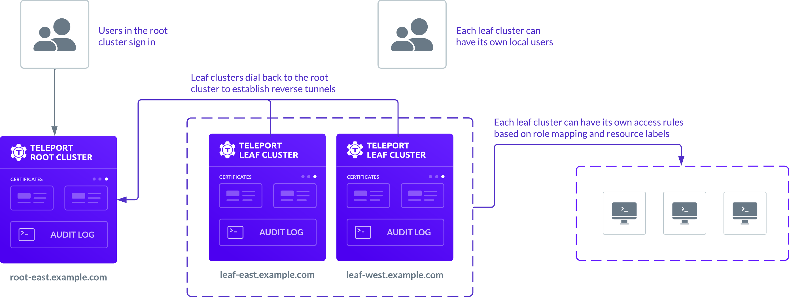
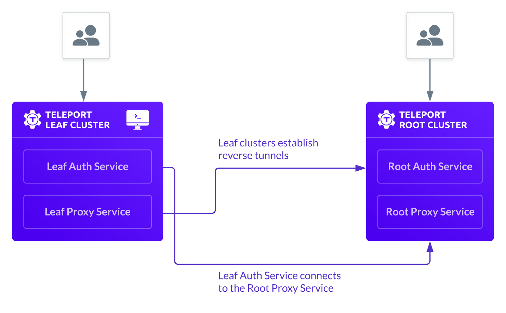

<Admonition type="note">
Trusted clusters are only available for self-hosted Teleport clusters.
</Admonition>

As you learned in [Core Concepts](../../../core-concepts.mdx), a Teleport cluster
consists of the Teleport Auth Service, the Teleport Proxy Service, and the 
Teleport services that manage access to resources in your infrastructure.
With Teleport, you can also partition your infrastructure into multiple connected 
clusters to allow the users of one cluster—the **root cluster**—to connect to resources 
in another cluster—the **leaf cluster**—while authenticated using a single 
Teleport Auth Service. 

After you establish a trust relationship between the root and leaf clusters, the leaf cluster can
run behind a firewall without any inbound ports open. The leaf cluster creates an outbound reverse 
SSH tunnel to the root cluster and keeps the tunnel open.
When a user tries to connect to any resource in the leaf cluster, the Teleport Auth Service on the 
leaf cluster connects to the root cluster through the reverse tunnel using the Teleport Proxy Service 
instance running on the root cluster.

<Admonition type="warning">
   Once a trust relationship is established between a root and leaf clusters, the root Proxy Service
   can ask the leaf Proxy Service to establish network connections to arbitrary addresses. This is
   how root clusters access resources on leaf clusters. A compromised root Proxy Service can ask
   leaf Proxy Services to connect to sensitive or unauthorized resources, so be sure to use a
   firewall to ensure leaf Proxy services are only allowed to connect to the appropriate resources.  
</Admonition>

## Who uses trusted clusters?

Most organizations don't need to configure trusted clusters. In most cases, you can add 
multiple Teleport Proxy Service instances to enroll and manage thousands of resources 
without creating a new cluster.

However, there are a few specific scenarios where trusted clusters can be particularly useful.
For example, if you have a large and widely-distributed infrastructure or must provide access
to resources for external agencies, contractors, or clients, you might benefit from setting up 
a trusted cluster. The most common use cases for trusted clusters include:

- Managed service providers (MSP) remotely managing the infrastructure of their clients.
- Device manufacturers remotely maintaining computing appliances deployed on premises.
- Large cloud software vendors managing multiple data centers using a common proxy.

## How it works

In the following example, a managed service provider uses three independent clusters to 
provide access to clients in different regions:

- Cluster `msp-root.example.com` is the root cluster. This cluster might have its own resources or be 
strictly used for collecting audit logs and authenticating users.
- Clusters `leaf-east.example.com` and `leaf-west.example.com` are two independent leaf clusters to service 
clients in different regions.
- Each cluster is an independent x.509 and SSH certificate authority and can operate autonomously.
- Each leaf cluster dials back to the root cluster to establish a reverse tunnel. If you have multiple 
Proxy Service instances, you have multiple tunnels for high availability.

The following diagram provides a simplified view of the architecture:



As this diagram suggests, users can sign in to the root cluster to receive certificates signed by the root
cluster certificate authority. They can then connect to leaf clusters either directly
or through the root cluster acting as a bastion host.
After users sign in, they can be recognized and trusted on the leaf clusters based on information in their
certificate and on how their roles in the root cluster are mapped to roles on the leaf cluster.

The Teleport Auth Service on the leaf cluster determines the resources a user has permissions to access by
checking the certificate for the following information:

- The list of **principals** that the user is authorized to use. Principals are equivalent to
  the local logins that have been added to a Teleport user profile.
- The signature of the **certificate authority** that issued the certificate. In a trusted cluster environment, 
  the Teleport Auth Service on the root cluster signs the certificate.
- The **metadata certificate extensions** that are provided by the Teleport Auth Service. Teleport uses 
  the metadata to store the list of user roles and SSH options like `permit-agent-forwarding`.
- The expiration date, or **time-to-live** (TTL) to ensure the certificate is still valid.

Based on the information in the certificate, the Teleport Auth Service performs the following actions:

- Verifies that the certificate signature matches one of its trusted root clusters.
- Applies role mapping to associate a role on the leaf cluster with one of the roles assigned 
  to the user in the root cluster.
- Checks if the local role allows the requested identity—the Unix login—to have access.
- Verifies that the certificate has not expired. The TTL is set by the root cluster.

The following diagram provides a simplified view of the interaction between the services running
on the leaf cluster and service running on the root cluster:



Note that trusted clusters only work in one direction. 
Users from the leaf cluster can't see or connect to resources in the root cluster.

## Role relationships in a trusted cluster

Leaf clusters are autonomous in that they have their own state, roles, and local users. This autonomy 
enables leaf cluster administrators to decide how to map the identity of the external users to their 
local cluster roles. 
The following diagram provides a simplified view of how role mapping works using the same trusted
cluster with `msp-root.example.com` as the root cluster and `leaf-east.example.com` as the leaf cluster:


In this example, the user Alice signs in to the `msp-root.example.com` root cluster. The root cluster is
configured with a single sign-on identity provider that authenticates her identity and her group membership.
Based on the information from the identity provider, the root cluster assigns Alice the `full-access` role
and issues her a certificate. The mapping of single sign-on properties to Teleport roles is configured when
you add an authentication connector to the Teleport cluster. To learn more about configuring single sign-on
through an external identity provider, see [Configure Single Sign-on](../../access-controls/sso/sso.mdx).

Alice receives the certificate that specifies the roles assigned to her in the root cluster. This metadata
about her roles is contained in the certificate extensions and is protected by the signature of the root 
cluster certificate authority so it can't be tampered with.

When Alice connects to a resource in the leaf cluster `leaf-east.example.com`, she's identified as an external user
with a certificate signed by an external certificate authority. Based on the role mapping rules in the leaf
cluster, Alice is assigned the `stage-access` role. This role allows her to access `mongodb.stage.example.com`
but not `mongodb.prod.example.com`.

| Role in the root cluster | Mapped role in the leaf cluster |
| ------------------------ | ------------------------------- |
| full-access | stage-access |

In this example, the leaf cluster `leaf-east.example.com` denies Alice access to the `mongodb.prod.example.com` resource
because her `full-access` role in the root cluster is mapped to the `stage-access` role in this leaf cluster.
With role mapping, leaf cluster administrators can control the privileges external users are granted.
Although role mapping can be as simple as assigning users to the same roles in the root and leaf clusters,
you can also use mapping to downgrade a user's privileges or restrict access to specific resources.

Now that you know what a trusted cluster is and how it works, you can use this guide 
to learn how to:

- Identify root and leaf clusters.
- Add trusted cluster resources.
- Generate an invitation token to establish a trust relationship between a root and leaf cluster.
- Establish permission mapping between clusters using Teleport roles.
- Enable and disable trust between clusters.

## Prerequisites

To complete the steps in this guide, verify your environment meets the following requirements:

- Access to **two** Teleport cluster instances.

  The two clusters should be at the same version or, at most, the leaf cluster can be one major version 
  behind the root cluster version.

- The `tctl` admin tool and `tsh` client tool version >= (=teleport.version=).
  
  You can verify the tools you have installed by running the following commands:

  ```code
  $ tctl version
  # Teleport v(=teleport.version=) go(=teleport.golang=)
  
  $ tsh version
  # Teleport v(=teleport.version=) go(=teleport.golang=)
  ```

  For more information about installing Teleport, see [Installation](../../../installation.mdx).

- A Teleport SSH server that is joined to the cluster you plan to use as the **leaf cluster**.
  For information about how to enroll a resource in your cluster, see 
  [Join Services to your Cluster](../../../enroll-resources/agents/join-services-to-your-cluster/join-services-to-your-cluster.mdx).

(!docs/pages/includes/permission-warning.mdx!)

## Step 1/6. Prepare the leaf cluster environment

This guide demonstrates how to enable users of your root cluster to access
a server in your leaf cluster with a specific user identity and role.
For this example, the user identity you can use to access the server in the leaf
cluster is `visitor`. Therefore, to prepare your environment, you first need to 
create the `visitor` user and a Teleport role that can assume this username when 
logging in to the server in the leaf cluster.

To add a user and role for accessing the trusted cluster:

1. Open a terminal shell on the server running the Teleport agent in the leaf cluster.

1. Add the local `visitor` user and create a home directory for the user by running the 
following command:
   
   ```code
   $ sudo useradd --create-home visitor
   ```
   
   The home directory is required for the `visitor` user to access a shell on the server.

1. Sign out of all user logins and clusters by running the following command:
   
   ```code
   $ tsh logout
   ```

1. Sign in to your **leaf cluster** from your administrative workstation using 
your Teleport username:
   
   ```code
   $ tsh login --proxy=<Var name="leafcluster.example.com" /> --user=<Var name="myuser" />
   ```

   Replace `leafcluster.example.com` with the Teleport leaf cluster domain and 
   `myuser` with your Teleport username.

1. Create a role definition file called `visitor.yaml` with the following content:

   ```yaml
   kind: role
   version: v5
   metadata:
     name: visitor
   spec:
     allow:
       logins:
         - visitor
       node_labels:
         '*': '*'
   ```

   You must explicitly allow access to nodes with labels to SSH into the server running 
   the Teleport agent. In this example, the `visitor` login is allowed access to any server.

1. Create the `visitor` role by running the following command:
   
   ```code
   $ tctl create visitor.yaml
   ```
   
   You now have a `visitor` role on your leaf cluster. The `visitor` role allows 
   users with the `visitor` login to access nodes in the leaf cluster. In the next step, 
   you must add the `visitor` login to your user so you can satisfy the conditions of 
   the role and access the server in the leaf cluster.

## Step 2/6. Prepare the root cluster environment

Before you can test access to the server in the leaf cluster, you must have a
Teleport user that can assume the `visitor` login. Because authentication is
handled by the root cluster, you need to add the `visitor` login to a user in the
root cluster.

To add the login to your Teleport user:

1. Sign out of all user logins and clusters by running the following command:
   
   ```code
   $ tsh logout
   ```

1. Sign in to your **root cluster** from your administrative workstation using 
your Teleport username:
   
   ```code
   $ tsh login --proxy=<Var name="rootcluster.example.com" /> --user=<Var name="myuser" />
   ```

   Replace `rootcluster.example.com` with the Teleport root cluster domain and 
   `myuser` with your Teleport username.

1. Open your user resource in your editor by running a command similar to the
   following:

   ```code
   $ tctl edit user/<Var name="myuser" />
   ```

   Replace `myuser` with your Teleport username.

1. Add the `visitor` login:
   
   ```diff
      traits:
        logins:
   +    - visitor
        - ubuntu
        - root
   ```

1. Apply your changes by saving and closing the file in your editor.

## Step 3/6. Establish trust between clusters

Before users from the root cluster can access the server in the
leaf cluster using the `visitor` role, you must define a trust relationship 
between the clusters. Teleport establishes trust between the root cluster and a 
leaf cluster using an **invitation token**.

To set up trust between clusters, you must first create the invitation token using the
Teleport Auth Service in the root cluster. You can then use the Teleport Auth Service 
on the leaf cluster to create a `trusted_cluster` resource that includes the invitation token, 
proving to the root cluster that the leaf cluster is the one you expect to register.

To establish the trust relationship:

1. Sign out of all user logins and clusters by running the following command:
   
   ```code
   $ tsh logout
   ```

1. Sign in to your **root cluster** from your administrative workstation using 
your Teleport username:
   
   ```code
   $ tsh login --proxy=<Var name="rootcluster.example.com" /> --user=<Var name="myuser" />
   ```

   Replace `rootcluster.example.com` with the Teleport root cluster domain and 
   `myuser` with your Teleport username.

1. Generate the invitation token by running the following command:
   
   ```code
   $ tctl tokens add --type=trusted_cluster --ttl=5m
   The cluster invite token: (=presets.tokens.first=)
   ```

   This command generates a trusted cluster invitation token to allow an inbound 
   connection from a leaf cluster. The token can be used multiple times. In this
   command example, the token has an expiration time of five minutes.
   
   Note that the invitation token is only used to establish a
   connection for the first time. Clusters exchange certificates and
   don't use tokens to re-establish their connection afterward.

   You can copy the token for later use. If you need to display the token again,
   run the following command against your root cluster:

   ```code
   $ tctl tokens ls
   Token                                                    Type            Labels   Expiry Time (UTC)
   -------------------------------------------------------- --------------- -------- ---------------------------
   (=presets.tokens.first=)                         trusted_cluster          28 Apr 22 19:19 UTC (4m48s)
   ```

1. Create a resource configuration file called `trusted_cluster.yaml` with the
following content:

   ```yaml
   kind: trusted_cluster
   version: v2
   metadata:
     name: rootcluster.example.com
   spec:
     enabled: true
     token: (=presets.tokens.first=)
     tunnel_addr: rootcluster.example.com:443
     web_proxy_addr: rootcluster.example.com:443
     role_map:
       - remote: "access"
         local: ["visitor"]
   ```

   In this file:

   - Set `metadata.name` to the name of your root cluster.
   - Set `spec.token` to the invitation token you generated previously.
   - Set `spec.tunnel_addr` to the reverse tunnel address of the Teleport Proxy Service in the root cluster.
   - Set `spec.web_proxy_addr` to the address of the Teleport Proxy Service on the root cluster. 
   - Set `spec.role_map` to map Teleport roles from the root cluster to roles in the leaf cluster.
   
   **Look up cluster addresses**

   If you aren't sure of what values to use for cluster settings such as the `tunnel_addr` or `web_proxy_addr`, 
   you can often look up the information using command-line tools that parse and extract machine-readable data 
   from JSON files. One of the most common of these tools is `jq`. You can download `jq` for most operating 
   systems from the [jqlang](https://jqlang.github.io/jq/download/) website.
   
   To get cluster addresses using `jq`:
   
   1. Set the `PROXY` environment variable to retrieve information about your Teleport cluster 
      by replacing `teleport.example.com` with your Teleport cluster domain:
      
      ```code
      $ PROXY=teleport.example.com
      ```
   
   1. Extract the `tunnel_addr` for your cluster by running the following command:
   
      ```code
      $ curl https://$PROXY/webapi/ping | jq 'if .proxy.tls_routing_enabled == true then .proxy.ssh.public_addr else .proxy.ssh.ssh_tunnel_public_addr end'      
      ```

   1. Extract the `web_proxy_addr` for your cluster by running the following command:
      
      ```code
      $ curl https://$PROXY/webapi/ping | jq .proxy.ssh.public_addr
      ```
   
   **Map root cluster roles to leaf cluster roles**

   You use the `role_map` setting in the `trusted_cluster` resource configuration to define how 
   roles from the root cluster map to roles on the leaf cluster. In this example, users assigned 
   the `access` role for the root cluster are granted the `visitor` role when they attempt to log 
   in to a server in the leaf cluster. This role mapping enables you to restrict access to resources
   in the leaf cluster.
   
   If your Teleport user is assigned the `access` role on the root cluster, you can use this role 
   mapping to test access to the server in the leaf cluster. If your Teleport user isn't assigned 
   the `access` role, change `access` in the `role_map` to one of your user's roles.

   Role mapping can be quite powerful for managing access in trusted clusters. For more information
   about how to use role mapping to restrict access to leaf clusters and examples of the accepted
   syntax, see [Role mapping syntax and expressions](#role-mapping-syntax-and-expressions).

1. Sign out of the root cluster by running the following command:
   
   ```code
   $ tsh logout
   ```

## Step 4/6. Create the trusted cluster resource

You're now ready to create the trusted cluster resource in the leaf cluster.

To create the trusted cluster resource:

1. Sign in to your **leaf cluster** from your administrative workstation using 
your Teleport username:
   
   ```code
   $ tsh login --proxy=<Var name="leafcluster.example.com" /> --user=<Var name="myuser" />
   ```

   Replace `leafcluster.example.com` with the Teleport leaf cluster domain and 
   `myuser` with your Teleport username.

1. Create the trusted cluster resource from the resource configuration file by running 
the following command:

   ```code
   $ tctl create trusted_cluster.yaml
   ```

   You can also configure leaf clusters directly in the Teleport Web UI.
   For example, you can select **Management**, then click **Trusted Clusters** to create a
   new `trusted_cluster` resource or manage an existing trusted cluster.

1. Sign out of the leaf cluster and sign back in to the root cluster. 

1. Verify the trusted cluster configuration by running the following command:
   
   ```code
   $ tsh clusters
   ```
   
   This command should list the root cluster and the leaf cluster with output 
   similar to the following:
   
   ```
   Cluster Name                Status Cluster Type Labels Selected 
   --------------------------- ------ ------------ ------ -------- 
   rootcluster.example.com     online root                *        
   leafcluster.example.com     online leaf                         
   ```

## Step 5/6. Manage access to the trusted cluster

When you created a `trusted_cluster` resource on the leaf cluster, the 
Teleport Auth Service on the leaf cluster sends a request to the Teleport 
Proxy Service on the root cluster to validate the trusted cluster. 
After validating the request, the root cluster creates a `remote_cluster` 
resource to represent the trusted leaf cluster.

You can add labels to the `remote_cluster` resource on the root cluster to
manage access to the leaf cluster. You can't manage labels on the leaf clusters
themselves. Leaf clusters propagating their own labels could create problems with 
rogue clusters updating their labels to unexpected values.

To manage access to the leaf cluster:

1. Verify that you are signed in as a Teleport user on the root cluster by
running the following command:
   
   ```code
   tsh status
   ```

1. Retrieve the `remote_cluster` resource by running the following command:

   ```code
   $ tctl get rc
   ```

   This command displays output similar to the following:

   ```
   kind: remote_cluster
   metadata:
     id: 1651261581522597792
     name: leafcluster.example.com
   status:
     connection: online
     last_heartbeat: "2022-04-29T19:45:35.052864534Z"
   version: v3
   ```

1. Add a label to the leaf cluster by running a command similar to the following:

   ```code
   $ tctl update rc/leafcluster.example.com --set-labels=env=demo
   ```
   
   After you run this command, you must be given explicit permission to access 
   clusters with the label you just set. If a trusted cluster has a label, the 
   Teleport Auth Service won't return any information about the cluster unless you
   are assigned a role that allows access to clusters with the label that's been set.

1. Create a role configuration file called `demo-cluster-access.yaml` that 
allows access to clusters with the `env: demo` label:

   ```yaml
   kind: role
   metadata:
     name: demo-cluster-access
   spec:
     allow:
       cluster_labels:
         'env': 'demo'
   version: v5
   ```

1. Create the role by running the following command:

   ```code
   $ tctl create demo-cluster-access.yaml
   ```

1. (!docs/pages/includes/add-role-to-user.mdx role="demo-cluster-access"!)

1. Confirm that the leaf cluster has been updated with the label you set by 
running the following command:

   ```code
   $ tctl get rc
   ```

   Because you now have a role with permission to access a cluster with the `env: demo` label,
   the command displays the updated resource information:

   ```
   kind: remote_cluster
   metadata:
     id: 1651262381521336026
     labels:
       env: demo
     name: leafcluster.example.com
   status:
     connection: online
     last_heartbeat: "2022-04-29T19:55:35.053054594Z"
   version: v3
   ```

## Step 6/6. Access a server in the leaf cluster

With the `trusted_cluster` resource you created earlier, you can log in to the
server in your leaf cluster as a user of your root cluster.

To test access to the server:

1. Verify that you are signed in as a Teleport user on the root cluster by
running the following command:
   
   ```code
   tsh status
   ```
   

1. Confirm that the server running the Teleport agent is joined to the leaf cluster by 
running a command similar to the following:
   
   ```code
   $ tsh ls --cluster=<Var name="leafcluster.example.com" />
   ```

   This command displays output similar to the following:

   ```
   Node Name       Address        Labels
   --------------- -------------- ------------------------------------
   ip-172-3-1-242  127.0.0.1:3022 hostname=ip-172-3-1-242                                                                    
   ip-172-3-2-205  ⟵ Tunnel      hostname=ip-172-3-2-205
   ```

1. Open a secure shell connection using the `visitor` login:

   ```code
   $ tsh ssh --cluster=leafcluster.example.com visitor@ip-172-3-2-205
   ```

1. Confirm you are logged in with as the user `visitor` on the server
in the leaf cluster by running the following commands:
   
   ```code
   $ pwd
   /home/visitor
   $ uname -a
   Linux ip-172-3-2-205 5.15.0-1041-aws #46~20.04.1-Ubuntu SMP Wed Jul 19 15:39:29 UTC 2023 aarch64 aarch64 aarch64 GNU/Linux
   ```

## Role mapping syntax and expressions

In this guide, you saw a simple example of role mapping.
However, you can define more sophisticated role mapping for trusted clusters using wildcards, regular expressions, 
role template variables, shared user traits, and labels.
The next sections provide additional details about role mapping in trusted clusters and provide examples 
for using more complex role mapping syntax.

### Wildcard characters

In role mappings, the asterisk (*) is a wildcard character that you can use to match any number of
characters in a string. For example, if you want to let *any* user from the root cluster connect to the
leaf cluster, you can use a wildcard `*` in the `role_map` like this:

```yaml
role_map:
  - remote: "*"
    local: [access]
```

The following example illustrates mapping any roles on the root cluster that begin with
`cluster-` to the role `clusteradmin` on the leaf cluster:

```yaml
role_map:
   - remote: 'cluster-*'
     local: [clusteradmin]
```

### Regular expressions

You can also use regular expressions to map user roles from one cluster to
another. The regular expression syntax enables you to use part of a remote 
role name that matches a regular expression in the corresponding local role.
In the following example, remote users with a remote role called `remote-one` are
mapped to a local role called `local-one`, `remote-two` becomes `local-two`, and so on:

```yaml
  - remote: "^remote-(.*)$"
    local: [local-$1]
```

Regular expression matching is activated only when the expression starts
with `^` and ends with `$`.

Regular expressions use Google's re2 syntax. For more information, see the re2 [syntax guide](https://github.com/google/re2/wiki/Syntax).

### Sharing user traits between trusted clusters

You can share user SSH logins, Kubernetes users and groups, and database users and names between trusted clusters.
For example, assume you have a root cluster with a role named `root` and the following allow rules:

```yaml
logins: ["root"]
kubernetes_groups: ["system:masters"]
kubernetes_users: ["alice"]
db_users: ["postgres"]
db_names: ["dev", "metrics"]
```

When setting up the trusted cluster relationship, the leaf cluster can choose 
to map this `root` cluster role to its own `admin` role:

```yaml
role_map:
- remote: "root"
  local: ["admin"]
```

The role `admin` of the leaf cluster can now be set up to use the root cluster's
role logins, Kubernetes groups, and other traits using the following variables:

```yaml
logins: ["{{internal.logins}}"]
kubernetes_groups: ["{{internal.kubernetes_groups}}"]
kubernetes_users: ["{{internal.kubernetes_users}}"]
db_users: ["{{internal.db_users}}"]
db_names: ["{{internal.db_names}}"]
```

User traits that come from an identity provider—such as OIDC claims or SAML
attributes—are also passed to the leaf clusters and can be used in role
templates using the `external` variable prefix. For example:

```yaml
logins: ["{{internal.logins}}", "{{external.logins_from_okta}}"]
node_labels:
  env: "{{external.env_from_okta}}"
```

For full details on how variable expansion works in Teleport roles, see the
[Teleport Zero Trust Access Controls
Reference](../../../reference/access-controls/roles.mdx).

### Update role mappings

You can update role mappings for a trusted cluster resource by modifying the `role_map` 
field in the `trusted_cluster.yaml` resource configuration file. After you update the 
resource configuration file, you can update the trusted cluster by signing in to the 
leaf cluster and running the following command:

```code
$ tctl create --force trusted_cluster.yaml
```

### Role mapping and cluster-level labels

In this guide, you learned how you can combine role mapping and labels to manage access to leaf cluster resources.
You should note that you can use a certificate issued for a root cluster to connect directly 
to a leaf cluster because the leaf cluster inherently trusts the root cluster. In most cases, 
the trust relationship between the root and leaf clusters provides the desired behavior. 

However, this trust relationship can also be exploited if you use cluster labels to enforce authorization 
restrictions. Because the leaf cluster trusts the certificate authority of the root cluster, that certificate 
can be used to bypass any leaf-specific `cluster_labels` settings that might be intended to restrict access to 
the leaf cluster. For example, assume you assign the leaf cluster a label using the following command:

```text
tctl update rc/leaf --set-labels=env=prod
```

This label can't prevent direct access to the leaf cluster if a user has a certificate signed by the root cluster.
You should use role mapping as the primary way to restrict access to leaf clusters and use `cluster_labels` for
filtering and limiting the visibility of leaf cluster resources.

## Temporarily disable a trusted cluster

You can temporarily disable the trust relationship for a cluster by logging in to the leaf
cluster and editing the `trusted_cluster` resource configuration files that you previously created.

To temporarily disable trust:

1. Sign in to your **leaf cluster** from your administrative workstation using 
your Teleport username:
   
   ```code
   $ tsh login --proxy=<Var name="leafcluster.example.com" /> --user=<Var name="myuser" />
   ```

   Replace `leafcluster.example.com` with the Teleport leaf cluster domain and 
   `myuser` with your Teleport username.

1. Edit the resource configuration by running the following command:

   ```code
   $ tctl edit trusted_cluster/<Var name="rootcluster.example.com" />
   ```

1. Set the `spec.enabled` field to `false`:

   ```diff
    spec:
   -  enabled: true
   +  enabled: false
      role_map:
      - local:
        - visitor
   ```

1. Update the trusted cluster configuration by saving and closing the file in
   your editor.

   This command closes the reverse tunnel between your leaf cluster and your root cluster.
   It also deactivates the root cluster's certificate authority on the leaf cluster.

You can repeat these steps to change `spec.enabled` to `true` if you want to reestablish 
the trust relationship between the leaf cluster and the root cluster.

## Federating access to Kubernetes clusters

There are cases when you have Kubernetes clusters that have to operate
independently, for example, they are part of a different organization or have
intermittent connectivity.

You can take advantage of trusted clusters to federate trust across Kubernetes
clusters.

When multiple trusted clusters are present behind the Teleport Proxy Service,
the `kubeconfig` generated by `tsh login` contains the Kubernetes API endpoint
determined by the `<cluster>` argument to the `tsh login` command.

For example, consider the following scenario:

- There are two Teleport clusters named `east` and `west`, and two Kubernetes
  clusters with the same names. Each Teleport cluster has its own configuration
  file with its name specified in the `cluster_name` field.
- The clusters `east` and `west` are leaf clusters that trust a Teleport Team or
  Enterprise Cloud account, for example, `example.teleport.sh`.
- Users always authenticate against `example.teleport.sh` but use their
  certificates to access SSH nodes and the Kubernetes API in all three clusters.

In this scenario, users usually log in using the following commands:

```code
# Log in to the root cluster
$ tsh --proxy=mytenant.teleport.sh login

# Receive a certificate for "east"
$ tsh --proxy=mytenant.teleport.sh login east

# Log in to the Kubernetes cluster called "east" in the Teleport cluster with
# the same name
$ tsh kube login --proxy=mytenant.teleport.sh --cluster=east east

# The user's kubeconfig now contains the entry for the "east" Kubernetes
# endpoint, i.e. east.mytenant.teleport.sh
```

## Remove a trusted leaf cluster

If you want to completely remove a leaf cluster without the possibility of restoring
it later, you must run commands on both the leaf cluster and the root cluster.

To remove a leaf cluster completely:

1. Sign in to your **leaf cluster** from your administrative workstation using 
your Teleport username:
   
   ```code
   $ tsh login --proxy=<Var name="leafcluster.example.com" /> --user=<Var name="myuser" />
   ```

   Replace `leafcluster.example.com` with the Teleport leaf cluster domain and 
   `myuser` with your Teleport username.

1. Disable and remove the leaf cluster by running the following command:

   ```code
   $ tctl rm trusted_cluster/<Var name="rootcluster.example.com" />
   ```

   This command sets `spec.enabled` to `false` for the `trusted_cluster` resource
   and removes the trusted cluster resource from the Teleport Auth Service backend.

1. Sign in to your **root cluster** from your administrative workstation using 
your Teleport username:
   
   ```code
   $ tsh login --proxy=<Var name="rootcluster.example.com" /> --user=<Var name="myuser" />
   ```

   Replace `rootcluster.example.com` with the Teleport root cluster domain and 
   `myuser` with your Teleport username.

1. Delete the certificate authorities associated with the remote cluster and remove the
`remote_cluster` resource from the Teleport Auth Service backend by running the following command

   ```code
   $ tctl rm rc/<Var name="leafcluster.example.com" />
   ```

   If you run this command without removing the trust relationship from the leaf cluster,
   the leaf cluster will continue to try to ping the root cluster, but won't be able to connect. 
   To reestablish the trusted cluster relationship, you must recreate the trusted cluster 
   from the leaf cluster.

## Troubleshooting

The most common problems you might encounter when configuring a trust relationship fall into
the following categories:

- **HTTPS configuration issues**.
- **Connectivity problems**.
- **Access problems**. 

### HTTPS configuration issues

The most common HTTPS configuration issues stem from a root cluster that uses a self-signed 
or invalid HTTPS certificate. If the `web_proxy_addr` endpoint of the root cluster uses a self-signed 
or invalid HTTPS certificate, you are likely to see an error similar to the following: 
`The trusted cluster uses misconfigured HTTP/TLS certificate`. 

For ease of testing, you can start the `teleport` daemon on the leaf cluster with 
the `--insecure` command-line options to accept self-signed certificates. However, you should 
ensure that you configure HTTPS properly to resolve the issue, then remove the `--insecure` before 
running Teleport in a production environment.

### Connectivity problems

If a leaf cluster doesn't show up in the output when you run the `tsh clusters` command 
on the root cluster, it might indicate network connectivity issues or problems communicating 
with the Teleport Auth Service.

To troubleshoot connectivity problems, enable verbose output for the Teleport Auth Service on 
both the root and leaf clusters. Usually, this can be done by adding the `--debug` flag to the
command to start the teleport service:

```code
teleport start --debug`
```

You can also enable verbose output by updating the configuration file for both Auth Services.
Open the `/etc/teleport.yaml` configuration file and add `DEBUG` to the `log` configuration section:

```yaml
# Snippet from /etc/teleport.yaml
teleport:
  log:
    output: stderr
    severity: DEBUG
```

On systemd-based distributions, you can watch the log output by running the following command:

```code
$ journalctl -fu teleport
```

Most of the time you will find out that either a invitation token is
mismatched/expired, or the network addresses for `tunnel_addr` or
`web_proxy_addr` cannot be reached due to pre-existing firewall rules or
how your network security groups are configured on AWS.

### Access problems

If users from the root cluster get **Access denied** error messages when trying to connect to nodes 
on the leaf cluster, it might indicate problems with their role assignment, role mapping, or allowed logins.
However, troubleshooting **Access denied** messages can be quite challenging. 
To troubleshoot, you should start by checking the following information for the user being denied access:

- The roles assigned to the user on the root cluster when signing in with the `tsh login` command. 
  You can inspect the certificate and assigned roles by running the `tsh status` command on the client.

- The roles assigned to the user on the leaf cluster when the role mapping takes place. You can check
  the role mapping in the Teleport audit log. 
  
  If you manage Teleport on your own network, the default location for audit log is 
  `/var/lib/teleport/log` on the server where the Teleport Auth Service for the cluster runs.

  If you use Teleport as a managed cloud-based service, you can access the audit log from the
  Teleport Web UI by selecting **Management**, then clicking **Audit Log** in the Activity section.
