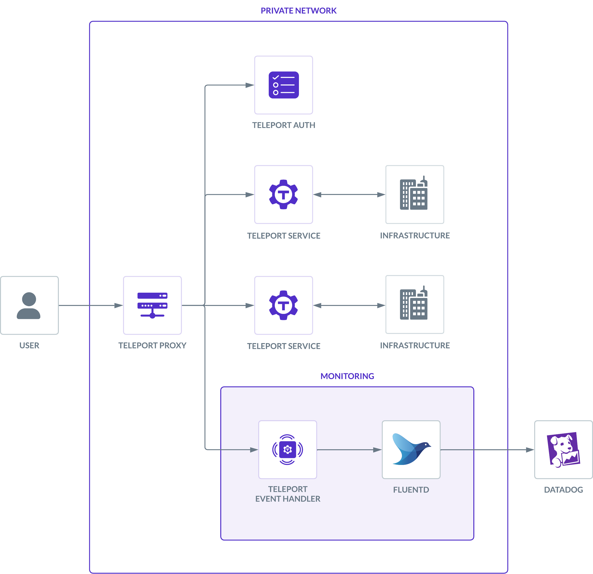

Datadog is a SAAS monitoring and security platform. In this guide, we'll explain
how to forward Teleport audit events to Datadog using Fluentd.

## How it works

The Teleport Event Handler authenticates to the Teleport Auth Service to receive
audit events over a gRPC stream, then sends those events to Fluentd as JSON
payloads over a secure channel established via mutual TLS:



Since the Datadog Agent can only receive logs from remote sources as
JSON-encoded bytes over a [TCP or UDP
connection](https://docs.datadoghq.com/agent/logs/?tab=tailfiles#custom-log-collection),
the Teleport Event Handler needs to send its HTTPS payloads without using the
Datadog Agent. Fluentd handles authentication to the Datadog API.

## Prerequisites

(!docs/pages/includes/edition-prereqs-tabs.mdx!)

(!docs/pages/includes/machine-id/plugin-prerequisites.mdx!)

- A [Datadog](https://www.datadoghq.com/) account.
- A server, virtual machine, Kubernetes cluster, or Docker environment to run the
  Event Handler. The instructions below assume a local Docker container for testing.
- Fluentd version v(=fluentd.version=) or greater. The Teleport Event Handler
  will create a new `fluent.conf` file you can integrate into an existing Fluentd
  system, or use with a fresh setup.

The instructions below demonstrate a local test of the Event Handler plugin on
your workstation. You will need to adjust paths, ports, and domains for other
environments.

- (!docs/pages/includes/tctl.mdx!)

## Step 1/6. Install the Event Handler plugin

The Teleport Event Handler runs alongside the Fluentd forwarder, receives events
from Teleport's events API, and forwards them to Fluentd.

(!docs/pages/includes/install-event-handler.mdx!)

## Step 2/6. Generate a plugin configuration

(!docs/pages/includes/configure-event-handler.mdx!)

## Step 3/6. Create a user and role for reading audit events

(!docs/pages/includes/plugins/event-handler-role-user.mdx!)

## Step 4/6. Create teleport-event-handler credentials

The Teleport Event Handler needs credentials to authenticate to the Teleport
Auth Service. In this section, you will give the Event Handler access to these
credentials.

### Enable issuing of credentials for the Event Handler role

<Tabs>
<TabItem label="Machine ID">
(!docs/pages/includes/plugins/rbac-impersonate-event-handler-machine-id.mdx!)
</TabItem>
<TabItem label="Long-lived identity files">
(!docs/pages/includes/plugins/rbac-impersonate-event-handler.mdx!)
</TabItem>
</Tabs>

### Export an identity file for the Event Handler plugin user

Give the plugin access to a Teleport identity file. We recommend using Machine
ID for this in order to produce short-lived identity files that are less
dangerous if exfiltrated, though in demo deployments, you can generate
longer-lived identity files with `tctl`:

<Tabs>
<TabItem label="Machine ID">
(!docs/pages/includes/plugins/tbot-identity.mdx secret="teleport-event-handler-identity"!)
</TabItem>
<TabItem label="Long-lived identity files">
(!docs/pages/includes/plugins/identity-export.mdx user="teleport-event-handler" secret="teleport-event-handler-identity"!)
</TabItem>
</Tabs>

## Step 5/6. Install the Fluentd output plugin for Datadog

In order for Fluentd to communicate with Datadog, it requires the [Fluentd output
plugin for Datadog](https://github.com/DataDog/fluent-plugin-datadog). Install
the plugin on your Fluentd host using either `gem` or the `td-agent`, if installed:

```code
# Using Gem
$ gem install fluent-plugin-datadog

# Using td-agent
$ /usr/sbin/td-agent-gem install fluent-plugin-datadog
```

<Admonition type="tip" title="Testing Locally?">

If you're running Fluentd in a local Docker container for testing, you can adjust
the entrypoint to an interactive shell as the root user, so you can install the
plugin before starting Fluentd:

```code
$ docker run -u $(id -u root):$(id -g root) -p 8888:8888 -v $(pwd):/keys -v \
$(pwd)/fluent.conf:/fluentd/etc/fluent.conf --entrypoint=/bin/sh -i --tty  fluent/fluentd:edge
# From the container shell:
$ gem install fluent-plugin-datadog
$ fluentd -c /fluentd/etc/fluent.conf
```

</Admonition>

### Configure Fluentd

1. Visit Datadog and generate an API key for Fluentd by following the [Datadog
   documentation](https://docs.datadoghq.com/account_management/api-app-keys).

1. Copy the API key and use it to add a new `<match>` block to `fluent.conf`:

   ```ini
   <match test.log>
   
     @type datadog
     @id awesome_agent
     api_key (=presets.tokens.first=)
   
     host http-intake.logs.us5.datadoghq.com
   
     # Optional parameters
     dd_source teleport
   
   </match>
   ```

1. Edit your configuration as follows:

   - Add your API key to the `api_key` field.
   - Adjust the `host` value to match your Datadog site. See the Datadog [Log
     Collection and
     Integrations](https://docs.datadoghq.com/logs/log_collection/?tab=host)
     guide to determine the correct value.
   - `dd_source` is an optional field you can use to filter these logs in the
     Datadog UI.
   - Adjust `ca_path`, `cert_path` and `private_key_path` to point to the
     credential files generated earlier. If you're testing locally, the Docker
     command above already mounted the current working directory to `keys/` in
     the container.

1. Restart Fluentd after saving the changes to `fluent.conf`.

## Step 6/6. Run the Teleport Event Handler plugin

In this section, you will modify the Event Handler configuration you generated
and run the Event Handler to test your configuration.

### Configure the Event Handler

In this section, you will configure the Teleport Event Handler for your
environment.

(!docs/pages/includes/plugins/finish-event-handler-config.mdx!)

Next, modify the configuration file as follows:

(!docs/pages/includes/plugins/config-toml-teleport.mdx!)

(!docs/pages/includes/plugins/machine-id-exporter-config.mdx!)

### Start the Teleport Event Handler

(!docs/pages/includes/start-event-handler.mdx!)

The Logs view in Datadog should now report your Teleport cluster events:


## Troubleshooting connection issues

If the Teleport Event Handler is displaying error logs while connecting to your
Teleport Cluster, ensure that:

- The certificate the Teleport Event Handler is using to connect to your
  Teleport cluster is not past its expiration date. This is the value of the
  `--ttl` flag in the `tctl auth sign` command, which is 12 hours by default.
- Ensure that in your Teleport Event Handler configuration file
  (`teleport-event-handler.toml`), you have provided the correct host *and* port
  for the Teleport Proxy Service.

## Next steps

- Read more about
[impersonation](../../access-controls/guides/impersonation.mdx)
here.
- While this guide uses the `tctl auth sign` command to issue credentials for the
Teleport Event Handler, production clusters should use Machine ID for safer,
more reliable renewals. Read [our guide](../../../enroll-resources/machine-id/getting-started.mdx)
to getting started with Machine ID.
- To see all of the options you can set in the values file for the
`teleport-plugin-event-handler` Helm chart, consult our [reference
guide](../../../reference/helm-reference/teleport-plugin-event-handler.mdx).
- Review the Fluentd output plugin for Datadog [README
file](https://github.com/DataDog/fluent-plugin-datadog/blob/master/README.md)
to learn how to customize the log format entering Datadog.
