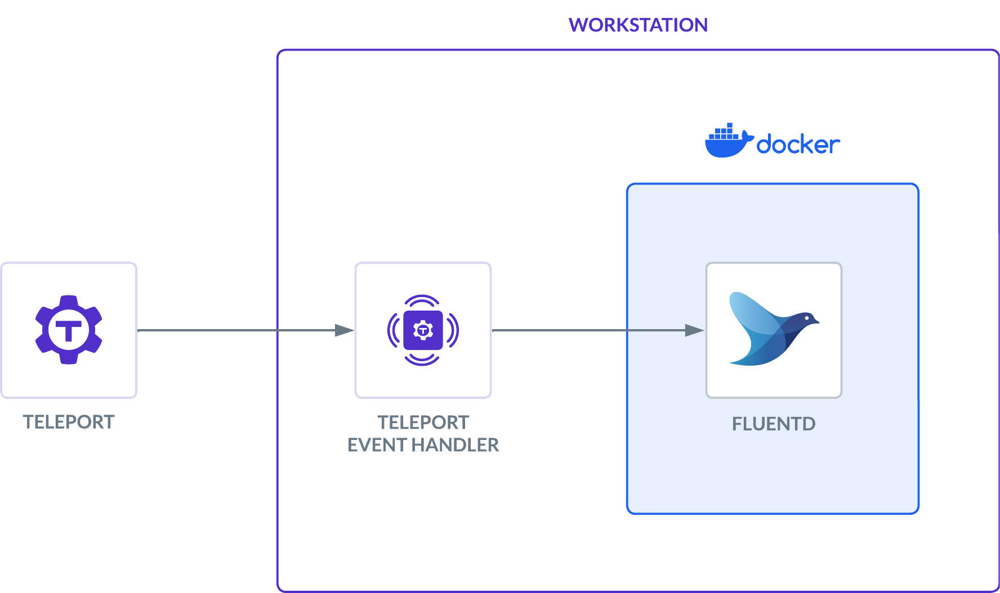

Fluentd is an open source data collector for a unified logging layer. In this
guide, we will:

- Set up Teleport's Event Handler plugin.
- Forward events with Fluentd.

This guide also serves as an explanation for the Teleport Event Handler plugin,
using Fluentd as the target service. 

## How it works

The Teleport event handler runs alongside the Fluentd forwarder, receives events
from Teleport's events API, and forwards them to Fluentd.

We'll create a local Docker container as a destination for the Event Handler:



You can follow the instructions below for a local proof-of-concept demo, or use any
of the additional installation instructions to configure the Teleport Event Handler
to integrate with your infrastructure.

## Prerequisites

(!docs/pages/includes/edition-prereqs-tabs.mdx!)

(!docs/pages/includes/machine-id/plugin-prerequisites.mdx!)

- Fluentd version v(=fluentd.version=) or greater.

- Docker version v(=docker.version=).

- (!docs/pages/includes/tctl.mdx!)

- On your workstation, create a folder called `event-handler`, to hold configuration files and plugin state:

  ```code
  $ mkdir -p event-handler
  $ cd event-handler
  ```

## Step 1/6. Install the event handler plugin

(!docs/pages/includes/install-event-handler.mdx!)

## Step 2/6. Generate a plugin configuration

(!docs/pages/includes/configure-event-handler.mdx!)

If you have an existing Fluentd setup with TLS, issue a client certificate and
key from the same certificate authority for the Teleport Event Handler to use.

## Step 3/6. Create a user and role for reading audit events

(!docs/pages/includes/plugins/event-handler-role-user.mdx!)

## Step 4/6. Create teleport-event-handler credentials

### Enable issuing of credentials for the event handler role

<Tabs>
<TabItem label="Machine ID">
(!docs/pages/includes/plugins/rbac-impersonate-event-handler-machine-id.mdx!)
</TabItem>
<TabItem label="Long-lived identity files">
(!docs/pages/includes/plugins/rbac-impersonate-event-handler.mdx!)
</TabItem>
</Tabs>

### Export an identity file for the Fluentd plugin user

Give the plugin access to a Teleport identity file. We recommend using Machine
ID for this in order to produce short-lived identity files that are less
dangerous if exfiltrated, though in demo deployments, you can generate
longer-lived identity files with `tctl`:

<Tabs>
<TabItem label="Machine ID">
(!docs/pages/includes/plugins/tbot-identity.mdx secret="teleport-event-handler-identity"!)
</TabItem>
<TabItem label="Long-lived identity files">
(!docs/pages/includes/plugins/identity-export.mdx user="teleport-event-handler" secret="teleport-event-handler-identity"!)
</TabItem>
</Tabs>

## Step 5/6. Start the Fluentd forwarder

The Fluentd plugin will send events to your Fluentd instance using keys
generated on the previous step.

The `fluent.conf` file generated earlier configures your Fluentd instance to
accept events using TLS and print them:

```
<source>
    @type http
    port 8888

    <transport tls>
        client_cert_auth true

        # We are going to run fluentd in Docker. /keys will be mounted from the host file system.
        ca_path /keys/ca.crt
        cert_path /keys/server.crt
        private_key_path /keys/server.key
        private_key_passphrase ********** # Passphrase generated along with the keys
    </transport>

    <parse>
      @type json
      json_parser oj

      # This time format is used by the plugin. This field is required.
      time_type string
      time_format %Y-%m-%dT%H:%M:%S
    </parse>

    # If the number of events is high, fluentd will start failing the ingestion
    # with the following error message: buffer space has too many data errors.
    # The following configuration prevents data loss in case of a restart and
    # overcomes the limitations of the default fluentd buffer configuration.
    # This configuration is optional.
    # See https://docs.fluentd.org/configuration/buffer-section for more details.
    <buffer>
      @type file
      flush_thread_count 8
      flush_interval 1s
      chunk_limit_size 10M
      queue_limit_length 16
      retry_max_interval 30
      retry_forever true
    </buffer>
</source>

# Events sent to test.log will be dumped to STDOUT.
<match test.log>
  @type stdout
</match>
```

To try out this Fluentd configuration, start your fluentd instance:

```code
$ docker run -u $(id -u ${USER}):$(id -g ${USER}) -p 8888:8888 -v $(pwd):/keys -v $(pwd)/fluent.conf:/fluentd/etc/fluent.conf fluent/fluentd:edge
```

This will consume your current terminal, so open a new one to continue following along.

## Step 6/6. Run the Event Handler plugin

### Configure the Event Handler

In this section, you will configure the Teleport Event Handler for your
environment.

(!docs/pages/includes/plugins/finish-event-handler-config.mdx!)

Next, modify the configuration file as follows:

(!docs/pages/includes/plugins/config-toml-teleport.mdx!)

(!docs/pages/includes/plugins/machine-id-exporter-config.mdx!)

### Start the Teleport Event Handler

(!docs/pages/includes/start-event-handler.mdx!)

## Troubleshooting connection issues

If the Teleport Event Handler is displaying error logs while connecting to your
Teleport Cluster, ensure that:

- The certificate the Teleport Event Handler is using to connect to your
  Teleport cluster is not past its expiration date. This is the value of the
  `--ttl` flag in the `tctl auth sign` command, which is 12 hours by default.
- Ensure that in your Teleport Event Handler configuration file
  (`teleport-event-handler.toml`), you have provided the correct host *and* port
  for the Teleport Proxy Service or Auth Service.

## Next Steps

Read more about
[impersonation](../../access-controls/guides/impersonation.mdx)
here.

While this guide uses the `tctl auth sign` command to issue credentials for the
Teleport Event Handler, production clusters should use Machine ID for safer,
more reliable renewals. Read [our guide](../../../enroll-resources/machine-id/getting-started.mdx)
to getting started with Machine ID.

To see all of the options you can set in the values file for the
`teleport-plugin-event-handler` Helm chart, consult our [reference
guide](../../../reference/helm-reference/teleport-plugin-event-handler.mdx).

