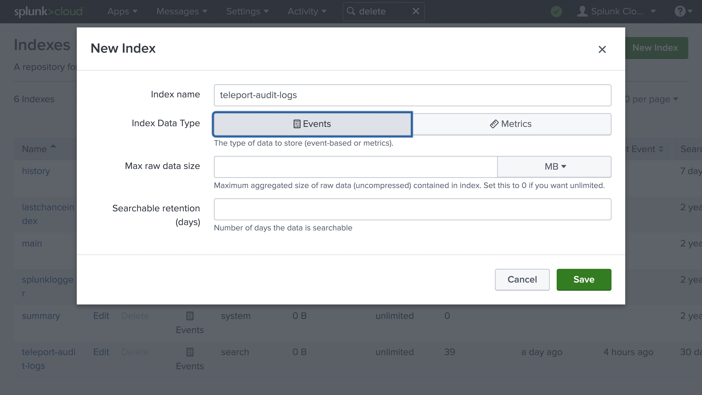
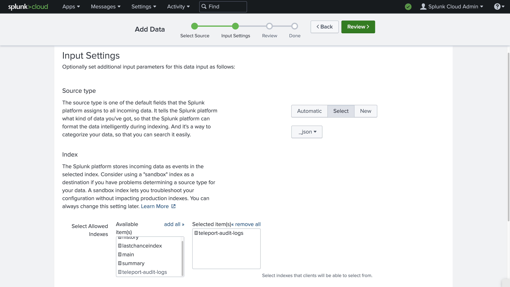

Teleport's Event Handler plugin receives audit logs from the Teleport Auth
Service and forwards them to your log management solution, letting you perform
historical analysis, detect unusual behavior, and form a better understanding of
how users interact with your Teleport cluster.

In this guide, we will show you how to configure the Teleport Event Handler
plugin to send your Teleport audit logs to Splunk. In this setup, the Teleport
Event Handler plugin forwards audit logs from Teleport to Splunk's Universal
Forwarder, which stores them in Splunk Cloud Platform or Splunk Enterprise for
visualization and alerting.

## Prerequisites

(!docs/pages/includes/edition-prereqs-tabs.mdx!)

(!docs/pages/includes/machine-id/plugin-prerequisites.mdx!)

- Splunk Cloud Platform or Splunk Enterprise v9.0.1 or above.

- A Linux host where you will run the Teleport Event Handler plugin and Splunk
  Universal Forwarder. The Universal Forwarder must be installed on the host.

  <details>
  <summary>Running the Teleport Event Handler and Universal Forwarder on separate hosts</summary>

  If you run the Teleport Event Handler and Universal Forwarder on the same
  host, there is no need to open a port on the host for ingesting logs. However,
  if you run the Universal Forwarder on a separate host from the Teleport Event
  Handler, you will need to open a port on the Universal Forwarder host to
  traffic from the Teleport Event Handler. This guide assumes that the Universal
  Forwarder is listening on port `9061`.

  </details>

- On Splunk Enterprise, port `8088` should be open to traffic from the host
  running the Teleport Event Handler and Universal Forwarder.

- (!docs/pages/includes/tctl.mdx!)

## Step 1/4. Set up the Teleport Event Handler plugin

The Event Handler plugin is a binary that runs independently of your Teleport
cluster. It authenticates to your Teleport cluster and your Splunk Universal
Forwarder using mutual TLS. In this section, you will install the Teleport Event
Handler plugin on the Linux host where you are running your Universal Forwarder
and generate credentials that the plugin will use for authentication.

### Install the Teleport Event Handler plugin

Follow the instructions for your environment to install the Teleport Event
Handler plugin on your Universal Forwarder host:

(!docs/pages/includes/install-event-handler.mdx!)

### Generate a starter config file

Generate a configuration file with placeholder values for the Teleport Event Handler plugin. Later in this guide, we will edit the configuration file for your environment.

(!docs/pages/includes/configure-event-handler.mdx!)

We'll re-purpose the files generated for Fluentd in our Universal Forwarder configuration.

### Define RBAC resources

(!docs/pages/includes/plugins/event-handler-role-user.mdx!)

### Enable issuing of credentials for the Event Handler role

<Tabs>
<TabItem label="Machine ID">
(!docs/pages/includes/plugins/rbac-impersonate-event-handler-machine-id.mdx!)
</TabItem>
<TabItem label="Long-lived identity files">
(!docs/pages/includes/plugins/rbac-impersonate-event-handler.mdx!)
</TabItem>
</Tabs>

### Export the plugin identity

Give the plugin access to a Teleport identity file. We recommend using Machine
ID for this in order to produce short-lived identity files that are less
dangerous if exfiltrated, though in demo deployments, you can generate
longer-lived identity files with `tctl`:

<Tabs>
<TabItem label="Machine ID">
(!docs/pages/includes/plugins/tbot-identity.mdx secret="teleport-event-handler-identity"!)
</TabItem>
<TabItem label="Long-lived identity files">
(!docs/pages/includes/plugins/identity-export.mdx user="teleport-event-handler" secret="teleport-event-handler-identity"!)
</TabItem>
</Tabs>

## Step 2/4. Configure the Universal Forwarder

In this step, you will configure the Universal Forwarder to receive audit logs
from the Teleport Event Handler plugin and forward them to Splunk. The Event
Handler sends audit logs as HTTP POST requests with the content type
`application/json`.

We will assume that you assigned `$SPLUNK_HOME` to `/opt/splunkforwarder` when
installing the Universal Forwarder.

<details>
<summary>Finding your $SPLUNK_HOME</summary>

To find your `$SPLUNK_HOME`, run the following command to see the location of
your Universal Forwarder service definition, which the init system systemd uses
to run the Universal Forwarder:

```code
$ sudo systemctl status SplunkForwarder.service
● SplunkForwarder.service - Systemd service file for Splunk, generated by 'splunk enable boot-start'
     Loaded: loaded (/lib/systemd/system/SplunkForwarder.service; enabled; vendor preset: enabled)
     Active: active (running) since Fri 2022-10-07 15:57:37 UTC; 2h 18min ago
   Main PID: 1772 (splunkd)
      Tasks: 53 (limit: 2309)
     Memory: 70.8M (limit: 1.8G)
     CGroup: /system.slice/SplunkForwarder.service
             ├─1772 splunkd --under-systemd --systemd-delegate=yes -p 8089 _internal_launch_under_systemd
             └─1810 [splunkd pid=1772] splunkd --under-systemd --systemd-delegate=yes -p 8089 _internal_launch_under_systemd [process-runner]
```

View the file at the path shown in the `Loaded:` field. Your `$SPLUNK_HOME`
will include the filepath segments in `ExecStart` before `/bin`. In this case,
`$SPLUNK_HOME` is `/opt/splunkforwarder/`:

```text
ExecStart=/opt/splunkforwarder/bin/splunk _internal_launch_under_systemd
```

</details>

### Create an index for your audit logs

Create an index for your Teleport audit logs by visiting the home page of the
Splunk UI and navigating to **Settings** > **Indexes**. Click **New Index**.
Name your index `teleport-audit-logs` and assign the **Index Data Type** field
to "Events".



The values of the remaining fields, **Max raw data size** and **Searchable
retention (days)** depend on your organization's resources and practices for log
management.

Click **Save**

### Create a token for the Universal Forwarder

The Universal Forwarder authenticates client traffic using a token. To generate
a token, visit the home page of the Splunk UI. Navigate to **Settings** > **Data
inputs** In the **Local inputs** table, find the **HTTP Event Collector** row and
click **Add new**

Enter a name you can use to recognize the token later so you can
manage it, e.g., `Teleport Audit Events`. Click **Next**.



In the **Input Settings** view (above), next to the **Source type** field, click
**Select**. In the **Select Source Type** dropdown menu, click **Structured**,
then **_json**. Splunk will index incoming logs as JSON, which is the format the
Event Handler uses to send logs to the Universal Forwarder.

In the **Index** section, select the `teleport-audit-logs` index you created
earlier. Click **Review** then view the summary and click **Submit**. Copy the
**Token Value** field and keep it somewhere safe so you can use it later in this
guide.

### Prepare a certificate file for the Universal Forwarder

The Universal Forwarder signs TLS certificates using a file that contains both
an X.509-format certificate and an RSA private key. To prepare this, run the
following commands on the Universal Forwarder host, where `server.crt` and
`server.key` are two of the files you generated earlier with the
`teleport-event-handler configure` the command:

```code
$ cp server.crt server.pem
$ cat server.key >> server.pem
```

Allow the Universal Forwarder to access the certificate file:

```code
$ sudo chown splunk:splunk server.pem
```

### Configure the HTTP Event Collector

On your Universal Forwarder host, create a file at
`/opt/splunkforwarder/etc/system/local/inputs.conf` with the following content:

```ini
[http]
port = 9061
disabled = false
serverCert = server.pem
sslPassword =
requireClientCert = true

[http://audit]
token =
index = teleport-audit-logs
allowQueryStringAuth = true
```

This configuration enables the HTTP input, which will listen on port `9061` and
receive logs from the Teleport Event Handler Plugin, assigning them to the
`teleport-audit-logs` index.

Assign `serverCert` to the path to the `server.pem` file you generated earlier.

To assign `sslPassword`, run the following command in the directory that
contains `fluent.conf`:

```code
$ cat fluent.conf | grep passphrase
private_key_passphrase "ffffffffffffffffffffffffffffffffffffffffffffffffffffffffffffffff"
```

Copy the passphrase and paste it as the value of `sslPassword`.

The `token` field in the `[http://audit]` section enables the Universal
Forwarder to collect logs from HTTP clients that present a token. Assign `token`
to the token you generated earlier.

`allowQueryStringAuth` enables the Teleport Event Handler to include the token
in a query string, rather than the `Authorization` HTTP header (the default).
This is necessary because the Teleport Event Handler does not currently support
custom HTTP headers.

### Configure TLS

To configure secure communications between the Universal Forwarder and the
Teleport Event Handler, create a file called
`/opt/splunkforwarder/etc/system/local/server.conf` with the following content
(if this file already exists, add  the following field in the `[sslConfig]`
section):

```ini
[sslConfig]
sslRootCAPath =
```

Assign `sslRootCAPath` to the path of the `ca.crt` file you generated earlier.

Ensure that the Universal Forwarder can read the CA certificate:

```code
$ sudo chmod +r ca.crt
```

### Configure an output

Instruct the Universal Forwarder to send the logs it collects to Splunk.

Create a file at the path `/opt/splunkforwarder/etc/system/local/outputs.conf`
with the following content:

```ini
[tcpout]
sslVerifyServerCert = true

[httpout]
httpEventCollectorToken =
uri =
```

Fill in `httpEventCollectorToken` with the token you generated earlier.

Assign `uri` to the following, replacing `MYHOST` with the hostname of your
Splunk instance and `8088` with the port you are using for your Splunk HTTP
Event Collector.

```text
https://MYHOST:8088
```

The format of the URL to use will depend on your Splunk deployment. See the
[list of acceptable URL
formats](https://docs.splunk.com/Documentation/Splunk/9.0.1/Data/UsetheHTTPEventCollector#Send_data_to_HTTP_Event_Collector)
in the Splunk documentation.

Note that you must only include the scheme, host, and port of the URL. The
Universal Forwarder will append the correct URL path of the Splunk ingestion
API when forwarding logs.

Finally, restart the Universal Forwarder:

```code
$ sudo systemctl restart SplunkForwarder
```

## Step 3/4. Run the Teleport Event Handler plugin

Now that you have configured your Universal Forwarder to receive logs via HTTP
and forward them to Splunk, you will ensure that the Teleport Event Handler
plugin is configured to authenticate to the Universal Forwarder and your
Teleport cluster, then run the Teleport Event Handler.

### Configure the Teleport Event Handler

In this section, you will configure the Teleport Event Handler for your
environment.

(!docs/pages/includes/plugins/finish-event-handler-config.mdx!)

Update the configuration file as follows.

Change `forward.fluentd.url` to the following:

```text
url = "https://localhost:9061/services/collector/raw?token=MYTOKEN"
```

Ensure the URL includes the scheme, host and port of your Universal Forwarder's
HTTP input, plus the URL path that the Universal Forwarder uses for raw data
(`/services/collector/raw`).

Replace `MYTOKEN` with the token you generated earlier for the Splunk Universal
Forwarder. If you are running the Universal Forwarder and Event Handler on
separate hosts, replace `localhost` with your Universal Forwarder's IP address
or domain name.

Change `forward.fluentd.session-url` to the same value as `forward.fluentd.url`,
but with the query parameter key `&noop=` appended to the end:

```text
session-url = "https://localhost:9061/services/collector/raw?token=MYTOKEN&noop="
```

For audit logs related to Teleport sessions, the Teleport Event Handler appends
routing information to the URL that our HTTP input configuration does not use.
Adding the `noop` query parameter causes the Teleport Event Handler to append
the routing information as the parameter's value so the Universal Forwarder can
discard it.

Next, edit the `teleport` section of the configuration as follows:

(!docs/pages/includes/plugins/config-toml-teleport.mdx!)

(!docs/pages/includes/plugins/machine-id-exporter-config.mdx!)

Ensure that the Teleport Event Handler can read the identity file:

```code
$ chmod +r auth.pem
```

### Start the Teleport Event Handler

(!docs/pages/includes/start-event-handler.mdx!)

## Step 4/4. Visualize your audit logs in Splunk

Since our setup forwards audit logs to Splunk in the structured JSON format,
Splunk automatically indexes them, so fields will be available immediately for
use in visualizations. You can use these fields to create dashboards that track
the way users are interacting with your Teleport cluster.

For example, from the Splunk UI home page, navigate to **Search & Reporting** >
**Dashboards** > **Create New Dashboard**. Enter "Teleport Audit Log Types" for
the title of your dashboard and click **Classic Dashboards**. Click **Create**
then, in the **Edit Dashboard** view, click **Add Panel**.

In the **Add Panel** sidebar, click **New** > **Column Chart**. For the **Search
String** field, enter the following:

```text
index="teleport-audit-logs" | timechart count by event
```

Once you click **Add to Dashboard** you will see a count of Teleport event types
over time, which gives you a general sense of how users are interacting with
Teleport:


## Troubleshooting connection issues

If the Teleport Event Handler is displaying error logs while connecting to your
Teleport Cluster, ensure that:

- The certificate the Teleport Event Handler is using to connect to your
  Teleport cluster is not past its expiration date. This is the value of the
  `--ttl` flag in the `tctl auth sign` command, which is 12 hours by default.
- Ensure that in your Teleport Event Handler configuration file
  (`teleport-event-handler.toml`), you have provided the correct host *and* port
  for the Teleport Proxy Service.

## Next steps

Now that you are exporting your audit logs to Splunk, consult our [audit log
reference](../../../reference/monitoring/audit.mdx) so you can plan visualizations
and alerts.

In this guide, we made use of impersonation to supply credentials to the
Teleport Event Handler to communicate with your Teleport cluster. To learn more
about impersonation, read [our
guide](../../access-controls/guides/impersonation.mdx).

While this guide uses the `tctl auth sign` command to issue credentials for the
Teleport Event Handler, production clusters should use Machine ID for safer,
more reliable renewals. Read [our guide](../../../machine-workload-identity/machine-id/getting-started.mdx)
to getting started with Machine ID.
