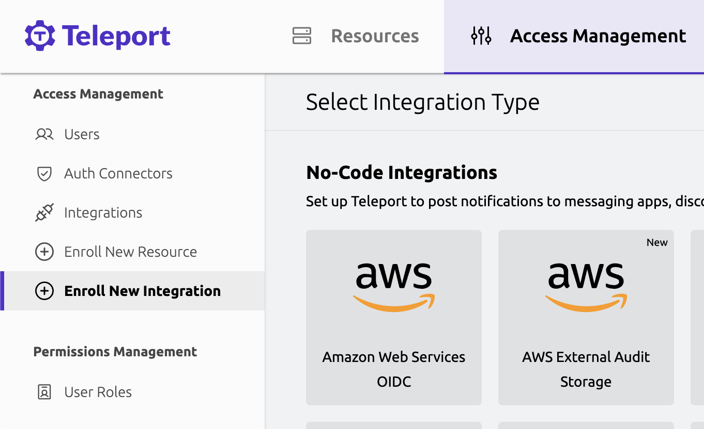

External Audit Storage is a feature of Teleport in which the Auth Service stores
audit events and session recordings directly on infrastructure in any AWS
account. 

Because you control the infrastructure that stores audit events and session
recordings, you can use External Audit Storage to satisfy compliance, retention,
and privacy policies. 

With External Audit Storage, you do not need to build an exporter to support
custom audit event queries, since you can access and efficiently query your
audit events right where they are stored.

External Audit Storage is based on Teleport's
[Athena](../../reference/backends.mdx#athena) backend for audit events and the
[S3](../../reference/backends.mdx#s3-session-recordings) backend for session recordings. It is only
available on Teleport Enterprise Cloud clusters running Teleport v14.2.1 or
above.

<Admonition type="note">
On Teleport Enterprise (Cloud), External Audit
Storage is not currently supported for users who have Access Monitoring enabled.
This functionality will be enabled in a future Teleport release.  
</Admonition>

## Prerequisites

1. A Teleport Enterprise Cloud account. If you do not have one, [sign
   up](https://goteleport.com/signup/) for a free trial.
1. To store and query audit events and session recordings, you need to set up
   the following four components in an AWS account of your choosing. The
   Teleport Web UI walks you through the infrastructure you need to create, but
   you should be aware that it includes the following components:
   - A long-term storage [Amazon S3](https://aws.amazon.com/s3/) bucket to hold
     all audit events and session recordings from your cluster. Audit events are
     stored as [Parquet](https://parquet.apache.org/) files.
   - An [AWS Glue](https://aws.amazon.com/glue/) database with a table to
     represent the schema of the audit events as stored in the Parquet format in
     S3.
   - An [Amazon Athena](https://aws.amazon.com/athena/) workgroup to power
     queries of your audit log.
   - A transient storage S3 bucket that temporarily holds the results of Athena
     queries.
1. Currently it is a requirement that the AWS infrastructure is hosted in the
   same AWS region as the Teleport Auth Service for your cluster.

## Step 1/2. Configure RBAC

To configure the integration you will need the following allow rules in one of
your Teleport roles. These are available by default in the preset `editor` role:

```yaml
kind: role
version: v7
metadata:
  name: example
spec:
  allow:
    rules:
    - resources:
      - integration
      - external_audit_storage
      verbs:
      - create
      - update
      - list
      - read
```

## Step 2/2. Visit the Web UI

External Audit Storage is available as an integration in the management panel of
the Teleport Web UI:



With External Audit Storage enabled, your Teleport Enterprise Cloud cluster acts
as an OpenID Connect (OIDC) identity provider to authenticate to your
organization's AWS account.

The Teleport Web UI walks you through the steps to set up an AWS OIDC
integration (if you don't have one already), configure the IAM policy, create
the infrastructure in your AWS account, test the connection to your S3 buckets
and Athena workgroup, and enable the feature.

<details>
<summary>IAM policy for External Audit Storage</summary>

The IAM policy for External Audit Storage resembles the following, modified to
support your AWS environment:

```json
{
    "Version": "2012-10-17",
    "Statement": [
        {
            "Effect": "Allow",
            "Action": [
                "s3:PutObject",
                "s3:GetObject",
                "s3:GetObjectVersion",
                "s3:ListMultipartUploadParts",
                "s3:AbortMultipartUpload",
                "s3:ListBucket",
                "s3:ListBucketVersions",
                "s3:ListBucketMultipartUploads",
                "s3:GetBucketOwnershipControls",
                "s3:GetBucketPublicAccessBlock",
                "s3:GetBucketObjectLockConfiguration",
                "s3:GetBucketVersioning",
                "s3:GetBucketLocation"
            ],
            "Resource": [
                "arn:aws:s3:::teleport-longterm-<unique_id>",
                "arn:aws:s3:::teleport-longterm-<unique_id>/events/*",
                "arn:aws:s3:::teleport-longterm-<unique_id>/sessions/*",
                "arn:aws:s3:::teleport-transient-<unique_id>",
                "arn:aws:s3:::teleport-transient-<unique_id>/query_results/*"
            ],
            "Sid": "ReadWriteSessionsAndEvents"
        },
        {
            "Effect": "Allow",
            "Action": [
                "athena:StartQueryExecution",
                "athena:GetQueryResults",
                "athena:GetQueryExecution"
            ],
            "Resource": "arn:aws:athena:us-west-2:278576220453:workgroup/teleport_events_<unique_id>",
            "Sid": "AllowAthenaQuery"
        },
        {
            "Effect": "Allow",
            "Action": [
                "glue:GetTable",
                "glue:GetTableVersion",
                "glue:GetTableVersions",
                "glue:UpdateTable"
            ],
            "Resource": [
                "arn:aws:glue:us-west-2:278576220453:catalog",
                "arn:aws:glue:us-west-2:278576220453:database/teleport_events_<unique_id>",
                "arn:aws:glue:us-west-2:278576220453:table/teleport_events_<unique_id>/teleport_events"
            ],
            "Sid": "FullAccessOnGlueTable"
        }
    ]
}
```

</details>

## Migrating to External Audit Storage

Once External Audit Storage is enabled, all new audit events and session
recordings will be stored in your S3 bucket, and they will *not* be stored in
the Teleport Cloud infrastructure.

If you currently use the
[Event Handler](../../zero-trust-access/export-audit-events/export-audit-events.mdx) plugin to export
events, it will follow the switch from the old to new backends and new events
will continue to be exported. Only events emitted after the transition to
External Audit Storage will be visible in the Teleport UI or accessible to
Teleport clients.

## Disabling External Audit Storage 

If you disable External Audit Storage at any time in the future, your
infrastructure will not be touched and all audit events and session recordings
will remain in your S3 bucket.

If you use the Event Handler plugin, it will continue to export new events. All
new events will be stored on Teleport Cloud infrastructure. While External Audit
Storage is disabled, only events stored in the Teleport Cloud infrastructure
will be visible in the Teleport UI or accessible to Teleport clients.
