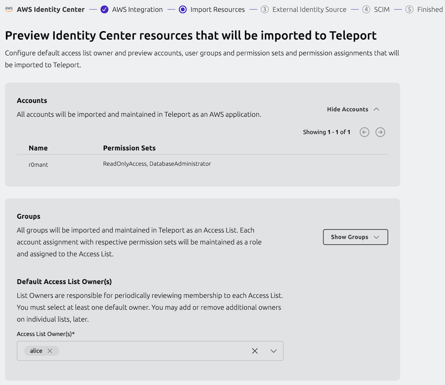
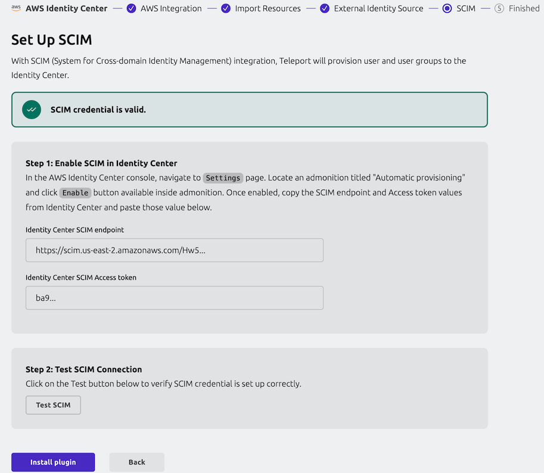

Teleport's integration with [AWS IAM Identity Center](https://aws.amazon.com/iam/identity-center/)
allows you to organize and manage your users' short- and long-term access to AWS
accounts and their permissions.

With the AWS Identity Center integration, you can manage AWS access by granting short term or long term access with Identity Governance.

## How it works

The Identity Center integration builds on top of Teleport's [role-based access controls](../../../access-controls/guides/guides.mdx),
[just-in-time Access Requests](../../../access-controls/access-requests/access-requests.mdx)
and [Access Lists](../../../access-controls/access-lists/access-lists.mdx) to manage
the creation and deletion of Identity Center _Account Assignments_. 

An _account assignment_ is the combination of a specific AWS Permission Set on a 
specific AWS account - for example "*AdminAccess on Production*" (where *Production* is 
an AWS account managed by Identity Center). All possible Account Assignments are
represented as resources within Teleport. When a user has access to an Account
Assignment in Teleport, that access is mirrored in AWS Identity Center.

When a Teleport user loses access to an Account Assignment in Teleport, that access
is similarly deleted in AWS. 

Access to Account Assignments can be granted via Teleport roles, either directly
to users or through Access Lists, or by Account Assignment resources included in
an approved Access Request.

When the integration is enabled, Teleport takes ownership over Identity Center 
users, groups, and permission set assignments:

- All Identity Center groups, along with their members, account and permission
  assignments, are imported into Teleport as Access Lists.
- Identity Center account and permission assignments are expressed as Teleport
  role policies.
- Changes made to Teleport users or Access Lists with Identity Center assigned
  permissions are reflected in the Identity Center.

For managing long-term access, Teleport cluster administrators can designate
Identity Center-synced Access Lists owners who will be responsible for adding
or removing users and performing periodic access reviews. Users added to or
removed from such Access Lists will be added to or removed from corresponding
Identity Center groups.

For short-term access, users can go through Teleport's standard Access Request
flow in which case Teleport will assign requested privileges to a particular
user and automatically unassign once the Access Request expires.

## Prerequisites

- Teleport Enterprise or Teleport Enterprise Cloud cluster version 17.0 or higher.
- Administrative access to AWS IAM Identity Center.

<Admonition type="warning">
Note that Identity Center integration requires using Teleport as an external
identity source.

As such, we recommend ensuring that all Identity Center users have access to
your Teleport cluster before turning the integration on to avoid access
interruption. If your Identity Center already uses external identity source,
you can configure corresponding [SSO connector](../../../access-controls/sso/sso.mdx)
in Teleport or, if you're using Okta, turn on
[Okta integration](../../../../enroll-resources/application-access/okta/hosted-guide.mdx).
</Admonition>

## Step 1/6. Configure AWS integration

Teleport provides a guided web UI based configuration flow for the Identity
Center integration. To get started, navigate to the "Add new integration" page
in your Teleport cluster control panel and select "AWS Identity Center".


During this step, you will set up Teleport as an OIDC identity provider for
your AWS account and create an AWS role with the permissions required for the
integration to function, such as fetching Identity Center accounts, users,
groups, permission set assignments, and so on.

<details>
<summary>Full list of IAM permissions required by Identity Center integration</summary>
```
// ListAccounts
organizations:ListAccounts
organizations:ListAccountsForParent

// ListGroupsAndMembers
identitystore:ListUsers
identitystore:ListGroups
identitystore:ListGroupMemberships

// ListPermissionSetsAndAssignments
sso:DescribeInstance
sso:DescribePermissionSet
sso:ListPermissionSets
sso:ListAccountAssignmentsForPrincipal
sso:ListPermissionSetsProvisionedToAccount

// CreateAndDeleteAccountAssignment
sso:CreateAccountAssignment
sso:DescribeAccountAssignmentCreationStatus
sso:DeleteAccountAssignment
sso:DescribeAccountAssignmentDeletionStatus
iam:AttachRolePolicy
iam:CreateRole
iam:GetRole
iam:ListAttachedRolePolicies
iam:ListRolePolicies

// AllowAccountAssignmentOnOwner
iam:GetSAMLProvider

// ListProvisionedRoles
iam:ListRoles
```
</details>


Enter required information such as Identity Center region, ARN and integration
name, and execute the generated command in the Cloud Shell.

After the script has run, fill out the ARN for the role created by the script.


## Step 2/6. Preview AWS resources

On the next step, you are presented with the list of AWS accounts, groups, and
permission sets that Teleport was able to find in your Identity Center.



Pick the default owners that should be assigned to the Access Lists in Teleport.
These resources will be imported into Teleport once the plugin is installed.

## Step 3/6. Configure identity source

<Admonition type="warning">
After this step, Teleport will become your Identity Center's identity provider.

To avoid access interruptions, we recommend making sure that all existing
Identity Center users have access to your Teleport cluster by, for example, using
the same [IdP](../../../access-controls/sso/sso.mdx) as your current Identity Center
external identity source.
</Admonition>

Follow the instructions to change your Identity Center's identity source to
Teleport.


## Step 4/6. Enable SCIM

The final step is to enable the SCIM endpoint in your Identity Center to
allow Teleport to push user and group changes.



Make sure to test SCIM connection after enabling it.

## Step 5/6. Verify the integration

Navigate to the Access Lists view page in your cluster and make sure that all
your Identity Center groups have been imported.

<Admonition type="note">
It may take a few minutes for the initial sync to complete.
</Admonition>


Imported Access Lists should show the same members as their corresponding
Identity Center groups.

## Step 6/6. Connect to AWS

Once the integration is up and running, you will see an application named
`aws-identity-center` among your resources:


Clicking the "Log In" button for this app takes you to your Identity Center
SSO start page which you can use to pick a role and connect to your AWS account
as usual.

## Usage scenarios

Let's take a look at some common usage scenarios enabled by the Identity Center
integration.

### Managing Account Assignments with Access Lists

Teleport creates an Access List for each group imported from the Identity Center
instance, with group members becoming Access List members. Default Access List 
owners are configured during the initial integration enrollment flow and can be
adjusted as necessary after the initial sync completes.

Each imported Access List is automatically assigned a role (or a set of roles)
that grant all members of that list access to all of the Account Assignments
assigned to the corresponding AWS Identity Center group during the integration
setup. 

These Teleport-generated roles each represent a single Account Assignment, and
are named using `<permission-set-name>-on-<account-name>-<account-id>` convention
(e.g. `AdministratorAccess-on-MyAccount-012345678`). 

<Admonition type="warning">
These roles are considered system roles, and any edits or updates to them will
be automatically reverted. 
</Admonition>

To give a user permission granted by an already-existing Identity Center synced
Access List, an owner can add that user as a member which makes Teleport to add
the user to its corresponding Identity Center group.

<Admonition type="warning">
Currently all existing Teleport users are synced to Identity Center. Label-based
user filtering will be supported in a later release.
</Admonition>

Removing a member from an Identity Center synced Access List removes them
from the corresponding Identity Center group effectively revoking privileges.

In addition to membership changes, Teleport propagates changes in Access List
grants back to Identity Center as well. For example, imagine an Access List with
the roles `AdminAccess-on-my-account` and `ReadOnlyAccess-on-my-account`. If the
Access List owner removes the `AdminAccess-on-my-account` role from the Access Lists,
that change will be propagated back to AWS and the corresponding Identity Center
group will have its assignments updated to remove the `AdminAccess` Permission 

### Just-in-time Access with Resource Access Requests

Teleport represents the imported AWS accounts as apps in the Teleport Resource
View, with the permission sets available for each account bundled up inside the
app. AWS accounts are treated the same as any other Teleport-managed resource, 
so users can see what AWS permission sets they are allowed to request just by
checking "Show requestable resources" in the resource view. 

Users can then choose the specific Account Assignments they want access to by 
selecting from the Permission Sets available to each AWS Account. Users
can mix Permission Sets from multiple AWS Accounts, and even include other 
Teleport-managed resources if necessary.


Once the used has selected their desired Account Assignments, the Access Request
submission and review process is the same as for any other Teleport-managed
resource. Assuming the Access Request is approved, Teleport will create the
appropriate AWS Account Assignments in Identity Center to grant the requested
access. These AWS Account Assignments will automatically be deleted when the
Access Request expires.

The user can access their temporary AWS Accounts and Roles from within Teleport
by assuming the Access Request roles. 


<Admonition type="warning">
The AWS Account Assignments will exist for the lifetime of the Access Request,
regardless of when the user assumes the associated role(s).
</Admonition>

### Just-in-time access with role Access Requests

The Identity Center integration allows Teleport users to submit Access Requests for short-term privilege elevation.

When an Access Request for a role granting Identity Center privileges is
approved, Teleport creates an individual assignment for that user in the
Identity Center. The assignment is deleted when the Access Request expires.

### Long-term access with Access Requests

If a user requests access to Account Assignments that can also be granted via an
existing Access List, Teleport will offer the reviewer the option of *promoting*
the Access Request to long-term access.


When an Access Request is promoted to long-term access, the requesting user is
added to the targeted Access List. This membership change is propagated to the
corresponding Identity Center group, and the user is then granted their requested
Account Assignments via group membership.

### Creating custom Identity Center roles

You can craft your own roles that bind Identity Center accounts to permission
sets, for example:

```yaml
kind: role
version: v7
metadata:
  name: aws-dev-access
spec:
  allow:
    account_assignments:
    - account: "<account_id>" # AWS identity center account ID
      # permission set ARN of AdministratorAccess
      permission_set: arn:aws:sso:::permissionSet/ssoins-1234/ps-5678
    - account: "<account_id>"
      # permission set ARN of ReadOnlyAccess
      permission_set: arn:aws:sso:::permissionSet/ssoins-1234/ps-8765 
```

These roles can be assigned to users and Access Lists or requested by users
using Access Requests flow described above.

## FAQ

### Which Access Lists are synced to Identity Center?

Teleport syncs all Access Lists that have AWS account and permission set rules
among their role grants to Identity Center.

### How does it work with nested Access Lists?

Identity Center does not support nested groups. As such, Teleport recursively 
flattens any [nested Access Lists](../../../access-controls/access-lists/nested-access-lists.mdx)
into a single Identity Center group containing all members reachable from the 
top-level Access List.

The flattened Identity Center group will be kept updated as members are added to
or removed from nested 

### How do I uninstall the integration?

<Admonition type="warning">
Before fully removing the integration, make sure to remember to change the
identity source in your Identity Center instance.
</Admonition>

You can remove the integration by navigating to your cluster's Integrations
list and deleting both the integration named `AWS Identity Center`. The AWS
OIDC integration that was created during the first enrollment step will be
automatically removed as well once the plugin is uninstalled.

To clean up AWS resources created for the integration, remove the Identity
Provider and its role from your AWS IAM console as well.

## Next steps

- Take a deeper dive into fundamental Teleport concepts used in Identity Center
  integration such as [RBAC](../../../access-controls/guides/guides.mdx),
  [JIT Access Requests](../../../access-controls/access-requests/access-requests.mdx)
  and [Access Lists](../../../access-controls/access-lists/access-lists.mdx).
- Learn how to enable [Okta integration](../../../../enroll-resources/application-access/okta/hosted-guide.mdx)
  to sync apps, users and groups from Okta in conjunction with Identity Center
  integration.
