The AWS RDS enrollment wizard is available in your Teleport cluster Web UI as
part of the [AWS OIDC integration](./awsoidc-integration.mdx).

The enrollment wizard configures AWS IAM resources and deploys a Teleport
Database Service instance on ECS Fargate to proxy connections to Amazon RDS
databases.

The enrollment wizard can be used to enroll RDS databases in a Teleport cluster.
It's also useful as an example of a serverless Teleport Database Service
deployment on ECS.

## How it works

### AWS OIDC Integration

The RDS enrollment wizard depends on the
[AWS OIDC integration](./awsoidc-integration.mdx).
The AWS OIDC integration creates and configures an AWS IAM OpenID Connect
Identity Provider (OIDC IdP) and an AWS IAM role that your Teleport cluster can
assume.

The RDS enrollment wizard adds permissions to the AWS OIDC integration IAM role
to list RDS databases and VPC resources like subnets and security groups and
to deploy an Amazon ECS service.

Once the integration role permissions are configured, the wizard walks you
through enrolling database(s) and deploying the Teleport Database Service in a
high availability (HA) setup on AWS Fargate for Amazon ECS.

### Dynamic Database Enrollment

Whether you choose to enroll a single database or enroll all databases using
auto-discovery, the wizard enrolls database(s) by creating `db` objects in your
Teleport cluster.
You can view detailed information about them with `tctl`:

```code
$ tctl get db/<database name>
```

### Teleport Database Service Deployment

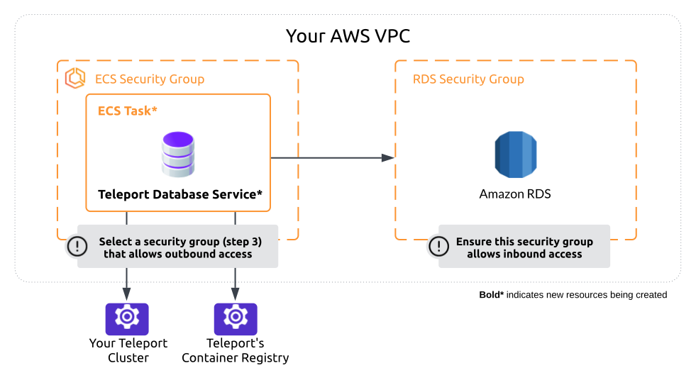

In the "Deploy Database Service" step, the wizard guides you through creating
and configuring the ECS Fargate deployment.

The wizard generates a script for you to run, which will create an IAM role for
Teleport Database Service instances to use. 
The IAM role has permissions to output logs in ECS, describe RDS databases, and
connect to RDS databases.

You then choose subnets and security groups for the deployment on ECS Fargate.

When you click "Deploy Teleport Service" the wizard creates an ECS task
definition that includes various settings for configuring and starting a
Teleport Database Service instance. 
The task definition uses the IAM role created in the first step as both the
[ECS task execution role](https://docs.aws.amazon.com/AmazonECS/latest/developerguide/task_execution_IAM_role.html).
and the
[ECS task role](https://docs.aws.amazon.com/AmazonECS/latest/developerguide/task-iam-roles.html)

The wizard then creates an ECS deployment in the same AWS VPC as your RDS
databases, configured to use the subnets and security groups you chose.
The ECS deployment is configured to run two replicas of the Teleport Database
Service task definition for an HA setup.
By deploying the Teleport Database Service instances in the same VPC as the RDS
databases, the instances can connect to databases in private subnets.
Note that the database security group rules must allow inbound traffic from the
ECS tasks as well.

Once an ECS task starts, it pulls the Teleport image and starts `teleport`.
The Teleport Database Service instance then establishes a tunnel connection to
your Teleport cluster and starts accepting connections from authorized
Teleport users to connect to the database(s) it proxies.

This is a serverless HA approach to deploying the Teleport Database Service.
It does not require any allowed inbound traffic from the internet and supports
[automatic agent upgrades](../../../upgrading/automatic-agent-updates.mdx).

The Teleport Database Service instances are configured to use
[dynamic database registration](../../../enroll-resources/database-access/guides/dynamic-registration.mdx)
so that you can enroll or disenroll databases without restarting or modifying
the deployment.
The instances will match and proxy connections for all dynamic `db` resources in
Teleport that have the following labels:

```yaml
account-id: "<AWS account ID>"
region: "<AWS region>"
vpc-id: "<AWS VPC ID>"
```

The `db` object(s) created by the wizard will have these labels, so the Teleport
Database Service instances will match them and proxy connections to them.

### AWS Resource Tags

AWS resources created by the RDS enrollment wizard are tagged in AWS so that you
can search and export them using the
[AWS Resource Groups / Tag Editor](https://console.aws.amazon.com/resource-groups/tag-editor/find-resources).
The following tags are applied:

```yaml
teleport.dev/cluster:      <Var name="cluster-name"/>
teleport.dev/origin:       integration_awsoidc
teleport.dev/integration:  <Var name="my-integration"/>
```

You can also search for AWS resources created by the wizard using the `aws` cli.
Assign <Var name="us-west-1" /> to the name of an AWS region:

```code
$ aws resourcegroupstaggingapi get-resources \
--region <Var name="us-west-1"/> \
--tag-filters \
Key=teleport.dev/cluster,Values=<Var name="cluster-name"/> \
Key=teleport.dev/integration,Values=<Var name="my-integration"/> \
Key=teleport.dev/origin,Values=integration_awsoidc
```

## Prerequisites

- A running Teleport cluster
- An AWS account and permissions to create IAM Identity Providers and roles

## Step 1/2. Configure RBAC

The RDS enrollment wizard is a part of the AWS OIDC integration.
You will need the following allow rules in one of your Teleport roles.
These are available by default in the preset `editor` role:

```yaml
kind: role
version: v7
metadata:
  name: example
spec:
  allow:
    rules:
    - resources:
      - integration
      verbs:
      - create
      - update
      - list
      - read
```

## Step 2/2. Visit the Web UI

The RDS enrollment wizard is available in the "Add new resource" panel of the
Teleport Web UI:

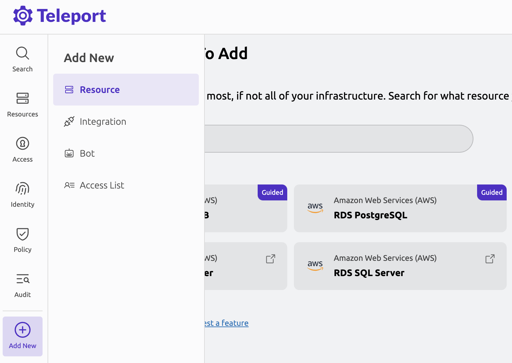

The Teleport Web UI walks you through the steps to set up an AWS OIDC
integration (if you don't have one already), configure IAM permissions, create
an ECS deployment in your AWS account, and run a database connection test.

## Troubleshooting

The enrollment wizard waits for the ECS deployment tasks to start and connect to
your Teleport cluster.
If that does not happen, then either the ECS tasks have failed to start or they
do not have network connectivity to your Teleport cluster.
You should inspect the ECS deployment to troubleshoot the issue further.

Most of the troubleshooting steps below assume you already know how to find
the ECS deployment and get more information about what is happening in ECS.
If you do not know how to find the ECS deployment, then first read about
[how to find the ECS deployment](#how-to-find-the-ecs-deployment).

### How to find the ECS deployment

Navigate to the ECS service in AWS: https://console.aws.amazon.com/ecs/v2/clusters.
Make sure you select the same AWS region that you selected at the start of the
RDS enrollment wizard.

The ECS cluster that the wizard created will be named after your Teleport
cluster except with dots `.` replaced with underscores `_` and the additional
suffix `-teleport`.
For example if your Teleport cluster is named
`example.teleport.sh`, then the corresponding ECS cluster will be named
`example_teleport_sh-teleport`.

Click on your ECS cluster:

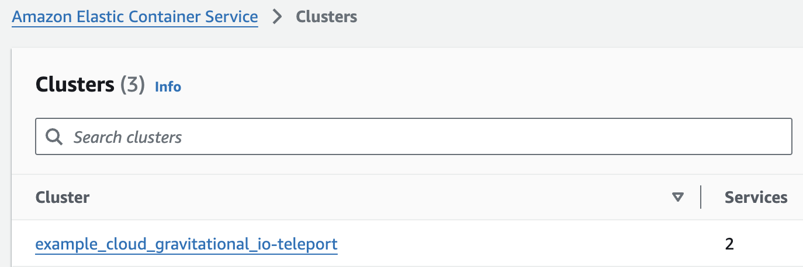

An ECS cluster is composed of one or more ECS services.
Click on the service named after the VPC you chose in the enrollment wizard -
the VPC ID is used as the suffix of the corresponding ECS service name, e.g
`database-service-vpc-123456789abcdefgh`:

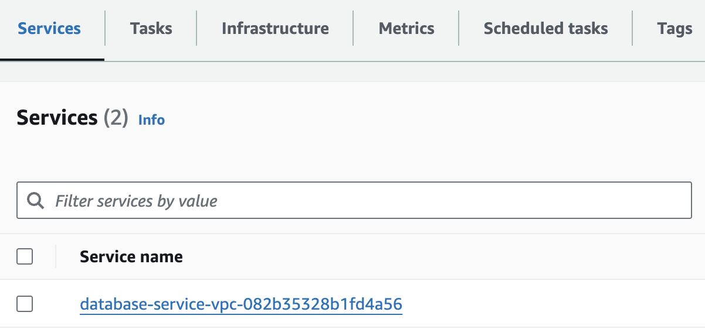

In the ECS service overview page you should click on the "Tasks" panel to see
the deployment tasks.
There should be two tasks either running or pending:

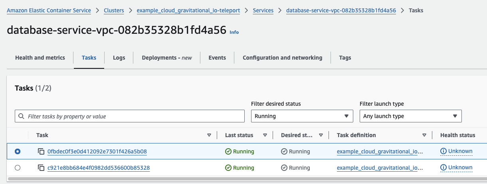

If you don't see any tasks, then proceed to
[ECS tasks not running](#ecs-tasks-not-running).

### How to find Teleport Database Service logs

Each ECS task is a replica of the Teleport Database Service task definition.
[Navigate to the ECS service tasks page](#how-to-find-the-ecs-deployment)
and click on one of the running tasks.
On the task overview page, click the "Logs" panel to see logs being emitted
to Amazon CloudWatch:

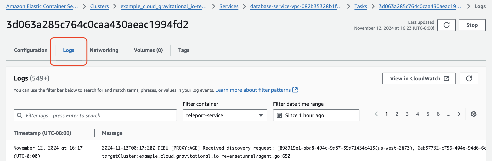

On this page you have to refresh the logs to see new output.
You can click "View in CloudWatch" and then start tailing the logs on that page
to watch for new log output automatically.

### ECS tasks not running

If you see that the tasks in your deployment remain in a "pending" state or have
stopped, then you should check individual tasks to see what is blocking them
from starting.

Navigate to the ECS deployment tasks panel, select the "Filter desired status"
dropdown, and choose "Any desired status".
You should see all tasks now, including tasks that are not running:

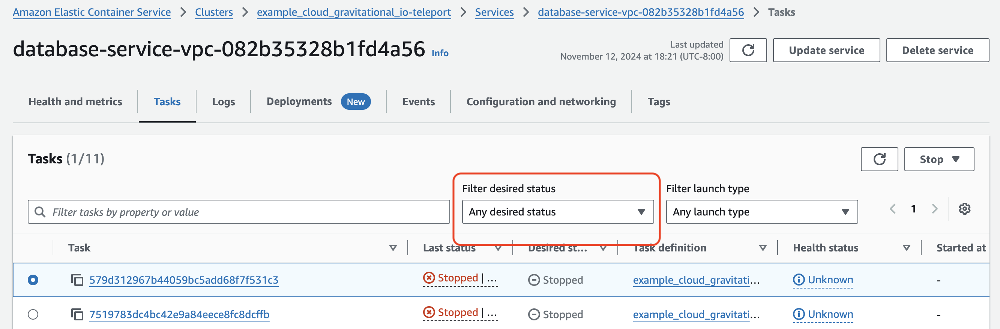

Click on a task that is stopped to see why it stopped. AWS will display an error
message explaining what went wrong.

Typically an error message only appears after the task has been stopped by ECS,
which may take a few minutes after it enters the "Pending" state.

The most common failure is that a task cannot pull the Teleport image:

```code
CannotPullContainerError: pull image manifest has been retried 5 time(s): failed to resolve ref public.ecr.aws/gravitational/teleport-ent-distroless:16.4.3: failed to do request: Head "https://public.ecr.aws/v2/gravitational/teleport-ent-distroless/manifests/16.4.3": dial tcp 99.83.145.10:443: i/o timeout
```

This is caused by a network connectivity issue that prevents the ECS task from
reaching the public Teleport image repository.

You may need to use different security groups or subnets for the deployment, but
you cannot update the ECS service networking configuration in the AWS console.
Fortunately, you can redeploy the ECS service from the RDS enrollment wizard in
Teleport and it will recreate the ECS service for you with updated network
settings.
Doing so will trigger a new ECS deployment rollout, which will only tear down
running tasks from a prior deployment after new tasks have started.

Navigate to the ECS service network setting located under "Configuration and networking":

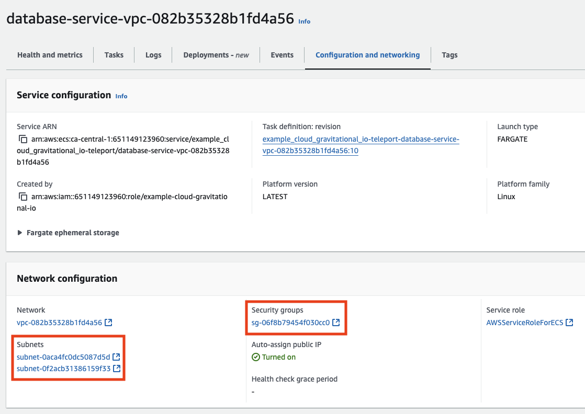

Check that the ECS service's security groups allow outbound internet access.
Remember that AWS security group rules are additive, meaning that if you selected
multiple security groups then only one of them needs to have an outbound rule
like the following in order to establish an outbound connection to the Teleport
image repository:

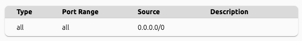

Next, check that the ECS task subnets have access to the internet.
There must be a network route to either an internet gateway or a NAT gateway.
Make a note of the list of subnets and navigate to the VPC overview page to
check each of them:

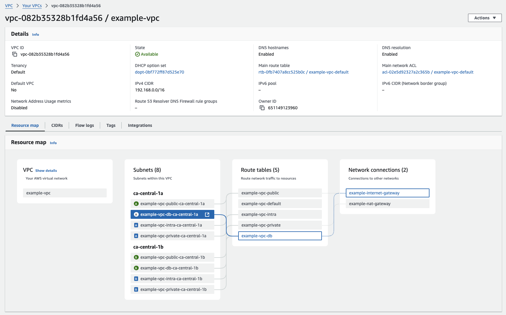

You may need to create a NAT gateway or internet gateway, update your routing
table(s), or use different subnets for the ECS service.

Finally, check that the network Access Control Lists (ACLs) associated with the
ECS service's subnets allow outbound traffic to the internet as well.
Network ACLs allow all inbound and outbound traffic by default, so this should
only be a potential cause of network problems if you have customized your
network ACLs.

Once network connectivity from the ECS service to the Teleport image repository
is established, ECS tasks should successfully start on their own after some
time.

### Database connection test timeout

If you test the connection to a database and the connection times out, then
you need to fix network connectivity to the database from the ECS deployment.

For example, this is what it looks like when an ECS deployment task cannot reach
an RDS postgres database because an AWS security group is blocking the
connection:

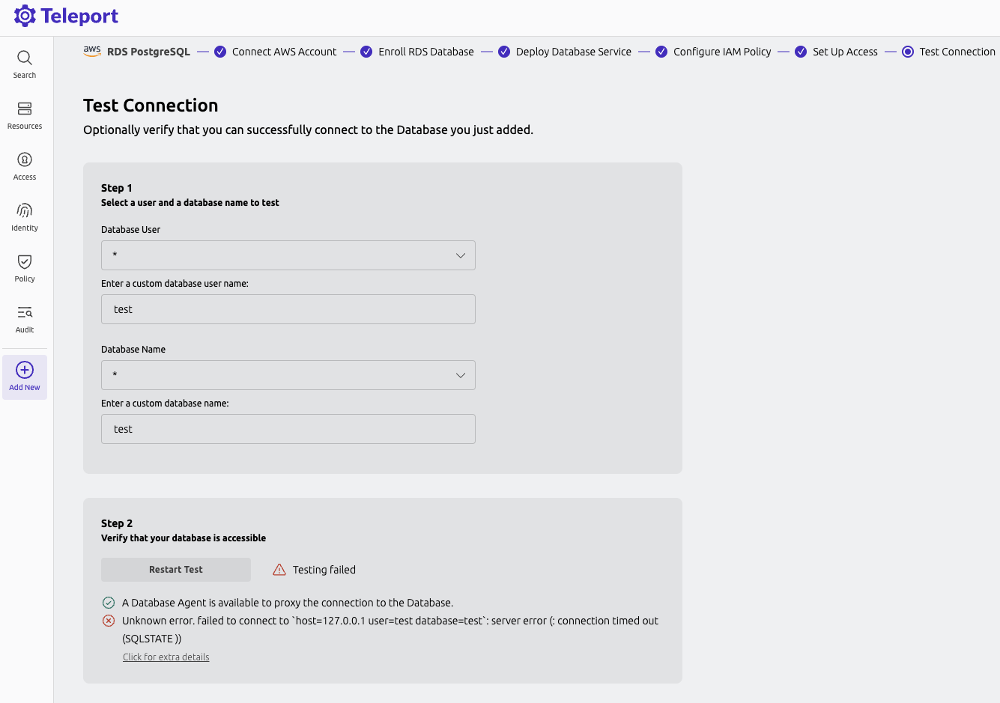

The most common cause of this error is that the security group rules attached to
the RDS database do not allow inbound traffic from the ECS task.

The easiest way to fix that problem is to add an inbound rule to one of the RDS
database's security groups that allows traffic from one of the security groups
associated with your ECS service.
Here's what that might look like in AWS:

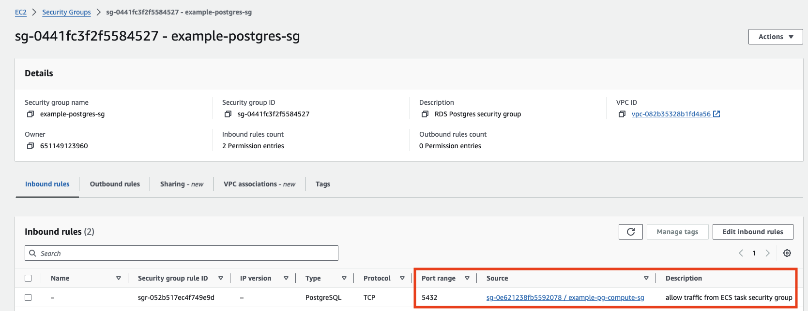

You can also run the AWS reachability analyzer to diagnose network problems.
Navigate to your ECS service and click on one of the tasks, then choose the
"Networking" tab and click "Run Reachability Analyzer":

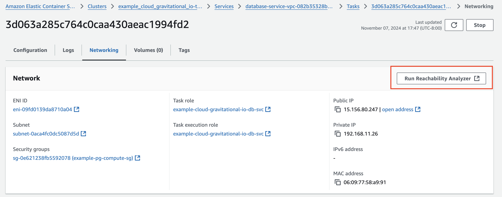

On the analyzer path creation page, the "Path Source" should be automatically
populated with the AWS Elastic Network Interface (ENI) of the ECS task.

Set the "Path destination" to the ENI associated with your database.
To find the database ENI, navigate to the
[ENI overview](https://console.aws.amazon.com/ec2/home#NIC)
(make sure you have the right AWS region selected) and search for "RDS".

Create the network analyzer path and run it.
After a short delay, the analysis results will be available, but you may need to
click the refresh icon a few times.

For example, this is what it looks like when the database security groups
don't allow inbound traffic from the ECS service task:

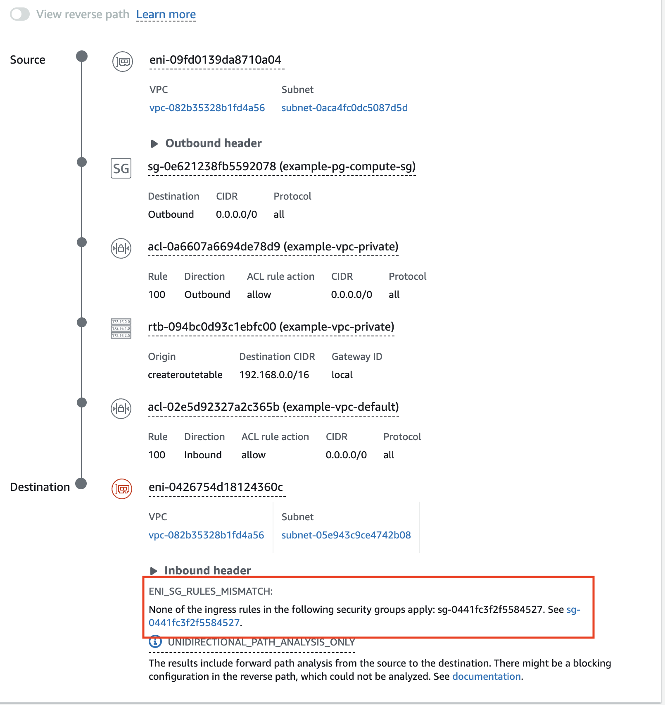

## Next steps

(!docs/pages/includes/database-access/guides-next-steps.mdx!)
- Set up [automatic database user provisioning](../../../enroll-resources/database-access/auto-user-provisioning/auto-user-provisioning.mdx).
