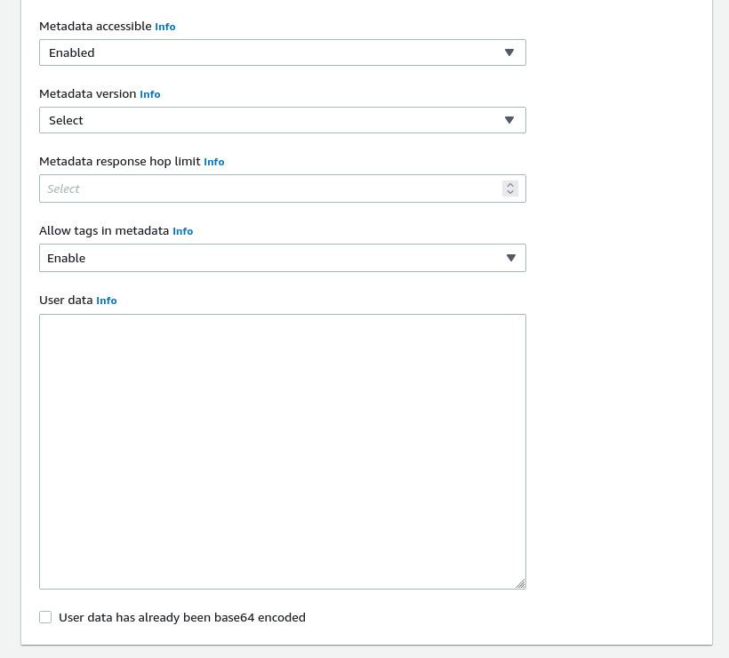
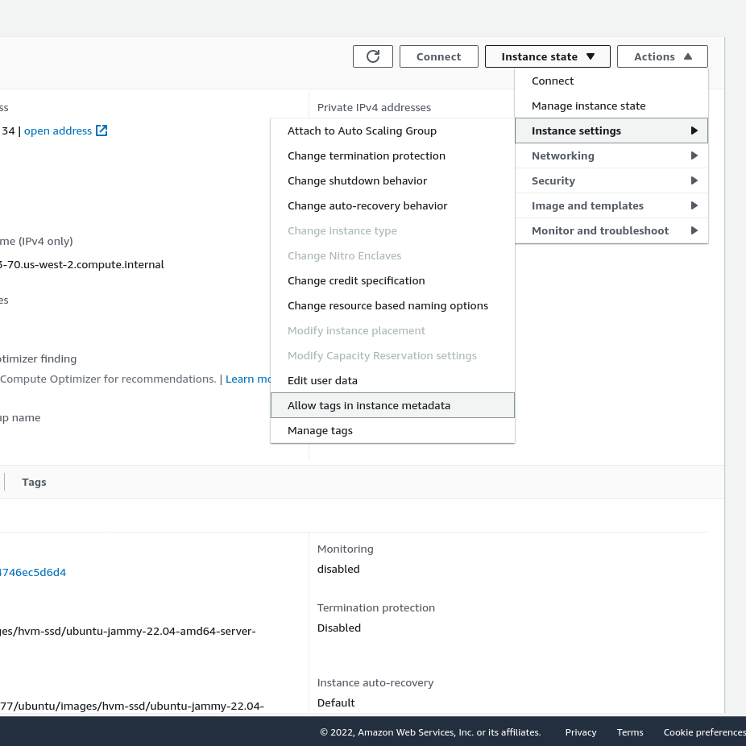
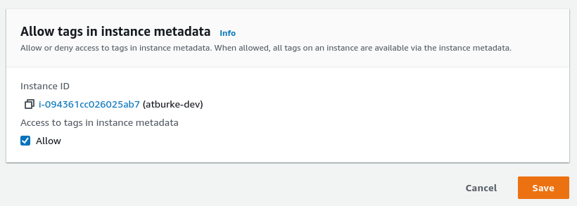

When running on an AWS EC2 instance, Teleport will automatically detect and import EC2 tags as
Teleport labels for SSH nodes, Applications, Databases, and Kubernetes clusters. Labels created
this way will have the `aws/` prefix. When the Teleport process starts, it fetches all tags from 
the instance metadata service and adds them as labels. The process will update the tags every hour, 
so newly created or deleted tags will be reflected in the labels.

If the tag `TeleportHostname` is present, its value (must be lower case) will override the node's hostname.

```bash
$ tsh ls
Node Name            Address        Labels                                                                                                                  
-------------------- -------------- ----------------------------------------------------------------------------------------------------------------------- 
fakehost.example.com 127.0.0.1:3022 env=example,hostname=ip-172-31-53-70,aws/Name=atburke-dev,aws/TagKey=TagValue,aws/TeleportHostname=fakehost.example.com
```

<Admonition type="note">
  For services that manage multiple resources (such as the Database Service), each resource will receive the
  same labels from EC2.
</Admonition>

## Prerequisites

(!docs/pages/includes/edition-prereqs-tabs.mdx!)
- One Teleport agent running on an Amazon EC2 instance. See
  [our guides](../../../enroll-resources/agents/join-services-to-your-cluster/join-services-to-your-cluster.mdx) for how to set up Teleport agents.

## Enable tags in instance metadata

To allow Teleport to import EC2 tags, tags must be enabled in the instance metadata. This can be done
via the AWS console or the AWS CLI. See the [AWS documentation](https://docs.aws.amazon.com/AWSEC2/latest/UserGuide/Using_Tags.html#allow-access-to-tags-in-IMDS)
for more details.

<Admonition type="note" title="Note">
  Only instances that are running on the [Nitro system](https://docs.aws.amazon.com/AWSEC2/latest/UserGuide/instance-types.html#ec2-nitro-instances)
  will update their tags while running. All other instance types [must be restarted](https://docs.aws.amazon.com/AWSEC2/latest/UserGuide/Using_Tags.html#work-with-tags-in-IMDS)
  to update tags.
</Admonition>

### AWS EC2 Console

To launch a new instance with instance metadata tags enabled:

1. Open `Advanced Options` at the bottom of the page.
1. Ensure that `Metadata accessible` is not disabled.
1. Enable `Allow tags in metadata`.

<Figure align="left" bordered caption="Advanced Options">
  
</Figure>

To modify an existing instance to enable instance metadata tags:

1. From the instance summary, go to `Actions > Instance Settings > Allow tags in instance metadata`.
1. Enable `Allow`.

<Figure align="left" bordered caption="Instance Settings">
  
</Figure>

<Figure align="left" bordered caption="Allow Tags">
  
</Figure>

### AWS CLI

To modify the instance at launch:

```code
$ aws ec2 run-instances \
    --image-id <image-id> \
    --instance-type <instance-type> \
    --metadata-options "InstanceMetadataTags=enabled"
    ...
```

To modify a running instance:

```code
$ aws ec2 modify-instance-metadata-options \
    --instance-id i-123456789example \
    --instance-metadata-tags enabled
```
