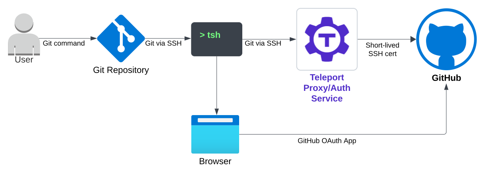
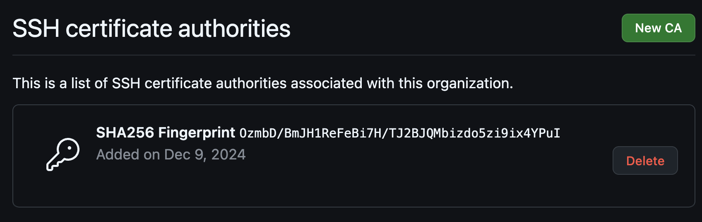

Teleport can proxy Git commands and use short-lived SSH certificates to
authenticate GitHub organizations.

In this guide, you will:
- Create a GitHub OAuth application.
- Configure SSH certificate authorities for your GitHub organizations.
- Create Teleport resources for the GitHub integration.
- Run Git commands through Teleport.

## How it works

GitHub enables organizations to configure a list of SSH Certificate Authorities
(CAs) for authentication. This feature allows access to the organization's
repositories using short-lived SSH certificates signed by an approved CA, such
as a Teleport CA. Optionally, organizations can enforce stricter security by
requiring these signed SSH certificates for access, effectively disabling the
use of personal SSH keys and access tokens.

Teleport users can configure their Git repositories to proxy through Teleport.
After setup, Git commands automatically route through Teleport, which
impersonates their GitHub identities using short-lived SSH certificates signed
by Teleport's CA for authentication with GitHub. Each Git command proxied
through Teleport is also logged in Teleport's audit events.

To retrieve a user's GitHub identity, `tsh` initiates the GitHub OAuth flow by
opening a browser window for the user to log in with their GitHub credentials.



Note that Teleport proxies Git commands through SSH but the users should
continue to access GitHub through their browsers.

## Prerequisites

(!docs/pages/includes/commercial-prereqs-tabs.mdx version="17.2"!)
- Access to GitHub Enterprise and permissions to modify GitHub's SSH certificate
  authorities and configure OAuth applications.
- (!docs/pages/includes/tctl.mdx!)
- Git locally installed

## Step 1/4. Configure a GitHub OAuth application

The GitHub integration requires a GitHub OAuth application to obtain users'
GitHub identities. You can skip this step if the Teleport users use GitHub SSO
to sign in Teleport.

Go to "OAuth Apps" under "Developer Settings" of your organization's settings.
Click on "New OAuth App".

Fill in the details. Use the following for "Authentication callback URL":
```
https://<Var name="teleport-proxy-address"/>/v1/webapi/github/
```

Once the OAuth application is created, create a client secret and remember the
client ID and the secret for the next step:


## Step 2/4. Create a GitHub integration and export the CAs

Now create a yaml file that represents the Github integration:
```yaml
# github_integration.yaml
kind: integration
sub_kind: github
version: v1
metadata:
  name: github-<Var name="my-github-org"/>
spec:
  github:
    organization: <Var name="my-github-org"/>
  credentials:
    id_secret:
      id: <Var name="oauth-app-client-id"/>
      secret: <Var name="oauth-app-client-secret"/>
```
Replace `my-github-org` with the organization name, and replace
`oauth-app-client-id` and `oauth-app-client-secret` with values from the
previous step.

To create the resource with `tctl`, run:
```code
$ tctl create -f github_integration.yaml
```

Once the integration resource is created, export the CA to be used for GitHub:
```code
$ tctl auth export --type github --integration github-<Var name="my-github-org"/>
```

Now go to the "Authentication Security" page of your GitHub organization. Click
on "New CA" under the "SSH certificate authorities" section, and copy-paste the CA
exported from the above `tctl auth export` command.



## Step 3/4. Configure access

User access is granted through `git_server` resources. The `git_server`
references the integration created in the previous step:
```yaml
# git_server.yaml
kind: git_server
sub_kind: github
version: v2
spec:
  github:
    integration: github-<Var name="my-github-org"/>
    organization: <Var name="my-github-org"/>
```

To create the resource with `tctl`, run:
```code
$ tctl create -f git_server.yaml
```

The user role must have `github_permissions` configured to allow access to your
GitHub organization. For example:
```yaml
# role_with_github_permissions.yaml
kind: role
metadata:
  name: github-access
spec:
  allow:
    github_permissions:
    - orgs:
      - <Var name="my-github-org"/>
version: v7
```

(!docs/pages/includes/add-role-to-user.mdx role="github-access"!)

## Step 4/4. Connect

(!docs/pages/connect-your-client/includes/tsh-git.mdx!)

## Further reading
- [Creating a GitHub OAuth app](https://docs.github.com/en/apps/oauth-apps/building-oauth-apps/creating-an-oauth-app)
- [GitHub SSH certificate authorities](https://docs.github.com/en/enterprise-cloud@latest/organizations/managing-git-access-to-your-organizations-repositories/about-ssh-certificate-authorities)
