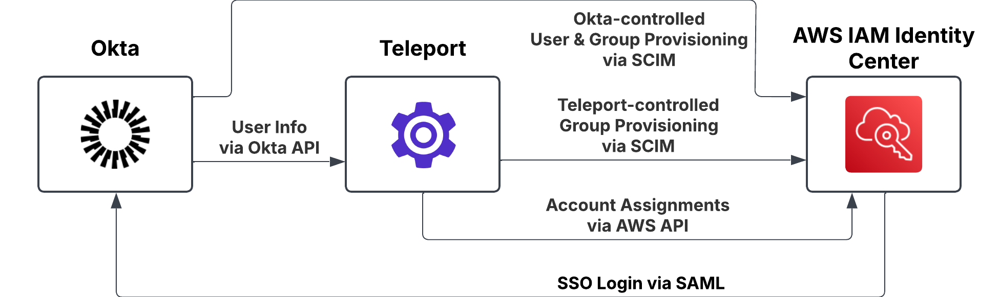
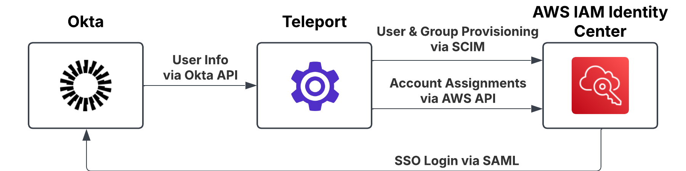
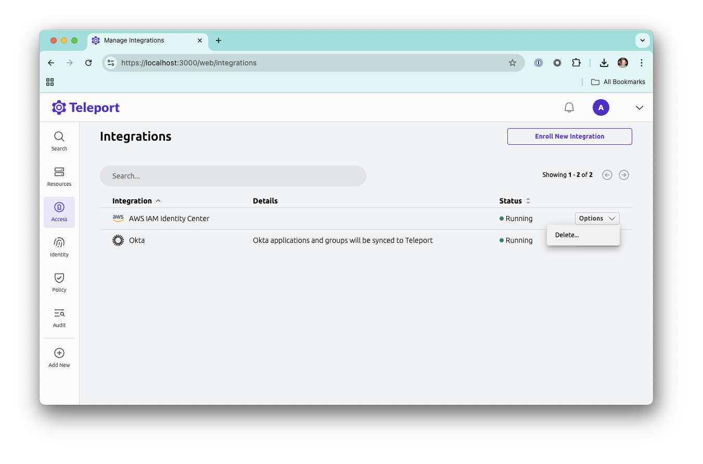

The goal of this guide is to allow you to perform a staged migration from
Okta-managed Identity Center users & groups, to having them managed by Teleport
while preserving Okta as your AWS SSO provider.

This approach lets you get set up with a minimal Teleport Identity Center
integration that you can expand as you gain expertise and confidence with
Teleport, as well as offering deployment options that are not available with a 
"standard" Teleport Identity Center configuration, such as having Teleport deployed
in a private network.

## How it works

By default, the Teleport Identity Center integration
- controls all user and group provisioning into Identity Center, and 
- becomes the SSO provider for AWS. 

This is fine for most deployments, but can cause difficulties when deploying into
a sophisticated, Okta-managed AWS Identity Center configuration. 

By contrast, the deployment in this guide will transition transition control
from Okta to Teleport in a staged fashion.

### Migration Path

#### Starting Point

This is our starting configuration: Okta as sole Identity Source for Identity Center


#### Midway

This is the point where you can start migrating control of users and groups from
Okta to Teleport. At this stage:

 - Okta provides SSO login for Identity Center
 - Okta manages a subset of the Identity Center group membership (selected via Push Groups)
 - Okta and Teleport both control user provisioning via SCIM
 - Teleport manages a second subset of Identity Center groups (selected via group filters during plugin installation)
 - Teleport controls IC Group Account Assignments for the Identity Center groups under its control
 - Teleport controls direct IC User Account Assignments for the Identity Center users under its control



#### Ending point

Once Teleport is in control of all the users and groups you want to provision
into Identity Center, the Okta Provisioning and Push Groups functions can be
retired, leaving Okta only providing SSO login.



## Prerequisites

 - A working Teleport cluster
 - An AWS role configured as per the [Identity Center guide](./aws-iam-identity-center.mdx)
   for the integration to use
 - AWS credentials configured for the Teleport auth process to pick up and use 
   (e.g. as environment vars, system profiles, etc)
 - An Okta API token, with the following privileges:
   - View users and their details
   - View groups and their details
   - View applications and their details
 - The AWS Identity Center ARN, AWS region, SCIM base address and SCIM bearer token

## Step 1: Install Okta SAML connector

Install Okta SAML connector into Teleport as per the Teleport 
[Okta as an SSO provider](../../access-controls/sso/okta.mdx) guide.

<Admonition type="note">
 Ideally, both Identity Center and Teleport will use the same Okta SAML application
 for their signin, which guarantees that both Okta and Teleport will view the same 
 user set. 

 If this is not possible, the most flexible approach we've found is having an
 an Okta Group for those users that should have IC access, and then assigning
 both the Okta Identity Center App and the Okta SAML App used for Teleport SAML
 connector to that group. This ensures that the same user set is visible across
 both applications.
</Admonition>

You will need the Teleport SAML Connector Name and Okta SAML App ID in the next
step.

## Step 2: Install the Teleport Okta integration

We will be using a very limited subset of the Teleport Okta integration in this 
deployment, disabling all features except periodic user synchronization. This
configuration is not supported by the normal installation UI, so we will have to
use `tctl` to install it:

```console
$ ./tctl plugins install okta \
    --org ${OKTA_ORG_URL} \
    --saml-connector ${TELEPORT_SAML_CONNECTOR_NAME} \
    --app-id ${OKTA_SAML_APP_ID} \
    --api-token ${OKTA_API_TOKEN} \
    --no-scim \
    --no-accesslist-sync \
    --no-appgroup-sync
```

This will install the Okta integration and start the User sync service. You can
monitor the state of the Okta integration in the Teleport Integrations UI.

## Step 3: Wait for user sync

To make sure everything is working, wait until the first Okta to Teleport user
sync has occurred. You can verify this by either
 - refreshing the user page and finding your Okta users,
 - checking the Okta integration status page, or

Once your Okta users are imported into Teleport, you can progress to the next
step.

## Step 4: Install the Teleport Identity Center Integration.

Again, we need to install the plugin using `tctl`. 

```console
$ ./tctl plugins install awsic \
    --arn ${IDENTITY_CENTER_INSTANCE_ARN} \
    --region ${IDENTITY_CENTER_INSTANCE_REGION} \
    --use-system-credentials \
    --url ${IDENTITY_CENTER_SCIM_BASE_URL} \
    --token ${IDENTITY_CENTER_SCIM_BEARER_TOKEN} \
    --default-owner ${TELEPORT_ACCESS_LIST_DEFAULT_OWNER} \
    --user-origin okta \
    --account-name ${ACCOUNT_NAME_ALLOW_FILTER} \
    --group-name ${GROUP_NAME_ALLOW_FILTER}
```

During the installation process, Teleport will import all of the Identity Center 
groups that match its allow list (or all of them, if no allow list is defined)
and create matching Access Lists, preserving the group membership and account
assignments.

<Admonition type="warning">
Individual User Account Assignments will _not_ be preserved during import. You
will need to ensure these are preserved manually, or converted to group assignments
prior to installation.
</Admonition>

### Group import control

The Group import allow-list is controlled by the `--group-name` option. You can
specify multiple filters and a Group will be imported if matches _any_ of the
supplied filters. Filters can be either literal names, globbed names or Go
compatible regular expressions. To treat a filter as a regular expression, 
enclose it in a leading `^` and trailing `$`.

Example filters:
 - `administrators`: The literal "administrators" group
 - `site-*`: Any group with the prefix `site-`
 - `^(?:[^a]|a[^w]|aw[^s]|aws[^\-]).*$`: Any group that does _not_ have the prefix `aws-`


<Admonition type="note">
Ensure that there is no overlap between the groups imported to Teleport and the
groups you want Okta to maintain control over.
</Admonition>

<Admonition type="warning">
Avoid creating an Access List with the same name as a Push Group managed by Okta.
Teleport will attempt to adopt the group, and may change the group membership.
Deleting the Teleport Access List and forcing a re-push from Okta should restore 
access.
</Admonition>

### User provisioning control

Your Teleport cluster may have a mix of local Teleport users (e.g. a local Admin
user) and users imported from Okta. By default, Teleport will try to provision
_all_ Teleport users into Identity Center. You can control which users are 
provisioned by the Identity Center integration with the `--user-origin` and 
`--user-filter` arguments. In the example above, the `--user-origin okta` will 
restrict Teleport to only provisioning users that are synced from Okta, and 
excluding all local Teleport users.

### AWS Account import control

By default, Teleport will take control of Account Assignments for all AWS Accounts
managed by Identity Center. You can create an allow-list of AWS Accounts to
import with the  `--account-name` and `--account-id` install options. 

The `--account-name` filters work like the `--group-name` filters above. The 
`--account-id` filters specify a literal AWS Account ID.

Teleport will not create or delete Account Assignments on AWS accounts outside
of its allow-list.

## Step 5: Migrate Account Assignments

We're now at the midway point, and ready to migrate Account Assignments from the
Okta-managed groups into new Teleport-managed Access Lists. To migrate groups,
create a new Access List in Teleport (taking care not to use the same name as
the existing Okta-managed Group) and create the appropriate memberships and 
Account Assignments.

Account Assignments can be created on an Access List by assigning it the Account
Assignment roles created by the Identity Center integration, assigning it a 
custom Teleport role that specifies a specific combination of access, or a
combination of each.

For more information, see the [Identity Center integration guide](./aws-iam-identity-center.mdx)

## Step 6: Expanding Teleport integration scope

Once you are satisfied with the way Teleport is handling the initial set of
imported AWS resources, you can expand the scope of the Identity Center
integration by editing the plugin import features. 


### With `tctl edit`

<Admonition type="warning">
This currently involves manually editing the Identity Center's integration 
resource using `tctl`, which is a dangerous operation. Please ensure you take a
backup of the plugin resource so you can roll back if necessary.

A guided editing workflow is currently under development.
</Admonition>

You can expand the scope of the Teleport Identity Center integration by editing
the integration's plugin resource with `tctl`.

```console
./tctl edit plugins/aws-identity-center
```

The plugin resource is a YAML document that looks something like this:

```YAML
kind: plugin
version: v1
metadata:
  labels:
    teleport.dev/hosted-plugin: "true"
  name: aws-identity-center
spec:
  Settings:
    aws_ic:
      # Account import filters. An absent or empty list of filters implies "manage all AWS accounts"
      aws_accounts_filters:
      - Include:
          id: "637423191929"
      - Include:
          id: "730335414865"
      - Include:
          id: "058264527036"
      - Include:
          name_regex: ^Staging-.*$

      # User provisioning filters. An absent or empty list of filters implies "provision all users to AWS"
      user_sync_filters:
      - labels:
          teleport.dev/origin: okta

      # Group import filters. See notes below. 
      group_sync_filters:
      - Include:
          name_regex: '^Group #00\d+$'

      access_list_default_owners:
      - admin
      arn: arn:aws:sso:::instance/ssoins-722326ecc902a06a
      credentials_source: 2
      integration_name: aws-identity-center
      provisioning_spec:
        base_url: https://scim.us-east-1.amazonaws.com/f3v9c6bc2ca-b104-4571-b669-f2eba522efe8/scim/v2
      region: us-east-1
```

You can add or remove filters to the various filters. Once you save and quit the
editor, `tctl` will replace the existing resource with your updated version. This
will automatically restart the Identity Center Integration with the ne2 filters.

<Admonition type="note">
As of Teleport 17.3, the `group_sync_filters` are only applied during the initial
import at installation time, and there is no user accessible method of re-triggering
the import. The only way to apply new group filters is to uninstall and re-install
the plugin. 

A later release of Teleport will re-trigger a group import when it detects a
change in the group import filters.
</Admonition>

### Uninstall/reinstall

A second alternative is to [uninstall](#deleting-the-identity-center-integration)
and re-install the integration with the new parameters. Be warned that this may 
result in user access disruptions while the integration is offline.

## Step 7: Retire Okta group provisioning

Once you are happy that a group has been migrated to Teleport control, you can
remove the corresponding push Group from the Okta Identity Center integration.

Depending on the version of Okta, you _may_ have to manually delete the Identity
Center Group using the AWS console. 

## Deleting the Identity Center integration

If you decide not to switch over to Teleport you can delete the Identity Center
integration in two ways.

### Delete integration in Teleport UI

Find the `AWS IAM Identity Center` integration in the Teleport integrations page
and select *Delete...* from  the integration options.



### Delete integration with `tctl`

```
$ ./tctl plugins delete aws-identity-center
```
