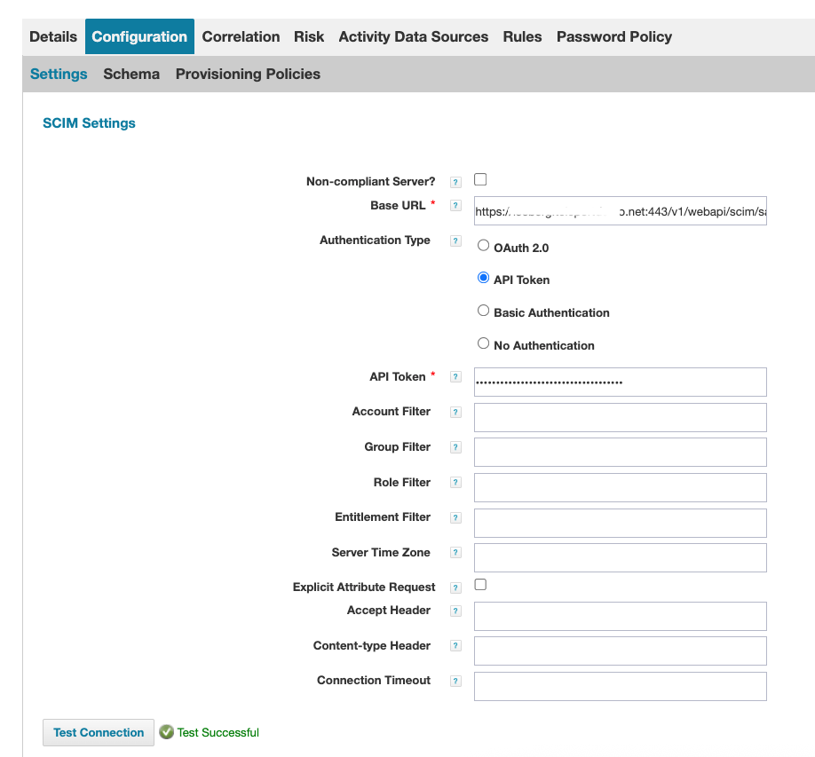

## Overview

The Sailpoint SCIM integration with Teleport automates user provisioning and deprovisioning while synchronizing Sailpoint group memberships with Teleport access lists using the SCIM protocol. This integration enables organizations leveraging Sailpoint for identity governance to manage access control within Teleport efficiently.
In this integration, user permissions in Teleport are governed by Access Lists, which define role-based access policies. However, user membership within Access Lists is managed dynamically through Sailpoint SCIM group memberships. This ensures that access rights align with organizational policies and are updated automatically as users are added to or removed from Sailpoint groups.


## Installation and Configuration
### 1. Install the Sailpoint SCIM Integration
To enable the integration use the following command:

```sh
$ tctl plugins install sailpoint --teleport-connector-name=ad

SCIM Base URL: https://teleport.example.com:443/v1/webapi/scim/sailpoint
SCIM Bearer Token: 11111111-2222-3333-3333-444444444444
```

Where `--teleport-connector=ad`  in the name of teleport SAML connector:
```sh
$ tctl get connectors
kind: saml
metadata:
  name: ad
...
```
### SCIM Server in Teleport

SCIM Server in TeleportTeleport runs an internal SCIM server to support synchronization with Sailpoint. Once the integration is installed, Teleport exposes a SCIM endpoint that can be used to receive user and group updates from Sailpoint.

After the installation, you can test the SCIM server using the following command:

```sh
$ export SCIM_TOKEN=11111111-2222-3333-3333-444444444444
$ curl -H "Authorization: Bearer $SCIM_TOKEN" https://teleport.example.com:443/v1/webapi/scim/sailpoint/Users
{"schemas":["urn:ietf:params:scim:api:messages:2.0:ListResponse"],"totalResults":0,"startIndex":1,"itemsPerPage":100,"Resources":[]
```

The SCIM Base URL and SCIM Bearer Token are provided during installation and must be used to configure Sailpoint SCIM configuration.


### 2. Configure SCIM Group Synchronization

To manage user group memberships via SCIM, you must create a Teleport Access List where the membership is handled by Sailpoint.
To achieve this, set the `scim` `sailpoint` label to the Access List definition

```terraform
resource "teleport_access_list" "acl-group-editor" {
  header = {
    version = "v1"
    name = "scim-group-editor"
    metadata = {
      labels = {
        scim = "sailpoint"
      }
    }
  }
  spec = {
    title = "GroupEditor"
    grants = {
      roles  = ["editor"]
      traits = []
    }
    owners = [
      {
        name = "alice"
      }
    ]
    membership_requires = {
      roles = []
    }
    ownership_requires = {
      roles = []
    }
    audit = {
      recurrence = {
        frequency    = 3
        day_of_month = 15
      }
    }
  }
}
```

The binding between SCIM groups and the Teleport access list is established through the Access List Title and the SCIM group name:
(access_list.spec.title must match the SCIM group name (displayName) in Sailpoint)

### 3. Configuring SCIM in SailPoint

To integrate Teleport with SailPoint using SCIM, you need to configure a SCIM connector in SailPoint IdentityNow or SailPoint IdentityIQ.
The exact configuration steps may vary slightly depending on your version of SailPoint, but the general process is as follows:

1. Create a new SCIM connector in SailPoint at: Applications > Application Definition > Add New Application.
    1.1. Select **SCIM 2.0** as the application type and provide the required configuration details:


    1.2. Set the **Base URL** and **API Token** provided by Teleport under **Configuration -> Settings**.
    1.3. Click **Test Connection** to verify that the connection is successful.



2. Configure the SCIM Schema
    2.1. Under **Configuration -> Schema**, click **Discover Schema Attributes** on both the **Accounts** and **Groups** tabs to retrieve the schema attributes.


    2.2. Go to the **Provisioning Policy** section, and create a **Create Policy** that maps the `userName` SCIM attribute to the user’s email address.


    2.3. Save all changes.

3. Configure SCIM Group Aggregation in SailPoint:
    3.1. Navigate to **Setup > Tasks -> New Task -> Group Aggregation**.


    3.2. Select the **Teleport SCIM Connector**, then click **Save and Execute** to run the aggregation task.


    3.3. If the aggregation completes successfully, you should see the imported Access Lists from Teleport in SailPoint under:
         **Applications > Entitlement Catalog**


4. Submit an Access Request for a Teleport Access List via SCIM integration:
   4.1. Go to **Manage > Manage User Access > Manage User Access**
   4.2. Submit an access request for the Access List represented by the corresponding Group Entitlement.


   4.3. Once the request is approved, the user will be added to the appropriate Access List in Teleport.


### Troubleshooting

SCIM requests and responses are logged in the Teleport proxy logs. If issues arise, collect Handled SCIM Request logs for troubleshooting.
Example log output:

`2025-03-14T17:57:51.754-04:00 INFO  Handled SCIM Request method:GET url:/webapi/scim/sailpoint/Users status_code:200 request: response:{"schemas":["urn:ietf:params:scim:api:messages:2.0:ListResponse"],"totalResults":0,"startIndex":1,"itemsPerPage":100,"Resources":[]} error:<nil> web/scim.go:160`

If the SCIM integration is not syncing as expected, check the following:
* Verify that the SCIM token is correctly configured in Sailpoint.
* Ensure that the Teleport SCIM Base URL is accessible from Sailpoint.
* Collect the `Handled SCIM Request` log entries for further analysis.
