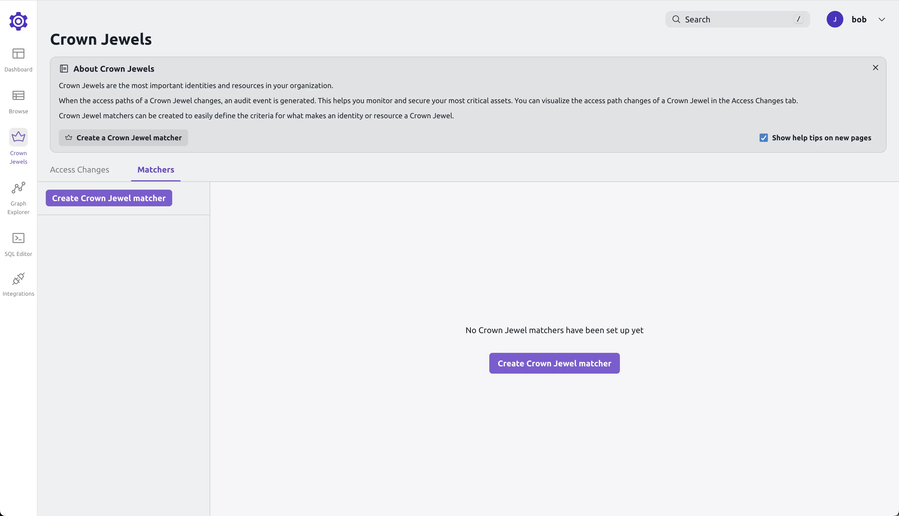
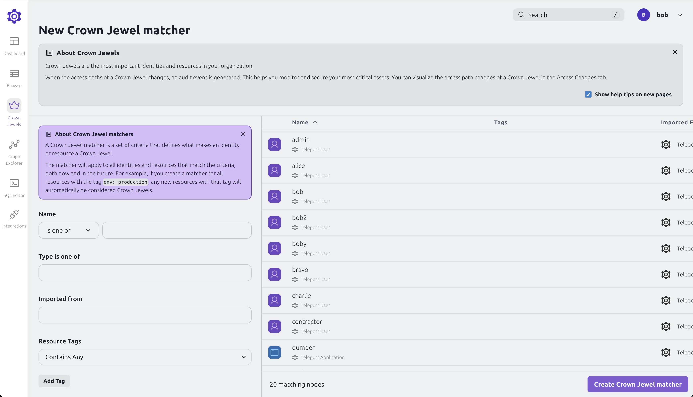
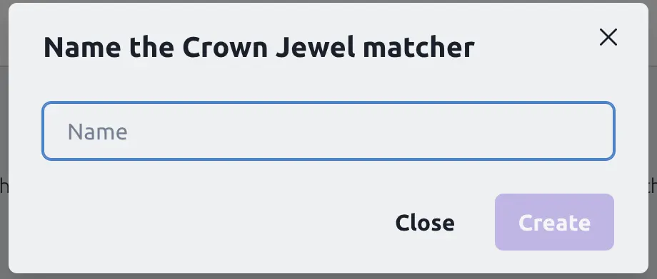
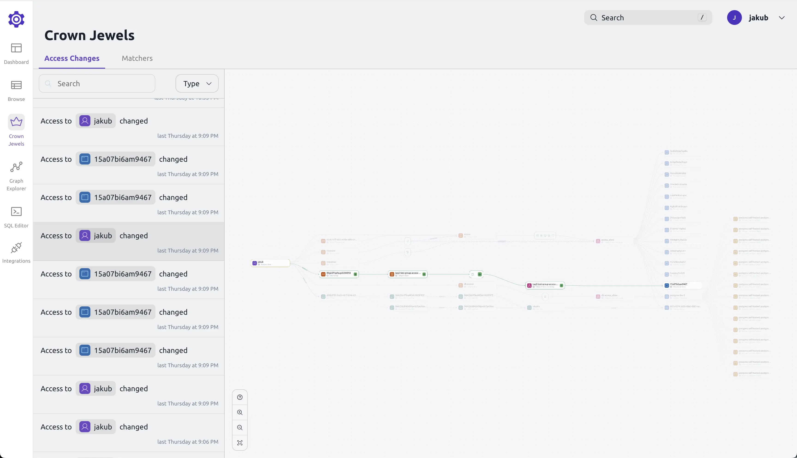

Access Graph's Crown Jewel feature allows you to track changes to access for
your most sensitive users or resources. When you mark a resource as a Crown
Jewel, Teleport emits audit events any time access to that resource changes.

This guide shows you how to configure Crown Jewels, how to mark resources as
Crown Jewels, and how to see permission changes for these resources.

## Prerequisites

<Admonition type="tip">

For an improved experience, we recommend using Crown Jewels in conjunction with Teleport local users or integrating with
[Okta](../../enroll-resources/application-access/okta/okta.mdx) or [Microsoft Entra ID](./integrations/entra-id.mdx).
This setup helps minimize the number of access path change entries generated when highly privileged ephemeral users
log in via Teleport Auth Connectors.

</Admonition>

- A running Teleport Enterprise cluster v16.2.0 or later.
- For self-hosted clusters, an updated `license.pem` with Teleport Identity Security enabled.
- For self-hosted clusters, a running Access Graph node v1.24.0 or later.
Check [Access Graph page](teleport-policy.mdx) for details on
how to set up Access Graph.

(!docs/pages/includes/policy/access-graph.mdx!)

## Required RBAC permissions

To create and view Crown Jewels, you need the following RBAC permissions:

```yaml
kind: role
metadata:
  name: crown-jewels-admin
spec:
  allow:
    rules:
    - resources:
      - crown_jewel
      verbs:
      - *
version: v7
```

## Creating a Crown Jewel

To create a Crown Jewel, you need to mark a resource or user as critical. Only changes to marked resources
and users will be logged by Identity Security.
To mark a resource or user as Crown Jewel, open the Access Graph and navigate to the "Crown Jewels" tab.



Click on "Create Crown Jewel" and select the resource or user you want to mark as critical.



Pick a name for the Crown Jewel and click "Create".



The Crown Jewel will now be created, and you will see it in the list of Crown Jewels. Access Graph will now create
audit events in Teleport's audit log and new entries in the "Access Changes" tab in the "Crown Jewels" menu whenever
access path to a resource or a user changes.

## Viewing permission changes

To view permission changes, open the Access Graph and navigate to the "Crown Jewels" tab.
Here you can see a list of all Crown Jewels and the changes that have been made to them.



The generated changes have a diff format showing removed nodes with "-" and added nodes with "+".
Every time a change is made to a Crown Jewel, a new entry will be added to the list and an audit event
will be generated in the Teleport Audit Log.

## Audit events

Every time a change is made to a Crown Jewel, an audit event is generated in the Teleport Audit Log.
Here is what an example audit event looks like:

```json
{
  "affected_resource_name": "bob",
  "affected_resource_source": "TELEPORT",
  "affected_resource_type": "teleport_node",
  "change_id": "0110b3c4-d0b5-4af9-8585-aa49a064c85d",
  "cluster_name": "ssh-node",
  "code": "TAG001I",
  "ei": 0,
  "event": "access_graph.access_path_changed",
  "time": "2024-09-20T19:50:38.194Z",
  "uid": "5447d050-699a-4009-a901-ab8ed2614bc2"
}
```

You can export the audit event using the event handler.
The setup is described [here](../management/export-audit-events/export-audit-events.mdx).
