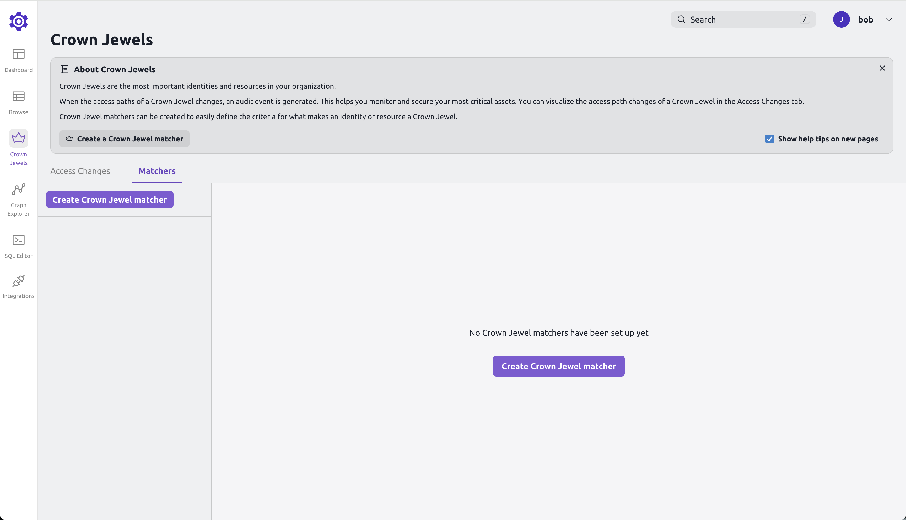
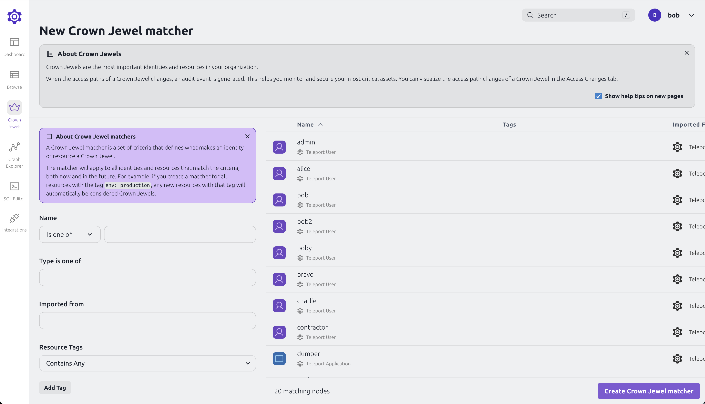
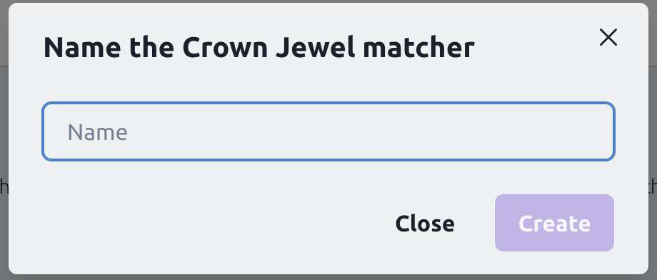
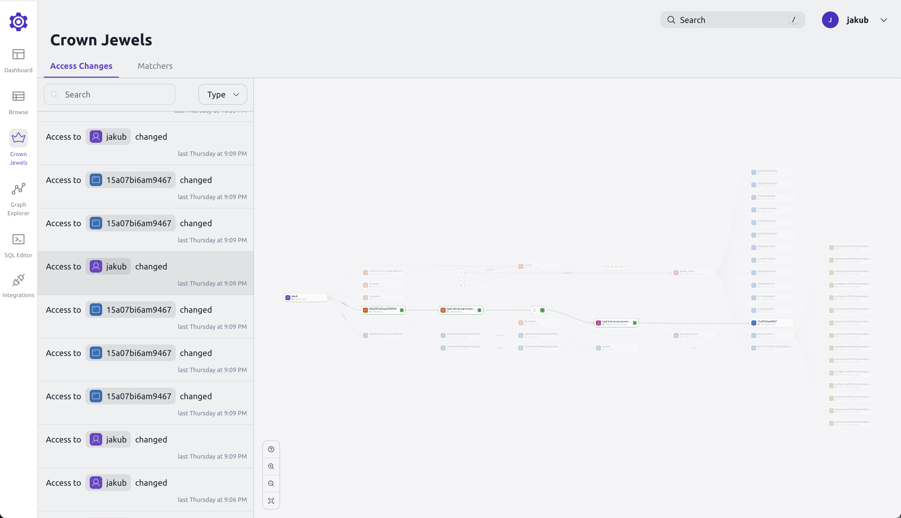

With Teleport Policy's Access Graph, you can see change to users and resources permissions.
Crown Jewels is a feature that allows you to mark resources and users as critical and see changes to them.
Each time access for those resources or users changes, Teleport Policy will log the change and generate
before and after snapshots of the permissions. This can help you identify when users get access to sensitive
resources or when permissions are changed unexpectedly.

This guide shows you how to configure Crown Jewels, how to mark resource and how to see permission changes.

## Prerequisites

- A running Teleport Enterprise cluster v16.2.0 or later.
- For self-hosted clusters, an updated `license.pem` with Teleport Policy enabled.
- For self-hosted clusters, a running Access Graph node v1.24.0 or later.
Check [Access Graph page](../teleport-policy.mdx) for details on
how to set up Access Graph.

Access Graph is a feature of the [Teleport Policy](https://goteleport.com/platform/policy/) product
available to Teleport Enterprise edition customers.

After logging in to the Teleport UI, navigate to the Management tab. If enabled, Access Graph options can be found
under the Permission Management section.

## Creating a Crown Jewel

To create a Crown Jewel, you need to mark a resource or user as critical. Only changes to marked resources
and users will be logged by Teleport Policy.
To mark a resource or user as Crown Jewel, open the Access Graph and navigate to the "Crown Jewels" tab.




Click on "Create Crown Jewel" and select the resource or user you want to mark as critical.



Pick a name for the Crown Jewel and click "Create".



The Crown Jewel will now be created, and you will see it in the list of Crown
Jewels. Access Graph will now log changes to matched resource/user.

## Viewing permission changes

To view permission changes, open the Access Graph and navigate to the "Crown Jewels" tab.
Here you can see a list of all Crown Jewels and the changes that have been made to them.



The generated changes have a diff format showing removed nodes with "-" and added nodes with "+".
Every time a change is made to a Crown Jewel, a new entry will be added to the list and an audit event
will be generated in the Teleport Audit Log.

### Required RBAC permissions

To create and view Crown Jewels, you need the following RBAC permissions:

```yaml
kind: role
metadata:
  name: crown-jewels-admin
spec:
  allow:
    rules:
    - resources:
      - crown_jewel
      verbs:
      - list
      - read
      - create
      - delete
      - update
version: v7
```
