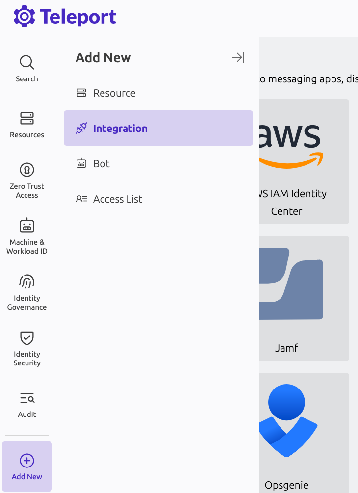
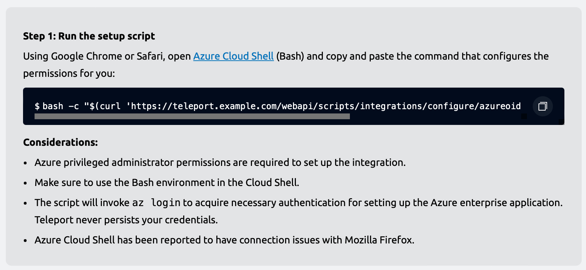
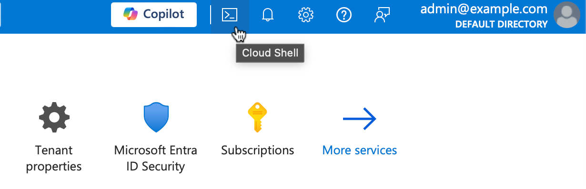
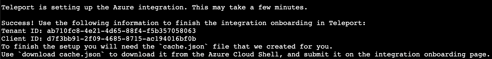
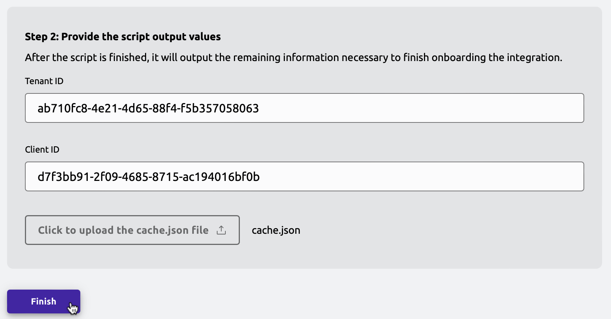
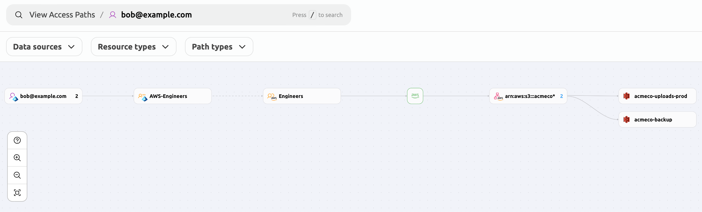

The Microsoft Entra ID integration in Teleport Identity Governance synchronizes your Entra ID directory into your Teleport cluster,
and offers insights into relationships in your Entra ID directory.
Additionally, when Entra ID is used as an SSO identity provider, Identity Security visualizes
SSO grants across your services.

<Admonition type="note">
SSO grant analysis is currently only supported in situations where Entra ID acts as the identity provider,
and AWS accounts are set up as relying parties using AWS IAM role federation.

Support for additional relying parties will be added in the future.
</Admonition>

## How it works

Teleport continuously scans the connected Entra ID directory.
At intervals of 5 minutes, it retrieves the following resources from your Entra ID directory:

- Users
- Groups
- Users' memberships in groups
- Enterprise applications

Entra ID users and groups are imported into Teleport as users and Access Lists respectively.
Once all the necessary resources are fetched, Teleport pushes them to the
Access Graph, ensuring that it remains updated with the latest information.
These resources are then visualized using the graph representation detailed in the
[Identity Security usage page](../policy-how-to-use.mdx).

## Prerequisites

- A running Teleport Enterprise cluster v15.4.2/v16.0.0 or later.
- Teleport Identity Governance and Identity Security enabled for your account.
- For self-hosted clusters:
  - Ensure that an up-to-date `license.pem` is used in the Auth Service configuration.
  - A running Access Graph node v1.21.3 or later.
Check the [Identity Security page](../teleport-policy.mdx) for details on
how to set up Access Graph.
  - The node running the Access Graph service must be reachable from the Teleport Auth Service.
- Your user must have privileged administrator permissions in the Azure account
- For OIDC setup, the Teleport cluster must be publicly accessible from the internet.
- For air gapped clusters, `tctl` must be v16.4.7 or later.

To verify that Access Graph is set up correctly for your cluster, sign in to the Teleport Web UI and navigate to the Management tab.
If enabled, the Access Graph menu item will appear in the Permission Management section.

## Step 1/3. Choose a setup method

To begin onboarding, select your preferred setup method. Teleport offers various methods based on your cluster
configuration and user requirements.

### Automatic setup with Teleport as an OIDC Provider for Entra ID

<Admonition type="tip">
This method is recommended and is required if you are a Teleport Enterprise (Cloud) customer.
</Admonition>

This method is suitable for Teleport clusters that are publicly accessible and lack Azure credentials on Auth
Service nodes or pods.

In this setup, Teleport is configured as an OpenID Connect (OIDC) identity provider, establishing a trusted
connection with an Entra ID application created during setup. This trust allows Teleport to authenticate using
the Entra ID application, accessing permissions tied to it without requiring additional credentials or managed
identities.

**Requirements:**
- Direct bidirectional connectivity between Teleport and Azure is necessary for Azure to validate the OIDC
tokens issued by Teleport.

### Automatic setup with system credentials for Entra ID authentication

Designed for air-gapped Teleport clusters that are not publicly accessible, this setup accommodates environments
where Azure cannot validate OIDC tokens issued by Teleport.

Instead, Teleport relies on Azure credentials available on the VMs where Teleport Auth Service is running. 
These credentials must have the following Entra ID permissions:

- `Application.Read.All`
- `Directory.Read.All`
- `Policy.Read.All`

**Requirements:**
- Unidirectional connectivity from Teleport to Azure infrastructure.

### Manual setup

This setup describes how to manually configure Entra ID integration without relying on automated scripts 
to setup Entra ID Application.

This guide covers the 
[**Automatic Setup with Teleport as OIDC Provider for Entra ID**](./entra-id.mdx#automatic-setup-with-teleport-as-an-oidc-provider-for-entra-id)
and [**Automatic Setup with System Credentials**](./entra-id.mdx#automatic-setup-with-system-credentials-for-entra-id-authentication)
setup but has a limitation of not being possible to enable the [Identity Security](../teleport-policy.mdx) integration.

## Step 2/3. Configure the Entra ID integration


<Tabs>
<TabItem label="Teleport as OIDC provider" >

### Start integration onboarding 

To start the onboarding process, access the Teleport Web UI,
navigate to the "Access Management" tab, and choose "Enroll New Integration", then pick "Microsoft Entra ID".



In the onboarding wizard, choose a Teleport user that will be assigned as the default owner of Access Lists that are created for your Entra groups, and click "Next".

<Figure width="600">

</Figure>

### Grant permissions in Azure and finish onboarding

The wizard will now provide you with a script that will set up the necessary permissions in Azure.

<Figure width="600">

</Figure>

Open Azure Cloud Shell by navigating to <a href="https://shell.azure.com">shell.azure.com</a>,
or by clicking the Cloud Shell icon in the Azure Portal.

<Figure width="600">

</Figure>

Make sure to use the Bash version of Cloud Shell.
Once a Cloud Shell instance opens, paste the generated command.
The command sets up your Teleport cluster as an enterprise application in the Entra ID directory,
and grants Teleport read-only permissions to read your directory's data (such as users and groups in the directory).

Once the script is done setting up the necessary permissions,
it prints out the data required to finish the integration onboarding.



Back in the Teleport Web UI, fill out the required data and click "Finish".

<Figure width="600">

</Figure>

</TabItem>

<TabItem label="Automatic setup with system credentials" >

### Assign permissions to the Azure identity of your Auth Service VMs

To set up the Azure Identity with the necessary permissions:

- `Application.Read.All`
- `Directory.Read.All`
- `Policy.Read.All`

Go to your Azure Dashboard, find the identities linked to your Teleport Auth Service VMs,
and copy the `Object (principal) ID`. Paste this value into `<Var name="Principal ID" />`.

After obtaining the Principal ID, open the [Azure Cloud Shell](https://portal.azure.com/#cloudshell/)
in PowerShell mode and run the following script to assign the required permissions to `<Var name="Principal ID" />`.

<Details
title="Assign required permissions to Azure Identity"
opened
>

```powershell

# Connect to Microsoft Graph with the required scopes for directory and app role assignment permissions.
Connect-MgGraph -Scopes 'Directory.ReadWrite.All', 'AppRoleAssignment.ReadWrite.All'

# Retrieve the managed identity's service principal object using its unique principal ID (UUID).
$managedIdentity = Get-MgServicePrincipal -ServicePrincipalId '<Var name="Principal ID" />'

# Set the Microsoft Graph enterprise application object. 
# This is a service principal object representing Microsoft Graph in Azure AD with a specific app ID.
$graphSPN = Get-MgServicePrincipal -Filter "AppId eq '00000003-0000-0000-c000-000000000000'"

# Define the permission scopes that we want to assign to the managed identity.
# These are Microsoft Graph API permissions required by the managed identity.
$permissions = @(
  "Application.Read.All"   # Permission to read applications in the directory
  "Directory.Read.All"     # Permission to read directory data
  "Policy.Read.All"        # Permission to read policies within the directory
)

# Filter and find the app roles in the Microsoft Graph service principal that match the defined permissions.
# Only include roles where "AllowedMemberTypes" includes "Application" (suitable for managed identities).
$appRoles = $graphSPN.AppRoles |
    Where-Object Value -in $permissions |
    Where-Object AllowedMemberTypes -contains "Application"

# Iterate over each app role to assign it to the managed identity.
foreach ($appRole in $appRoles) {
    # Define the parameters for the role assignment, including the managed identity's principal ID, 
    # the Microsoft Graph service principal's resource ID, and the specific app role ID.
    $bodyParam = @{
        PrincipalId = $managedIdentity.Id  # The ID of the managed identity (service principal)
        ResourceId  = $graphSPN.Id         # The ID of the Microsoft Graph service principal
        AppRoleId   = $appRole.Id          # The ID of the app role being assigned
    }

    # Create a new app role assignment for the managed identity, granting it the specified permissions.
    New-MgServicePrincipalAppRoleAssignment -ServicePrincipalId $managedIdentity.Id -BodyParameter $bodyParam
}

```

</Details>

Your identity principal `<Var name="Principal ID" />` now has the necessary permissions to list Applications,
Directories, and Policies.


### Set up Entra ID and Teleport resources

The Teleport `tctl` command provides an interactive guide to set up and configure Entra ID integration for air-gapped clusters.

To use it, ensure you have `tctl` version v16.4.7 or later and select a default list of Access List owners. 
These specified Teleport users will become the owners of Access Lists imported by the Entra ID integration. 
`<Var name="Access List Owner"/>` must be an existing Teleport user. 
If you prefer multiple Access List owners, repeat the flag with each user, e.g., `--default-owner=owner1 --default-owner=owner2`.

You'll also need to provide the Teleport Auth Service address as `<Var name="example.teleport.sh:443" />`.
For clusters running in multiplex mode, this address will be the same as your proxy address.

If your Teleport license does not include [Identity Security](../teleport-policy.mdx), include the `--no-access-graph` flag.

```code
# Disable Access Graph integration if your license supports Identity Security with --no-access-graph flag.
$ tctl plugins install entraid \
    --default-owner=<Var name="Access List Owner"/> \
    --default-owner=someOtherOwner@teleport.sh  \
    --use-system-credentials \
    --auth-server <Var name="example.teleport.sh:443" />
```

Follow the detailed instructions provided by the `tctl plugins install entraid` guide to install and configure the Entra ID plugin.
This guide will walk you through each step required to enable Entra ID integration within your Teleport environment.
Be sure to follow each step in the `tctl plugins install entraid` guide closely to complete the installation and configuration.

</TabItem>

<TabItem label="Manual setup" >

### Assign permissions to the Azure identity of your Auth Service VMs

This step configures the Azure Identity on your Auth Service machine with the required Entra ID permissions.

<Admonition type="warning">
Follow this step only if you want to use system-available credentials to authenticate Teleport with Entra ID. 
If you intend to use Teleport as an OIDC provider for Entra ID, you can skip this step.
</Admonition>


- `Application.Read.All`
- `Directory.Read.All`
- `Policy.Read.All`

Go to your Azure Dashboard, find the identities linked to your Teleport Auth Service VMs,
and copy the `Object (principal) ID`. Paste this value into `<Var name="Principal ID" />`.

After obtaining the Principal ID, open the [Azure Cloud Shell](https://portal.azure.com/#cloudshell/)
in PowerShell mode and run the following script to assign the required permissions to `<Var name="Principal ID" />`.

<Details
title="Assign required permissions to Azure Identity"
opened
>

```powershell

# Connect to Microsoft Graph with the required scopes for directory and app role assignment permissions.
Connect-MgGraph -Scopes 'Directory.ReadWrite.All', 'AppRoleAssignment.ReadWrite.All'

# Retrieve the managed identity's service principal object using its unique principal ID (UUID).
$managedIdentity = Get-MgServicePrincipal -ServicePrincipalId '<Var name="Principal ID" />'

# Set the Microsoft Graph enterprise application object. 
# This is a service principal object representing Microsoft Graph in Azure AD with a specific app ID.
$graphSPN = Get-MgServicePrincipal -Filter "AppId eq '00000003-0000-0000-c000-000000000000'"

# Define the permission scopes that we want to assign to the managed identity.
# These are Microsoft Graph API permissions required by the managed identity.
$permissions = @(
  "Application.Read.All"   # Permission to read applications in the directory
  "Directory.Read.All"     # Permission to read directory data
  "Policy.Read.All"        # Permission to read policies within the directory
)

# Filter and find the app roles in the Microsoft Graph service principal that match the defined permissions.
# Only include roles where "AllowedMemberTypes" includes "Application" (suitable for managed identities).
$appRoles = $graphSPN.AppRoles |
    Where-Object Value -in $permissions |
    Where-Object AllowedMemberTypes -contains "Application"

# Iterate over each app role to assign it to the managed identity.
foreach ($appRole in $appRoles) {
    # Define the parameters for the role assignment, including the managed identity's principal ID, 
    # the Microsoft Graph service principal's resource ID, and the specific app role ID.
    $bodyParam = @{
        PrincipalId = $managedIdentity.Id  # The ID of the managed identity (service principal)
        ResourceId  = $graphSPN.Id         # The ID of the Microsoft Graph service principal
        AppRoleId   = $appRole.Id          # The ID of the app role being assigned
    }

    # Create a new app role assignment for the managed identity, granting it the specified permissions.
    New-MgServicePrincipalAppRoleAssignment -ServicePrincipalId $managedIdentity.Id -BodyParameter $bodyParam
}

```

</Details>

Your identity principal `<Var name="Principal ID" />` now has the necessary permissions to list Applications,
Directories, and Policies.


### Set up an Entra ID application

In this step, you will manually configure an Entra ID Enterprise Application to be used by the Teleport Auth Connector.

We provide a PowerShell script that creates the specified application, assigns the token signing request, and sets up the necessary SAML parameters.

To proceed, you need to define the following parameters:

- `<Var name="Application name" />`: The Entra ID Application name, typically set to `Teleport your.cluster.address`.
- `<Var name="example.teleport.sh:443" />`: Your Teleport Proxy address.
- `<Var name="Auth Connector Name" />`: The Teleport Auth Connector name, usually set to `entra-id`.

Once these parameters are defined, open the [Azure Cloud Shell](https://portal.azure.com/#cloudshell/) in 
PowerShell mode, or use the session created in the previous step.

<Details
title="Create the Entra ID application"
opened
>

```powershell
# Connect to Microsoft Graph with required scopes for application creation and app role assignment permissions.
Connect-MgGraph -Scopes "Application.ReadWrite.All", "AppRoleAssignment.ReadWrite.All"

# Import the Microsoft Graph module for managing applications.
Import-Module Microsoft.Graph.Applications

# Define application parameters, including the display name.
$params = @{
	displayName = '<Var name="Application name" />'  # Set the display name of the new application.
}

# Set the SAML application template ID.
# This ID corresponds to a non-gallery SAML application template.
$applicationTemplateId = "8adf8e6e-67b2-4cf2-a259-e3dc5476c621"

# Instantiate the application template to create a new application and its service principal.
$app = Invoke-MgInstantiateApplicationTemplate -ApplicationTemplateId $applicationTemplateId -BodyParameter $params

# Extract the Application ID, Object ID, and Service Principal ID of the newly created application.
$appId = $app.Application.AppId       # The unique identifier for the application (client ID).
$objectId = $app.Application.Id       # The unique object ID for the application in Azure AD.
$servicePrincipal = $app.ServicePrincipal.Id  # The unique object ID for the service principal.

# Define parameters for the token signing certificate used for SAML.
$principalTokenSigningCertificateParams = @{
	displayName = "CN=azure-sso"  # Common Name (CN) for the SAML token signing certificate.
}

# Add a token signing certificate to the service principal, which is required for SAML authentication.
$cert = Add-MgServicePrincipalTokenSigningCertificate -ServicePrincipalId $servicePrincipal -BodyParameter $principalTokenSigningCertificateParams

# Extract the thumbprint of the certificate, which will be used to configure SAML.
$thumbprint = $cert.Thumbprint

# Set additional SAML-specific properties for the service principal.
$updateServicePrincipalParams = @{
	preferredSingleSignOnMode = "saml"                    # Set SAML as the single sign-on mode.
	preferredTokenSigningKeyThumbprint = $thumbprint      # Use the thumbprint of the added certificate for token signing.
	appRoleAssignmentRequired = $false                    # Allow app access without explicit app role assignments.
}

# Update the service principal with the SAML configuration.
Update-MgServicePrincipal -ServicePrincipalId $servicePrincipal -BodyParameter $updateServicePrincipalParams

# Define the URL for the proxy (Teleport Auth Service address).
# This URL will be used as the Redirect URI and Identifier URI.
$proxyURL = 'https://<Var name="example.teleport.sh:443" />'.TrimEnd("/").TrimEnd(":443")  # Remove the default 443 port for standard formatting.
$acsURL = $proxyURL+'/v1/webapi/saml/acs/<Var name="Auth Connector Name"/>'

# Define web properties, including the redirect URI for SAML authentication.
$web = @{
	redirectUris = @($acsURL)  # Set the application's redirect URI.
}

# Update the application with the web properties and identifier URI.
# This enables SAML-based authentication and includes security group claims.
Update-MgApplication -ApplicationId $objectId -Web $web -IdentifierUris @($acsURL)
# Define optional claims for the application to include group membership claims.
$optionalClaims = [Microsoft.Graph.PowerShell.Models.MicrosoftGraphOptionalClaims]::DeserializeFromDictionary(@{
	AccessToken = @(
      @{ Name = 'groups' }
   )
   IdToken = @(
	  @{ Name = 'groups' }
   )
   Saml2Token = @(
      @{ Name = 'groups' }
   )
})

Update-MgApplication -ApplicationId $objectId -GroupMembershipClaims "SecurityGroup" -OptionalClaims $optionalClaims


# Retrieve the tenant ID for display purposes.
$tenant = Get-AzTenant

# Output the Application ID, Tenant ID, and additional information for reference.
Write-Output "-------------------------------------------------------" "Copy and paste the following details:" "Application ID (Client ID): $appId" "Tenant ID: $tenant" "-------------------------------------------------------"

```

</Details>

If your cluster is publicly accessible from the internet and you prefer or need to use OIDC rather
than Auth Service system credentials, you can configure Teleport as an OIDC provider for the Entra
ID application. If you have already assigned the necessary permissions to your Auth Service's Azure
Identity, you may skip the following section.

To configure Federated credentials for your application, run the following script in the same 
Azure Cloud Shell terminal used previously.

<Details
title="Create Federated Credentials for Entra ID Application"
opened
>

```powershell

# Define the subject for the federated identity credential. This is a constant defined in Teleport.
$subject = "teleport-azure"

# Define the accepted audiences for the credential. It's a constant value.
$audiences = @("api://AzureADTokenExchange")

# Set the issuer to the Teleport cluster proxy URL. 
$issuer = $proxyURL

# Define a unique name for the federated identity credential. This name is used for identification within the application.
$name = "teleport-oidc"

# Create a new federated identity credential for the application in Microsoft Graph.
$credential = New-MgApplicationFederatedIdentityCredential -ApplicationId $objectId -Subject $subject -Audiences $audiences -Issuer $issuer -Name $name


# Configure the required permissions for the application.

# Retrieve the managed identity's service principal object using its unique principal ID (UUID).
$managedIdentity = Get-MgServicePrincipal -ServicePrincipalId $servicePrincipal


# Set the Microsoft Graph enterprise application object. 
# This is a service principal object representing Microsoft Graph in Azure AD with a specific app ID.
$graphSPN = Get-MgServicePrincipal -Filter "AppId eq '00000003-0000-0000-c000-000000000000'"

# Define the permission scopes that we want to assign to the managed identity.
# These are Microsoft Graph API permissions required by the managed identity.
$permissions = @(
  "Application.Read.All"   # Permission to read applications in the directory
  "Directory.Read.All"     # Permission to read directory data
  "Policy.Read.All"        # Permission to read policies within the directory
)

# Filter and find the app roles in the Microsoft Graph service principal that match the defined permissions.
# Only include roles where "AllowedMemberTypes" includes "Application" (suitable for managed identities).
$appRoles = $graphSPN.AppRoles |
    Where-Object Value -in $permissions |
    Where-Object AllowedMemberTypes -contains "Application"

# Iterate over each app role to assign it to the managed identity.
foreach ($appRole in $appRoles) {
    # Define the parameters for the role assignment, including the managed identity's principal ID, 
    # the Microsoft Graph service principal's resource ID, and the specific app role ID.
    $bodyParam = @{
        PrincipalId = $managedIdentity.Id  # The ID of the managed identity (service principal)
        ResourceId  = $graphSPN.Id         # The ID of the Microsoft Graph service principal
        AppRoleId   = $appRole.Id          # The ID of the app role being assigned
    }

    # Create a new app role assignment for the managed identity, granting it the specified permissions.
    New-MgServicePrincipalAppRoleAssignment -ServicePrincipalId $managedIdentity.Id -BodyParameter $bodyParam
}

```

</Details>

### Set up Teleport resources

The Teleport `tctl` command provides an interactive guide to set up and configure Entra ID integration for air-gapped clusters.

To use it, ensure you have `tctl` version v16.4.7 or later and select a default list of Access List owners. 
These specified Teleport users will become the owners of Access Lists imported by the Entra ID integration. 
`<Var name="Access List Owner"/>` must be an existing Teleport user. 
If you prefer multiple Access List owners, repeat the flag with each user, e.g., `--default-owner=owner1 --default-owner=owner2`.

You'll also need to provide the Teleport Auth Service address as `<Var name="example.teleport.sh:443"/>`.
For clusters running in multiplex mode, this address will be the same as your proxy address.

If you chose to use Teleport as the OIDC provider for Entra ID in the previous step, remove the `--use-system-credentials`
flag from the command below.

<Admonition type="note">
Currently, when using manual mode, it is not possible to operate without the `--no-access-graph` flag.
</Admonition>

```code
# enable Access Graph integration if your license supports Identity Security.
$ tctl plugins install entraid \
    --default-owner=<Var name="Access List Owner"/> \
    --default-owner=someOtherOwner@teleport.sh  \
    --auth-connector-name="<Var name="Auth Connector Name"/>" \
    --use-system-credentials \
    --no-access-graph \
    --manual-setup \
    --auth-server <Var name="example.teleport.sh:443" />

```

Follow the detailed instructions provided by the `tctl plugins install entraid` guide to install and configure the Entra ID plugin.
    </TabItem>
</Tabs>

## Step 3/3. Analyze Entra ID directory in Teleport Zero Trust Access Graph

Shortly after the integration onboarding is finished,
your Entra ID directory will be imported into your Teleport cluster and Access Graph.

You can find Entra ID users and groups in the Access Graph UI. If you have Entra ID SSO set up for your AWS accounts,
and the AWS accounts have been connected to Teleport,
Access Graph will also show access to AWS resources granted to Entra ID identities.

In the following example, Bob is assigned to group `AWS-Engineers` in Entra ID.
This allows him to use SSO to assume the AWS IAM role `Engineers`,
which in turn allows Bob to access two S3 buckets.


