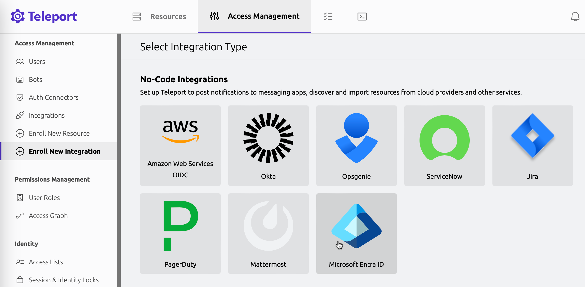
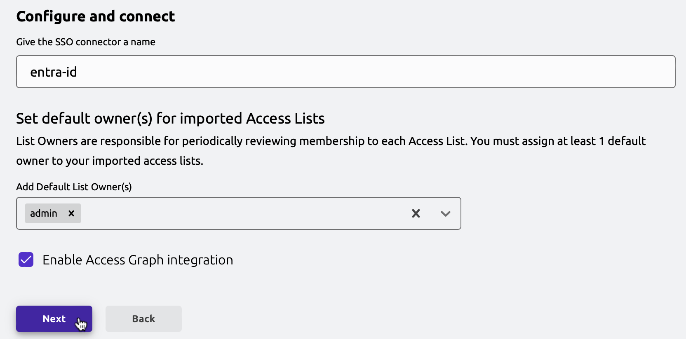

The Microsoft Entra ID integration in Teleport Identity synchronizes your Entra ID directory into your Teleport cluster,
and offers insights into relationships in your Entra ID directory.
Additionally, when Entra ID is used as an SSO identity provider, Teleport Policy visualizes
SSO grants across your services.

<Admonition type="note">
SSO grant analysis is currently only supported in situations where Entra ID acts as the identity provider,
and AWS accounts are set up as relying parties using AWS IAM role federation.

Support for additional relying parties will be added in the future.
</Admonition>

## How it works

Teleport continuously scans the connected Entra ID directory.
At intervals of 5 minutes, it retrieves the following resources from your Entra ID directory:

- Users
- Groups
- Users' memberships in groups
- Enterprise applications

Entra ID users and groups are imported into Teleport as users and Access Lists respectively.
Once all the necessary resources are fetched, Teleport pushes them to the
Access Graph, ensuring that it remains updated with the latest information.
These resources are then visualized using the graph representation detailed in the
[Teleport Policy usage page](../policy-how-to-use.mdx).

## Prerequisites

- A running Teleport Enterprise cluster v15.4.2/v16.0.0 or later.
- Teleport Identity and Teleport Policy enabled for your account.
- For self-hosted clusters:
  - Ensure that an up-to-date `license.pem` is used in the Auth Service configuration.
  - A running Access Graph node v1.21.3 or later.
Check the [Teleport Policy page](../teleport-policy.mdx) for details on
how to set up Access Graph.
  - The node running the Access Graph service must be reachable from the Teleport Auth Service.
- Your user must have privileged administrator permissions in the Azure account

To verify that Access Graph is set up correctly for your cluster, sign in to the Teleport Web UI and navigate to the Management tab.
If enabled, the Access Graph menu item will appear in the Permission Management section.

## Step 1/3. Start Integration onboarding

To start the onboarding process, access the Teleport Web UI,
navigate to the "Access Management" tab, and choose "Enroll New Integration", then pick "Microsoft Entra ID".

In the onboarding wizard, choose a Teleport user that will be assigned as the default owner of Access Lists that are created for your Entra groups, and click "Next".

<Figure width="600">

</Figure>

## Step 2/3. Grant permissions in Azure and finish onboarding

The wizard will now provide you with a script that will set up the necessary permissions in Azure.

<Figure width="600">

</Figure>

Open Azure Cloud Shell by navigating to <a href="https://shell.azure.com">shell.azure.com</a>,
or by clicking the Cloud Shell icon in the Azure Portal.

<Figure width="600">

</Figure>

Make sure to use the Bash version of Cloud Shell.
Once a Cloud Shell instance opens, paste the generated command.
The command sets up your Teleport cluster as an enterprise application in the Entra ID directory,
and grants Teleport read-only permissions to read your directory's data (such as users and groups in the directory).

Once the script is done setting up the necessary permissions,
it prints out the data required to finish the integration onboarding.

Back in the Teleport Web UI, fill out the required data and click "Finish".

<Figure width="600">

</Figure>

## Step 3/3. Analyze Entra ID directory in Teleport Access Graph

Shortly after the integration onboarding is finished,
your Entra ID directory will be imported into your Teleport cluster and Access Graph.

You can find Entra ID users and groups in the Access Graph UI. If you have Entra ID SSO set up for your AWS accounts,
and the AWS accounts have been connected to Teleport,
Access Graph will also show access to AWS resources granted to Entra ID identities.

In the following example, Bob is assigned to group `AWS-Engineers` in Entra ID.
This allows him to use SSO to assume the AWS IAM role `Engineers`,
which in turn allows Bob to access two S3 buckets.

