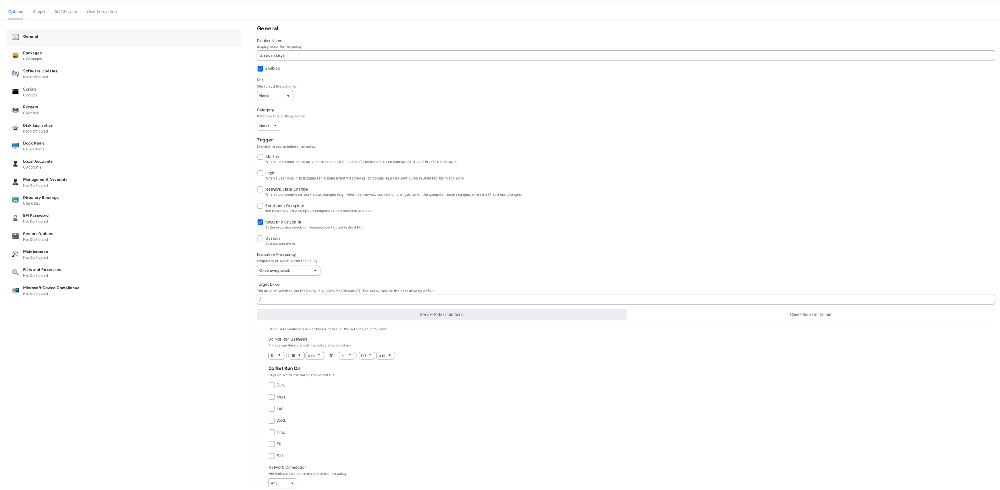

With Teleport Policy's Access Graph, you can gain insights on how SSH keys are used within your environment. By scanning
all SSH authorized keys present on your servers and SSH private keys present on company managed laptops, Teleport Policy can
provide a visual representation of the access patterns and help you enhance the security of your environment.

This functionality gives you insights into the following areas:

- Which servers have SSH authorized keys that could be used to bypass Teleport?
- Which users have SSH private keys that grant access to SSH servers?
- Which laptops have unprotected SSH private keys?

Access Graph is a feature of the [Teleport Policy](https://goteleport.com/platform/policy/) product available to Teleport Enterprise edition customers.

To verify that Access Graph is set up correctly for your cluster, sign in to the Teleport Web UI, click the
Policy sidebar button, and then the Browse menu item. Identities, resources, etc. should be listed.

## How it works

Teleport and Teleport Policy's Access Graph synchronize various resources, including SSH authorized keys and private keys.

These resources are then visualized using the graph representation detailed in the
[Access Graph page](../teleport-policy.mdx).

### Importing SSH authorized keys

Teleport-protected servers running the Teleport SSH Service continuously scan for SSH authorized keys present on the server.
The public fingerprint of these keys is sent to the Teleport Auth Service, which then pushes them to the Access Graph.
Together with the key fingerprint, the Teleport-protected server also sends the following metadata:

- `public_fingerprint`: The SHA256 fingerprint of the public key.
- `host_id`: The unique identifier of the server.
- `username`: The local username whose access is granted by the key.
- `key_comment`: The comment associated with the key in the `authorized_keys` file.

By default, Teleport scans the `$HOME/.ssh/authorized_keys` and `$HOME/.ssh/authorized_keys2` files for authorized keys.
Here, `$HOME` refers to the home directory of each user on the system, whether they are local or LDAP managed users.

### Importing User's SSH private keys

Teleport's `tsh` CLI tool can scan users' laptops for SSH private keys.
It goes through the specified directories, defaulting to `/Users` on macOS, `/home` on Linux, and `C:\Users` on Windows,
by peeking into files to identify SSH private keys.

The `tsh` tool authenticates with the Teleport cluster through the [Device Trust](../../access-controls/device-trust/device-trust.mdx) feature,
which guarantees that only enrolled devices can submit private keys to the cluster. By utilizing the device's Secure
Enclave or TPM private key, it confirms that the device is the same one that was enrolled, enabling Teleport to trust
and accept the private key reports without requiring further authentication or credentials thus allowing scanning operations
to be performed without user interaction and valid credentials.

Once the device is authenticated, the `tsh` tool extracts the public key fingerprint from the private key, if available,
otherwise, it generates the fingerprint from the public key file if the last exists. The fingerprint is then sent to the
Teleport cluster with metadata such as:

- `device_id`: The unique identifier of the device.
- `public_fingerprint`: The SHA256 fingerprint of the public key if available.
- `derivation_mode`: The method used to derive the public key from the private key. If can be either `private_key` if the
  public key is extracted from the private key, `public_key_file` if the private key is encrypted and the public key is
    available in a separate file, or `protected` if the public key fingerprint is not available.

<Notice type="warning">
`tsh` never sends the private key itself to the Teleport cluster, ensuring that the private key remains secure on the device.
It also never sends the private key path or any other sensitive information.
</Notice>

## Prerequisites

- A running Teleport Enterprise cluster v15.4.16/v16.2.0 or later.
- Teleport Policy enabled for your account.
- A Linux/macOS server running the Teleport SSH Service.
- Devices enrolled in the [Teleport Device Trust feature](../../access-controls/device-trust/device-trust.mdx).
- For Jamf Pro integration, devices must be enrolled in Jamf Pro and have the signed `tsh` binary installed.
- For self-hosted clusters:
  - Ensure that an up-to-date `license.pem` is used in the Auth Service configuration.
  - A running Access Graph node v1.22.0 or later.
Check the [Teleport Policy page](../teleport-policy.mdx) for details on
how to set up Access Graph.
  - The node running the Access Graph service must be reachable from the Teleport Auth Service.

## Step 1/3. Enable SSH Key Scanning

To enable SSH Key Scanning, you need to configure the Teleport cluster to scan for SSH authorized keys.

To enable the SSH Key Scanning feature, edit the Teleport Access Graph configuration file:

```code
$ tctl edit access_graph_settings
```

Set the `spec.secrets_scan_config` field to `enabled` as shown below:

```yaml
kind: access_graph_settings
metadata:
  name: access-graph-settings
spec:
  secrets_scan_config: enabled  # possible values: enabled, disabled
version: v1
```

Save the changes and exit the editor. The Teleport cluster will now start informing the Teleport-protected servers to scan for
SSH authorized keys. This process may take a few minutes to complete.

After a few minutes, you can navigate to the Access Graph page in the Teleport UI to view the imported SSH authorized keys
and local users.

## Step 2/3. Scan for SSH private keys

On devices enrolled in the Teleport, you can use the `tsh` CLI tool to scan for SSH private keys. Check [Device Trust](../../access-controls/device-trust/device-trust.mdx)
for details on how to enroll devices in Teleport, specially if you are using Jamf Pro.

To scan for SSH private keys, run the following command from any enrolled device:

```code
$ tsh scan keys --proxy=<Var name="teleport.example.com" /> --dirs=<Var name="/dir1,/dir2" />
```

The `tsh` tool will scan the specified directories and subdirectories for SSH private keys and send the public key
fingerprints to the Teleport cluster. The Teleport cluster will then import the keys and display them in the Access Graph.

`tsh scan keys` supports the following flags:

- `--proxy`: The Teleport Proxy address to connect to.
- `--insecure`: Skip proxy's TLS certificate verification.
- `--dirs`: A comma-separated list of directories to scan for SSH private keys. The default directories are `/Users` on macOS,
  `/home` on Linux, and `C:\\Users` on Windows.
- `--skip-paths`: A comma-separated list of paths to skip during the scan. It supports glob patterns to match multiple paths.
  like `--skip-paths="/Users/*/Library/*,/home/*/Library/*"`.

Once the scan is complete, `tsh` will display the number of keys found, their fingerprints and their paths. The program
output is the only place where the private key paths are displayed. The paths are not sent to the Teleport cluster.


## Step 3/3. View Access Graph

Once the SSH authorized keys and private keys have been imported, you can view them on the Access Graph page.
Users whose devices have private keys will see direct paths to the servers they can access.

The access paths shown include the following relationships:

- A device node linked to the user who owns the device.
- A private key node connected to the Device node, representing the private key found on the device.
- A host user connected to the Teleport-protected server where it is registered.
- An authorized key node connected to the host user node, representing the authorized key found on the `authorized_keys` file.
- A path linking the private key to the authorized key nodes, indicating the insecure access path if the fingerprints match.

Insecure paths are also visible in a user's access paths. To view them, click on the user node and select `View Access`
from the context menu. This will show the Teleport permissions granted to the user, the resources they can access,
and any detected insecure paths.

### Access Graph: Dedicated `ssh_keys` SQL View

Starting in version **v1.25.0**, Access Graph introduces a dedicated `ssh_keys` SQL view for managing SSH access paths.
This view excludes access paths granted through Teleport and focuses on:
- Displaying identified access paths between identities and SSH nodes.
- Listing existing SSH authorized keys configured for nodes, even if `tsh scan keys` fails to detect matching SSH private keys.

Below are a few example queries demonstrating how the `ssh_keys` view can be useful for identifying potential backdoors.

- List all SSH access paths for Teleport SSH nodes and users:
  ```sql
  SELECT * FROM ssh_keys;
  ```
- View insecure access paths and SSH authorized keys for a specific node:
  ```sql
  SELECT * FROM ssh_keys WHERE resource='RESOURCE_NAME';
  ```
- View insecure access paths and SSH authorized keys for a subset of nodes using labels:
  ```sql
  SELECT * FROM ssh_keys WHERE resource_labels @> '{"env": "dev"}';
  ```


## Jamf Pro Integration

If you are using Jamf Pro to manage your devices, you can integrate it with Teleport to automate the device enrollment
process and periodically scan for SSH private keys. Check the [Jamf Pro Integration](../../access-controls/device-trust/jamf-integration.mdx)
page for details on how to set up the device enrollment and scanning process.

On your Jamf Pro page navigate to Settings > Scripts and create a new script command that runs the `tsh scan keys` command
with the required flags.

```code
$ tsh scan keys --proxy=<Var name="teleport.example.com" /> --dirs=<Var name="/dir1,/dir2" />
```

On the Jamf Pro page navigate to Computers > Policies and create a new recurring policy to run the `tsh scan keys` command
periodically. The policy should run the command with the required flags and schedule it to run at regular intervals.
You can also setup the policy to not run during certain hours or days to avoid disrupting the user experience
given that the command may consume system resources during the scan.



<Notice type="warning">
    `tsh` must be installed on the devices to run the scan. If the `tsh` binary is not installed, consider distributing it
    to the devices using the same policy or a separate policy.
</Notice>

Once the policy is created, the devices will start scanning for SSH private keys and sending the fingerprints to the Teleport
Cluster. The keys will be imported and displayed in the Access Graph.

## Troubleshooting

### `"device not enrolled"` error

If you see the `device not enrolled` error when running the `tsh scan keys` command, it means that the device is not enrolled
in the Teleport Device Trust feature. Check the [Device Trust](../../access-controls/device-trust/device-trust.mdx) page for details on how to enroll devices
in Teleport.

### `"binary missing signature or entitlements"` error

A signed and notarized `tsh` binary is necessary to enroll and use a trusted
device. [Download the macOS tsh installer](../../../installation.mdx#macos) to fix
the problem.
