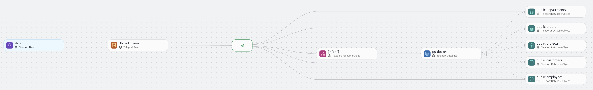
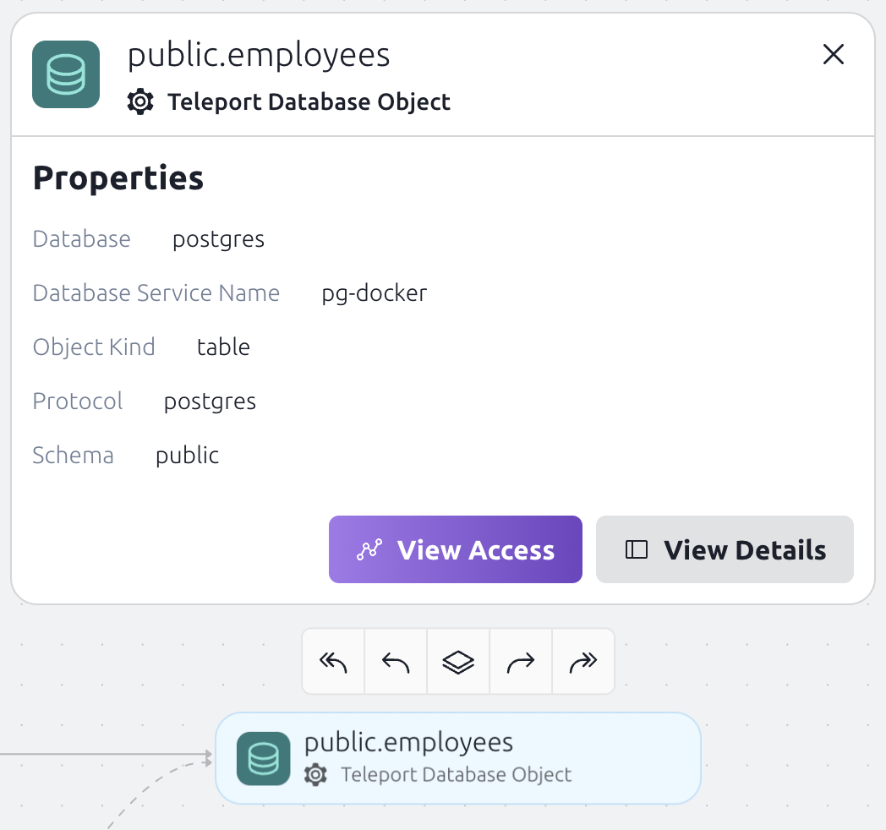
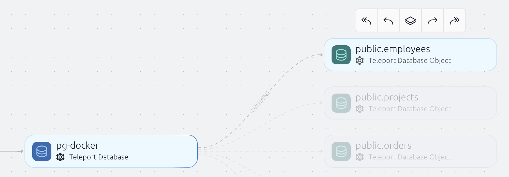
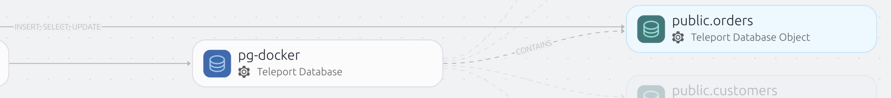

Teleport Policy's Access Graph feature feature shows the relationships between users, roles, and resources. 
It does this by showing paths between nodes. Paths are the relationships between nodes. 
Paths always connect nodes in the following order:

## Connecting to resources

1. Users
1. User Groups
1. Actions
1. Resource Groups
1. Resources

Graph paths can be divided into two categories:

1. Allow paths

Allow paths connect identities to resources. They show what an identity can access and what actions they can perform.

2. Deny paths

Deny paths connect identities to resources. They show what an identity cannot access and what actions they cannot perform. Deny paths take precedence over allow paths.

## How resources and identities are represented

Access Graph imports all resources and identities from Teleport and keeps them up to date, so every time you make a change
to your Teleport resources, the Graph will reflect those changes.

### Identities

Users are created from Teleport Users.
Local users are imported as soon as they are created.
External users (created from authentication connectors for GitHub, SAML, etc.) are imported when they log in for the first time.

### User Groups

User Groups are created from Teleport roles and Access Requests. Roles create User Groups where the members
are the users that have that role. Access requests create a temporary User Group where the members are the users that
got the access through the accepted access request.

### Actions

Actions are created from Teleport roles. Actions can be divided into three
categories:

1. Allow Actions

Allow Actions are created from Teleport roles. Allow Actions are the things that users can do. 
For example, a user can SSH into a node.

2. Deny Actions

Deny Actions are created from Teleport roles. Deny Actions are the things that users cannot do. 
For example, a user cannot SSH into a node. Deny Actions take precedence over Allow Actions.

3. Temporary Actions

Temporary Actions are created when a user is granted temporary access to a resource. 
They are automatically deleted when the user's access expires. The temporary actions 
can be identified by having `Temporary: true` property.

#### Resource Groups

Resource Groups are created from Teleport roles.

### Database Access Controls

Teleport supports [object-level permissions](../../enroll-resources/database-access/rbac.mdx#executing-database-object-permission-rules) for select database protocols.

The database objects-level access information is automatically synchronized to Teleport Policy, making it possible to see who has particular levels of access to the different parts of the database.

When you inspect a particular user's access, the Teleport Access Graph will automatically display the database objects that the user can access.

To see more details about a specific database object, simply select it.

In the graph, database objects are connected by multiple edges:

1. There is exactly one edge connecting the object to its parent database resource. This edge has "contains" label.

2. At least one edge shows the permissions associated with the object, such as `INSERT, SELECT, UPDATE`. If multiple roles grant permissions to the same object, additional edges of this type may be present. The permissions are presented as edge labels.

#### Resources

Resources are created from Teleport resources like nodes, databases, and Kubernetes clusters.

## Next steps
- Uncover [privileges, permissions, and construct SQL queries](./policy-how-to-use.mdx) in  Teleport Policy.