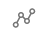
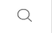
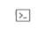
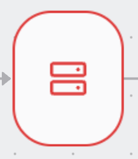

Policy use with the Access Graph provides a framework for visualizing and managing 
access controls across an organization’s infrastructure. 

This interface allows administrators to quickly identify and address potential security risks, 
such as overly broad permissions or conflicting roles, ensuring that access is granted 
on principles of least privilege.

## How to use Policy with Access Graph

Teleport Access Graph can help you to answer questions like:

- Who can access a specific resource?

Determine who has access to resources and understand the pathways that grant access:


- What resources can a specific user access?

At a glance, you can view all the resources a user can access:


## Navigation

The left hand side menu contains the main navigation options:

- Graph view 
- Search 
- SQL editor 
- Integrations 

## Graph View

Graph view is the main view that shows the connections between identities and resources.
By default, an aggregated view of access paths grouped by identity is showed.

## Search

To search for a graph node, use the search bar at the top of the page or the search icon on the right hand side:


You can then search through all node types and all imported entities.

## Graph nodes

Teleport Access Graph divides your infrastructure into six main components:

1. Identities


Identities are the actors that can access your infrastructure. They can be employees, contractors, machines or bots.

The number on the right hand side shows "standing privileges". Standing privileges is the number of 
resources that an identity can access without creating an access request.

2. User Groups


Identity Groups are collections of identities. They can be used to organize users
based on their role or team, and they can be nested.

3. Actions


Actions are the things that identities can or cannot do. Actions are related to resources. 
For example, a user can SSH into a node.

4. Deny Actions



Deny Actions are the things that identities cannot do. Deny Actions are related to resources. 
For example, a user cannot SSH into a node.

5. Resource Groups


Resource Groups are collections of resources. They can be used to organize resources based on their role or team.

The number on the right hand side shows the number of resources that a resource group contains.

6. Resources


Resources are the things that users can or cannot access. They can be servers, databases, or Kubernetes clusters.

## SQL Editor

Access Graph allows creating SQL like queries to explore the graph.


The query language allows to create different views of the graph, ex:

Show only allowed paths:

```sql
SELECT * FROM access_path WHERE kind = 'ALLOWED';
```

Show only denied paths:
```sql
SELECT * FROM access_path WHERE kind = 'DENIED';
```

Show all access paths for a user:
```sql
SELECT * FROM access_path WHERE identity = 'bob';
```

Show all access paths for a user AND a resource:
```sql
SELECT * FROM access_path WHERE identity = 'bob' AND resource = 'postgres';
```

Show all access paths for resources with specific labels:
```sql
SELECT * FROM access_path WHERE resource_labels @> '{"key": "value"}';
```

More actionable examples is available under ? icon.