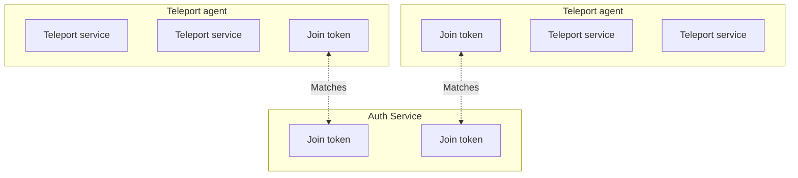

An agent is a Teleport instance configured to run one or more Teleport services
in order to proxy infrastructure resources. For a brief architectural overview
of how agents run in a Teleport cluster, read the [Introduction to Teleport
Agents](introduction.mdx).

This guide shows you how to deploy a pool of Teleport agents by declaring it as
code using Terraform.

There are several methods you can use to join a Teleport agent to your cluster,
which we discuss in the [Joining Services to your
Cluster](join-services-to-your-cluster.mdx) guide. In this guide, we will use
the **join token** method, where the operator stores a secure token on the Auth
Service, and an agent presents the token in order to join a cluster.

No matter which join method you use, it will involve the following Terraform
resources:

- Compute instances to run Teleport services
- A join token for each compute instance in the agent pool



## Prerequisites

(!docs/pages/includes/edition-prereqs-tabs.mdx!)

<Admonition type="tip">

We recommend following this guide on a fresh Teleport demo cluster so you can
see how an agent pool works. After you are familiar with the setup, apply the
lessons from this guide to protect your infrastructure. You can get started with
a demo cluster using:
- A demo deployment on a [Linux server](../get-started.mdx)
- A [Teleport Team trial](https://goteleport.com/signup)

</Admonition>

- An AWS account with permissions to create EC2 instances.
- Terraform v(=terraform.version=).
- An identity file for the Teleport Terraform provider. Make sure you are
  familiar with [how to set up the Teleport Terraform
  provider](../management/dynamic-resources/terraform-provider.mdx) before following this
  guide.
- (!docs/pages/includes/tctl.mdx!)

## Step 1/3. Fetch the example Terraform configuration

Fetch the Teleport code repository and copy the example Terraform configuration
for this project into your current working directory:

```code
$ git clone --depth=1 https://github.com/gravitational/teleport
$ cp -R teleport/examples/agent-pool-terraform .
$ rm -rf teleport
```

Move the identity file for the Teleport Terraform provider into your project
directory so the Terraform provider an access it. Name the file
`terraform-identity`.

<Notice type="warning">

If you don't have an identify file available, make sure you have followed the
[prerequisites for this guide](#prerequisites).

</Notice>

## Step 2/3. Prepare your Terraform configuration

After you have copied the example Terraform configuration, you will assign input
variables and apply your new resources. First, we will explain the Terraform
resource configuration you copied so you can understand how to deploy an agent
pool in your infrastructure.

### Instances and tokens

The file `agent-pool.tf` configures EC2 instances and Teleport join tokens:

```text
(!examples/agent-pool-terraform/agent-pool.tf!)
```

In this minimal example, we deploy one EC2 instance for each Teleport agent.
Each agent joins the cluster using a token. We create each token using the
`teleport_provision_token` Terraform resource, specifying the token's value with
a `random_string` resource.

When we apply the `teleport_provision_token` resources, the Teleport Terraform
provider creates them on the Teleport Auth Service backend. Each EC2 instance
presents the token in order to establish trust with the cluster. 

The Auth Service associates the join token with one or more roles, identifying
the Teleport service that is allowed to use the token. The configuration above
generates tokens for the following Teleport services:

- Teleport SSH Service (`Node`)
- Teleport Application Service (`App`)
- Teleport Database Service (`Db`)
- Teleport Kubernetes Service (`Kube`)

### Startup script

Each EC2 instance runs a script on startup, which we configured above using the
`user_data` field within the `aws_instance.teleport_agent` resource:

```text
(!examples/agent-pool-terraform/userdata.sh!)
```

This script installs Teleport Community Edition on the host, then writes a
configuration file to the default location, `/etc/teleport.yaml`. The
configuration file enables each Teleport service we associated with our token.

So we you access hosts in the agent pool later, the configuration also adds the
`role: agent-pool` label to the Teleport SSH Service on each instance.

Finally, the script restarts Teleport on the host to apply the new
configuration.

### Input variables

The Terraform configuration we show in this guide relies on the following
inputs:

```text
(!examples/agent-pool-terraform/inputs.tf!)
```

In your `agent-pool-terraform` project directory, create a file called
`main.auto.tfvars` with the following content:

```text
agent_count=2
proxy_service_address="mytenant.teleport.sh"
aws_region=""
teleport_version=(=teleport.version=)
subnet_id=""
```

Assign `agent_count` to `2` for high availability. As you scale your Teleport
usage, you can increase this count to ease the load on each agent. You can
consider adding your agents to an Auto Scaling group as well.

Assign `proxy_service_address` to the host and HTTPS port of your Teleport Proxy
Service, e.g., `mytenant.teleport.sh:443`.

<Notice type="tip">

Make sure to include the port.

</Notice>

Assign `aws_region` to your AWS region, e.g., `us-east-1`.

For `subnet_id`, include the ID of the AWS subnet where you will deploy Teleport
agents.

Finally, make sure you are using the latest supported version of the Teleport
Terraform provider. The `required_providers` block for the Teleport provider
includes a placeholder value:

```text
(!examples/agent-pool-terraform/provider.tf!)
```

Replace the placeholder value with the latest version:

```code
$ sed -i "" "s/TELEPORT_VERSION/(=teleport.plugin.version=)/" provider.tf
```

## Step 3/3. Verify the deployment

Make sure you have made your AWS credentials available to Terraform using the
standard approach for your organization.

Apply the Terraform configuration:

```code
$ terraform apply
```

Once the `apply` command completes, run the following command to verify that the
two agents have deployed successfully:

```code
$ tsh ls role=agent-pool
Node Name                  Address    Labels
-------------------------- ---------- ---------------
ip-10-1-1-187.ec2.internal ⟵ Tunnel   role=agent-pool
ip-10-1-1-24.ec2.internal  ⟵ Tunnel   role=agent-pool
```

## Next step: Enroll infrastructure resources

There are two ways to configure your agent pool to protect infrastructure
resources with Teleport:

- **Dynamic infrastructure resources:** You can declare additional Terraform
  resources that represent resources in your infrastructure. Teleport agents
  look up dynamic infrastructure resources from the Auth Service in order to
  proxy user traffic.
- **Static configuration settings:** Edit the configuration of each service to
  point to specific resources in your infrastructure.

### Define dynamic resources in Terraform 

You can declare Terraform resources that enroll your infrastructure with
Teleport. The Teleport Terraform provider currently supports the following:

|Infrastructure Resource|Terraform Resource|
|---|---|
|Application|`teleport_app`|
|Database|`teleport_database`|

To declare a dynamic resource with Terraform, add configuration blocks similar
to the ones below. The Teleport Terraform provider creates these on the Auth
Service backend, and the relevant Teleport services query them in order to proxy
user traffic. For a full list of supported resources and fields, see the
[Terraform provider reference](../reference/terraform-provider.mdx).

<Tabs>
<TabItem label="Application">

```text
resource "teleport_app" "example" {
  metadata = {
    name = "example"
    description = "Test app"
    labels = {
        // Teleport adds this label by default, so add it here to
        // ensure a consistent state.
        "teleport.dev/origin" = "dynamic"     
    }
  }

  spec = {
    uri = "localhost:3000"
  }
}
```

</TabItem>
<TabItem label="Database">

```text
resource "teleport_database" "example" {
    metadata = {
        name = "example"
        description = "Test database"
        labels = {
            // Teleport adds this label by default, so add it here to
            // ensure a consistent state.
            "teleport.dev/origin" = "dynamic"
        }
    }

    spec = {
        protocol = "postgres"
        uri = "localhost"
    }
}
```

</TabItem>
</Tabs>

### Configure Teleport services in the agent pool

Each Teleport service reads its local configuration file (`/etc/teleport.yaml`
by default) to determine which infrastructure resources to proxy. You can edit
this configuration file to enroll resources with Teleport.

In the setup we explored in this guide, you can edit the user data script for
each instance to add configuration settings to, for example, the
`database_service` or `kubernetes_service` sections.

To see how to configure each service, read its section of the documentation:

- [SSH Service](../server-access/introduction.mdx)
- [Database Service](../database-access/introduction.mdx)
- [Kubernetes Service](../kubernetes-access/introduction.mdx)
- [Windows Desktop Service](../desktop-access/introduction.mdx)
- [Application Service](../application-access/introduction.mdx)
