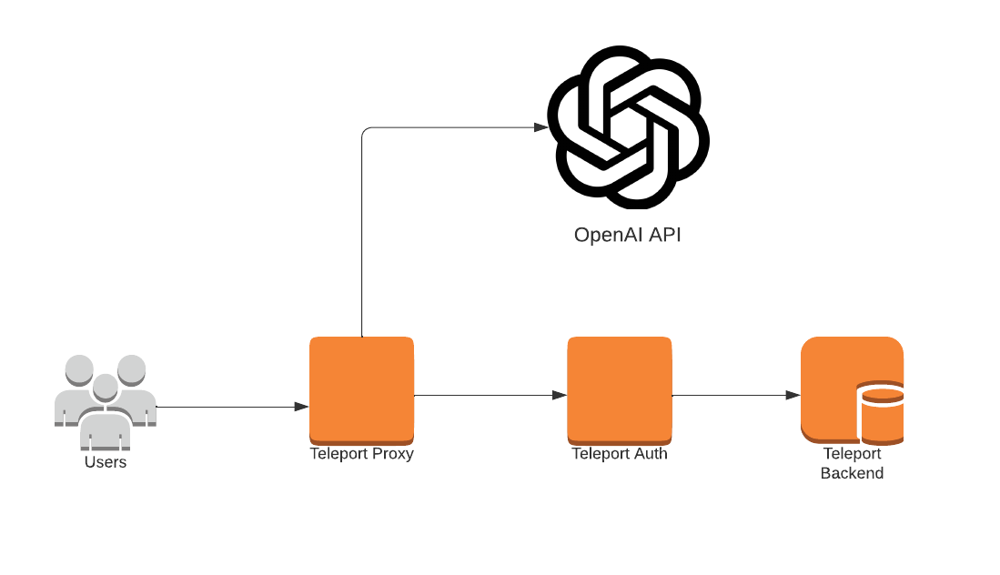
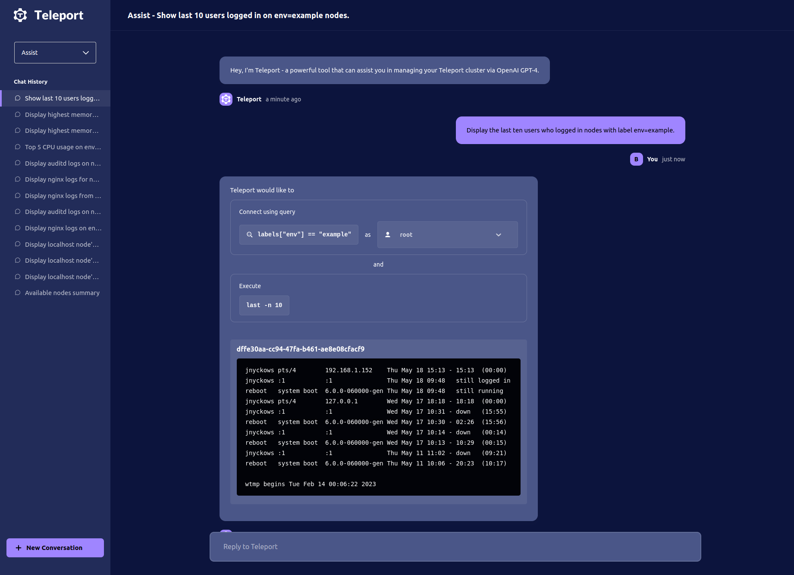

<Admonition type="tip" title="Preview">
  Teleport Assist is currently in Preview.
</Admonition>

This guide will help you understand how to set up and use Teleport Assist, an
AI-powered assistant that helps you run commands, debug issues and navigate your
infrastructure.

### Architecture diagram



### The main screen



## Prerequisites

Before you get started with Teleport Assist, make sure you have the following:

- A running Teleport Community Edition cluster, v12.4 or higher. For details on
  how to set this up, see our [Getting Started](./index.mdx) guide.
- **OpenAI Account**: You will need an active OpenAI account with GPT-4 API
  access as Teleport Assist relies on OpenAI services.

Teleport Assist currently doesn't support Teleport clusters using the etcd backend.
If your installation is using etcd, you can create a new cluster with
any other backend.

## Step 1/3. Generate an OpenAI API key

Teleport Assist uses the GPT-4 model. Your account must have access to it if you
want to use Teleport Assist.

Follow these steps to generate your OpenAI API key:

1. Sign in to your OpenAI account or
   [sign up](https://platform.openai.com/signup) if you don't have one.
1. Navigate to the [API section](https://platform.openai.com/account/api-keys)
   in your OpenAI dashboard.
1. Click on "Create new secret key".
1. Give your key a descriptive name.
1. Click "Create secret key".
1. Your new API key will be displayed. Make sure to copy it and save it in a
   file on the system where the Teleport Proxy Service is running, e.g.,
   `/etc/teleport/openai_key`. If you have multiple instances of Teleport Proxy,
   you must copy the file to all of them.
1. Set read-only permissions and change the file owner to the user that the
   Teleport Proxy Service uses by running the following commands:

```bash
chmod 400 /etc/teleport/openai_key
chown teleport:teleport /etc/teleport/openai_key
```

<Admonition type="warning">
Remember, your API keys carry many privileges, so be sure to keep them secure!
Do not share your secret API keys in publicly accessible areas.
</Admonition>

## Step 2/3. Enable Assist

To enable Teleport Assist, you need to provide your OpenAI API key. On each
Proxy and Auth Service host, perform the following actions:

1. Open your Teleport configuration file. This is typically located at `/etc/teleport.yaml`.

1. Add your OpenAI API key to the `assist` section:

   If the host is running the Auth Service, add the following section:

   ```yaml
   auth_service:
     assist:
       openai:
         api_token_path: /etc/teleport/openai_key
   ```

   If the host is running the Proxy Service, add the following section:

   ```yaml
   proxy_service:
     assist:
       openai:
         api_token_path: /etc/teleport/openai_key
   ```

1. Save the changes and close the file.

1. Restart Teleport for the changes to take effect.

Make sure that your Teleport user has the `assistant` permission. By default, users
with built-in `access` and `editor` roles have this permission. You can also
add it to a custom role. Here is an example:

```yaml
kind: role
version: v7
metadata:
  name: assist
spec:
  allow:
    rules:
    - resources:
      - assistant
      verbs:
      - list
      - create
      - read
      - update
      - delete
```

## Step 3/3. Example use

Now that you have Teleport Assist enabled, you can start using it.

1. Open Teleport's Web UI in your browser (e.g., https://teleport.example.com).
1. Log in to the Web UI using your Teleport credentials.
1. Click on the "Assist" button in the top left dropdown menu.

1. Click "New Conversation" to start a new conversation with Teleport Assist.


Remember, Teleport Assist is powered by OpenAI, so the more specific your query,
the better the response will be.

And that's it! You have now learned how to set up and use Teleport Assist. For
more details and advanced configuration options, check out the other pages in
our documentation.

## Next steps

- [Server Access](enroll-resources/server-access/introduction.mdx)
- [Access controls](admin-guides/access-controls/getting-started.mdx)
- [Resource filtering](reference/predicate-language.mdx)
- [Access Request plugins](admin-guides/access-controls/access-request-plugins/access-request-plugins.mdx)
