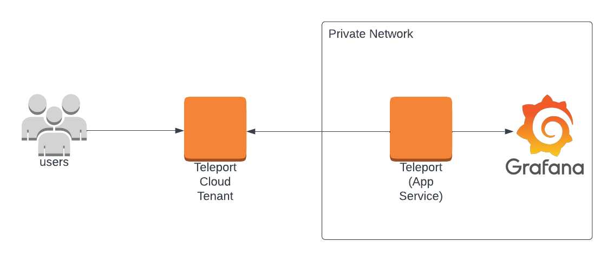

Let's connect to Grafana using Teleport in three steps:

- Launch Grafana in a Docker container or Kubernetes cluster.
- Install the Teleport Application Service and configure it to proxy Grafana.
- Access Grafana through Teleport.

<ScopedBlock scope={["oss", "enterprise"]}>

</ScopedBlock>
<ScopedBlock scope={["cloud"]}>

</ScopedBlock>

## Prerequisites

(!docs/pages/includes/edition-prereqs-tabs.mdx!)

- (!docs/pages/includes/tctl.mdx!)
- A host where you will run the Teleport Application Service.

<Tabs>
<TabItem label="Docker">
- A Docker installation, which we will use to launch Grafana in a container. Alternatively, if you have another web application you'd like to protect with Teleport, you can use that instead.
</TabItem>
<TabItem label="Kubernetes Cluster">

(!docs/pages/includes/kubernetes-access/helm-k8s.mdx!)

- Administrative rights to deploy within a cluster.

</TabItem>
</Tabs>

<Admonition type="tip" title="Not yet a Teleport user?">
{/*lint ignore messaging*/}
If you have not yet deployed the Auth Service and Proxy Service, you should follow one of our [getting started guides](../get-started.mdx) or try our Teleport Application Access [interactive learning track](https://play.instruqt.com/teleport/invite/rgvuva4gzkon). 
</Admonition>

<Admonition type="note" title="Application Access and DNS for Self-Hosted Clusters">

(!docs/pages/includes/dns-app-access.mdx!)

Teleport Cloud will automatically provide a subdomain and signed TLS certificate
for your application under your tenant address.
</Admonition>

## 1/4 Generate a token

A join token is required to authorize a Teleport Application Service instance to
join the cluster. Generate a short-lived join token and save it, for example,
in `/tmp/token`:

```code
$ tctl tokens add \
    --type=app \
    --app-name=grafana \
    --app-uri=http://localhost:3000
```

<Tabs>
<TabItem label="Docker">

## Step 2/4. Start Grafana

We've picked Grafana for this tutorial since it's very easy to run with zero
configuration required. If you have another web application you'd like to
expose, skip over to **Step 3**.

Grafana can be launched in a Docker container with a single command:

```code
$ docker run -d -p 3000:3000 grafana/grafana
```

## Step 3/4. Install and configure Teleport
(!docs/pages/includes/permission-warning.mdx!)


### Configure and Start Teleport

Install Teleport on the host where you will run the Teleport Application Service. See our [Installation](../installation.mdx) page for options besides Linux servers.

(!docs/pages/includes/install-linux.mdx!)

Create the Teleport Application Service configuration at `/etc/teleport.yaml`. Replace <Var name="teleport.example.com" /> with
your Teleport Proxy Service address (`teleport.example.com`) or Teleport Cloud tenant (e.g. `mytenant.teleport.sh`).

```code
$ sudo teleport configure \
  -o file \
  --proxy=<Var name="teleport.example.com" />:443 \
  --token=/tmp/token \
  --roles=app \
  --app-name=grafana \
  --app-uri=http://localhost:3000
```
  
Make sure to update `--app-name` and `--app-uri` accordingly if you're using your own web application.

The `--token` flag points to the file on the Application Service host where we stored the token that we generated earlier.

(!docs/pages/includes/start-teleport.mdx service="the Teleport Application Service"!)

</TabItem>
<TabItem label="Kubernetes cluster">

## Step 2/4. Start Grafana

We've picked Grafana for this tutorial since it's very easy to run with zero
configuration required. If you have another web application you'd like to
expose, skip over to **Step 3**. Install Grafana with these helm instructions
and it will be available at `http://example-grafana.example-grafana.svc.cluster.local`
within the Kubernetes cluster.

```code
$ helm repo add grafana https://grafana.github.io/helm-charts
$ helm repo update
$ helm install example-grafana grafana/grafana \
    --create-namespace \
    --namespace example-grafana
```

## Step 3/4. Install and configure Teleport

  (!docs/pages/kubernetes-access/helm/includes/helm-repo-add.mdx!)

<ScopedBlock scope={["oss", "enterprise"]}>
Install the Teleport Kubernetes Service into your Kubernetes Cluster
with the Teleport Application Service configuration.
Replace <Var name="teleport.example.com" /> with
your Teleport Proxy Service address (`teleport.example.com`) or your
Teleport Enterprise Cloud tenant (e.g. `mytenant.teleport.sh`):

```code
$ JOIN_TOKEN=$(cat /tmp/token)
$ helm install teleport-kube-agent teleport/teleport-kube-agent \
  --create-namespace \
  --namespace teleport-agent \
  --set roles=app \
  --set proxyAddr=<Var name="teleport.example.com" />:443 \
  --set authToken=${JOIN_TOKEN?} \
  --set "apps[0].name=grafana" \
  --set "apps[0].uri=http://example-grafana.example-grafana.svc.cluster.local" \
  --set "labels.env=dev" \
  --version (=teleport.version=)
```
</ScopedBlock>
<ScopedBlock scope={["cloud"]}>
Install the Teleport Kubernetes Service into your Kubernetes Cluster
with the Teleport Application Service configuration.
Replace <Var name="teleport.example.com" /> with
your Teleport Enterprise Cloud tenant address (`mytenant.teleport.sh`)
```code
$ JOIN_TOKEN=$(cat /tmp/token)
$ helm install teleport-kube-agent teleport/teleport-kube-agent \
  --create-namespace \
  --namespace teleport-agent \
  --set roles=app \
  --set proxyAddr=<Var name="teleport.example.com" />:443 \
  --set authToken=${JOIN_TOKEN?} \
  --set "apps[0].name=grafana" \
  --set "apps[0].uri=http://example-grafana.example-grafana.svc.cluster.local" \
  --set "labels.env=dev" \
  --version (=cloud.version=)
```
</ScopedBlock>

Make sure to update `apps[0].name` and `apps[0].uri` accordingly if you're using your own web application.

</TabItem>
</Tabs>

### Create a user

Next, let's create a user to access the application we've just connected. Teleport has a built-in role called `access` that allows users to access cluster resources. Create a local user assigned this role:

```code
$ tctl users add --roles=access alice
```

The command will output a signup link. Use it to choose a password and set up a second factor. After that, it will take you to the Teleport Web UI.

## Step 4/4. Access the application

There are a couple of ways to access the proxied application.

Log in to the Teleport Web UI at your Proxy Service address. All available applications are displayed on the Applications tab.
Click Launch on the Grafana application tile to access it.

Alternatively call the application directly with its name as the sub-domain, e.g. `https://grafana.teleport.example.com`. 
or `https://grafana.mytenant.teleport.sh` for a Teleport Cloud tenant. You will need to log in
if you weren't already authenticated.

## Next steps

Dive deeper into protecting applications with Teleport:

- Learn in more detail about [connecting applications](./guides/connecting-apps.mdx).
- Learn about integrating with [JWT tokens](./jwt/introduction.mdx) for auth.
- Learn how to use application access with [RESTful APIs](./guides/api-access.mdx).
- See full configuration and CLI [reference](./reference.mdx).
- Read about how Let's Encrypt uses the [ACME protocol](https://letsencrypt.org/how-it-works/).
