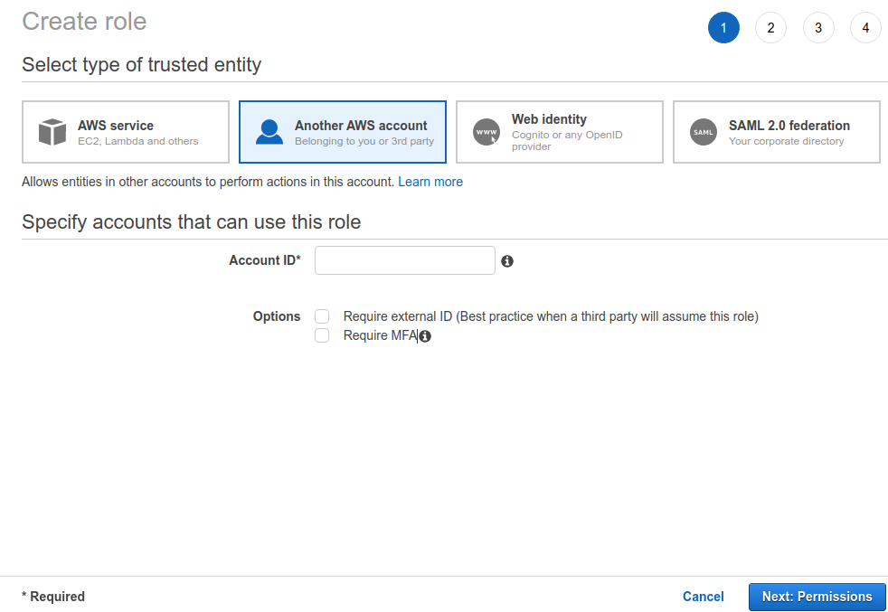
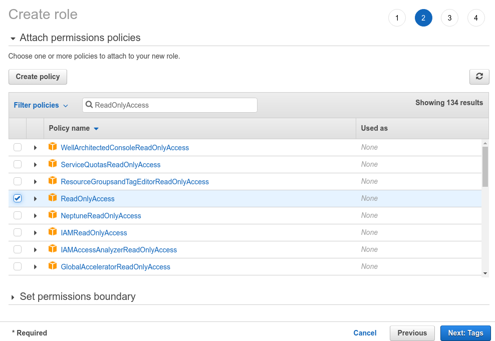
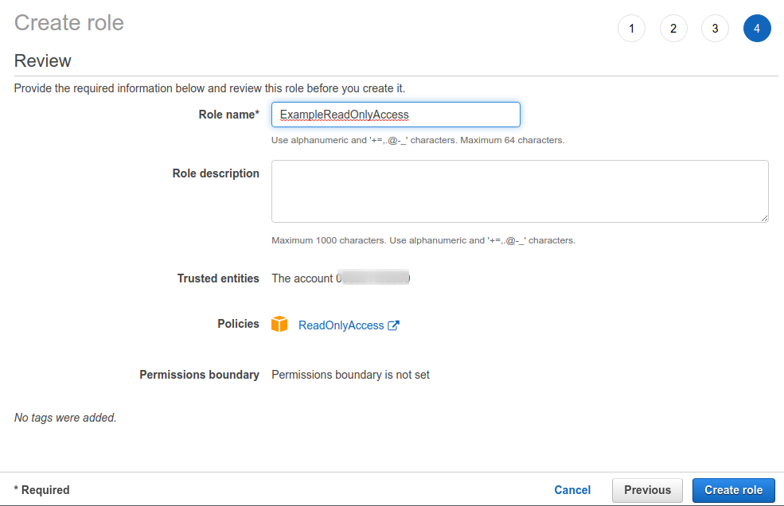
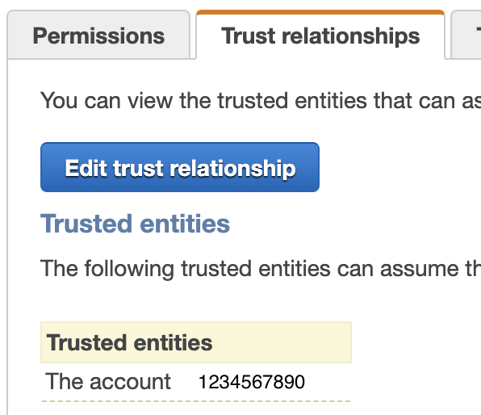
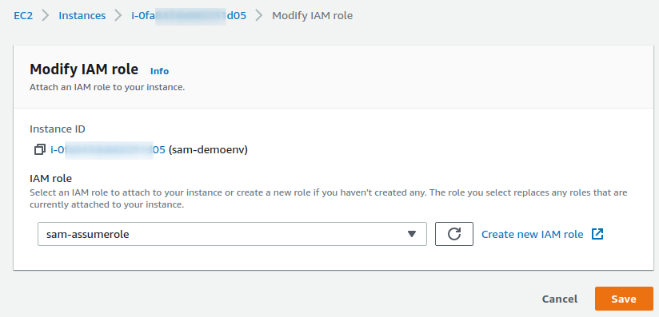

# AWS Management Console Access

Teleport can automatically sign your users into AWS management console with
appropriate IAM roles.

This guide will explain how to:

- Connect your AWS account(-s) to Teleport.
- Setup example AWS IAM Read Only and Power User roles.
- Use Teleport's role-based access control with AWS IAM roles.
- View Teleport users' AWS console activity in CloudTrail.
- AWS command line tool [Installing the AWS CLI](https://docs.aws.amazon.com/cli/latest/userguide/cli-chap-install.html)

## Prerequisites

- Teleport with Application Access. Follow [Getting Started](../getting-started.mdx)
  or [Connecting Apps](./connecting-apps.mdx) guides to get it running.
- IAM permissions in the AWS account you want to connect.
- AWS EC2 or other instance where you can assign a IAM Security Role for the Teleport Agent.

<Admonition type="note">
If using the Teleport agent deployed in AWS EKS, you cannot use Helm chart
annotations to specify the IAM permissions;
you must associate the policy with the cluster role for the worker nodes.
Otherwise, you will receive "400 Bad Request" errors from AWS.
</Admonition>

## Step 1. [Optional] Configure Read Only and Power User roles

AWS provides the `ReadOnlyAccess` and `PowerUserAccess` IAM policies that can be incorporated into roles.  <b>Skip this step</b> if you already have the roles you want to provide access to.

<Admonition type="note">
These policies may provide too much or not enough access for your intentions. Validate these meet your expectations if you plan on using them.
</Admonition>

### Create the example Read Only role

Go to the IAM -> Access Management -> [Roles](https://console.aws.amazon.com/iamv2/home#/roles).
Press Create Role.



### Select the ReadOnlyAccess policy

Press Next and Select the `ReadOnlyAccess`.  Sorting the Policy Name table from Z-A will make it faster to select.



Press next through the tags

### Confirm role

Enter a role name and press create role.




### Repeat for Power User

Follow the same steps and select `PowerUserAccess` IAM Policy to create a `ExamplePowerUser` role.


## Step 2. Update IAM roles trust relationships

<Admonition type="note">
This step is only required if you are allowing access from another account.  The trust relationship will already exist for the same account.
</Admonition>

Teleport uses AWS [Federation](https://docs.aws.amazon.com/IAM/latest/UserGuide/id_roles_providers_enable-console-custom-url.html)
service to generate sign-in URLs for users, which relies on the `AssumeRole` API
for getting temporary security credentials. As such, you would first need to
update your IAM roles' "Trusted entities" to include AWS account ID.

Go to the [Roles](https://console.aws.amazon.com/iamv2/home#/roles) list, pick
a role and create the following trust policy for it by clicking on "Edit trust
relationship" button on the "Trust relationships" tab:

```yaml
{
  "Version": "2012-10-17",
  "Statement": [
    {
      "Effect": "Allow",
      "Principal": {
        "AWS": "arn:aws:iam::<account-id>:root"
      },
      "Action": "sts:AssumeRole"
    }
  ]
}
```

See [How to use trust policies with IAM roles](https://aws.amazon.com/blogs/security/how-to-use-trust-policies-with-iam-roles/)
for more details. After saving the trust policy, the account will show as a
trusted entity:
From the EC2 dashboard select Actions -> Security -> Modify IAM Role


Do this for each IAM role your Teleport users will need to assume.

## Step 3. Give Teleport permissions to assume roles

Next, create a Role using this IAM policy to allow Teleport to assume IAM roles:

```yaml
{
  "Version": "2012-10-17",
  "Statement": [
    {
      "Effect": "Allow",
      "Action": "sts:AssumeRole",
      "Resource": "*"
    }
  ]
}
```

<Admonition type="note">
You can make the policy more strict by providing specific IAM role resource
ARNs in the Resource field instead of using a wildcard.
</Admonition>

Attach this policy to the IAM role/user your Teleport application service agent
is using.



## Step 4. Configure Teleport IAM role mapping

The next step is to give your Teleport users permissions to assume IAM roles.

You can do this by creating a role with `aws_role_arns` field listing all IAM
role ARNs this particular role permits its users to assume:

```yaml
kind: role
version: v4
metadata:
  name: aws-console-access
spec:
  allow:
    app_labels:
      '*': '*'
    aws_role_arns:
    - arn:aws:iam::1234567890:role/ExamplePowerUser
    - arn:aws:iam::1234567890:role/ExampleReadOnlyAccess
```

The `aws_role_arns` field supports template variables so they can be populated
dynamically based on your users' identity provider attributes. See [Role Templates](../../access-controls/guides/role-templates.mdx)
for details.

## Step 5. Register AWS console application in Teleport

Add AWS management console to your application service configuration:

```yaml
teleport:
  # Data directory for the Application Proxy service. If running on the same
  # node as Auth/Proxy service, make sure to use different data directories.
  data_dir: /var/lib/teleport-app
  # Instructs the service to load the join token from the specified file
  # during initial registration with the cluster.
  auth_token: /var/lib/teleport-app/token
  # Proxy address to connect to. Note that it has to be the proxy address
  # because the app service always connects to the cluster over a reverse
  # tunnel.
  auth_servers:
  - teleport.example.com:3080
app_service:
  enabled: "yes"
  apps:
  - name: "awsconsole"
  # The public AWS Console is used after authenticating the user from Teleport
    uri: "https://console.aws.amazon.com/ec2/v2/home"
auth_service:
  enabled: "no"
ssh_service:
  enabled: "no"
proxy_service:
  enabled: "no"

```

Start the application service


```code
sudo teleport start --config=/path/to/teleport.yaml
```

Note that URI must start with `https://console.aws.amazon.com` in order to be
recognized as an AWS console.

### Multiple AWS accounts

If you have multiple AWS accounts and would like to logically separate them
in the UI, register an application entry for each and set `aws_account_id`
label to the account ID:

```yaml
app_service:
  enabled: "yes"
  apps:
  - name: "awsconsole-test"
    uri: "https://console.aws.amazon.com/ec2/v2/home"
    labels:
      aws_account_id: "1234567890"
      env: test
  - name: "awsconsole-prod"
    uri: "https://console.aws.amazon.com/ec2/v2/home"
    labels:
      aws_account_id: "0987654321"
      env: prod
```

When showing available IAM roles, Teleport will display only role ARNs that
belong to the specific account.

## Step 6. Connect to AWS console with assumed IAM role

Navigate to the Applications tab in your Teleport cluster's control panel and
click on the Launch button for the AWS console application which will bring up
an IAM role selector:


Click on the role you want to assume and you will get redirected to AWS
management console signed in with the selected role.

In the console's top-right corner you should see that you're logged in through
federated login and the name of your assumed IAM role:


Note that your federated login session is marked with your Teleport username.

<Admonition type="note" title="Session Duration">
    If the Teleport agent is running with [temporary security credentials](https://docs.aws.amazon.com/IAM/latest/UserGuide/id_credentials_temp.html),
    the management console session will be limited to a maximum of one hour.
</Admonition>

## Step 7. Use CloudTrail to see Teleport user activity

To view CloudTrail events for your federated sessions, navigate to the CloudTrail
[dashboard](https://console.aws.amazon.com/cloudtrail/home) and go to "Event history".

Each Teleport federated login session uses Teleport username as the federated
username which you can search for to get the events history:


## Step 8. Using AWS CLI

First, log into the previously configured AWS console app:

```code
$ tsh app login --aws-role ExamplePowerUser awsconsole-test
Logged into AWS app awsconsole-test. Example AWS CLI command:

$ tsh aws s3 ls
```

The `--aws-role` flag allows to specify the AWS IAM role to assume when accessing AWS API. You can either
provide a role name like `--aws-role ExamplePowerUser` or a full role ARN `arn:aws:iam::1234567890:role/ExamplePowerUser`

Now you can use the `tsh aws` command like the native `aws` command-line tool:

```code
$ tsh aws s3 ls
```

<Admonition type="note" title="Note">
    The `aws` command-line tool should be available in PATH.
</Admonition>

To log out of the aws application and remove credentials:

```code
$ tsh app logout awsconsole-test
```


## Next steps

- Take a closer look at [role-based access controls](../controls.mdx).
- Explore other application access [guides](../guides.mdx).
