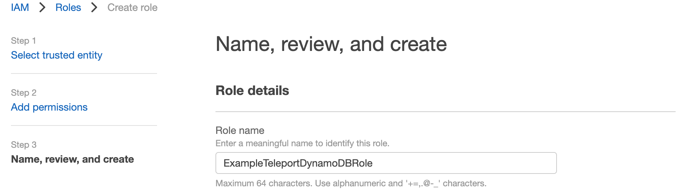
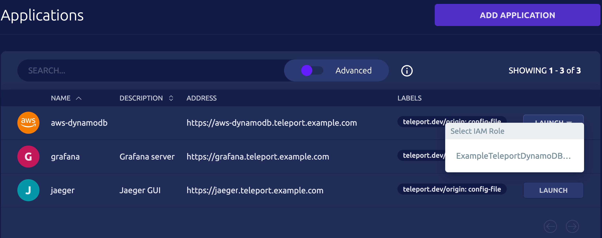

Access to AWS DynamoDB can be provided by [**Teleport Application
Access**](../../application-access/introduction.mdx) for the AWS Console and
API. This is an alternative to accessing DynamoDB through the Teleport Database
service, as described in our [Database Access with AWS
DynamoDB](../../database-access/guides/aws-dynamodb.mdx) guide.

Note that using the Database Service will allow you to connect with GUI clients,
whereas the Application Service does not. On the other hand, a single Application
Service configuration can access DynamoDB across regions, while Database resources
must be configured for each region with DynamoDB databases.

This guide will help you to:

- Install the Teleport Application Service.
- Set up the Teleport Application Service to access the AWS Console and API.
- Connect to your DynamoDB databases through the Teleport Application Service.

<ScopedBlock scope={["oss", "enterprise"]}>

</ScopedBlock>
<ScopedBlock scope={["cloud"]}>

</ScopedBlock>

## Prerequisites

- AWS account with DynamoDB databases.
- IAM permissions to create IAM roles.
- `aws` Command Line Interface (CLI) tool installed in PATH.
- A host, e.g., an EC2 instance, where you will run the Teleport Application
  Service.

(!docs/pages/includes/edition-prereqs-tabs.mdx!)

- (!docs/pages/includes/tctl.mdx!)

<Admonition type="tip" title="Not yet a Teleport user?">
If you have not yet deployed the Auth Service and Proxy Service, you should follow one of our [getting started guides](../getting-started.mdx) or try our Teleport application access [interactive learning track](https://play.instruqt.com/teleport/invite/rgvuva4gzkon).
</Admonition>

We will assume your Teleport cluster is accessible at `teleport.example.com` and `*.teleport.example.com`. You can substitute the address of your Teleport Proxy Service. (For Teleport Cloud customers, this will be similar to `mytenant.teleport.sh`.)

<Admonition type="note" title="Application Access and DNS" scope={["oss", "enterprise"]} scopeOnly>
(!docs/pages/includes/dns-app-access.mdx!)
</Admonition>

## Step 1/5. Create an IAM role for DynamoDB access

Visit the [Roles page](https://console.aws.amazon.com/iamv2/home#/roles) of
the AWS Console, then press "Create Role".

Select the "AWS account" option, which creates a default trust policy to allow
other entities in this account to assume this role:


Press "Next". Find the AWS-managed policy `AmazonDynamoDBFullAccess` and then select the policy:


Press "Next". Enter a role name and press "Create role":



<Admonition type="note" title="Apply least-privilege permissions">
`AmazonDynamoDBFullAccess` may provide too much access for your intentions. To
use a different IAM policy to reduce permissions, see [Managing access
permissions to your Amazon DynamoDB
Resources](https://docs.aws.amazon.com/amazondynamodb/latest/developerguide/access-control-overview.html) for more details.
</Admonition>

## Step 2/5. Configure the Teleport IAM role mapping

The next step is to give your Teleport users permissions to assume IAM roles in
your Teleport cluster.

You can do this by creating a Teleport role with the `aws_role_arns` field
listing the IAM role ARN created in the previous step. Create a file called
`aws-dynamodb-access.yaml` with the following content:

```yaml
kind: role
version: v5
metadata:
  name: aws-dynamodb-access
spec:
  allow:
    app_labels:
      '*': '*'
    aws_role_arns:
    - arn:aws:iam::123456789000:role/ExampleTeleportDynamoDBRole
```

<Details title="Templating aws_role_arns">
The `aws_role_arns` field supports template variables so they can be populated
dynamically based on your users' identity provider attributes. See [Role
Templates](../../access-controls/guides/role-templates.mdx) for details.
</Details>

Create the new role:

```code
$ tctl create -f aws-dynamodb-access.yaml
```

(!docs/pages/includes/add-role-to-user.mdx role="aws-dynamodb-access"!)

## Step 3/5. Install the Teleport Application Service

### Generate a token

A join token is required to authorize a Teleport Application Service instance
to join the cluster. Generate a short-lived join token and save the output of
the command:

```code
$ tctl tokens add \
    --type=app \
    --app-name=aws-dynamodb \
    --app-uri=https://console.aws.amazon.com/dynamodbv2/home
```

On the host where you will run the Teleport Application Service, copy the token
to a file called `/tmp/token`.

<Admonition type="tip" title="non-standard AWS regions">
Replace `https://console.aws.amazon.com` with
`https://console.amazonaws-us-gov.com` for AWS GovCloud (US) regions or
`https://console.amazonaws.cn` for AWS China regions.
</Admonition>

### Install and start Teleport

Install Teleport on the host where you will run the Teleport Application
Service. See our [Installation](../../installation.mdx) page for options
besides Linux servers.

(!docs/pages/includes/install-linux.mdx!)

Edit the Teleport configuration file (`/etc/teleport.yaml`) to include the
following information, adjusting the value of `proxy_server` to specify the host
and port of your Teleport Proxy Service:

```yaml
version: v3
teleport:
  join_params:
    token_name: "/tmp/token"
    method: token
  proxy_server: "teleport.example.com:443"
auth_service:
  enabled: off
proxy_service:
  enabled: off
ssh_service:
  enabled: off
app_service:
  enabled: true
  apps:
  - name: aws-dynamodb
    uri: https://console.aws.amazon.com/dynamodbv2/home
```

(!docs/pages/includes/aws-credentials.mdx service="the Teleport Application Service"!)

(!docs/pages/includes/start-teleport.mdx service="the Teleport Application Service"!)

<Admonition type="warning" title="non-standard AWS regions">
For non-standard AWS regions such as AWS GovCloud (US) regions and AWS China
regions, please set the corresponding region in the `AWS_REGION` environment
variable or in the AWS credentials file so that the Application Service can use
the correct STS endpoint.
</Admonition>

## Step 4/5. Give Teleport permissions to assume roles

Next, attach the following policy to the IAM role or IAM user the Teleport
Application Service instance is using, which allows the Application Service to
assume the IAM roles:

```yaml
{
  "Version": "2012-10-17",
  "Statement": [
    {
      "Effect": "Allow",
      "Action": "sts:AssumeRole",
      "Resource": "*"
    }
  ]
}
```

<Admonition type="tip">
You can make the policy more strict by providing specific IAM role resource
ARNs in the "Resource" field instead of using a wildcard.
</Admonition>

## Step 5/5. Connect

Once the Application Service has started and joined the cluster, you can start
connecting to your DynamoDB database.

### Using AWS Management Console

First log in to the Teleport Web UI at `https://teleport.example.com` (replace
with your Proxy Service's public address).

Navigate to the Applications tab in your Teleport cluster's control panel and
click on the Launch button for the AWS DynamoDB application. This will bring up
an IAM role selector:



Click on the role you want to assume and you will get redirected to the AWS
Management Console, signed in with the selected role.

In the console's top-right corner you should see that you're logged in through
federated login and the name of your assumed IAM role:


Note that your federated login session is marked with your Teleport username.

### Using AWS CLI
Now, log into the previously configured AWS DynamoDB app on your desktop:

```code
$ tsh apps login --aws-role ExampleTeleportDynamoDBRole aws-dynamodb
Logged into AWS app aws. Example AWS CLI command:

$ tsh aws s3 ls
```

The `--aws-role` flag allows you to specify the AWS IAM role to assume when
accessing the AWS API. You can either provide a role name like `--aws-role
ExampleTeleportDynamoDBRole` or a full role ARN like
`arn:aws:iam::123456789000:role/ExampleTeleportDynamoDBRole`.

Now you can use the `tsh aws` command like the native `aws` command-line tool:

```code
$ tsh aws dynamodb list-tables
```

To log out of the `aws-dynamodb` application and remove credentials:

```code
$ tsh apps logout aws-dynamodb
```

### Using other DynamoDB applications

First, log into the previously configured AWS DynamoDB app if you haven't
already done so:

```code
$ tsh apps login --aws-role ExampleTeleportDynamoDBRole aws-dynamodb
```

To connect your DynamoDB application, you can start either a local HTTPS proxy
or a local AWS Service Endpoint proxy.

<Tabs>
  <TabItem label="HTTPS proxy">
  By default, starting the AWS app proxy creates a local HTTPS proxy server
  that forwards AWS requests to the Teleport Proxy Service, enabling you to
  access AWS applications.

  Now, use the following command to start the proxy your applications will be
  connecting to:

  ```code
  $ tsh proxy aws -p 23456
  Started AWS proxy on http://127.0.0.1:23456.

  Use the following credentials and HTTPS proxy setting to connect to the proxy:
    AWS_ACCESS_KEY_ID=(=aws.aws_access_key=)
    AWS_SECRET_ACCESS_KEY=(=aws.aws_secret_access_key=)
    AWS_CA_BUNDLE=<ca-bundle-path>
    HTTPS_PROXY=http://127.0.0.1:23456
  ```

  Use the displayed AWS credentials and HTTPS proxy settings when configuring
  your application.

  For example, you can assign the AWS credentials and the HTTPS proxy address
  to environment variables for Python AWS SDK:

  ```code
  $ export AWS_ACCESS_KEY_ID=(=aws.aws_access_key=)
  $ export AWS_SECRET_ACCESS_KEY=(=aws.aws_secret_access_key=)
  $ export AWS_CA_BUNDLE=<ca-bundle-path>
  $ export HTTPS_PROXY=http://127.0.0.1:23456
  $ python3
  >>> import boto3
  >>> boto3.client('dynamodb').list_tables()
  {'TableNames': ['my-dynamodb-table'], 'ResponseMetadata': {...}}

  ```

  </TabItem>
  <TabItem label="AWS Service Endpoint proxy">
  If your application cannot use a HTTPS proxy, start the AWS app proxy with
  the `--endpoint-url` flag to create a local server that can be used as an
  AWS Service Endpoint.

  ```code
  $ tsh proxy aws --endpoint-url -p 23457
  Started AWS proxy which serves as an AWS endpoint URL at https://localhost:23457

  In addition to the endpoint URL, use the following credentials to connect to the proxy:
    AWS_ACCESS_KEY_ID=(=aws.aws_access_key=)
    AWS_SECRET_ACCESS_KEY=(=aws.aws_secret_access_key=)
    AWS_CA_BUNDLE=<ca-bundle-path>
  ```

  For example, to connect the GUI tool `dynamodb-admin` to the local AWS
  Service Endpoint proxy:
  ```code
  $ export AWS_ACCESS_KEY_ID=(=aws.aws_access_key=)
  $ export AWS_SECRET_ACCESS_KEY=(=aws.aws_secret_access_key=)
  $ export NODE_EXTRA_CA_CERTS=<ca-bundle-path>
  $ export DYNAMO_ENDPOINT=https://127.0.0.1:23457
  $ dynamodb-admin
  database endpoint:     https://127.0.0.1:23457
  region:                ca-central-1
  accessKey:             <access-key-id>

  dynamodb-admin listening on http://localhost:8001 (alternatively http://0.0.0.0:8001)
  ```

  </TabItem>
</Tabs>
To log out of the `aws-dynamodb` application and remove credentials:

```code
$ tsh apps logout aws-dynamodb
```

## Next steps
- More information on [AWS Management and API with Teleport Application Access](../../application-access/cloud-apis/aws-console.mdx).
- Learn more about [AWS service endpoints](https://docs.aws.amazon.com/general/latest/gr/rande.html).
