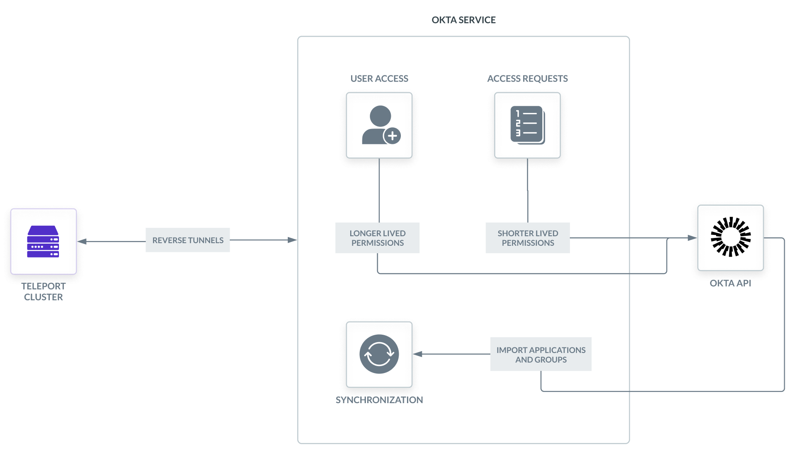

This document will go into details on how the Okta Service is organized and how
it functions.

## How does the Okta integration work?

Teleport provides an Okta Service that is responsible for dealing with all
interactions with Okta. There are three main components of the Okta Service:

- Synchronization
- User access
- Access Requests

The Okta Service uses an Okta API token and endpoint in order to interact
with Okta's API. The API is used to import applications and user groups and
manage assignments.

### Synchronization

The synchronization process runs periodically in the Okta Service, occurring every
10 minutes. This service will import Okta applications, user groups and (if 
Teleport Identity is enabled) Okta users into Teleport, cleaning up any 
resources that no longer exist in Okta.

#### Okta Import Rules

During synchronization, labels can be customized for imported applications and user
groups through the use of Okta Import Rules. These objects can be created by
administrators of the Teleport cluster and they will be automatically picked up
during the next synchronization run.

(!docs/pages/includes/okta-import-rule.mdx!)

### User access

Upon logging into Teleport, users will be granted access to the Okta applications
and user groups that they have access to within Teleport. If a user has RBAC access to
an application or user group, it will be reflected within Okta.

### Access Requests

Users can use Teleport's Just-in-time Access Requests in order to
request temporary access to Okta applications and user groups. Upon expiration of the
access request, the access granted will be revoked within Okta.

## Guide

A guide for setting up a simple Okta Service can be found [here](./guide.mdx).
