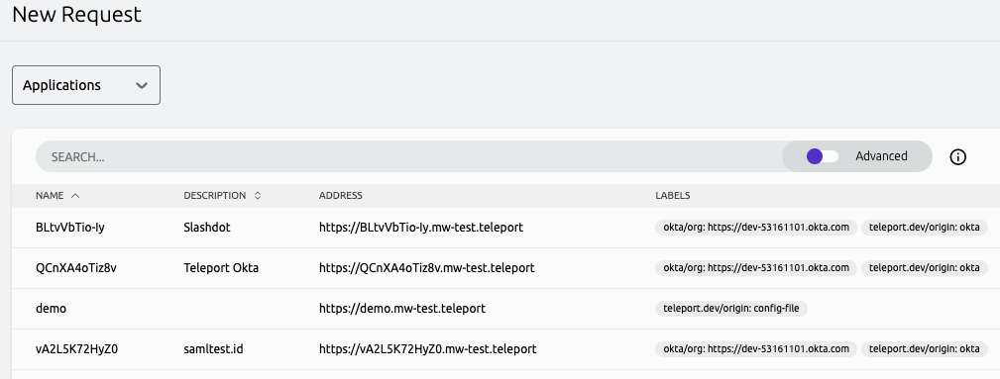

<Admonition type="warning">
Running the Okta integration as a self hosted process is officially deprecated,
and is slated for removal in Teleport 16.

The preferred method for running the Okta integration is as a hosted
integration. See the [Okta hosted integration](./hosted-guide.mdx) guide for more
information.
</Admonition>

Teleport can import and grant access to Okta applications and user groups. Okta applications
can be accessed through Teleport's application access UI, and access to these applications along
with user groups can be managed by Teleport's RBAC along with access requests.

This guide will help you set up the Okta Service and provide some basic
configurations to enable it.

<Details title="This integration is hosted on Teleport Cloud" open={false}>

(!docs/pages/includes/plugins/enroll.mdx name="the Okta integration"!)

</Details>

## Prerequisites

(!docs/pages/includes/commercial-prereqs-tabs.mdx!)

- (!docs/pages/includes/tctl.mdx!)
- A running Teleport cluster with Okta login configured.
- An instance where you will run the Okta Service. This can live anywhere
  with outbound access to Okta and must be running Linux.
- An Okta organization with an [Okta API token](https://developer.okta.com/docs/guides/create-an-api-token) created.

<Details title="Okta API token permissions">

Okta API tokens inherit the permissions of the user who created them. These can
be controlled by using [custom admin roles](https://help.okta.com/en-us/Content/Topics/Security/custom-admin-role/about-creating-custom-admin-roles.htm)
and assigning them to a user who will then create the API token. We recommend
creating a user dedicated to the Teleport Okta API service to manage this token.

The permissions required are:

### User permissions

- View users and their details
- Edit users' group membership
- Edit users' application assignments

### Group permissions

- View groups and their details
- Manage group membership

### Application permissions

- View applications and their details
- Edit application's user assignments

Additionally, the resource set associated with the target user must have unconstrained
access to Users, Applications, and Groups.

One caveat here is that it's impossible to assign API token creation permissions to a
custom role. However, the Okta built in role "Group Membership Admin" has permissions
to create an API token. See more information about built in roles
[here](https://help.okta.com/en-us/Content/Topics/Security/administrators-admin-comparison.htm).

</Details>

## Step 1/3. Create Okta import rules

Before setting up the Okta Service, you should create Okta import rules in order
to ensure that our Okta applications are set up with appropriate labeling before
you attempt to synchronize them. First, you'll need to get the group and application
IDs from Okta. The easiest way to do this is to use the <Var name="okta-api-token" />
that was created when when evaluating the prerequisites.

To get group IDs:

```code
$ curl -H "Authorization: SSWS <Var name="okta-api-token" />" <Var name="okta-endpoint-url" />/api/v1/groups | jq '[.[] |  {"id": .id, "label": .profile.name}]'
...
[
  {
    "id": "111111",
    "label": "Developers"
  },
  {
    "id": "222222",
    "label": "Admins"
  },
  {
    "id": "333333",
    "label": "Everyone"
  },
  {
    "id": "444444",
    "label": "HR"
  },
  ...
]
```

```code
$ curl -H "Authorization: SSWS <Var name="okta-api-token" />" <Var name="okta-endpoint-url" />/api/v1/apps | jq '[.[] |  {"id": .id, "label": .label}]'
...
[
  {
    "id": "111111",
    "label": "Okta Admin Console"
  },
  {
    "id": "222222",
    "label": "Okta Browser Plugin"
  },
  {
    "id": "333333",
    "label": "Okta Dashboard"
  },
  {
    "id": "444444",
    "label": "SAML test"
  },
  ...
]
```

From here, you can copy the IDs from the output of the `curl` commands and use
these to create the Okta import rule. Put this in a file called `okta-import-rule.yaml`:

```yaml
kind: okta_import_rule
version: v1
metadata:
  name: import-rule
  description: "Okta import rule for all groups and applications"
spec:
  mappings:
  - match:
    - app_ids: ["111111", "222222", "333333"] # Replace these with your Okta application IDs.
    add_labels:
      app_label: app-label-value
  - match:
    - group_ids: ["111111", "222222", "333333"] # Replace these with your Okta group IDs.
    add_labels:
      group_label: group-label-value
```

This will ensure that the applications and groups, once synchronized to Teleport,
will be given the specified labels.

## Step 2/3. Set up the Okta Service

In this step, you'll set up the Okta Service. The Okta Service will interact with Okta's
API to import applications and groups, as well as update memberships to those applications
and groups. The Okta Service connects back to the Teleport cluster over a reverse tunnel.

### Get a join token

Establish trust between your Teleport cluster and the new Okta Service
instance by creating a join token:

```code
$ tctl tokens add --type=okta --ttl=1h --format=text
(=presets.tokens.first=)
```

On the host where you will install the Teleport Okta Service, create a
file called `/tmp/token` that consists only of your token:

```code
$ echo <Var name="join-token" /> | sudo tee /tmp/token
```

### Configure the Okta Service

First, on the host where you will run the Okta Service , create a file at
<Var name="okta-api-token-path" /> with the contents of the API token.

Install Teleport on the host:

(!docs/pages/includes/install-linux-enterprise.mdx!)

Next, on the same host, create a file at `/etc/teleport.yaml` with the
following content:

```yaml
version: v3
teleport:
  join_params:
    token_name: "/tmp/token"
    method: token
  proxy_server: "<Var name="teleport.example.com" />:443"
auth_service:
  enabled: no
proxy_service:
  enabled: no
ssh_service:
  enabled: no
okta_service:
  enabled: yes
  api_endpoint: <Var name="okta-endpoint-url" />
  api_token_path: <Var name="okta-api-token-path" />
```

Edit `/etc/teleport.yaml` to replace `teleport.example.com:443` with the host
and port of your Teleport Proxy Service or Teleport Cloud tenant, e.g.,
`mytenant.teleport.sh:443`.

### Run the Teleport Okta Service

(!docs/pages/includes/start-teleport.mdx service="the Teleport Okta Service"!)

## Step 3/3. Connect to the Teleport web UI

Navigate to the application access page within the Teleport web UI to see the list of
of synchronized Okta applications. If you're unable to see the applications, please refer
to the application [Access Controls](../controls.mdx) and update your roles to match the
labels given to your applications by the above specified Okta import rules.

You can also try Access Requests by navigating to the Access Requests page and creating
a new Access Request. From here, you can navigate to applications and see the Okta
applications in the request list:



Or you can navigate to user groups and see the user groups in the request list:


## Next steps

- Learn more about [accessing APIs](../guides/api-access.mdx) with the Teleport
  Application Service.
- Take a look at application-related [Access Controls](../controls.mdx).
