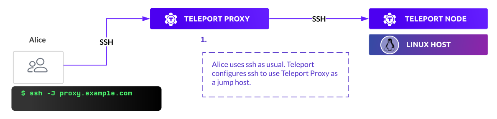

**Teleport agents** proxy traffic from users to resources in your
infrastructure. This guide describes the architecture that enables Teleport to
securely proxy client traffic to infrastructure resources.

Teleport agents are running instances of the `teleport` binary, and can run on a
Linux machine or in a Kubernetes cluster. It is up to Teleport administrators to
deploy and manage agents, including on cloud-hosted Teleport Enterprise
accounts. 

Each agent can connect to multiple infrastructure resources, and a single agent
can run multiple services, e.g., the Teleport SSH Service and the Teleport
Kubernetes Service.

## Agent services

An agent can run one or more services. The following agent services are
available:

| Agent | Traffic it proxies |
|-------|--------------------|
| SSH Service | SSH traffic to the target SSH Service instance or remote OpenSSH servers.|
| Teleport Kubernetes Service  | HTTPS traffic to Kubernetes API servers.|
| Teleport Database Service    | Database-native wire protocols such as Postgres and MySQL, plus HTTP-based database protocols such as DynamoDB.|
| Teleport Application Service | HTTPS and TCP forwarding for internal web applications, with optional JSON web tokens. Signed HTTPS messages for cloud provider APIs.|
| Teleport Desktop Service     | Remote Desktop Protocol traffic to remote servers. Converts incoming RDP traffic to Teleport Desktop Protocol traffic before returning it to the Teleport Web UI via the browser.|

Agents can also run the Teleport Discovery Service. The Discovery Service
queries service discovery endpoints to list resources in your infrastructure,
and configures your Teleport cluster to proxy these resources by creating
dynamic configurations on the Auth Service backend. Agent services listed above
can then proxy resources enrolled by the Discovery Service.

## Components

A Teleport cluster where an administrator has enrolled resources involves the
following components:

- **[Teleport Proxy Service](../architecture/proxy.mdx):** A stateless service that
  performs the function of an authentication gateway, serves the Web UI, and
  accepts client connections. On cloud-hosted Teleport Enterprise accounts, this
  service is accessible at your Teleport account URL, e.g.,
  `example.teleport.sh`.
- **[Teleport Auth Service](../architecture/authentication.mdx):** Serves as
  cluster's certificate authority, handles user authentication/authorization and
  issues short-lived client certificates.
- **Teleport agents:** Agents perform authentication against infrastructure
  resources, proxy user traffic to those resources, and perform protocol
  parsing.
- **Teleport client tools (`tsh`, Teleport Connect, and the Teleport Web UI):**
  Connect to resources in your infrastructure through Teleport agents and the
  Teleport Proxy Service.
- **Local proxies:** In some cases, `tsh` spins up local proxy servers that
  authenticate to Teleport and forward traffic from client tools (e.g., database
  clients and AWS SDK applications).
- **Infrastructure resources:** Teleport can protect access to self-hosted
  infrastructure as well as infrastructure managed by a cloud provider.

## Retrieving credentials from the Teleport Auth Service

The Teleport Auth Service issues certificates that enable users to communicate
with Teleport agents and for Teleport agents to communicate with resources in
your infrastructure.

### Credentials for Teleport agents

The Teleport Auth Service runs a certificate authority that issues a host
certificate to an agent when it joins the cluster for the first time. Read [Join
Services to your Teleport Cluster](../agents/join-services-to-your-cluster.mdx)
for the available methods you can use to join an agent to your Teleport cluster.

All agents in a Teleport cluster keep the Auth Service updated on their status
with periodic ping messages. They report their IP addresses and the values of
their assigned labels. Clients can access the list of all agent instances in
their cluster via the Auth Service API or CLI.

An agent's identity is represented by SSH host certificate it receives after
registering withing the cluster:

This certificate contains information about the agent, including:

- The **host ID**, a generated UUID unique to an agent.
- A **hostname**, which defaults to the return value of the `hostname` command
  on the agent host, but can be configured.
- The **cluster name**. On cloud-hosted Teleport Enterprise clusters, this is a
  subdomain of `teleport.sh`. On self-hosted clusters, the default value is the
  `hostname` of the Teleport Auth Service, and users can configure this.
- The agent's **role** (e.g., `node,proxy`) encoded as a certificate extension. 
- The **expiry time** of the certificate.

### Credentials for Teleport clients

When a user logs into the cluster with the `tsh login` command, the Teleport
Auth Service uses the `user` certificate authority to sign the certificate. See
[Issuing User Certificates](../architecture/authentication.mdx) for more details
on how it works. If the user authenticates via the Teleport Web UI, the browser
retrieves a session cookie.

In most cases, Teleport users must retrieve another user certificate in order to
access Teleport-protected resources. The certificate authorizes the user to
access specific resources, such as an application or database. The following
table indicates how a user obtains this certificate for different kinds of
resources:

|Resource kind|How users obtain certificates|
|---|---|
|Databases|The user can retrieve a client certificate for before connecting to a database with `tsh db login`. The `tsh db connect` and `tsh proxy db` commands also retrieve certificates. The Teleport Database Service verifies the certificate when a user connects to a database.|
|Kubernetes clusters|The user runs `tsh kube login`, which updates the local kubeconfig to contain a certificate signed by the Teleport user CA. The user can then execute `kubectl` commands against Teleport-protected Kubernetes clusters.|
|Servers|After running `tsh login`, the user receives a certificate that contains authorization information for servers. The SSH Service checks the certificate when a user authenticates to a Teleport-protected server.|
|Web applications|The user authenticates to the Teleport Web UI and visits a Teleport-protected application. The Teleport Proxy Service forwards traffic to the application along with Teleport-signed JSON web tokens that the application can verify. For HTTP API applications, TCP applications, and cloud provider APIs, the user runs `tsh apps login` to retrieve a certificate.|
|Windows desktops|Users authenticate to the Teleport Web UI. The Web UI initiates a WebSocket session with the Teleport Desktop Service and communicates with the service using Teleport Desktop Protocol (TDP). The Desktop Service converts TDP traffic to Remote Desktop Protocol traffic.|

In most cases (except for some self-hosted clusters), the user will have
connected to the Auth Service through the Teleport Proxy Service. The Auth
Service forwards user certificates through the Proxy Service over mutual TLS.  

## Establishing reverse tunnels

In most cases, when an agent joins a Teleport cluster, it establishes a reverse
SSH tunnel to the Proxy Service. As such, users do not need to have direct
connectivity to agents or the resources they are connected to. As long as an
agent can dial back to the cluster's Proxy Service, it can be located behind a
firewall.

The connection between the Proxy Service and a Teleport agent instance is also
authenticated with mutual TLS. The Proxy Service generates a short-lived X.509
certificate signed by the cluster's host CA, with the client's identity and
routing information for an infrastructure resource encoded in it, and uses it to
authenticate with the Teleport agent.

The Proxy Service authenticates the connection and dispatches it to the
appropriate agent instance based on the routing information encoded in the
client certificate, over the reverse tunnel.

It is possible to join Teleport agents to a cluster [through the Teleport Auth
Service](../agents/join-services-to-your-cluster/join-token.mdx#connecting-directly-to-the-auth-service.mdx).
Once an agent joins a cluster through the Teleport Auth Service, the Teleport
Proxy Service dials the agent directly, without creating a reverse tunnel. This
mode supports the following services:

- Teleport SSH Service
- Teleport Desktop Service
- Teleport Kubernetes Service
- Teleport Discovery Service

In direct mode, SSH Service instances act like OpenSSH servers that only accept
client SSH certificates. Users can connect to SSH servers through the Teleport
Proxy Service as a jump-host or directly:

Direct mode is designed for legacy use cases and only supports self-hosted
Teleport clusters. We recommend joining agents through the Teleport Proxy
Service and the reverse tunnel system unless this is not possible for your
self-hosted Teleport deployment.

## Connecting to infrastructure through Teleport agents

Teleport users can access resources in their infrastructure with the `tsh`
clientCLI, the Teleport Web UI, and Teleport Connect. All of these tools route
traffic through agents, usually routed through the Teleport Proxy Service.

### Communication between agents and infrastructure resources

Teleport agents proxy user traffic to resources in your infrastructure. The
method that agents use to connect to a resource typically depends on whether the
resource is self hosted or managed by a cloud provider. 

For self-hosted resources, operators distribute mutual TLS credentials to
infrastructure resources, including a certificate signed by a Teleport
certificate authority for validating the resource and a certificate authority
certificate that the resource can use for validating Teleport-issued client
certificates. When an agent connects to a resource, it retrieves a signed client
certificate from the Teleport Auth Service.

For resources managed by cloud providers, Teleport takes advantage of identity
and access management (IAM) solutions available through the cloud provider. The
agent accesses credentials to authenticate to the cloud provider, and has
permissions to perform certain operations against the infrastructure resources
it protects, e.g., managing a database or assuming another IAM role.

To learn more about the mechanism an agent uses to authenticate to an
infrastructure resource, read the guide to setting up connectivity to that
resource:

- [Applications](../application-access/guides.mdx)
- [Cloud provider APIs](../application-access/cloud-apis.mdx)
- [Databases](../database-access/guides.mdx)
- [Kubernetes clusters](../kubernetes-access/register-clusters.mdx)
- [Linux hosts with Teleport](../server-access/getting-started.mdx)
- [OpenSSH servers](../server-access/openssh.mdx)
- [Windows desktops](../desktop-access/gertting-started.mdx)

### Communication between clients and agents

Teleport makes several client tools available for access infrastructure
resources through agents:

- [The `tsh` CLI](../connect-your-client/tsh.mdx)
- [Teleport Connect](../connect-your-client/teleport-connect.mdx)
- [Teleport Web UI](../connect-your-client/web-ui.mdx)

After retrieving [client credentials](#credentials-for-teleport-clients), these
tools authenticate to the Teleport Proxy Service and send traffic to Teleport
agents. The protocol used depends depends on the upstream resource. See [TLS
Routing](./tls-routing.mdx) for how client tools perform protocol negotiation
with the Teleport Proxy Service.

Depending on the upstream infrastructure resource a user wants to connect to,
the `tsh` client tool may spin up one or more local proxy servers. These
authenticate to the Teleport Proxy Service, then create a listener that accepts
traffic from local client tools. A user can then connect to the local proxy with
their client tool as though they were connecting to a remote resource.

The following table summarizes the local proxies available through the `tsh`
CLI:

|`tsh` command|Upstream infrastructure resource|
|---|---|
|`tsh proxy app`|HTTP and [TCP](../application-access/guides/tcp.mdx) applications|
|`tsh proxy aws`|[AWS SDK applications](../application-access/cloud-apis/aws.mdx)|
|`tsh proxy azure`|[Azure SDK applications](../application-access/cloud-apis/azure.mdx)|
|`tsh proxy gcloud`|[Google Cloud SDK applications](../application-access/cloud-apis/google-cloud.mdx)|
|`tsh proxy ssh`|[OpenSSH client traffic](../server-access/openssh/openssh.mdx)|
|`tsh proxy db`|[Native database clients](../connect-your-client/gui-clients.mdx)|
|`tsh proxy kube`|[Kubernetes clusters behind L7 load balancers](../tls-routing.mdx#kubernetes)|

`tsh` commands that connect to resources often spin up the same local proxies as
`tsh proxy` commands. For example, depending on the database, `tsh db connect`
starts a local proxy before using a database client to send traffic to it.

### Submitting audit events

Teleport agents connect to the Teleport Auth Service through the Teleport Proxy
Service and submit audit events at various moments within the life cycle of a
user session, including when the user signs in, connects to a resource,
interacts with a resource, and signs out. Agents interpret the wire protocol
messages they forward to infrastructure resources in order to detect events.

Learn more about the Teleport audit events in the [Audit Event
Reference](../reference/audit.mdx).

## Further reading

- For instructions on deploying agents, see the [Teleport agent
  guides](../agents/introduction.mdx).
