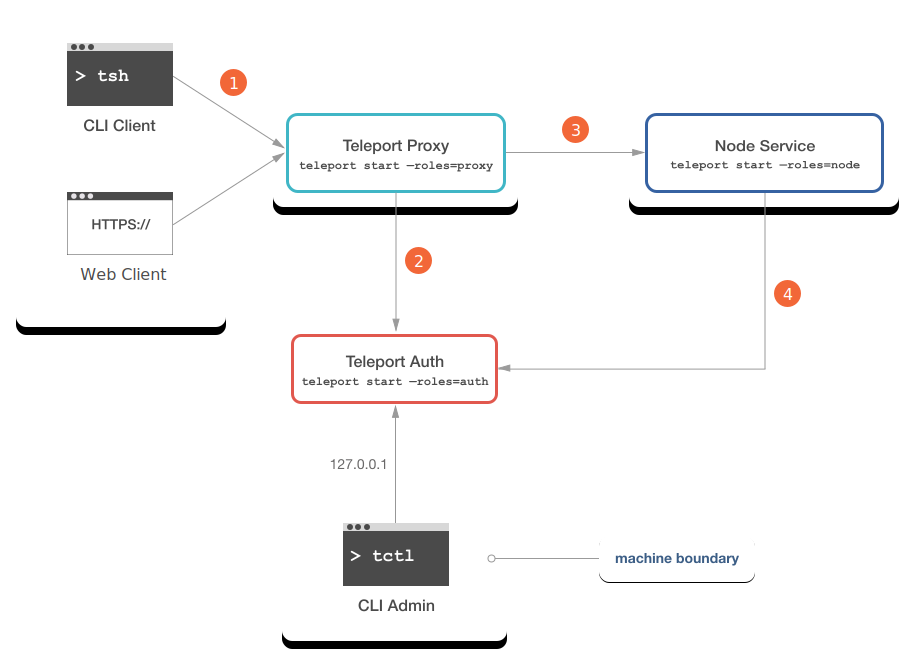
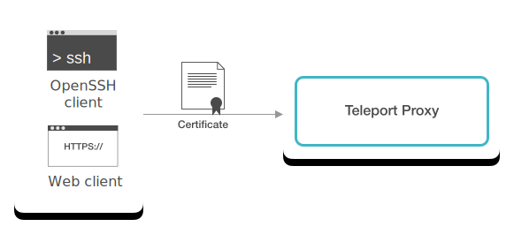
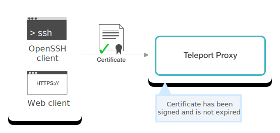
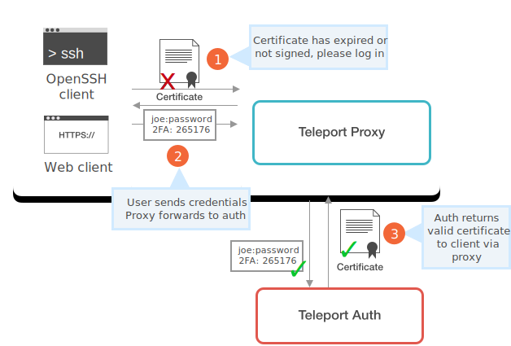
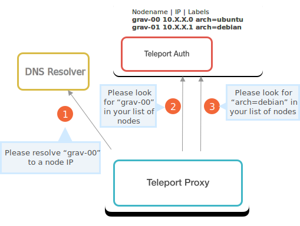
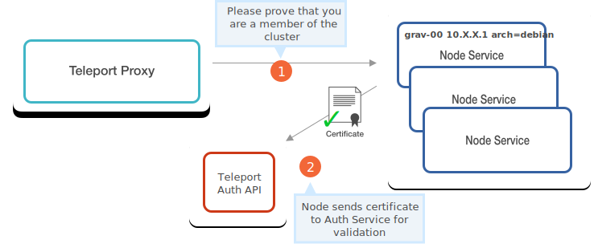
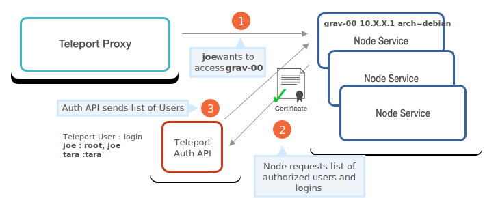
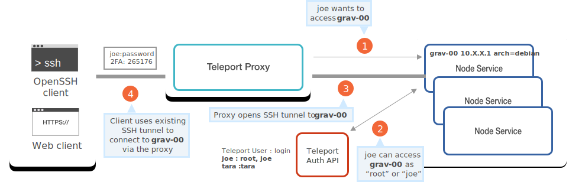

This guide is for those looking for a deeper understanding of Teleport. If you
are looking for hands-on instructions on how to set up Teleport for your team,
check out the [Admin Guide](../admin-guide.mdx)

## What makes Teleport different

- Teleport replaces legacy keys and shared secrets with short-lived X.509 and SSH certificates
  for services and users.
- It proxies and inspects SSH, Kubernetes, Web, and Database protocols.
  For example for SSH, it controls the session from the start
  and captures a session recording and in-kernel system calls using BPF.
- It removes a need for VPN and can connect multiple regions and organizations
  in a decentralized network using mutual TLS and SSH tunnels.

## Design principles

Teleport was designed under the following principles:

- **Off the Shelf Security**: Teleport does not re-implement any security primitives and uses well-established, popular implementations of the encryption and network protocols.
- **Open Standards**: There is no security through obscurity. Teleport is fully
  compatible with existing and open standards and other software, including
  [OpenSSH](../server-access/guides/openssh.mdx).
- **Cluster-Oriented Design**: Teleport is built for managing clusters, not individual servers. In practice this means that hosts and [Users](../user-manual.mdx)
  have cluster memberships. Identity management and authorization happen on a
  cluster level.
- **Built for Teams**: Teleport was created under the assumption of multiple teams operating on several disconnected clusters. Example use cases might be production-vs-staging environment, or a cluster-per-customer or cluster-per-application basis.

This doc introduces the basic concepts of Teleport so you can get started
managing access!

## Definitions

Here are definitions of the key concepts you will use in Teleport.

| Concept | Description |
| - | - |
| Node | A node is a "server", "host" or "computer". Users can create shell sessions to access nodes remotely. |
| User | A user represents someone (a person) or something (a machine) who can perform a set of operations on a node. |
| Cluster | A cluster is a group of nodes that work together and can be considered a single system. Cluster nodes can create connections to each other, often over a private network. Cluster nodes often require TLS authentication to ensure that communication between nodes remains secure and comes from a trusted source. |
| Certificate Authority (CA) | A Certificate Authority issues SSL certificates in the form of public/private keypairs. |
| [Teleport Node](nodes.mdx) | A Teleport Node is a regular node that is running the Teleport Node service. Teleport Nodes can be accessed by authorized Teleport Users. A Teleport Node is always considered a member of a Teleport Cluster, even if it's a single-node cluster. |
| [Teleport User](users.mdx) | A Teleport User represents someone who needs access to a Teleport Cluster. Users have stored usernames and passwords, and are mapped to OS users on each node. User data is stored locally or in an external store. |
| Teleport Cluster | A Teleport Cluster is comprised of one or more nodes, each of which holds certificates signed by the same [Auth Server CA](authentication.mdx). The CA cryptographically signs the certificate of a node, establishing cluster membership. |
| [Teleport CA](authentication.mdx) | Teleport operates two internal CAs as a function of the Auth service. One is used to sign User certificates and the other signs Node certificates. Each certificate is used to prove identity, cluster membership, and manage access. |

## Teleport services

Teleport uses three services which work together: [Nodes](nodes.mdx),
[Auth](authentication.mdx), and [Proxy](proxy.mdx).

[**Teleport Nodes**](nodes.mdx) are servers that can be accessed remotely with
SSH. The Teleport Node service runs on a machine and is similar to the `sshd`
daemon you may be familiar with. Users can log in to a Teleport Node with all
of the following clients:

- [OpenSSH: `ssh`](../server-access/guides/openssh.mdx) (works on Linux, macOS and Windows)
- [Teleport CLI client: `tsh ssh`](../setup/reference/cli.mdx#tsh-ssh) (works on Linux and macOS)
- [Teleport Proxy UI](proxy.mdx#web-to-ssh-proxy) accessed via any modern web browser (including Safari on iOS and Chrome on Android)

[**Teleport Auth**](authentication.mdx) authenticates Users and Nodes, authorizes User
access to Nodes, and acts as a CA by signing certificates issued to Users and
Nodes.

[**Teleport Proxy**](proxy.mdx) forwards User credentials to the [Auth
Service](authentication.mdx), creates connections to a requested Node after successful
authentication, and serves a [Web UI](proxy.mdx#web-to-ssh-proxy).

## Basic architecture overview

The numbers correspond to the steps needed to connect a client to a node. These
steps are explained below the diagram.

<Admonition
  type="warning"
  title="Caution"
>
  The teleport daemon calls services "roles" in the CLI
  client. The `--roles` flag has no relationship to concept of [User Roles](users.mdx#user-roles) or
  permissions.
</Admonition>



1. Initiate Client Connection
2. Authenticate Client
3. Connect to Node
4. Authorize Client Access to Node

<Admonition
  type="tip"
  title="Tip"
>
  In the diagram above we show each Teleport service separately for clarity, but Teleport services do not have to run on separate nodes.
  Teleport can be run as a binary on a single-node cluster with no external storage backend. We demonstrate this minimal setup in the [Getting Started Guide](../getting-started.mdx).
</Admonition>

## Detailed architecture overview

Here is a detailed diagram of a Teleport Cluster.

The numbers correspond to the steps needed to connect a client to a node. These
steps are explained in detail below the diagram.


<Admonition
  type="note"
  title="Caution"
>
  The Teleport Admin tool, `tctl`, must be physically present on the same machine where Teleport Auth is running. Adding new nodes or inviting new users to the cluster is only possible using this tool.
</Admonition>

### 1: Initiate client connection



The client tries to establish an SSH connection to a proxy using the CLI
interface or a web browser. When establishing a connection, the client offers
its certificate. Clients must always connect through a proxy for two reasons:

1. Individual nodes may not always be reachable from outside a secure network.

2. Proxies always record SSH sessions and keep track of active user sessions.

   This makes it possible for an SSH user to see if someone else is connected to
   a node she is about to work on.

### 2: Authenticate client certificate



The proxy checks if the submitted certificate has been previously signed by the
auth server.



If there was no certificate previously offered (first time log in) or if the certificate has expired, the proxy denies the connection and asks the client to
login interactively using a password and a 2nd factor if enabled.

Teleport supports
[Google Authenticator](https://support.google.com/accounts/answer/1066447?hl=en),
[Authy](https://www.authy.com/), or another
[TOTP](https://en.wikipedia.org/wiki/Time-based_One-time_Password_algorithm)
generator. The password + 2nd factor are submitted to a proxy via HTTPS,
therefore it is critical for a secure configuration of Teleport to install a
proper HTTPS certificate on a proxy.

<Admonition
  type="warning"
  title="Warning"
>
  Do not use self-signed SSL/HTTPS certificates in production!
</Admonition>

If the credentials are correct, the auth server generates and signs a new
certificate and returns it to the client via the proxy. The client stores this certificate
and will use it for subsequent logins. The certificate will automatically expire after
12 hours by default. This [TTL](https://en.wikipedia.org/wiki/Time_to_live) can be [configured](../setup/reference/cli.mdx#tctl-users-add)
to another value by the cluster administrator.

### 3: Lookup Node



At this step, the proxy tries to locate the requested node in a cluster. There
are three lookup mechanisms a proxy uses to find the node's IP address:

1. Uses DNS to resolve the name requested by the client.
2. Asks the Auth Server if there is a Node registered with this `nodename`.
3. Asks the Auth Server to find a node (or nodes) with a label that matches the requested name.

If the node is located, the proxy establishes the connection between the client
and the requested node. The destination node then begins recording the session,
sending the session history to the auth server to be stored.

<Admonition
  type="note"
  title="Note"
>
  Teleport may also be configured to have the session recording
  occur on the proxy, see [Audit Log](../admin-guide.mdx#audit-log) for more
  information.
</Admonition>

### 4: Authenticate Node certificate



When the node receives a connection request, it checks with the Auth Server to
validate the node's certificate and validate the Node's cluster membership.

If the node certificate is valid, the node is allowed to access the Auth Server
API which provides access to information about nodes and users in the cluster.

### 5: Grant user Node access



The node requests the Auth Server to provide a list of [OS users (user
mappings)](../setup/admin/users.mdx) for the connecting client, to make sure the client is
authorized to use the requested OS login.

Finally, the client is authorized to create an SSH connection to a node.



## Teleport CLI tools

Teleport offers two command-line tools. `tsh` is a client tool used by the end
users, while `tctl` is used for cluster administration.

### TSH

`tsh` is similar in nature to OpenSSH `ssh` or `scp`. It has
subcommands named after them so you can call:

```code
$ tsh --proxy=p ssh -p 1522 user@host
$ tsh --proxy=p scp -P example.txt user@host/destination/dir
```

Unlike `ssh`, `tsh` is very opinionated about authentication: it always uses
auto-expiring certificates and it always connects to Teleport nodes via a proxy.

When `tsh` logs in, the auto-expiring certificate is stored in `~/.tsh` and is
valid for 12 hours by default, unless you specify another interval via the
`--ttl` flag (capped by the server-side configuration).

You can learn more about `tsh` in the [User Manual](../user-manual.mdx).

### TCTL

`tctl` is used to administer a Teleport cluster. It connects to the Auth
server listening on `127.0.0.1` and allows a cluster administrator to manage
nodes and users in the cluster.

`tctl` is also a tool that can be used to modify the dynamic configuration of
the cluster, like creating new user roles or connecting trusted clusters.

You can learn more about `tctl` in the [Admin Manual](../admin-guide.mdx).

## Next steps

- If you haven't already, read the [Getting Started Guide](../getting-started.mdx) to run a
  minimal setup of Teleport yourself.
- Set up Teleport for your team with the [Admin Guide](../admin-guide.mdx).

Read the rest of the Architecture Guides:

- [Teleport Users](users.mdx)
- [Teleport Nodes](nodes.mdx)
- [Teleport Auth](authentication.mdx)
- [Teleport Proxy](proxy.mdx)
