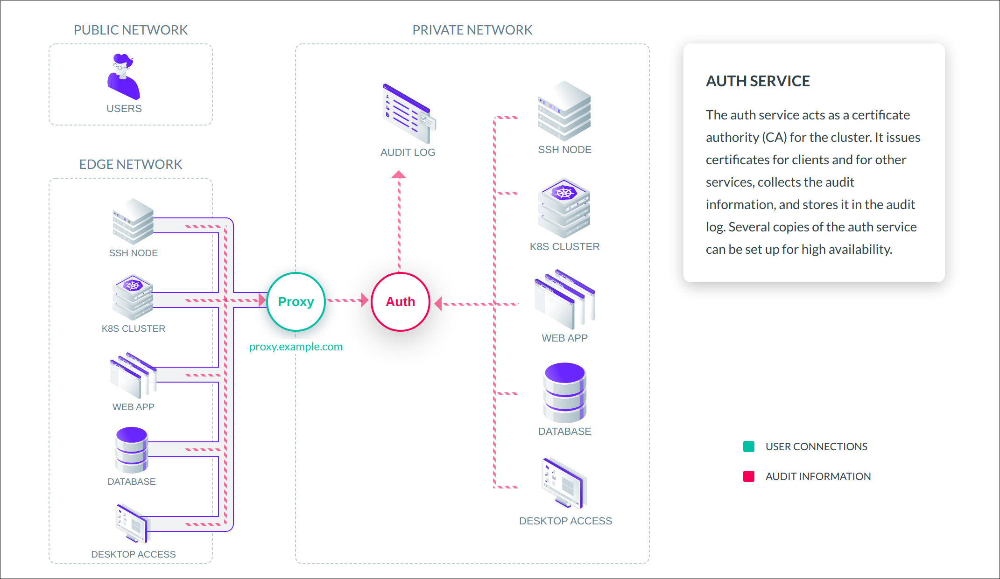

<Notice type="tip">
This guide is for those looking for a deeper understanding of Teleport. If you
are looking for hands-on instructions on how to set up Teleport for your team,
check out the [Admin Guide](../setup/admin.mdx)
</Notice>

## What makes Teleport different

- Teleport replaces legacy keys, passwords and shared secrets with short-lived X.509 and SSH certificates
  for services and users accessing your infrastructure.
- It proxies and inspects SSH, Kubernetes, Web, Database and Desktop access protocols.
- It removes a need for VPN and connects multiple regions and organizations
in a decentralized network using mutual TLS and SSH tunnels.

## Core Components

The key concept of Teleport's architecture is a cluster.
A Teleport cluster consists of the Teleport Auth Service, Teleport Proxy Service and optional Teleport Agents.

Cluster controls access to resources - Linux or Windows servers, databases, Kubernetes clusters,
Windows desktops, cloud services and consoles, internal web applications and services.

<Notice type="tip">
To create a minimal Teleport cluster, you have to run two services:
Teleport Auth Service and Teleport Proxy Service. For your home lab,
you can run both services as a one binary and process.
</Notice>

### Teleport Auth Service

The auth service controls certificate authority of the cluster.
It uses managed back-ends and HSM to store the certificate authority private keys.
The auth service issues certificates to clients and maintains the audit log.

<Figure
  align="center"
  bordered="false"
  caption="Auth service"
>

</Figure>

<Notice type="tip">
The auth service uses HTTPS and accepts client certificates for authentication.
You don't have to deploy it on a private network, but it's a good practice to restrict network access to its port
for defense in depth.
</Notice>

Here are some key facts about the auth service:

- It is the only service that has to be connected to the backend for audit and state storage.
All other services are stateless and always interact with auth service GRPC API, never
directly with the backend.
- This is why you can safely limit access to the backend to the auth service only.
- You can run multiple auth services in the cluster for high availability.

### Teleport Proxy Service

The proxy service allows access to cluster resources from the outside.
It is the only service that has to be available from any user-facing network.
All public users and external services most of the time connect to the proxy.

<Figure
  align="center"
  bordered="false"
  caption="Proxy service"
>

</Figure>

<Notice type="tip">
In its minimal configuration, the proxy service can multiplex all connections on one port and protocol, HTTPS.
</Notice>

<Notice type="tip">
In some cases, e.g. break-glass recovery scenarios, and if allowed by configuration, clients can bypass proxies and
connect to resources with client certificates directly. Proxies add benefits, such as connection control,
routing and tunneling but are not a required component for connections!
</Notice>

### Teleport Node Service

The Teleport Node Service is optional. You can use it to replace OpenSSH on your infrastructure.
Here is why we recommend the Teleport Node Service instead of OpenSSH:

- The Node Service supports BPF recording of all syscalls, network calls and files accessed during SSH session.
- It can record terminal sessions.
- It provides automatic registration, certificate and certificate authority rotation.
- It can provision OS user and update sudoers files according to teleport roles.
- You connect nodes to the proxy using outbound persistent tunnels, for your IoT lab or
remote infrastructure.

## Definitions

Here are some of the key concepts we use in Teleport.

| Concept | Description |
| - | - |
| Certificate Authority (CA) | A Certificate Authority issues x.509 and SSH certificates in the form of public/private key pairs. |
| Teleport Cluster | A Teleport Cluster manages access to resources - databases, kubernetes clusters, servers, desktops, web apps and clouds.|
| Teleport Proxy Service | A proxy service allows access to cluster resources from the public network. It is the only service that has to be available from the public network.|
| Teleport Auth Service | The auth service manages certificate authorities of the cluster. It issues certificates to clients and maintains the audit log.|
| [Teleport CA](./authentication.mdx) | Teleport's Auth service operates multiple internal certificate authorities. One is used to sign User certificates and the other signs Node certificates. Each certificate is used to prove identity, cluster membership, and manage access.|
| [Teleport Users](./authorization.mdx) | A Teleport User represents a user or a service that needs access to resources behind Teleport Cluster. Users can be local or external, interactive for users and non-interactive for services. |
| [Teleport Node](./nodes.mdx) | A Teleport Node is an optional service to replace OpenSSH. |

## Next steps

Read the rest of the Architecture Guides:

- See how Teleport uses [Certificates](authentication.mdx) for authentication.
- [Teleport Authorization](authorization.mdx)
- [Teleport Nodes](nodes.mdx)
- [Teleport Proxy](proxy.mdx)
- Reduce your surface of attack using [TLS routing](./tls-routing.mdx).

Get started with Teleport:

- Read the [Getting Started Guide](../getting-started.mdx) to run a Teleport yourself or
sign up for [Teleport cloud](https://goteleport.com/signup/).
- Set up Teleport for your team with the [Admin Guide](../setup/admin.mdx).

