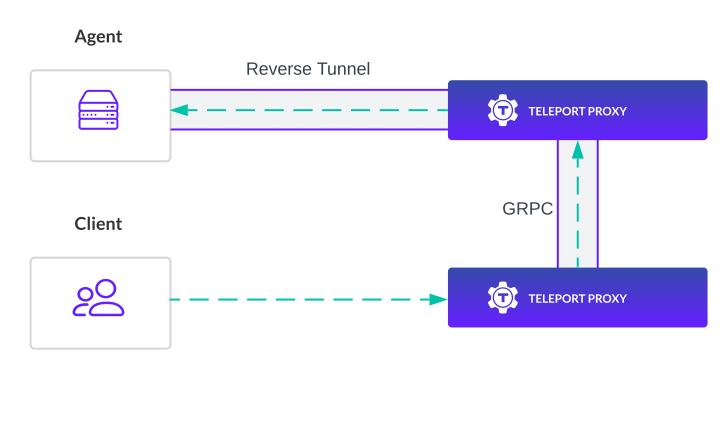

  Proxy Peering is available starting from Teleport `10.0`.

Proxy Peering enables an agent to be reachable without it connecting to every
Teleport Proxy instance. This allows proxies to scale horizontally without
increasing the number of connections created by agents.

Proxy Peering is a type of tunnel strategy configurable in Teleport. A tunnel
strategy defines the behavior for agent reverse tunnel connections as well as
how client are connected to those reverse tunnels. A Teleport cluster's tunnel
strategy is configurable in the Teleport Auth service.

## How it works

### Proxy Service

A GRPC service on each Teleport Proxy instance provides an API for establishing a
bi-directional connection to the agents connected to that Teleport Proxy. Teleport
Proxy instances manage a GRPC client to all other Teleport Proxy instances in the
cluster.

Routing information on which proxies each agent is connected to is stored in
Teleport's backend and propagated to each Teleport Proxy instance.

The routing information and GRPC service allow a Teleport Proxy to identify where
an agent is connected and create an end-to-end connection from a client to that
agent.

### Reverse tunnel agents

Normally Teleport agents need to create a reverse tunnel to every Teleport Proxy
to ensure a client is able to reach the agent. With Proxy Peering this is no
longer a requirement. When Proxy Peering is enabled agents will automatically
change their behavior to connect to the configured number of Teleport Proxy
instances.

By default agents are configured to connect to a single Teleport Proxy instance.
For high availability a cluster administrator may configure agents to connect to
2 or more Teleport Proxy instances.

## Next Steps
- See the [migration guide](../management/operations/proxy-peering.mdx) to learn how to upgrade an existing cluster to use
Proxy Peering