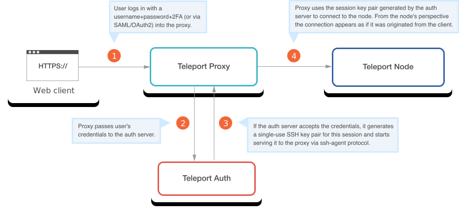
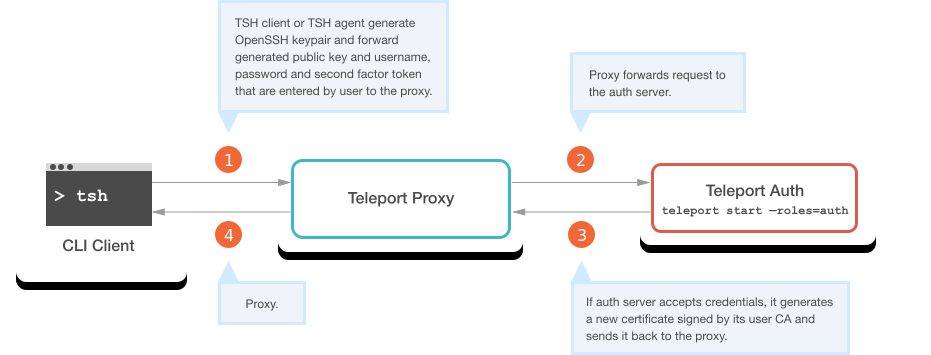
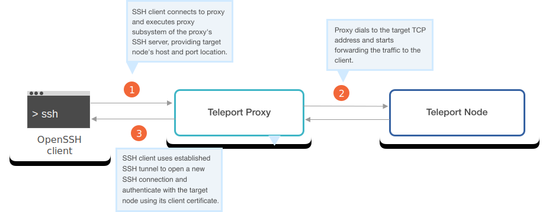

The proxy is a stateless service that performs three main functions in a
Teleport cluster:

1. It serves as an authentication gateway. It asks for credentials from
   connecting clients and forwards them to the Auth server via [Auth
   API](authentication.mdx#auth-api).
2. It looks up the IP address for a requested Node and then proxies a connection
   from client to Node.
3. It serves a Web UI that is used by cluster users to sign up and configure
   their accounts, explore Nodes in a cluster, log into remote Nodes, join
   existing SSH sessions or replay recorded sessions.

## Connecting to a Node

### Web to SSH Proxy

In this mode, Teleport Proxy implements WSS - secure web sockets - to proxy a
client SSH connection:

1. User logs in to Web UI using username and password, and 2nd-factor token if configured (2FA Tokens are not used with SSO providers).
2. Proxy passes credentials to the Auth Server's API
3. If Auth Server accepts credentials, it generates a new web session and generates a special ssh keypair associated with this web session. Auth server
   starts serving [OpenSSH ssh-agent protocol](https://tools.ietf.org/html/draft-miller-ssh-agent-04) to the proxy.
4. The User obtains an SSH session in the Web UI and can interact with the Node on a web-based terminal. From the Node's perspective, it's a regular SSH
   client connection that is authenticated using an OpenSSH certificate, so no special logic is needed.

<Admonition
  type="note"
  title="SSL Encryption"
>
  When using the web UI, the Teleport Proxy terminates SSL traffic and re-encodes data for the SSH client connection.
</Admonition>

### CLI to SSH Proxy

**Getting Client Certificates**

Teleport Proxy implements a special method to let clients get short-lived
authentication certificates signed by the Certificate Authority (CA) provided by
the [Auth Service](authentication.mdx#authentication-in-teleport).

1. A [`tsh` client](../setup/reference/cli.mdx#tsh) generates an OpenSSH key pair. It forwards the generated public key, username, password, and second-factor token to the proxy.
2. The Proxy Service forwards the request to the Auth Service.
3. If Auth Service accepts credentials, it generates a new certificate signed by its user CA and sends it back to the Proxy Server. The certificate has a TTL
   that defaults to 12 hours but can be configured in [`tctl`](../setup/reference/cli.mdx#tctl).
4. The Proxy Server returns the user certificate to the client and the client stores it in `~/.tsh/keys/example.com`. The certificate is also added to the local SSH agent if one is running.

**Using Client Certificates**

Once the client has obtained a certificate, it can use it to authenticate with
any Node in the cluster. Users can use the certificate using a standard OpenSSH
client `ssh` or using `tsh`:

1. A client connects to the Proxy Server and provides target Node's host and port location. There are three lookup mechanisms a proxy uses to find the
   Node's IP address:

   - Use DNS to resolve the name requested by the client.
   - Asks the Auth Service if there is a Node registered with this `nodename`.
   - Asks the Auth Service to find a Node (or Nodes) with a label that matches the requested name.

2. If the Node is located, the Proxy establishes an SSH tunnel to the
   requested Node and starts forwarding traffic from Node to client.

3. The client uses the established SSH tunnel from Proxy to Node to open a new
   SSH connection. The client authenticates with the target Node using its
   client certificate.

<Admonition
  type="tip"
  title="NOTE"
>
  Teleport's proxy command makes it compatible with [SSH jump hosts](https://wiki.gentoo.org/wiki/SSH_jump_host) implemented using OpenSSH's `ProxyCommand`. It also supports OpenSSH's ProxyJump/ssh -J implementation. See [User Manual](../user-manual.mdx#ssh-proxy-configuration).
</Admonition>

## Recording Proxy mode

In this mode, the proxy terminates (decrypts) the SSH connection using the
certificate supplied by the client via SSH agent forwarding and then establishes
its own SSH connection to the final destination server, effectively becoming an
authorized "man in the middle". This allows the proxy server to forward SSH
session data to the auth server to be recorded, as shown below:

The recording proxy mode, although *less secure*, was added to allow Teleport
users to enable session recording for OpenSSH's servers running `sshd`, which is
helpful when gradually transitioning large server fleets to Teleport.

We consider the "recording proxy mode" to be less secure for two reasons:

1. It grants additional privileges to the Teleport proxy. In the default mode,
   the proxy stores no secrets and cannot "see" the decrypted data. This makes a
   proxy less critical to the security of the overall cluster. But if an
   attacker gains physical access to a proxy Node running in the "recording"
   mode, they will be able to see the decrypted traffic and client keys stored in the proxy's process memory.
2. Recording proxy mode requires SSH Agent Forwarding. Agent Forwarding is required because without it, a proxy will not be able to establish the 2nd connection to the destination Node.

However, there are advantages of proxy-based session recording too. When
sessions are recorded at the Nodes, a root user can add iptables rules to
prevent sessions logs from reaching the Auth Service. With sessions recorded at
the proxy, users with root privileges on Nodes have no way of disabling the
audit.

See the [admin guide](../admin-guide.mdx#recorded-sessions) to learn how to turn
on the recording proxy mode. Note that the recording mode is configured on the
Auth Service.

## More concepts

- [Architecture Overview](overview.mdx)
- [Teleport Users](users.mdx)
- [Teleport Auth](authentication.mdx)
- [Teleport Proxy](proxy.mdx)
