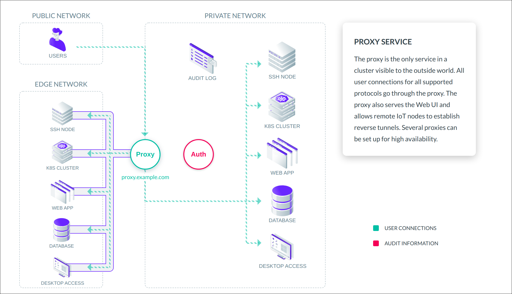
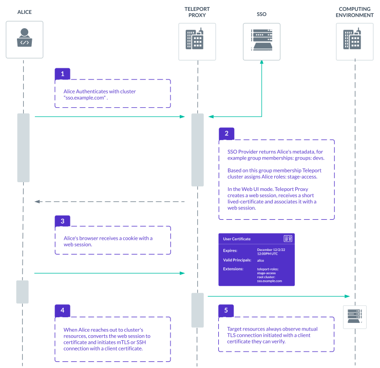
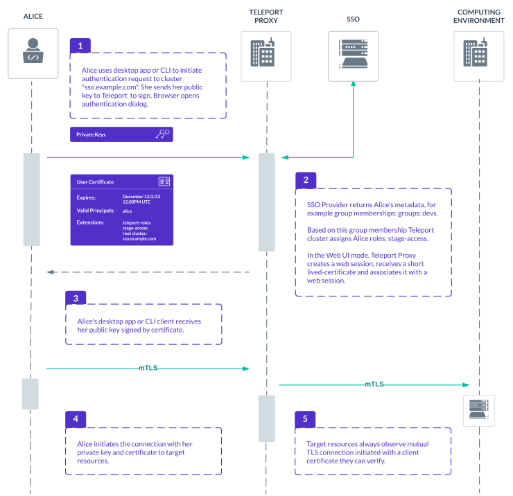
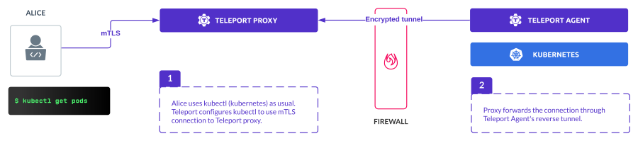

Teleport Proxy is a identity aware proxy, with a web UI. Here are Proxy's key features:

- Users can authenticate with a Single-Sign-On or local credentials to access SSH and Windows Desktops via Proxy's web UI.
- Proxy is identity aware - it makes sure that only authenticated clients can connect to target resources.
It intercepts traffic for multiple protocols - SSH, Kubernetes, HTTPS, databases.
It records commands, API calls and queries and streams them to the audit log.
- Proxy provides networking and connectivity features. Nodes and proxies behind firewalls can connect
to proxies using reverse tunnels. System administrators can use TLS routing feature to compress all ports for all protocols to one TLS port using TLS routing feature.

<Notice type="tip">
To create a minimal Teleport cluster, you have run two services:
Teleport Auth Service and Teleport Proxy Service. For your home lab,
you can run both services as a one binary and process.
</Notice>

## Web UI

In Web UI, Teleport Proxy implements WSS - secure web sockets - to proxy a
target resource, for example SSH server or Desktop:

<Admonition
  type="note"
  title="TLS Encryption"
>
  When using the web UI, the Teleport Proxy terminates traffic and re-encodes data for the client connection.
</Admonition>

## Identity-Aware-Proxy

In IAP mode, users initiate the SSO or login flow to sign public keys on their client machines:

<Admonition
  type="note"
  title="IAP Mode Security"
>
We consider IAP mode more secure than Web UI access, because private keys never leave user's client.
Client's connection to resource is mutually authenticated. This mode is also less vulnerable
for web-related attacks, like CSRF or cookie hijacking, because browser is used less.
</Admonition>

## Tunnels

In this mode, resources behind firewall can establish reverse tunnels back to proxies.
Proxies will forward client's connections to target resources via those tunnels.

In the example below, Alice connects to kubernetes cluster behind firewall via two tunnels:

<Notice type="tip">
All modes above are turned on by default in Proxies. No special configuration is necessary, unless you
want to turn some of those modes off.
</Notice>

## More concepts

- [TLS Routing](tls-routing.mdx)
- [Architecture Overview](../core-concepts.mdx)
- [Teleport Authentication](authentication.mdx)
- [Teleport Authorization](authorization.mdx)
- [Teleport Proxy](proxy.mdx)
