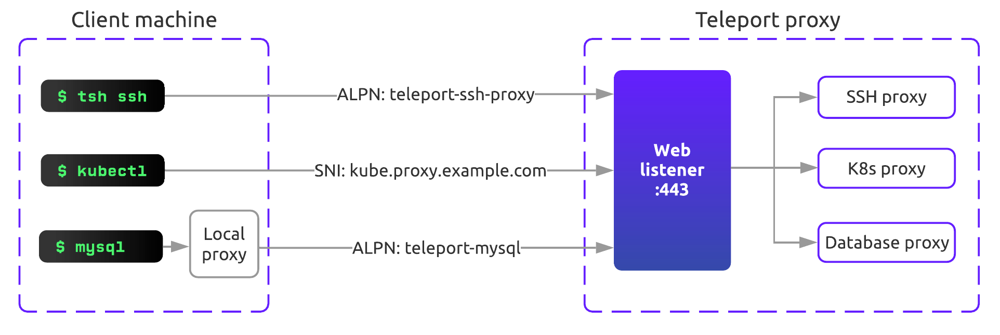
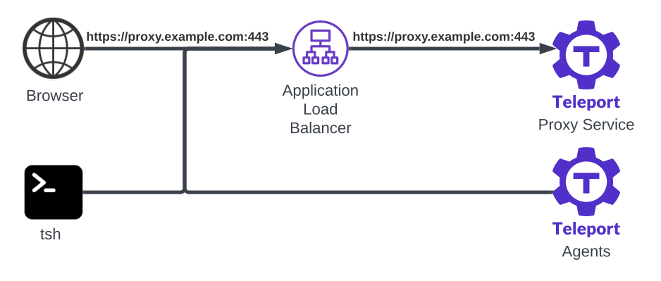
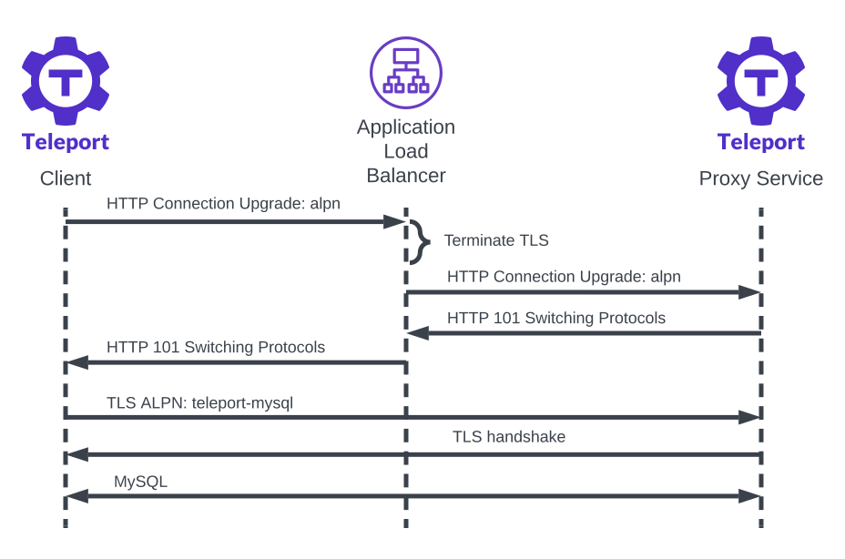

In TLS routing mode [Teleport proxy](./proxy.mdx) multiplexes all client
connections on a single TLS port.

With TLS routing, cluster administrators can simplify network configurations
since proxy only listens on one port. All connections are authenticated with
mutual TLS and users are able to tunnel protocols that may be blocked on the
network such as SSH.

To implement TLS routing, Teleport uses SNI ([Server Name Indication](https://en.wikipedia.org/wiki/Server_Name_Indication))
and ALPN ([Application-Level Protocol Negotiation](https://en.wikipedia.org/wiki/Application-Layer_Protocol_Negotiation))
TLS extensions.

Support for TLS Routing behind layer 7 (HTTP/HTTPS) load balancers and reverse
proxies is available starting from Teleport `13.0`.

## How it works

The Teleport Proxy Service listens for all client connections on its `web_listen_addr` by default:

```yaml
proxy_service:
  web_listen_addr: "0.0.0.0:443"
```

All Teleport clients including SSH, web browser, kubectl, database and reverse
tunnel clients establish a TLS tunnel to the proxy's web port and indicate the
protocol they're requesting using SNI and ALPN TLS extensions.

Upon accepting a new connection, the proxy inspects the SNI/ALPN value in the
TLS handshake and forwards the connection to appropriate backend service.

### Local proxy

Clients like `psql` or `mysql` implement TLS handshake as a part of their
protocol-specific connection negotiation phase (aka [STARTTLS](https://en.wikipedia.org/wiki/Opportunistic_TLS)).

To support these clients, as well as clients that do support TLS but don't allow
setting custom ALPN values, Teleport's `tsh` client includes ability to start
a local TLS routing aware proxy.

Such clients connect to the local proxy instead of Teleport proxy directly. The
local proxy establishes a TLS connection to the Teleport proxy with the proper
SNI/ALPN values set and tunnels the client's connection over it.

In most cases, clients handle TLS routing transparently when establishing
connection. For example, `tsh` client starts local proxy and sets appropriate
SNI/ALPN values automatically. For some clients, like native/GUI database
clients instead of `tsh db connect`, the user needs to start the local proxy so
these clients can connect to it.

### Diagram

<Figure align="left" bordered caption="TLS routing">
  
</Figure>

Let's take a look at how each protocol Teleport supports implements TLS routing.

## SSH

Teleport client `tsh`, when connecting to an SSH node, first dials Teleport
proxy over TLS and requests `teleport-proxy-ssh` ALPN protocol.

No local proxy is started in this case as `tsh` uses this TLS connection as a
transport to establish the SSH connection.

### OpenSSH

To support standard OpenSSH client, Teleport provides a `tsh proxy ssh` command
which can be used as a `ProxyCommand`.

Similarly to `tsh ssh`, `tsh proxy ssh` establishes a TLS tunnel to Teleport
proxy with `teleport-proxy-ssh` ALPN protocol, which `ssh` then connects over.

See the [OpenSSH client](../server-access/openssh/openssh.mdx) guide for details on
how it's configured.

## Reverse tunnels

Reverse tunnel workers within the Teleport SSH, Application, and Database
Services, as well as for trusted clusters, open a TLS tunnel to the cluster's
Proxy Service with the `teleport-reversetunnel` ALPN protocol. The workers then
dial SSH over the tunnel, establishing a secure connection.

## Kubernetes

Kubernetes client `kubectl` uses HTTPS API and TLS handshake to talk to the API
server.

As such, it is not possible to request a custom ALPN protocol using `kubectl`.
Instead, Teleport leverages SNI and sets a `ServerName` prefixed with
`kube-teleport-proxy-alpn.` when generating a kubeconfig file during `tsh kube
login`:

```yaml
apiVersion: v1
kind: Config
clusters:
- cluster:
    certificate-authority-data: ...
    server: https://proxy.example.com:443
    tls-server-name: kube-teleport-proxy-alpn.proxy.example.com
  name: example
```

## Databases

The `tsh db connect` command executes an appropriate database client for the
database you're connecting to.

In TLS routing mode, `tsh` starts a local proxy which database client
connections are tunneled through. The local proxy uses ALPN values like
`teleport-mysql` depending on the database. The proxy is shut down when the
database session ends.

### Native and GUI clients

For the native or graphical database clients to work with TLS routing, they
must be connecting to the local proxy instead of Teleport proxy directly.

Teleport provides a `tsh proxy db` command to launch a local database proxy:

```code
$ tsh proxy db example-db
```

See [GUI clients](../connect-your-client/gui-clients.mdx) guide for a usage
example.

## Web UI, apps and desktops

Application access, desktop access and Teleport web UI are served by the
Teleport proxy's web listener and don't require a local proxy or any special
ALPN/SNI negotiation. These web connections use standard `http1.1` and `h2`
protocols for ALPN.

## Working with layer 7 load balancers or reverse proxies 

Starting from version `13.0`, TLS routing can now be enabled allowing the
Teleport Proxy Service to serve a single port behind a layer 7 load balancer or
reverse proxy.



It is expected that the layer 7 load balancer or reverse proxy will terminate
TLS with a public certificate, such as using ACM for AWS ALB. This means that
the Proxy Service does not require a Web TLS certificate using `http_keypair`
or `acme`.

Teleport clients automatically detect whether the Teleport Proxy Service is
behind a layer 7 load balancer or a reverse proxy. In such cases, the client
initiates a connection upgrade and then sends the TLS routing request through
the upgraded connection.

The initial client implementation sends a Teleport-custom upgrade 'alpn', which
uses the same connection upgrade principle as WebSockets. Starting from version
15.1, Teleport clients will send native WebSocket upgrades to extend its
compatibility with more load balancers and reverse proxies.



Non-Teleport clients should require local proxies that can perform the
special connection upgrades.

Let's take a closer look at how each protocol functions in this configuration.

### SSH

When transporting the SSH protocol over TLS routing, `tsh` make connection
upgrades seamlessly. This is applicable to `tsh ssh/scp` commands, as well as
`tsh proxy ssh` when connected via `ProxyCommand` using OpenSSH clients.

### Kubernetes

The `tsh proxy kube` command creates a local proxy and an ephemeral kubeconfig
for Kubernetes clients like `kubectl`. The local proxy generates a self-signed
certificate to secure local communications with the Kubernetes clients.

When forwarding the requests to the Proxy Service, the local proxy performs
necessary connection upgrades and sets the required SNI for the TLS handshake.

The `tsh kubectl` and `tsh kube exec` commands also start a local proxy
automatically when connection upgrades are required.

### Databases

In TLS routing mode, `tsh db connect` starts a local proxy which database
client connection is tunneled through. The local proxy initiates a connection
to the Proxy Service with the connection upgrade then uses database specific
ALPN values for the TLS handshake.

Similarly, native and GUI clients can connect through `tsh proxy db` which
starts a local proxy that handles the connection upgrades.

### Web UI and Desktops

The Teleport Web UI is fully functional with standard browsers, without any
special ALPN/SNI values or connection upgrades.

### Apps

For both HTTP and TCP apps, `tsh proxy app` can launch a local proxy that
handles the connection upgrades and sets appropriate ALPN value for TLS
routing.

`tsh` CLI commands for accessing Cloud APIs, e.g., `tsh aws`, transparently
start a local proxy that performs connection upgrades for TLS routing. To start
local proxies for native applications, you can use `tsh proxy aws`.

### Client source IPs

When `proxy_service.trust_x_forwarded_for` is set to `true`, the Proxy service
will take the client source IPs from the "X-Forwarded-For" headers set by the
load balancer or the reverse proxy. This also applies to TLS routing requests
that utilize connection upgrades, since they are essentially HTTP requests.

To prevent IP spoofing, only a single IP address is expected in the
"X-Forwarded-For" headers per request. Any requests with multiple IP addresses
will be rejected.

## FAQ

### Does TLS routing work behind a layer 4 load balancer that terminates TLS?

Yes. When the Teleport Proxy Service is behind a layer 4 load balancer that
terminates TLS, Teleport clients handle the situation similarly to when a layer
7 load balancer is present, performing the connection upgrades.

Note that the load balancer must forward the TLS layer to the Teleport Proxy
Service. For example, an AWS Network Load Balancer (NLB) must use "TLS"
protocol for the target group.

### Will TLS routing work behind my reverse proxy?

Starting version 15.1, TLS routing is compatible with any reverse proxies that
supports WebSocket.

For Teleport version before 15.1, the reverse proxy must support custom
[connection
upgrades](https://developer.mozilla.org/en-US/docs/Web/HTTP/Headers/Upgrade)
and long-lived connections.

You can set up a Teleport Proxy Service behind the reverse proxy and run the
following command to test the connection:
```code
$ curl -v https://<Var name="teleport.example.com" />/webapi/connectionupgrade -H "Connection: Upgrade" -H "Upgrade: alpn-ping" --no-alpn
```

For a successful upgrade, the server should return "101 Switching Protocols"
with the requested upgrade type and you should also get some binary output in
about 30 seconds running the `curl` command:
```
< HTTP/1.1 101 Switching Protocols
< Connection: Upgrade
< Upgrade: alpn-ping
< X-Teleport-Upgrade: alpn-ping
<
Warning: Binary output can mess up your terminal.
```

### How can I access Kubernetes clusters without using `tsh proxy kube`?

Local proxies are required when the Teleport Proxy Service is behind layer 7
load balancers or reverse proxies.

One alternative to `tsh proxy kube` is to use `tsh kubectl` which starts a
local proxy automatically when connection upgrades are required.

To completely avoid local proxies, either use layer 4 load balancers in TCP
mode instead of layer 7 load balancers, or configure your Teleport Proxy
Service in `separate` port mode and use a separate Kubernetes port that is not
behind layer 7 load balancers.

## Next steps

- See [migration guide](../management/operations/tls-routing.mdx) to learn how to
  upgrade an existing cluster to use TLS routing.
- Read through TLS routing design document [RFD](https://github.com/gravitational/teleport/blob/master/rfd/0039-sni-alpn-teleport-proxy-routing.md).
