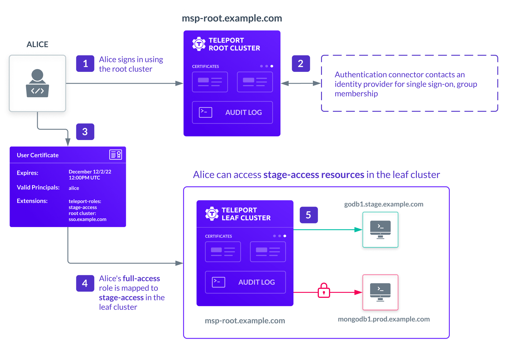

Teleport can partition compute infrastructure into multiple clusters. A cluster
is a group of Teleport connected resources. Each cluster
manages a set of certificate authorities (CAs) for its users and resources.

Trusted clusters allow the users of one cluster, the **root cluster**, to
seamlessly SSH into the Nodes of another cluster, the **leaf cluster**, while
remaining authenticated with only a single Auth Service. The leaf cluster can
be running behind a firewall without any ingress ports open.

Uses for trusted clusters include:

- Managed service providers (MSP) remotely managing the infrastructure of their clients.
- Device manufacturers remotely maintaining computing appliances deployed on premises.
- Large cloud software vendors managing multiple data centers.

Individual nodes and proxies can create reverse tunnels to proxy services without creating a new cluster.
You don't need to set up a trusted cluster just to connect servers, kubernetes clusters, or
databases behind a firewall. You don't need to use trusted clusters unless you have
large, distributed infrastructure or your organization works with external agencies or contractors who
need separate access.

In many cases, a single cluster is enough and can scale to hundreds of thousands
of connected resources.

## Multi-cluster data centers

In the following example, a managed service provider uses three independent clusters to 
provide access to clients in different regions:

- Cluster `msp-root.example.com` is the root cluster. This cluster might have its own resources or be 
strictly used for collecting audit logs and authenticating users.
- Clusters `leaf-east.example.com` and `leaf-west.example.com` are two independent leaf clusters to service 
clients in different regions.
- Each cluster is an independent x.509 and SSH certificate authority and can operate autonomously.
- Each leaf cluster dials back to the root cluster to establish a reverse tunnel. If you have multiple 
proxies, you have multiple tunnels for high availability.

The following diagram provides a simplified view of the architecture:

## Using a load balancer with trusted clusters

The leaf cluster establishes a reverse tunnel to the root cluster even if the
root cluster uses multiple proxies behind a load balancer (LB) or a DNS entry
with multiple values. In this case, the leaf cluster establishes a tunnel to
*every* proxy in the root cluster.

This requires that the load balancer use a round-robin or a similar balancing algorithm.
Don't use *sticky* load balancing algorithms—such as session affinity or sticky sessions
with Teleport proxies.

## Role mapping

Leaf clusters are autonomous. They have their own state, roles, and local users. 
This autonomy enables leaf cluster administrators to decide how to map the identity of the 
external users to their local cluster roles. 
The following diagram provides a simplified view of how role mapping works using the same trusted
cluster with `msp-root.example.com` as the root cluster and `leaf-east.example.com` as the leaf cluster:

### How role mapping works

In this example, the user Alice signs in to the `msp-root.example.com` root cluster. The root cluster is
configured with a single sign-on identity provider that authenticates her identity and her group membership.
Based on the information from the identity provider, the root cluster assigns Alice the `full-access` role
and issues her a certificate. The mapping of single sign-on properties to Teleport roles is configured when
you add an authentication connector to the Teleport cluster. To learn more about configuring single sign-on
through an external identity provider, see [Configure Single Sign-on](../access-controls/sso).

Alice receives the certificate that specifies the roles assigned to her in the root cluster. This metadata
about her roles is contained in the certificate extensions and is protected by the signature of the root 
cluster certificate authority so it can't be tampered with.

When Alice connects to a resource in the leaf cluster `leaf-east.example.com`, she's identified as an external user
with a certificate signed by an external certificate authority. Based on the role mapping rules in the leaf
cluster, Alice is assigned the `stage-access` role. This role allows her to access `mongodb.stage.example.com`
but not `mongodb.prod.example.com`.

In this example, the leaf cluster `leaf-east.example.com` denies Alice access to the 
`mongodb.prod.leaf-east.example.com` resource because her `full-access` role in the root cluster 
is mapped to the `stage-access` role in this leaf cluster.
With role mapping, leaf cluster administrators can control the privileges external users are granted.
Although role mapping can be as simple as assigning users to the same roles in the root and leaf clusters,
you can also use mapping to downgrade a user's privileges or restrict access to specific resources.

### Role mapping and labels

You should note that you can use a certificate issued for a root cluster to connect directly 
to a leaf cluster because the leaf cluster inherently trusts the root cluster. In most cases, 
the trust relationship between the root and leaf clusters provides the desired behavior. 

However, this trust relationship can also be exploited if you use cluster labels to enforce authorization 
restrictions. Because the leaf cluster trusts the certificate authority of the root cluster, that certificate 
can be used to bypass any leaf-specific cluster labels that are intended to restrict access to the leaf cluster. 
Because of the potential security vulnerability, you should use role mapping as the primary way to restrict access 
to leaf clusters and use `cluster_labels` for filtering and limiting the visibility of leaf cluster resources.

## Next steps

For information about how to set up a trusted cluster, see [Configure Trusted Clusters](../management/admin/trustedclusters.mdx).