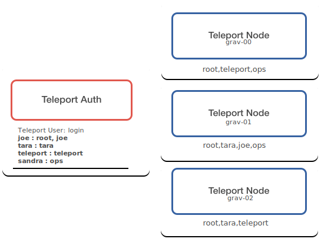

{
  /* TODO: This doc is incomplete, pending addition of Enterprise topics */
}

## Types of Users

Unlike traditional SSH, Teleport introduces the concept of a User Account. A
User Account is not the same as SSH login. Instead each Teleport User is
associated with another account which is used to authenticate the user.

For community edition users, these will be OS users which are administered
outside of Teleport on each cluster node. For example, there can be a Teleport
user "joe" who can be given permission to login as "root" to a specific subset
of nodes. Another user "juliet" could be given permission to OS users "root" and
to "nginx". Teleport does not have knowledge of the OS Users so it expects both
"root" and "nginx" to exist on the node.

For enterprise edition users, these can be stored in an external identity
sources such as OKTA, Active Directory, OneLogin, G Suite, or OIDC. Read the
[Enterprise Guide](../enterprise/introduction.mdx) to learn more.

Teleport supports two types of user accounts: **Local Users** and
**External Users**.

### Local users

Local users are created and stored in Teleport's own identity storage in the
Auth Server.

Let's look at this table:

| Teleport User | Allowed OS Logins | Description |
| - | - | - |
| joe | joe, root | Teleport user 'joe' can login into member nodes as OS user 'joe' or 'root' |
| juliet | juliet | Teleport user 'juliet' can login into member nodes only as OS user 'juliet' |
| ross | | If no OS login is specified, it defaults to the same name as the Teleport user, here this is "ross". |

To add a new user to Teleport, you have to use the `tctl` tool on the same node
where the auth server is running, i.e. `teleport` was started with
`--roles=auth` .

A cluster administrator must create account entries for every Teleport user with
[`tctl users add`](../cli-docs.mdx). Every Teleport User must be associated with a
list of one or more machine-level OS usernames it can authenticate as during a
login. This list is called "user mappings".

The diagram shows the following mappings. A couple of noteworthy things
from this example:

- Teleport User `sandra` does **not** have access to `grav-02`
  through Teleport because `ops` is not an OS username on that node.
- Teleport User `joe` has access to all nodes because the OS user `root`
  is present on all nodes.

| Teleport User | logins | has access to nodes |
| - | - | - |
| joe | root, joe | grav-00, grav-01, grav-02 |
| tara | tara | grav-01, grav-02 |
| teleport | teleport | grav-00, grav-02 |
| sandra | ops | grav-00, grav-01 |

Teleport supports second factor authentication (2FA) when using a local auth
connector and it is enforced by default.

<Admonition
  type="tip"
  title="2FA Support"
>
  2FA is not supported with SSO providers such as Github or OKTA. To learn
  more about SSO configuration check out the [SSO section of the Enterprise
  Guide](../enterprise/introduction.mdx#sso)
</Admonition>

There are two types of 2FA supported:

- [TOTP - e.g. Google Authenticator](https://en.wikipedia.org/wiki/Time-based_One-time_Password_Algorithm)
- [U2F - e.g. YubiKey](https://en.wikipedia.org/wiki/Universal_2nd_Factor)

  `TOTP` is the default. You can use [Google
  Authenticator](https://en.wikipedia.org/wiki/Google_Authenticator) or
  [Authy](https://www.authy.com/) or any other TOTP client.

### External users

{
  /* TODO: Production topic */
}

External users are users stored elsewhere within an organization. Examples
include Github, Active Directory (AD), OIDC, or any identity store with an
OpenID/OAuth2 or SAML endpoint.

<Admonition
  type="tip"
  title="Version Warning"
>
  External user storage is only supported in Teleport
  Enterprise. Please take a look at the [Teleport
  Enterprise](../enterprise/introduction.mdx) chapter for more information.
</Admonition>

#### Multiple Identity Sources

It is possible to have multiple identity sources configured for a Teleport
cluster. In this case, an identity source (called a "connector") will have to be
passed to [`tsh --auth=connector_name login`](../cli-docs.mdx#tsh-login).

{
  /* TODO: Production Configuration */
}

The local users connector can be specified via [`tsh --auth=local
login`](../cli-docs.mdx#tsh-login).

## User Roles

Unlike traditional SSH, each Teleport user account is assigned a `role` . Having
roles allows Teleport to implement role-based access control (RBAC), i.e. assign
users to groups (roles) and restrict each role to a subset of actions on a
subset of nodes in a cluster.

{
  /* TODO: Enterprise Topic */
}

## More Concepts

- [Architecture Overview](overview.mdx)
- [Teleport Auth](authentication.mdx)
- [Teleport Nodes](nodes.mdx)
- [Teleport Proxy](proxy.mdx)
