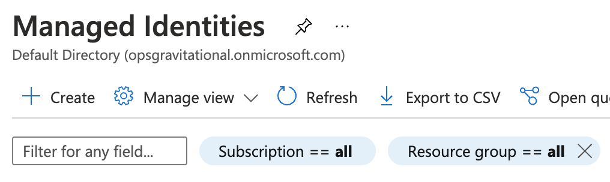
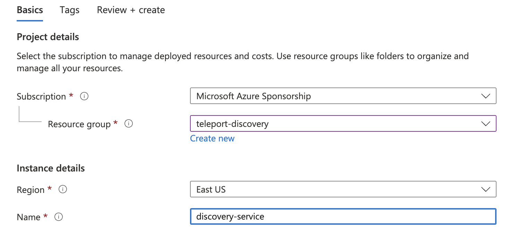
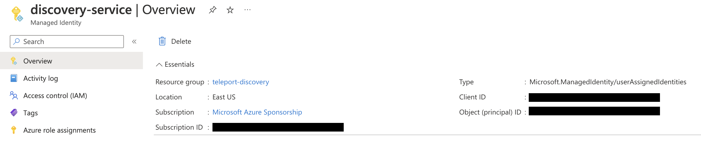
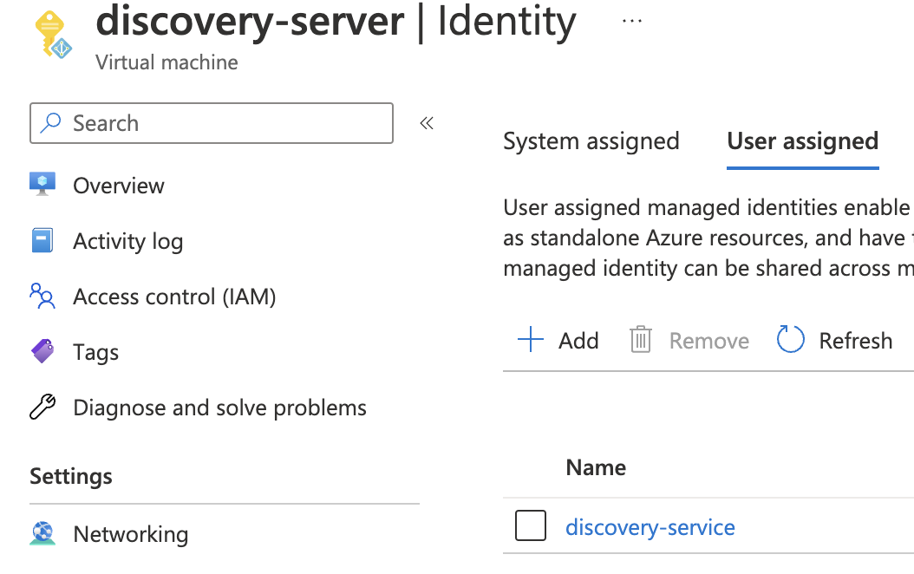
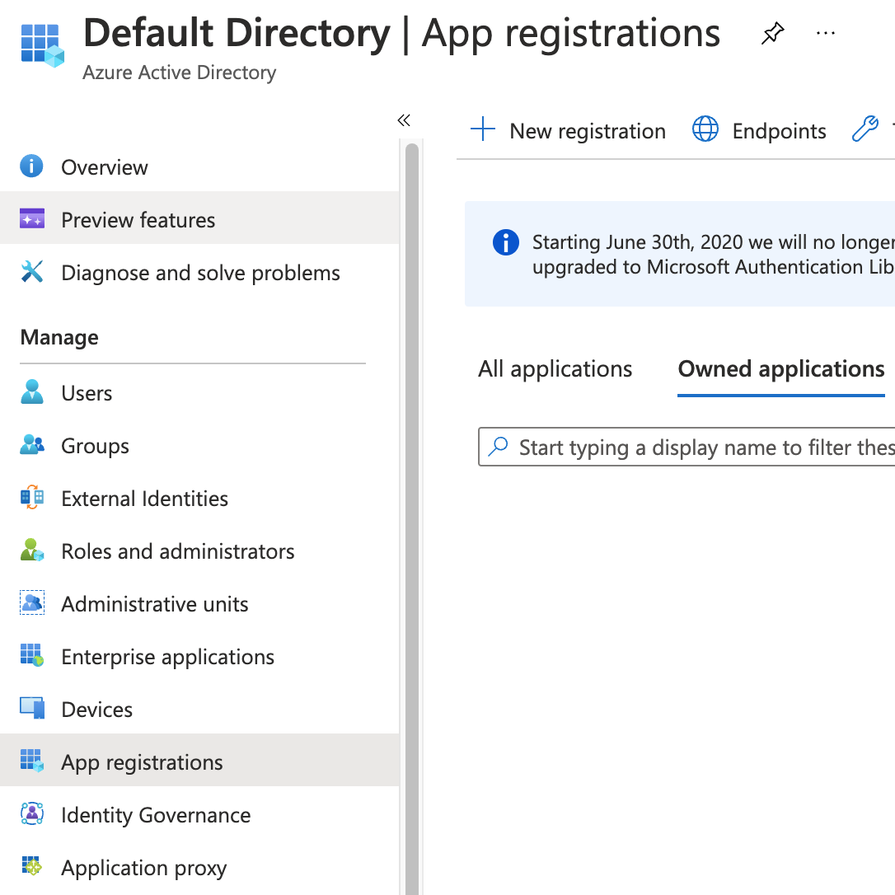
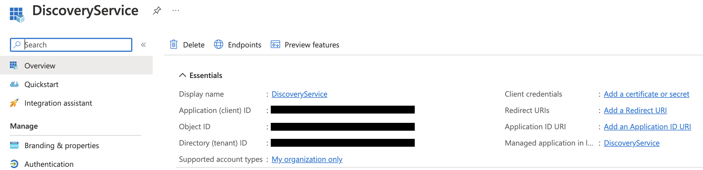
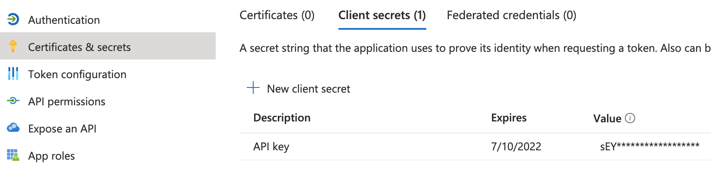
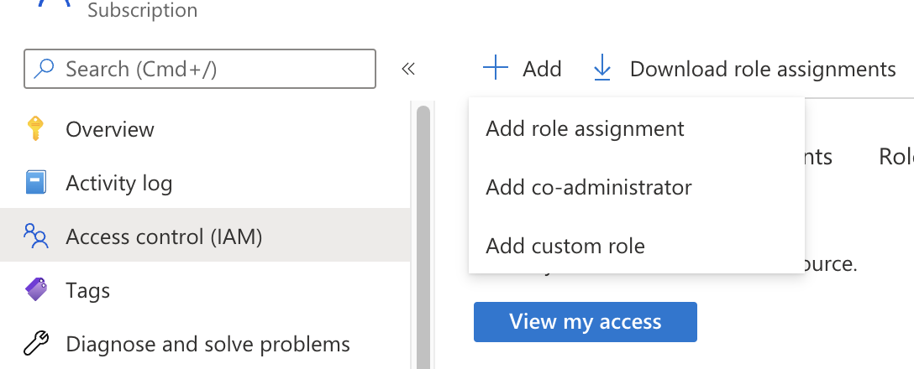
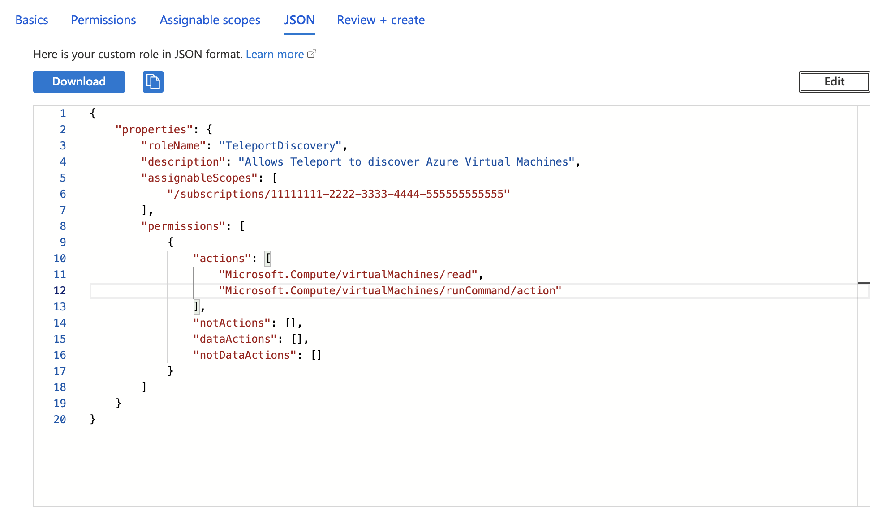

The Teleport Discovery Service can connect to Azure and automatically
discover and enroll virtual machines matching configured labels. It will then
execute a script on these discovered instances that will install Teleport,
start it and join the cluster.

## Prerequisites

(!docs/pages/includes/edition-prereqs-tabs.mdx!)

- Azure subscription with virtual machines and permissions to create and attach
managed identities.
- Azure virtual machines to join the Teleport cluster, running
Ubuntu/Debian/RHEL if making use of the default Teleport install script. (For
other Linux distributions, you can install Teleport manually.)
- (!docs/pages/includes/tctl.mdx!)

## Step 1/6. Create an Azure invite token

When discovering Azure virtual machines, Teleport makes use of Azure invite tokens for
authenticating joining SSH Service instances.

Create a file called `token.yaml`:

```yaml
# token.yaml
kind: token
version: v2
metadata:
  # the token name is not a secret because instances must prove that they are
  # running in your Azure subscription to use this token
  name: azure-discovery-token
  # set a long expiry time, as the default for tokens is only 30 minutes
  expires: "3000-01-01T00:00:00Z"
spec:
  # use the minimal set of roles required
  roles: [Node]

  # set the join method allowed for this token
  join_method: azure

  azure:
    allow:
    # specify the Azure subscription which Nodes may join from
    - subscription: "123456789"
```

Assign the `subscription` field to your Azure subscription ID.
Add the token to the Teleport cluster with:

```code
$ tctl create -f token.yaml
```

## Step 2/6. Configure IAM permissions for Teleport

The Teleport Discovery Service needs Azure IAM permissions to discover and register Azure virtual machines.

### Configure an Azure service principal

There are a couple of ways for the Teleport Discovery Service to access Azure
resources:

- The Discovery Service can run on an Azure VM with attached managed identity. This
  is the recommended way of deploying the Discovery Service in production since
  it eliminates the need to manage Azure credentials.
- The Discovery Service can be registered as an Azure AD application (via AD's "App
  registrations") and configured with its credentials. This is only recommended
  for development and testing purposes since it requires Azure credentials to
  be present in the Discovery Service's environment.

<Tabs>
<TabItem label="Using managed identity">
  Go to the [Managed Identities](https://portal.azure.com/#blade/HubsExtension/BrowseResource/resourceType/Microsoft.ManagedIdentity%2FuserAssignedIdentities)
  page in your Azure portal and click *Create* to create a new user-assigned
  managed identity:

  

  Pick a name and resource group for the new identity and create it:

  

  Take note of the created identity's *Client ID*:

  

  Next, navigate to the Azure VM that will run your Discovery Service instance and
  add the identity you've just created to it:

  

  Attach this identity to all Azure VMs that will be running the Discovery
  Service.
</TabItem>
<TabItem label="Using app registrations">
  <Admonition type="note">
    Registering the Discovery Service as Azure AD application is suitable for
    test and development scenarios, or if your Discovery Service does not run on
    an Azure VM. For production scenarios prefer to use the managed identity
    approach.
  </Admonition>

  Go the the [App registrations](https://portal.azure.com/#blade/Microsoft_AAD_IAM/ActiveDirectoryMenuBlade/RegisteredApps)
  page of your Azure Active Directory and click on *New registration*:

  

  Pick a name (e.g. *DiscoveryService*) and register a new application. Once the
  app has been created, take note of its *Application (client) ID* and click on
  *Add a certificate or secret*:

  

  Create a new client secret that the Discovery Service agent will use to
  authenticate with the Azure API:

  

  The Teleport Discovery Service uses Azure SDK's default credential provider chain to
  look for credentials. Refer to [Azure SDK Authorization](https://docs.microsoft.com/en-us/azure/developer/go/azure-sdk-authorization)
  to pick a method suitable for your use-case. For example, to use
  environment-based authentication with a client secret, the Discovery Service should
  have the following environment variables set:

  ```text
  export AZURE_TENANT_ID=
  export AZURE_CLIENT_ID=
  export AZURE_CLIENT_SECRET=
  ```
</TabItem>
</Tabs>

### Create a custom role

Teleport requires the following permissions to discover and enroll Azure VMs:

- `Microsoft.Compute/virtualMachines/read`
- `Microsoft.Compute/virtualMachines/runCommand/action`
- `Microsoft.Compute/virtualMachines/runCommands/write`
- `Microsoft.Compute/virtualMachines/runCommands/read`
- `Microsoft.Compute/virtualMachines/runCommands/delete`

Here is a sample role definition allowing Teleport to read and run commands on Azure
virtual machines:
```json
{
    "properties": {
        "roleName": "TeleportDiscovery",
        "description": "Allows Teleport to discover Azure virtual machines",
        "assignableScopes": [
            "/subscriptions/11111111-2222-3333-4444-555555555555"
        ],
        "permissions": [
            {
                "actions": [
                    "Microsoft.Compute/virtualMachines/read",
                    "Microsoft.Compute/virtualMachines/runCommand/action",
                    "Microsoft.Compute/virtualMachines/runCommands/write",
                    "Microsoft.Compute/virtualMachines/runCommands/read",
                    "Microsoft.Compute/virtualMachines/runCommands/delete"
                ],
                "notActions": [],
                "dataActions": [],
                "notDataActions": []
            }
        ]
    }
}
```
The `assignableScopes` field above includes a subscription
`/subscriptions/<subscription>`, allowing the role to be assigned at any
resource scope within that subscription or the subscription scope itself. If
you want to further limit the `assignableScopes`, you can use a resource group
`/subscriptions/<subscription>/resourceGroups/<group>` or a management group
`/providers/Microsoft.Management/managementGroups/<group>` instead.

Now go to the [Subscriptions](https://portal.azure.com/#view/Microsoft_Azure_Billing/SubscriptionsBlade) page and select a subscription.

Click on *Access control (IAM)* in the subscription and select *Add > Add custom role*:
<Figure align="left">

</Figure>

In the custom role creation page, click the *JSON* tab and click *Edit*, then paste the JSON example
and replace the subscription in `assignableScopes` with your own subscription id:
<Figure align="left">

</Figure>

### Create a role assignment for the Teleport Discovery Service principal

(!docs/pages/includes/server-access/azure-assign-service-principal.mdx!)

## Step 3/6. Set up managed identities for discovered nodes

Every Azure VM to be discovered must have a managed identity assigned to it
with at least the `Microsoft.Compute/virtualMachines/read` permission.

(!docs/pages/includes/server-access/azure-join-managed-identity.mdx!)

If the VMs to be discovered have more than one managed identity assigned to
them, save the client ID of the identity you just created for step 5.

## Step 4/6. Install the Teleport Discovery Service

<Admonition type="tip">

If you plan on running the Discovery Service on a host that is already running
another Teleport service (Auth or Proxy, for example), you can skip this step.

</Admonition>

Install Teleport on the virtual machine that will run the Discovery Service:

(!docs/pages/includes/install-linux.mdx!)

## Step 5/6. Configure Teleport to discover Azure instances

If you are running the Discovery Service on its own host, the service requires a
valid invite token to connect to the cluster. Generate one by running the
following command against your Teleport Auth Service:

```code
$ tctl tokens add --type=discovery
```

Save the generated token in `/tmp/token` on the virtual machine that will run
the Discovery Service.

In order to enable Azure instance discovery the `discovery_service.azure` section
of `teleport.yaml` must include at least one entry:

```yaml
version: v3
teleport:
  join_params:
    token_name: "/tmp/token"
    method: token
  proxy_server: "<Var name="teleport.example.com" />:443"
auth_service:
  enabled: off
proxy_service:
  enabled: off
ssh_service:
  enabled: off
discovery_service:
  enabled: "yes"
  azure:
    - types: ["vm"]
      subscriptions: ["<subscription>"]
      resource_groups: ["<resource-group>"]
      regions: ["<region>"]
      tags:
        "env": "prod" # Match virtual machines where tag:env=prod
      install:
        azure:
          # Optional: If the VMs to discover have more than one managed
          # identity assigned to them, set the client ID here to the client
          # ID of the identity created in step 3.
          client_id: "<client-id>"
```

- Edit the `teleport.auth_servers` key to match your Auth Service or Proxy Service's URI
  and port.
- Adjust the keys under `discovery_service.azure` to match your Azure environment,
  specifically the regions and tags you want to associate with the Discovery
  Service.

## Step 6/6. [Optional] Customize the default installer script

(!docs/pages/includes/server-access/custom-installer.mdx cloud="Azure" matcher="azure" matchTypes="[\"vm\"]"!)

If `client_id` is set in the Discovery Service config, custom installers will
also have the `{{ .AzureClientID }}` templating option.

## Troubleshooting

### No credential providers error

If you see the error `DefaultAzureCredential: failed to acquire a token.` in Discovery Service logs then Teleport
is not detecting the required credentials to connect to the Azure SDK. Check whether
the credentials have been applied in the machine running the Teleport Discovery Service and restart
the Teleport Discovery Service.
Refer to [Azure SDK Authorization](https://docs.microsoft.com/en-us/azure/developer/go/azure-sdk-authorization)
for more information.

### Teleport reports no error but VM does not join

Check your Discovery Service config and make sure that the VM you want to
discover matches. In debug mode, Teleport will log the Subscription IDs and
names of VMs it discovers.

The Azure run command API does not report the output of commands,
so Teleport has no way of knowing if a command succeeded or failed. Run command
logs can be found on the targeted VM at
`/var/log/azure/run-command-handler/handler.log`.

## Next steps

- Read [Joining Nodes via Azure Managed Identity](../../agents/join-services-to-your-cluster/azure.mdx)
  for more information on Azure tokens.
- Full documentation on Azure discovery configuration can be found through the [
  config file reference documentation](../../reference/config.mdx).
- The complete default installer can be found [with the Teleport source
](https://github.com/gravitational/teleport/blob/branch/v(=teleport.major_version=)/api/types/installers/installer.sh.tmpl).
