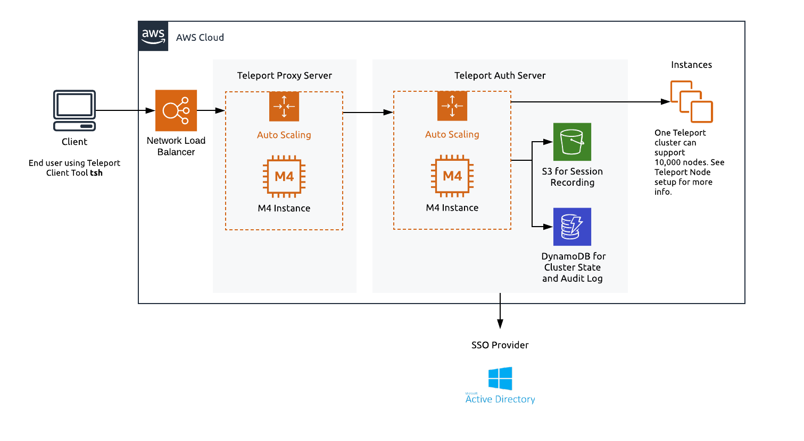
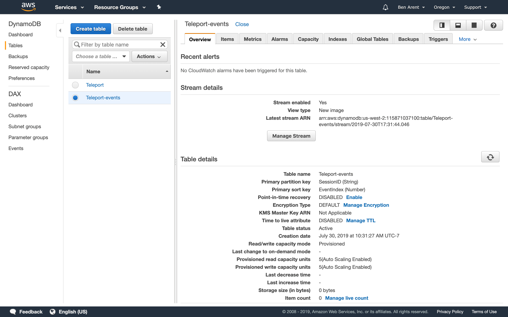
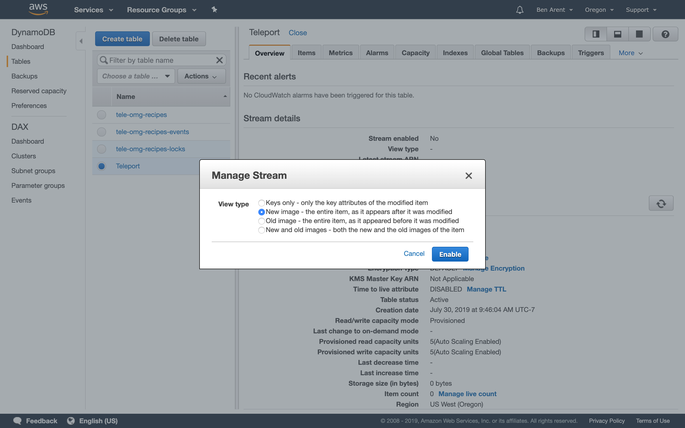

We've created this guide to give customers a high level overview of how to use Teleport
on Amazon Web Services (AWS). This guide provides a high level introduction leading to
a deep dive into how to setup and run Teleport in production.

We have split this guide into:

- [Teleport on AWS FAQ](#teleport-on-aws-faq)
- [Authenticating to EKS Using GitHub Credentials with Teleport Open Source Edition](#using-teleport-with-eks)
- [Setting up Teleport Enterprise on AWS](#running-teleport-enterprise-on-aws)
- [Teleport AWS Tips & Tricks](#teleport-aws-tips--tricks)
- [AWS High Availability with Terraform](aws-terraform-guide.mdx)

### Teleport on AWS FAQ

**Why would you want to use Teleport with AWS?**

At some point you'll want to log into the system using SSH
to help test, debug and troubleshoot a problem box. For EC2, AWS recommends creating
['Key Pairs'](https://docs.aws.amazon.com/AWSEC2/latest/UserGuide/ec2-key-pairs.html)
and has a range of [other tips for securing EC2 instances](https://aws.amazon.com/articles/tips-for-securing-your-ec2-instance/).

This approach has a number of limitations:

1. As your organization grows, keeping track of end users' public/private keys becomes
   an administrative nightmare.
2. Using SSH public/private keys has a number of limitations. Read why [SSH Certificates are better](https://gravitational.com/blog/ssh-key-management/).
3. Once a machine has been bootstrapped with SSH Keys, there isn't an easy way to
   add new keys and delegate access.

**Which Services can I use Teleport with?**

You can use Teleport for all the services that you would SSH into. This guide is focused
on EC2. We have a short blog post on using Teleport with [EKS](https://gravitational.com/blog/teleport-aws-eks/). We plan to expand the guide based on feedback but will plan to add instructions
for the below.

- RDS
- Detailed EKS
- Lightsail
- Fargate
- AWS ECS

## Teleport Introduction

This guide will cover how to setup, configure and run Teleport on [AWS](https://aws.amazon.com/).

### AWS Services required to run Teleport in High Availability

- [EC2 / Autoscale](#ec2--autoscale)
- [DynamoDB](#dynamodb)
- [S3](#s3)
- [Route53](#route53)
- [NLB](#nlb-network-load-balancer)
- [IAM](#iam)
- [ACM](#acm)
- [SSM](#aws-systems-manager-parameter-store)

We recommend setting up Teleport in High Availability mode. In High Availability mode DynamoDB
stores the state of the system and S3 will store audit logs.



### EC2 / Autoscale

To run Teleport in a High Availability configuration we recommend using m4.large instances. It's best practice to separate the proxy and authentication server, using autoscaling groups for both machines. We have pre-built AMIs for both Teleport OSS and Enterprise editions.

### DynamoDB

DynamoDB is a key-value and document database that delivers single-digit millisecond
performance at any scale. For large clusters you can provision usage but for smaller
deployments you can leverage DynamoDB's autoscaling.

Teleport 4.0+ leverages [DynamoDB's streaming feature](https://github.com/gravitational/teleport/issues/2430). When turning this on, you'll need
to specify `New Image` from the streaming options. DynamoDB back-end supports two
types of Teleport data:

- Cluster state
- Cluster events

See [DynamoDB Admin Guide for more information](admin-guide.mdx#using-dynamodb)



Setting Stream to `NEW IMAGE`

For maintainability and ease of use, we recommend following our [Terraform example](https://github.com/gravitational/teleport/blob/master/examples/aws/terraform/ha-autoscale-cluster/dynamo.tf)
but below are high level definitions for the tables required to run Teleport.

DynamoDB Table A - Teleport Cluster State:

| Table name | teleport-cluster-name |
| - | - |
| Primary partition key | HashKey (String) |
| Primary sort key | FullPath (String) |

DynamoDB Table B - Teleport Cluster Events:

| Table name | teleport-cluster-name-events |
| - | - |
| Primary partition key | SessionID (String) |
| Primary sort key | EventIndex (Number) |

| Indexes - `timesearch` | teleport-cluster-name-events |
| - | - |
| Primary partition key | EventNamespace (String) |
| Primary sort key | CreatedAt (Number) |
| Attributes | ALL |

### S3

Amazon Simple Storage Service (Amazon S3) is an object storage service that offers
industry-leading scalability, data availability, security, and performance. In this
Teleport setup, S3 will provide storage for recorded sessions.

We recommend using Amazon S3 Standard.

<Admonition
  type="tip"
  title="Tip"
>
  S3 provides [Amazon S3 Object Lock](https://docs.aws.amazon.com/AmazonS3/latest/dev/object-lock.html),
  which is useful for customers deploying Teleport in regulated environments.
</Admonition>

### Route53

Route53 is a highly available Domain Name System (DNS) provided by AWS. It'll be
needed to setup a URL for the proxy - we recommend using a subdomain.

e.g. `teleport.acmeinc.com`

### NLB: Network Load Balancer

AWS provides many different load balancers. To setup Teleport, we recommend
using a Network Load Balancer.  Network Load Balancers provides TLS for the Teleport
proxy and provides the TCP connections needed for Teleport proxy SSH connections.

### IAM

IAM is the recommended tool for creating service access. This guide will follow the
best practice of principle of least privilege (PoLP).

#### IAM for Amazon S3

In order to grant an IAM user in your AWS account access to one of your buckets, `example.s3.bucket` you will need to grant the following permissions: `s3:ListBucket`, `s3:ListBucketVersions`, `s3:PutObject`, `s3:GetObject`, `s3:GetObjectVersion`

An example policy is shown below:

```json
{
    "Version": "2012-10-17",
    "Statement": [
        {
            "Sid": "ClusterSessionsStorage",
            "Effect": "Allow",
            "Action": [
                "s3:PutEncryptionConfiguration",
                "s3:PutObject",
                "s3:GetObject",
                "s3:GetEncryptionConfiguration",
                "s3:GetObjectRetention",
                "s3:ListBucketVersions",
                "s3:CreateBucket",
                "s3:ListBucket",
                "s3:GetBucketVersioning",
                "s3:PutBucketVersioning",
                "s3:GetObjectVersion"
            ],
            "Resource": [
                "arn:aws:s3:::<bucket_name>/*",
                "arn:aws:s3:::<bucket_name>"
            ]
        }
    ]
}

```

<Admonition
  type="note"
  title="Note"
>
  `example.s3.bucket` will need to be replaced with your bucket name.
</Admonition>

#### IAM for DynamoDB

In order to grant an IAM user access to DynamoDB make sure that the IAM role assigned to Teleport is configured with proper permissions.

An example policy is shown below:

```json
{
    "Version": "2012-10-17",
    "Statement": [
        {
            "Sid": "ClusterStateStorage",
            "Effect": "Allow",
            "Action": [
                "dynamodb:BatchWriteItem",
                "dynamodb:UpdateTimeToLive",
                "dynamodb:PutItem",
                "dynamodb:DeleteItem",
                "dynamodb:Scan",
                "dynamodb:Query",
                "dynamodb:DescribeStream",
                "dynamodb:UpdateItem",
                "dynamodb:DescribeTimeToLive",
                "dynamodb:CreateTable",
                "dynamodb:DescribeTable",
                "dynamodb:GetShardIterator",
                "dynamodb:GetItem",
                "dynamodb:UpdateTable",
                "dynamodb:GetRecords"
            ],
            "Resource": [
                "arn:aws:dynamodb:<region>:<account_id>:table/<cluster_state_table_name>",
                "arn:aws:dynamodb:<region>:<account_id>:table/<cluster_state_table_name>/stream/*"
            ]
        },
        {
            "Sid": "ClusterEventsStorage",
            "Effect": "Allow",
            "Action": [
                "dynamodb:CreateTable",
                "dynamodb:BatchWriteItem",
                "dynamodb:UpdateTimeToLive",
                "dynamodb:PutItem",
                "dynamodb:DescribeTable",
                "dynamodb:DeleteItem",
                "dynamodb:GetItem",
                "dynamodb:Scan",
                "dynamodb:Query",
                "dynamodb:UpdateItem",
                "dynamodb:DescribeTimeToLive",
                "dynamodb:UpdateTable"
            ],
            "Resource": [
                "arn:aws:dynamodb:<region>:<account_id>:table/<events_table_name>",
                "arn:aws:dynamodb:<region>:<account_id>:table/<events_table_name>/index/*"
            ]
        }
    ]
}
```

<Admonition
  type="note"
  title="Note"
>
  `arn:aws:dynamodb:<region>:<account_id>:table/<events_table_name>` and `<cluster_state_table_name>` will need to be replaced with your two DynamoDB tables.
</Admonition>

### ACM

With AWS Certificate Manager, you can quickly request SSL/TLS certificates.

- TLS Cert: Used to provide SSL for the proxy.
- SSH Certs (not in ACM): Created and self signed by the `authentication server` and are used to
  delegate access to Teleport nodes.

### AWS Systems Manager Parameter Store

To add new nodes to a Teleport Cluster, we recommend using a [strong static token](https://gravitational.com/teleport/docs/admin-guide/#example-configuration). SSM can be also used to store the
enterprise licence.

## Setting up a High Availability Teleport Cluster

Teleport's config based setup offers a wide range of customization for customers.
This guide offers a range of setup options for AWS. If you have a very large account,
multiple accounts, or over 10k users we would recommend getting in touch. We are
more than happy to help you architect, setup and deploy Teleport into your environment.

We have these options for you.

- [Deploying with CloudFormation](#deploying-with-cloudformation)
- [Deploying with Terraform High Availability + Monitoring](#deploying-with-terraform)

## Deploying with CloudFormation

We are currently working on an updated CloudFormation guide but you can start with our
[AWS AMI example](https://github.com/gravitational/teleport/tree/master/examples/aws/cloudformation#aws-cloudformation-based-provisioning-example). It requires a VPC, but
we expect customers to deploy within an already existing VPC.

## Deploying with Terraform

To deploy Teleport in AWS using Terraform look at our [AWS Guide](https://github.com/gravitational/teleport/tree/master/examples/aws/terraform/ha-autoscale-cluster#terraform-based-provisioning-example-amazon-single-ami).

### Installing Teleport to EC2 Server

Customers run many workloads within EC2 and depending on how you work there are many
ways to integrate Teleport onto your servers. We recommend looking at our [Admin manual](https://gravitational.com/teleport/docs/admin-guide/#installing).

In short, to add new nodes / EC2 servers that you can "SSH into" you'll need to

1. [Install the Teleport Binary on the Server](https://gravitational.com/teleport/docs/admin-guide/#installing)

- [Run Teleport, we recommend using SystemD](https://gravitational.com/teleport/docs/admin-guide/#systemd-unit-file)
- [Set the correct settings in /etc/teleport.yaml](https://gravitational.com/teleport/docs/admin-guide/#configuration-file)
- [Add EC2 nodes to the Teleport cluster](https://gravitational.com/teleport/docs/admin-guide/#adding-nodes-to-the-cluster)

## Upgrading

To upgrade to a newer version of Teleport:

- Back up `/etc/teleport.yaml`, `/etc/teleport.d/` and the contents of `/var/lib/teleport`
- Launch a new instance with the correct AMI for a newer version of Teleport
- Copy `/etc/teleport.yaml`, `/etc/teleport.d/` and `/var/lib/teleport` to the new instance, overwriting anything that already exists
- Backup the contents and copy them over to the new instance.
- Either restart the instance, or log in via SSH and run `sudo systemctl restart teleport.service`

## Using Teleport with EKS

In this section, we will set Kubernetes RBAC permissions needed by Teleport and
configure the EC2 instance running Teleport to map to those permissions.

### Prerequisites

You’ll need a functioning EKS cluster, we recommend version 1.16.  If you’re unfamiliar
with creating an EKS cluster, view [AWS EKS getting started guide](https://aws.amazon.com/eks/getting-started/).

- EKS Version: The below guide has been tested with [Kubernetes 1.16](https://docs.aws.amazon.com/eks/latest/userguide/kubernetes-versions.html)
- [`eksctl`](https://eksctl.io). Make sure you have eksctl version 0.22.0.
- [`jq`](https://stedolan.github.io/jq/) installed on your local machine.
- An AWS Account with Root Access

### Create cluster role and role binding

The first step is to create a cluster role and role binding that will allow the Teleport
EC2 instance to relay user requests to the Kubernetes API.

The below command is ran on a machine with `kubectl` access to the cluster.

```bash
$ cat << 'EOF' | kubectl apply -f -
apiVersion: rbac.authorization.k8s.io/v1
kind: ClusterRole
metadata:
  name: teleport-impersonation
rules:
- apiGroups:
  - ""
  resources:
  - users
  - groups
  - serviceaccounts
  verbs:
  - impersonate
- apiGroups:
  - ""
  resources:
  - pods
  verbs:
  - get
- apiGroups:
  - "authorization.k8s.io"
  resources:
  - selfsubjectaccessreviews
  verbs:
  - create
---
apiVersion: rbac.authorization.k8s.io/v1
kind: ClusterRoleBinding
metadata:
  name: teleport-crb
roleRef:
  apiGroup: rbac.authorization.k8s.io
  kind: ClusterRole
  name: teleport-impersonation
subjects:
- kind: Group
  name: teleport-group
EOF
```

If successful the terminal should output:

```
# clusterrole.rbac.authorization.k8s.io/teleport-impersonation created
# clusterrolebinding.rbac.authorization.k8s.io/teleport-crb created
```

### Create IAM trust policy document

This is the trust policy that allows the Teleport EC2 instance to assume a role.

```bash
$ cat > teleport_assume_role.json << 'EOF'
{
  "Version": "2012-10-17",
  "Statement": [
    {
      "Effect": "Allow",
      "Principal": {
        "Service": "ec2.amazonaws.com"
      },
      "Action": "sts:AssumeRole"
    }
  ]
}
EOF
```

This will create a `.json` file locally, the below command should then be run to create the role.

```bash
$ aws iam create-role --role-name teleport-role --assume-role-policy-document file://teleport_assume_role.json
```

### Create IAM policy granting list-clusters and describe-cluster permissions (optional)

This policy is necessary to create a `kubeconfig` file using the `aws eks update-kubeconfig`
command. If you have another mechanism to create a kubeconfig file on the instance that runs
Teleport, this step is not required.

```bash
cat > teleport_eks_desc_and_list.json << 'EOF'
{
    "Version": "2012-10-17",
    "Statement": [
        {
            "Sid": "VisualEditor0",
            "Effect": "Allow",
            "Action": [
                "eks:DescribeCluster",
                "eks:ListClusters"
            ],
            "Resource": "*"
        }
    ]
}
EOF
POLICY_ARN=$(aws iam create-policy --policy-name teleport-policy --policy-document file://teleport_eks_desc_and_list.json | jq -r '.Policy.Arn')
aws iam attach-role-policy --role-name teleport-role --policy-arn $POLICY_ARN
```

### Map IAM role to Kubernetes group

This maps the IAM role **teleport-role** to the Kubernetes group **teleport-group**.

<Admonition type="note">
  If you used eksctl to create your cluster, you may need to add the mapUsers section to the aws-auth ConfigMap before executing these commands.

  ```
  eksctl create iamidentitymapping --cluster [cluster-name] --arn arn:aws:iam::[account-id]:role/teleport-role --group teleport-group --username teleport
  ```
</Admonition>

```bash
ROLE="    - userarn: arn:aws:iam::[account-id]:role/teleport-role\n      username: teleport\n      groups:\n        - teleport-group"
kubectl get -n kube-system configmap/aws-auth -o yaml | awk "/mapRoles: \|/{print;print \"$ROLE\";next}1" > /tmp/aws-auth-patch.yml
kubectl patch configmap/aws-auth -n kube-system --patch "$(cat /tmp/aws-auth-patch.yml)"
```

To check, run `kubectl describe configmap -n kube-system aws-auth`

### Installing Teleport

#### Create EC2 instance

Create an EC2 instance using the [Teleport Open Source AMI](https://aws.amazon.com/marketplace/pp/Gravitational-Teleport-Community-Edition/B07FYTZB9B) on a public subnet in your VPC.
Modify the security group associated with that instance to allow port 22 inbound, so
you can SSH to the instance after it’s running. You will need security group rules
to allow access to ports `3080` and `3022-3026` so that users can access the Teleport
server from the Internet.

This will allow GitHub to post a response back to the Teleport server. You’ll
need to open port 80 to allow Let’s Encrypt to complete HTTP validation when using
SSL certificates/unless you provide pre-provisioned TLS certificates.

| Type | Protocol | Port Range | Source |
| - | - | - | - |
| Custom | TCP | 3022-3026 | 0.0.0.0/0 |
| Custom | TCP | 3080 | 0.0.0.0/0 |
| HTTP | TCP | 80 | 0.0.0.0/0 |
| SSH | TCP | 22 | your IP |

You must modify the EKS control plane security group to allow port 443 inbound from
the Teleport security group, to allow your Teleport instance to communicate with the Kubernetes API.

Assign role to instance:

```bash
aws iam create-instance-profile --instance-profile-name teleport-role
aws iam add-role-to-instance-profile --instance-profile-name teleport-role --role-name teleport-role
aws ec2 associate-iam-instance-profile --iam-instance-profile Name=teleport-role --instance-id [instance_id]
# instance_id should be replaced with the instance id of the instance where you intend to install Teleport.
```

#### Install Teleport

1. [Download and Install Teleport](installation.mdx)
2. [Setup systemd](production.mdx#running-teleport-in-production)
3. Setup Teleport config file. `sudo cp teleport.yaml /etc/teleport.yaml`. An example is below.

```
(!examples/aws/eks/teleport.yaml!)
```

#### Download Kubectl on Teleport Server

Kubectl is required to obtain the correct kubeconfig, so Teleport can access the EKS Cluster.

Instructions are below, or can be found on [AWS Docs](https://docs.aws.amazon.com/eks/latest/userguide/install-kubectl.html).

```bash
# Download the Amazon EKS-vended kubectl binary for your cluster's Kubernetes version from Amazon S3:
curl -o kubectl https://amazon-eks.s3.us-west-2.amazonaws.com/1.16.8/2020-04-16/bin/linux/amd64/kubectl
# (Optional) Verify the downloaded binary with the SHA-256 sum for your binary.
curl -o kubectl.sha256 https://amazon-eks.s3.us-west-2.amazonaws.com/1.16.8/2020-04-16/bin/linux/amd64/kubectl.sha256
# Check the SHA-256 sum for your downloaded binary.
openssl sha256 kubectl
# Apply execute permissions to the binary.
chmod +x ./kubectl
# Copy the binary to a folder in your PATH. If you have already installed a version of kubectl, then we recommend creating a $HOME/bin/kubectl and ensuring that $HOME/bin comes first in your $PATH.
sudo mv ./kubectl /usr/local/bin
# After you install kubectl, you can verify its version with the following command:
kubectl version --short --client
```

Create kubeconfig:

```bash
aws eks update-kubeconfig --name [teleport-cluster] --region us-west-2
# Added new context arn:aws:eks:us-west-2:480176057099:cluster/teleport-eks-cluster to /home/ec2-user/.kube/config
```

#### Creating TLS certificate for Teleport

This section walks through configuring Teleport to acquire a TLS (SSL) certificate for HTTPS. 

<Admonition type="warning" title="Warning">
  It's essential to properly configure TLS (SSL) to secure your production resources!
</Admonition>

While Teleport is fully compatible with third-party ACME clients (such as Let's Encrypt certbot), third-party clients are optional to get started with Teleport on AWS. Teleport will automatically acquire a TLS certificate through the ACME protocol by default to make it easy to get set up.

Some resources, architectures, and scenarios will nevertheless require more sophisticated or flexible configuration options. Perhaps, an ACME client is already being used within a stack and to manage certificates for multiple resources. The steps below will help you configure your Teleport environment to use Let's Encrypt certbot for just such occasions:

Install certbot:

```bash
# Install the EPEL release package for RHEL 7 and enable the EPEL repository.
sudo yum install -y https://dl.fedoraproject.org/pub/epel/epel-release-latest-7.noarch.rpm
sudo yum install -y certbot python-certbot-nginx
```

Run Certbot

```bash
export TELEPORT_PUBLIC_DNS_NAME=[teleport-proxy-url]
echo $TELEPORT_PUBLIC_DNS_NAME
export EMAIL=[email-for-letsencrypt]

sudo certbot certonly --standalone \
             --preferred-challenges http \
                      -d $TELEPORT_PUBLIC_DNS_NAME \
                      -n \
                      --agree-tos \
                      --email=$EMAIL
```

#### Setup Github Auth

Run this on the Teleport EC2 Host, see [Github Auth](admin-guide.mdx#github-oauth-20) for more info.

```bash
export TELEPORT_PUBLIC_DNS_NAME="[teleport-proxy-url]"
export GH_CLIENT_ID="[github-client-id]"
export GH_SECRET="[github-oauth-secret]"
export GH_ORG="[github-org]"
export GH_TEAM="[github-team]"

cat > github.yaml << EOF
kind: github
version: v3
metadata:
  # connector name that will be used with 'tsh --auth=github login'
  name: github
spec:
  # client ID of Github OAuth app
  client_id: $GH_CLIENT_ID
  # client secret of Github OAuth app
  client_secret: $GH_SECRET
  # connector display name that will be shown on web UI login screen
  display: Github
  # callback URL that will be called after successful authentication
  redirect_url: https://$TELEPORT_PUBLIC_DNS_NAME:3080/v1/webapi/github/callback
  # mapping of org/team memberships onto allowed logins and roles
  teams_to_logins:
  - kubernetes_groups:
  # change this to restrict the access of users logging in via GitHub;
  # system:masters gives everyone full access to the entire cluster
    - system:masters
    logins:
    - github
    - ec2-user
    organization: $GH_ORG
    team: $GH_TEAM
EOF
```

Use `tctl` to create the github auth connector.

```bash
sudo /usr/local/bin/tctl create -f ./github.yaml
```

#### Testing Teleport & EKS Setup

```
➜  ~ tsh login --proxy=[teleport-proxy-url].practice.io:3080
If browser window does not open automatically, open it by clicking on the link:
 http://127.0.0.1:64467/54e5d06a-c509-4077-bf54-fb27fd1b8d50
> Profile URL:  https://[teleport-proxy-url].practice.io:3080
  Logged in as: benarent
  Cluster:      teleport-eks
  Roles:        admin*
  Logins:       github, ec2-user
  Valid until:  2020-06-30 02:12:54 -0700 PDT [valid for 12h0m0s]
  Extensions:   permit-agent-forwarding, permit-port-forwarding, permit-pty


* RBAC is only available in Teleport Enterprise
  https://gravitational.com/teleport/docs/enterprise
```

On your local machine test using `kubectl get pods --all-namespaces`

```bash
➜  ~ kubectl get pods --all-namespaces
NAMESPACE     NAME                       READY   STATUS    RESTARTS   AGE
kube-system   aws-node-56p6g             1/1     Running   0          5h28m
kube-system   aws-node-7dv5j             1/1     Running   0          5h28m
kube-system   coredns-5c97f79574-69m6k   1/1     Running   0          5h36m
kube-system   coredns-5c97f79574-dq54w   1/1     Running   0          5h36m
kube-system   kube-proxy-7w4z4           1/1     Running   0          5h28m
kube-system   kube-proxy-c5nv2           1/1     Running   0          5h28m
```

## Running Teleport Enterprise on AWS

Most of this guide has been designed for OSS Teleport. Most of this guide also applies
to Teleport Enterprise with a few extra notes around adding a license and getting the
correct binary.

We've a few other resources for Enterprise customers such as our

- [Running Teleport Enterprise in High Availability mode on AWS using Terraform](aws-terraform-guide.mdx)
- [Teleport Enterprise Quickstart](enterprise/quickstart-enterprise.mdx)

If you would like help setting up Teleport Enterprise on AWS, please mail us at [info@goteleport.com](mailto:info@goteleport.com)

## Teleport AWS Tips & Tricks

### Generating labels from AWS tags

Labels can be a useful addition to the Teleport UI.  Simply add some or all of the
below to Teleport Nodes in `etc/teleport.yaml` to have helpful labels in the Teleport UI.

```yaml
    commands:
      - name: arch
        command: [uname, -p]
        period: 1h0m0s
      - name: kernel
        command: [uname, -r]
        period: 1h0m0s
      - name: uptime
        command: [uptime, -p]
        period: 1h0m0s
      - name: internal
        command: [curl, "http://169.254.169.254/latest/meta-data/local-ipv4"]
        period: 1h0m0s
      - name: external
        command: [curl, "http://169.254.169.254/latest/meta-data/public-ipv4"]
        period: 1h0m0s
```

Create labels based on [EC2 Tags](https://community.gravitational.com/t/setting-teleport-labels-based-on-ec2-tags-for-use-with-rbac/558).
