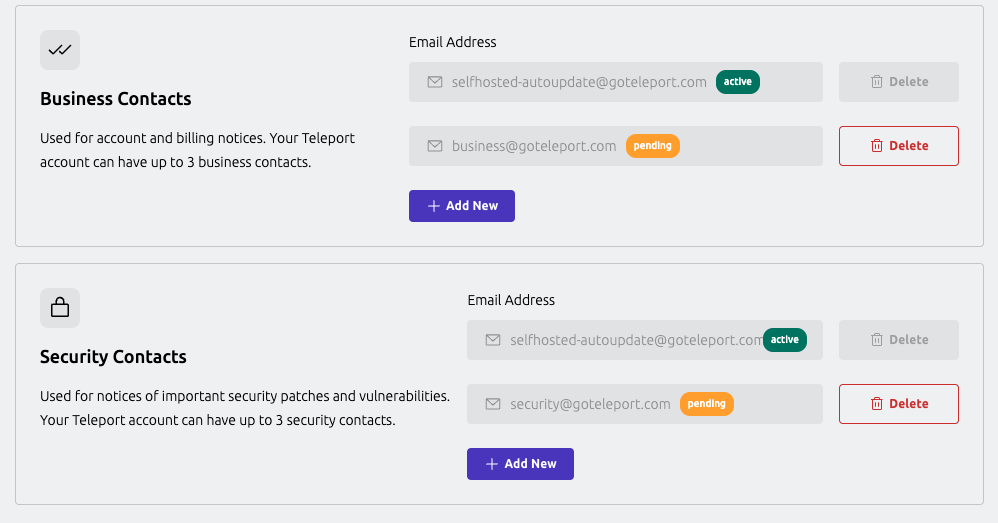
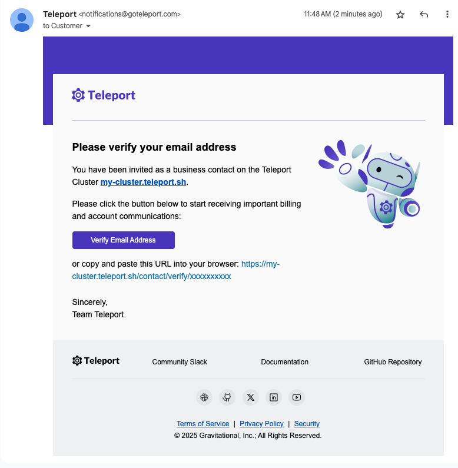

The **Business & Security Contacts** feature allows administrators to
configure email addresses that will receive important operational,
billing, and security-related notifications from Teleport.

This helps ensure that the right teams in your organization stay
informed about critical updates, such as license renewals,
security advisories, and compliance-related changes.

When you create a Teleport Enterprise account, the email associated with
your administrator will automatically be set as a business and
security contact.

## Contact types

You can configure two types of contact emails:

- **Business Contact**: Intended for billing, account management, and administrative notices.
- **Security Contact**: Intended for vulnerability disclosures, security alerts, and compliance communication.

You may configure the same email address for both roles or provide
separate addresses based on your organization’s structure.
Each contact type supports up to **three** email addresses.

## Listing contacts

<Admonition type="note">

Users will need permission to `list` the `contact` resource.

On dashboards, all users have this permission.

</Admonition>

### Teleport Cloud

1. Go to https://teleport.sh and enter your tenant name.
1. Sign in using your credentials.
1. Hover over Zero Trust Access on the side menu and access Manage Clusters.
1. Select your cluster on the list and click Options to expand the dropdown menu.

### Teleport Self-Hosted

Self-hosted users must go to their **dashboard cluster** in order to add contacts.

1. Go to https://teleport.sh and enter your tenant name.
1. Sign in using your credentials.
1. Click Clusters on the side menu.
1. Select your cluster on the list and click Options to expand the dropdown menu.

## Adding contacts

<Admonition type="note">

Users will need permission to `edit` the `contact` resource.
On dashboards, the role `dashboard-admin` will have the necessary
permissions to edit contacts.

</Admonition>

Any email address can be added as a contact. They do not have to belong
to any existing Teleport user in your cluster.

1. Go to the contacts lists following the instructions on the section below.
1. Click `Add New` under the category you want to add a contact.
1. Enter the email and click Invite.

### Confirmation email

New contacts are initially marked as pending. 
A confirmation email is sent to the address with an activation link.

Once confirmed, the contact becomes active and will receive relevant communications.

If the same address is used for both categories, it only needs to be confirmed once.
