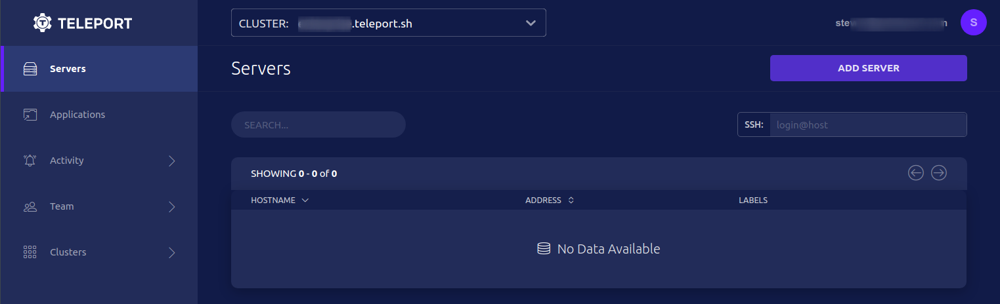
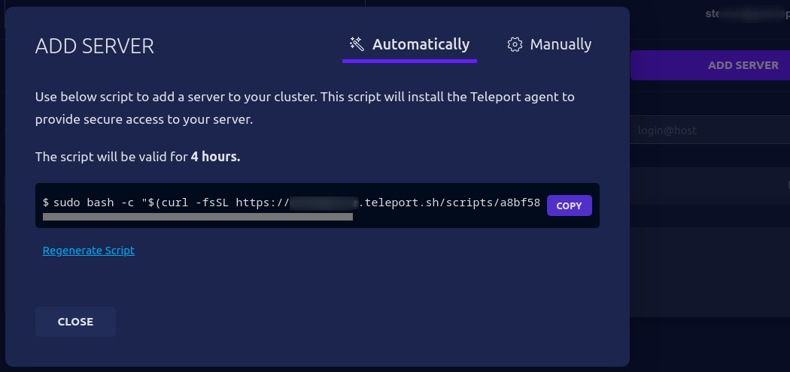
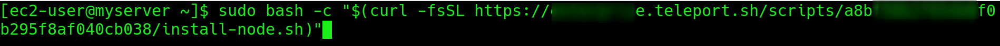
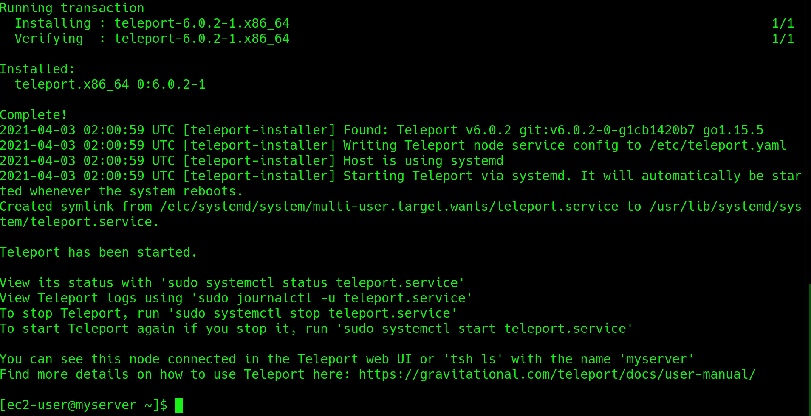
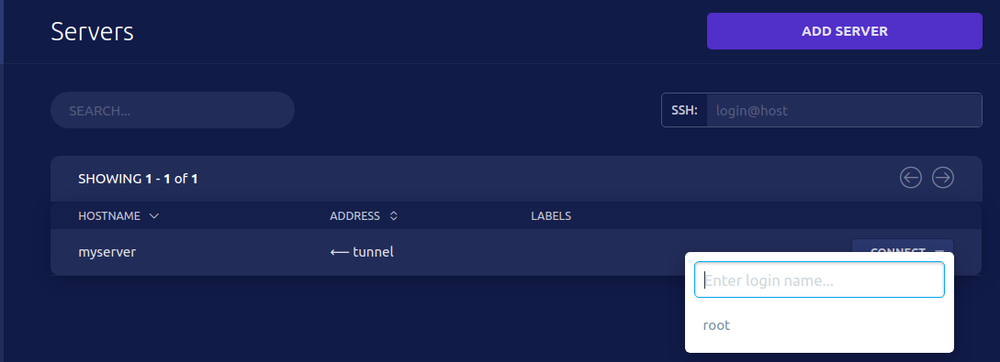
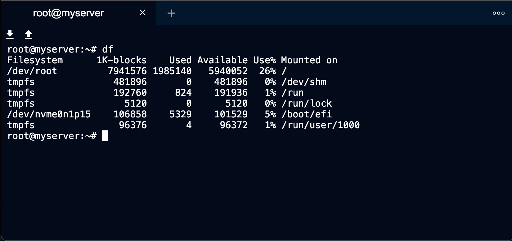
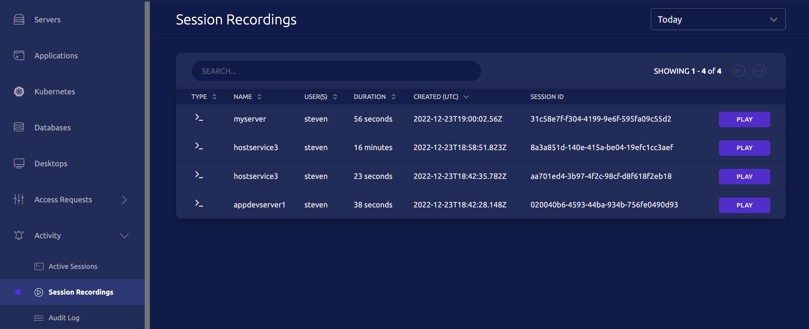

Here is a simple set of steps to access your cloud from the command line and easily add your first Server access.

## Step 1/5 Sign up

Sign up for a cloud account [here](https://goteleport.com/signup/).

## Step 2/5 Access Web Console

Access Web Console


Select Add Server and press COPY to copy the script command


## Step 3/5 Install Teleport Agent on Server

Paste and run the script on a Linux Server:



Teleport Agent Installed


## Step 4/5 Access Server

Click **CLOSE**.  The server can now be accessed via SSH:


Interact with your SSH session:


Exit the session with `exit`. You can replay the session within Session Recordings:


## Step 5/5 Access from Command Line

Install client libraries:

<Tabs>
  <TabItem label="MacOS">
(!docs/pages/includes/enterprise/install-macos-ent.mdx!)
  </TabItem>
  <TabItem label="Windows">
(!docs/pages/includes/install-windows.mdx!)
  </TabItem>

  <TabItem label="Linux">
    ```code
    $ curl -O https://cdn.teleport.dev/teleport-ent-v(=teleport.version=)-linux-amd64-bin.tar.gz
    # verify signature 
    $ echo "$(curl  https://get.gravitational.com/teleport-ent-v(=teleport.version=)-linux-amd64-bin.tar.gz.sha256)" | sha256sum --check
    $ tar -xzf teleport-ent-v(=teleport.version=)-linux-amd64-bin.tar.gz
    $ cd teleport-ent
    $ sudo ./install
    ```
  </TabItem>
</Tabs>

Login into Teleport and test the connection:

```code
# tsh logs you in and receives short-lived certificates
$ tsh login --proxy=myinstance.teleport.sh --user=email@example.com
$ tsh ls
# Node Name Address    Labels 
# --------- ---------- ------ 
# myserver  ⟵ Tunnel     
$ tsh ssh root@myserver
```

<Details title="Not seeing Nodes?" opened={false}>

(!docs/pages/includes/node-logins.mdx!)

</Details>

Type exit to end this session.  Happy Teleporting!

## Next Steps

- Consider using our desktop app - [Teleport Connect](../../connect-your-client/teleport-connect.mdx) to access your resources.
- Explore [cloud architecture](./architecture.mdx).
- Check out [FAQ](./faq.mdx).
- Join the [Teleport Discussions](https://github.com/gravitational/teleport/discussions) and ask a question.
- Join the [Slack channel](https://goteleport.com/slack).
