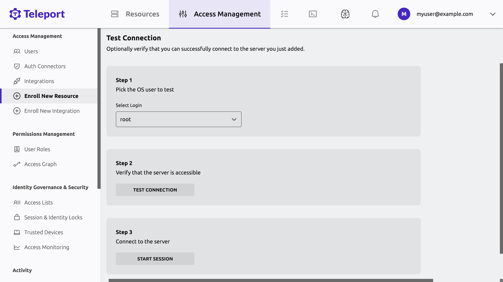

In this guide, we will show you how to get started with Teleport Enterprise
Cloud and register your first resource with Teleport so you can provide secure
access to your infrastructure.

Teleport Enterprise Cloud includes two components:

- **Teleport Auth Service:** The certificate authority for your cluster. It
  issues certificates and conducts authentication challenges.
- **Teleport Proxy Service:** The cluster frontend, which handles user requests,
  forwards user credentials to the Auth Service, and communicates with Teleport
  instances that enable access to specific resources in your infrastructure.

In this guide, you will register a server with your Teleport Cloud account so
you can access it securely. Your server will connect to the Teleport Proxy
Service and open a reverse tunnel that the Proxy Service can use to allow
traffic to the server from authorized clients.

## Prerequisites

- A Teleport Enterprise Cloud account. You can sign up for a free trial at the
  following page:

  https://goteleport.com/signup/

- Docker installed on your workstation. We will use a Docker container to
  register a server with Teleport via the Teleport SSH Service. You can find
  installation instructions on [Docker's
  website](https://docs.docker.com/get-docker/).

  <Notice type="tip">

  Docker is only required for a local demo environment. If you want to get
  started registering your servers in your infrastructure with Teleport, view
  our documentation on how to [register servers and configure access to
  them](../../server-access/introduction.mdx).

  </Notice>

- The `tsh` client tool. Visit our [Installation Guide](../../installation.mdx)
  for instructions. If you want to get started quickly, you can skip this for
  now and access Teleport through your browser.

## Step 1/4. Spin up your server

Spin up a server on your workstation. In Step 2, we will register this server
with your Teleport Enterprise Cloud tenant:

```code
$ docker run -it ubuntu:22.10 /bin/bash
```

Your terminal will begin a shell session in the `ubuntu:22.10` container. From
there, make sure you have `curl` and `telnet` installed. When we run a script to install Teleport later in this guide, the script will require both of these tools.

```code
$ apt update && apt install -y curl telnet
```

Keep this shell open in your terminal for the next step.

## Step 2/4. Install the Teleport SSH Service

To install the Teleport SSH Service on your server, visit the Teleport Web UI at
the address of your Teleport Enterprise Cloud tenant, 
<Var name="tenant-url"/>`.teleport.sh` (e.g., `mytenant.teleport.sh`). 

If this is your first time visiting the Web UI, you will see a prompt to add
your first resource: 


Clicking **Add my first resource** will take you to the Teleport Discover UI:


Leave **Server** selected and click **Next**.

You will see a script that you can copy from the Teleport Web UI:


Copy the script and paste it into the shell you opened in the previous step.

The script assumes that you will run it as a non-`root` user, but the shell in
the container you created earlier is running as root. Remove `sudo` from the
start of the script so you can run it on your container. It should look
something like this:

```text
bash -c "$(curl -fsSL https://TENANT_SUBDOMAIN.teleport.sh/scripts/SCRIPT_NAME/install-node.sh)" 
```

Leave the script running in your shell. Teleport will run in the foreground. You
will see a message in the Web UI that your new server connected successfully:


Click **Next**.

Confirm that you will authenticate as the `root` user and click **Next**:


From there, you can test the connection and access the server. Click **Start
Session** to connect:



<Notice type="tip">

If you get an error connecting to your container, interrupt the `teleport`
process in your container's shell with **Ctrl-C**, then run `teleport start` to
restart the process.

</Notice>

You should see a terminal prompt in your browser. Your Teleport Enterprise Cloud
account routes your SSH connection through the Teleport Proxy Service, which
connects to your container via a reverse tunnel. 

Reverse tunnels like this allow Teleport to manage access to resources like
Kubernetes clusters and remote desktops, even if these resources are running on
private networks.

Execute some commands in your terminal. When you have finished, run `exit` to
end your session.

In the **Manage Access** view, click **Finish**, then **Browse existing
resources** to visit the main view of the Teleport Web UI.

## Step 3/4. Play back your session

As Teleport Enterprise Cloud proxies SSH connections to registered servers, it
records the commands that users execute during their sessions so operators can
play them back later to investigate issues.

In the Teleport Web UI, click the **Activity** tab in the sidebar on the left of
the screen, then click **Session Recordings**. You will see your session from
the previous step:


Click **PLAY**. You will see a full recording of your session.

## Step 4/4. Access your server from the command line

Open a new terminal window and log in to your Teleport Enterprise Cloud tenant
via the command line, filling in the URL of your tenant and the name of your
Teleport user:

```code
$ tsh login --proxy=<Var name="tenant-url" />.teleport.sh --user=<Var name="username" />
```

List the servers your Teleport user can access. You should see the name of the
container you just registered:

```code
$ tsh ls
Node Name    Address    Labels
------------ ---------- ----------------------------------------------------------------------------------------
000000000000 ⟵ Tunnel   hostname=000000000000,teleport.internal/resource-id=000000000000
```

Access your server as the `root` user:

```code
$ tsh ssh root@<Var name="node-name" />
```

## Next steps

- Now that you have registered your first server with Teleport, read about how
  you can register resources in your infrastructure, including:

  - [Additional SSH servers](../../server-access/introduction.mdx)
  - [Cloud provider tools and internal web applications](../../application-access/introduction.mdx)
  - [Databases](../../database-access/introduction.mdx)
  - [Kubernetes clusters](../../kubernetes-access/introduction.mdx)
  - [Service accounts](../../machine-id/introduction.mdx)
  - [Windows desktops](../../desktop-access/introduction.mdx)

- Aside from `tsh` and the Web UI, you can also connect to Teleport with our
  desktop application, [Teleport
  Connect](../../connect-your-client/teleport-connect.mdx).

- Learn more about Teleport Enterprise Cloud with our [Architecture
  Guide](./architecture.mdx) and [Frequently Asked Questions](./faq.mdx) page.

- Get support in our [Discussion
  Forum](https://github.com/gravitational/teleport/discussions) and [Slack
  community](https://goteleport.com/slack).
