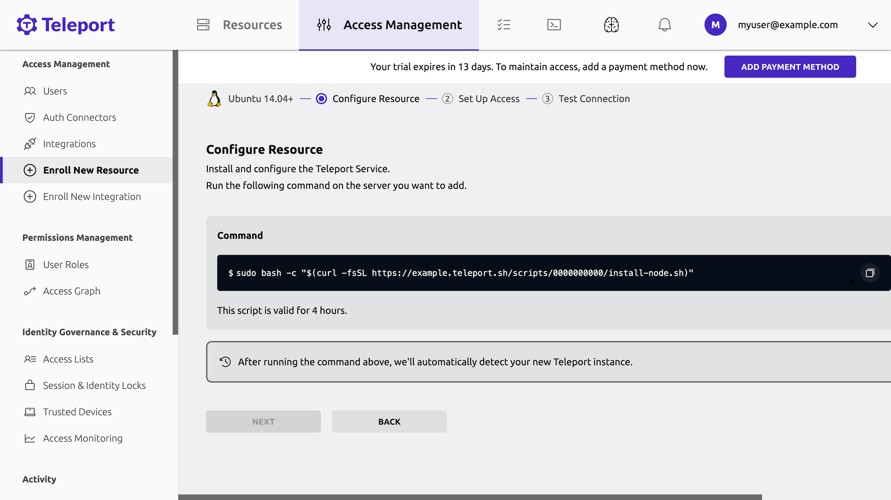

Teleport Team helps small organizations provide secure access to their infrastructure, with 
minimal configuration and no management overhead. 

With Teleport Team, the Teleport Auth Service and Teleport Proxy Service are professionally 
managed in the cloud. These services provide an immediate, scalable, and fault tolerant 
environment with a certificate authority and reverse proxy that you don't need to manage but 
can use to configure access for users in private networks or across the globe.

After starting a [free trial](https://goteleport.com/signup) of Teleport Team,
you can set up role-based access control (RBAC), enable single sign-on with GitHub 
or the Teleport identity provider, and prevent unauthorized of organization resources.


<Notice type="tip">

For a detailed comparison of Teleport's editions, including how Teleport Team
compares to Teleport Enterprise Cloud and Teleport Enterprise, see [Choose an edition](introduction.mdx).

</Notice>

## Get started with Teleport Team

This guide walks you through the process of registering a local server with a
Teleport Team account. You can then access the server through the browser and
the terminal, and record your session so you can review it later.

### Prerequisites

- A Teleport Team account. You can sign up for a free trial at the following
  page:

  https://goteleport.com/signup/

- Docker installed on your workstation. We will use a Docker container to
  register a server with Teleport via the Teleport SSH Service. You can find
  installation instructions on [Docker's
  website](https://docs.docker.com/get-docker/).

  <Notice type="tip">

  Docker is only required for the local demo environment we use in this guide.
  If you want to get started registering your servers in your infrastructure
  with Teleport, view our documentation on how to [register servers and
  configure access to them](../server-access/introduction.mdx).

  </Notice>

- The `tsh` client tool. Visit our [Installation Guide](../installation.mdx)
  for instructions. If you want to get started quickly, you can skip this for
  now and access Teleport through your browser.

### Step 1/4. Spin up your server

Start a Docker container on your workstation to register as a server in your
Teleport Team tenant:

```code
$ docker run -it ubuntu:22.10 /bin/bash
```

Your terminal will begin a shell session in the `ubuntu:22.10` container. From
there, make sure you have `curl` and `telnet` installed. When we run a script to
install Teleport later in this guide, the script will require both of these
tools:

```code
$ apt update && apt install -y curl telnet
```

Keep this shell open in your terminal.

### Step 2/4. Install the Teleport SSH Service

To install the Teleport SSH Service on your server, visit the Teleport Web UI at
the address of your Teleport Team tenant, <Var name="tenant-url"/>`.teleport.sh`
(e.g., `mytenant.teleport.sh`). 

If this is your first time visiting the Web UI, you will see a prompt to add
your first resource: 


Clicking **Add my first resource** will take you to the **Enroll New Resource**
view. Enter "server" in the search box as shown below:


Select "Ubuntu 14.04+" so you can register your Docker container.

After selecting an OS, you will see a script that you can copy from the Teleport
Web UI:



The Teleport installation script uses `sudo`, which is not installed on your
Docker container. Alias `sudo` in your container terminal to override this:

```code
$ alias sudo=""
```

Copy the script and paste it into the shell you opened earlier on your Docker
container.

Leave the script running in your shell. Teleport will run in the foreground. You
will see a message in the Web UI that your new server connected successfully:


Click **Next**.

Confirm that you will authenticate as the `root` user and click **Next**:


From there, you can test the connection and access the server. Click **Start
Session** to connect:


<Notice type="tip">

If you get an error connecting to your container, interrupt the `teleport`
process in your container's shell with **Ctrl-C**, then run `teleport start` to
restart the process.

</Notice>

You should see a terminal prompt in a new browser window. Your Teleport Team
account routes your SSH connection through the Teleport Proxy Service, which
connects to your container via a reverse tunnel. 

Reverse tunnels like this allow Teleport to manage access to resources like
Kubernetes clusters and remote desktops, even if these resources are running on
private networks.

Execute some commands in your terminal. When you have finished, run `exit` to
end your session.

Return to your original browser window. In the **Manage Access** view, click
**Finish**, then **Browse existing resources** to visit the main view of the
Teleport Web UI.

### Step 3/4. Play back your session

As Teleport Team proxies SSH connections to registered servers, it records the
commands that users execute during their sessions so operators can play them
back later to investigate issues.

In the Teleport Web UI, set the dropdown menu on the upper left of the screen to
**Management**, then click **Session Recordings**. You will see your session
from the previous step:


Click **PLAY**. You will see a full recording of your session.

### Step 4/4. Access your server from the command line

Open a new terminal window and log in to your Teleport Team tenant
via the command line, filling in the URL of your tenant and the name of your
Teleport user:

```code
$ tsh login --proxy=<Var name="tenant-url" />.teleport.sh --user=<Var name="username" />
```

List the servers your Teleport user can access. You should see the name of the
container you just registered:

```code
$ tsh ls
Node Name    Address    Labels
------------ ---------- ----------------------------------------------------------------------------------------
000000000000 ⟵ Tunnel   hostname=000000000000,teleport.internal/resource-id=000000000000
```

Access your server as the `root` user:

```code
$ tsh ssh root@<Var name="node-name" />
```

## Next steps

We have shown you how to use Teleport Team to quickly protect your
infrastructure by registering a server with your Teleport Team cluster. From
here, you can explore more of the documentation to see how to set up secure
access for your infrastructure.

To enroll your infrastructure with Teleport, you deploy one or more Teleport
**agents**, which proxy traffic to resources like servers, databases, Kubernetes
clusters, cloud provider APIs, and Windows desktops.

You can use Terraform to declare a pool of Teleport agents and configure them to
proxy your infrastructure. Read [Deploy Teleport Agents with
Terraform](../agents/deploy-agents-terraform.mdx).

## Subscribe

After you finish your free trial, Teleport Team will charge based on usage.
Check the [pricing page](https://goteleport.com/pricing/) for detailed
billing information.
