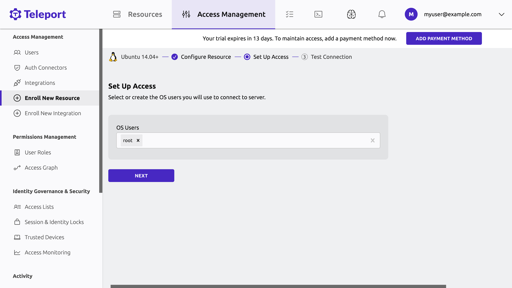

Teleport Team helps small organizations get started quickly with enabling secure
access to their infrastructure. 

With Teleport Team, the Auth Service and Proxy Service are fully managed, giving
you a scalable, fault tolerant certificate authority that you can use to
configure access from users across the globe to infrastructure resources in
private networks.

After you start a [free trial](fixme.mdx) of Teleport Team, you can set up RBAC,
enable single sign-on with GitHub or Teleport's own identity provider, and start
protecting resources with Teleport.

<Notice type="tip">

For a detailed comparison of Teleport's editions, including how Teleport Team
compares to Teleport Team, see our [Choose an
Edition](introduction.mdx) introduction page.

</Notice>

## Get started with Teleport Team

To show you how Teleport Team protects your infrastructure without compromising
convenience, we will walk through the process of registering a local Docker
container with Teleport. You can then access the container through the browser
and the terminal, and record your session so you can review it later.

### Prerequisites

- A Teleport Team account. You can sign up for a free trial at the following
  page:

  {/*TODO: update this*/}
  https://goteleport.com/signup/

- Docker installed on your workstation. We will use a Docker container to
  register a server with Teleport via the Teleport SSH Service. You can find
  installation instructions on [Docker's
  website](https://docs.docker.com/get-docker/).

  <Notice type="tip">

  Docker is only required for a local demo environment. If you want to get
  started registering your servers in your infrastructure with Teleport, view
  our documentation on how to [register servers and configure access to
  them](../../server-access/introduction.mdx).

  </Notice>

- The `tsh` client tool. Visit our [Installation Guide](../../installation.mdx)
  for instructions. If you want to get started quickly, you can skip this for
  now and access Teleport through your browser.

### Step 1/4. Spin up your server

Spin up a server on your workstation. In Step 2, we will register this server
with your Teleport Team tenant:

```code
$ docker run -it ubuntu:22.10 /bin/bash
```

Your terminal will begin a shell session in the `ubuntu:22.10` container. From
there, make sure you have `curl` and `telnet` installed. When we run a script to install Teleport later in this guide, the script will require both of these tools.

```code
$ apt update && apt install -y curl telnet
```

Keep this shell open in your terminal for the next step.

### Step 2/4. Install the Teleport SSH Service

To install the Teleport SSH Service on your server, visit the Teleport Web UI at
the address of your Teleport Team tenant, <Var name="tenant-url"/>`.teleport.sh`
(e.g., `mytenant.teleport.sh`). 

If this is your first time visiting the Web UI, you will see a prompt to add
your first resource: 


Clicking **Add my first resource** will take you to the Teleport Discover UI:


Leave **Server** selected and click **Next**.

You will see a script that you can copy from the Teleport Web UI:


Copy the script and paste it into the shell you opened in the previous step.

The script assumes that you will run it as a non-`root` user, but the shell in
the container you created earlier is running as root. Remove `sudo` from the
start of the script so you can run it on your container. It should look
something like this:

```text
bash -c "$(curl -fsSL https://TENANT_SUBDOMAIN.teleport.sh/scripts/SCRIPT_NAME/install-node.sh)" 
```

Leave the script running in your shell. Teleport will run in the foreground. You
will see a message in the Web UI that your new server connected successfully:


Click **Next**.

Confirm that you will authenticate as the `root` user and click **Next**:



From there, you can test the connection and access the server. Click **Start
Session** to connect:


<Notice type="tip">

If you get an error connecting to your container, interrupt the `teleport`
process in your container's shell with **Ctrl-C**, then run `teleport start` to
restart the process.

</Notice>

You should see a terminal prompt in your browser. Your Teleport Team
account routes your SSH connection through the Teleport Proxy Service, which
connects to your container via a reverse tunnel. 

Reverse tunnels like this allow Teleport to manage access to resources like
Kubernetes clusters and remote desktops, even if these resources are running on
private networks.

Execute some commands in your terminal. When you have finished, run `exit` to
end your session.

In the **Manage Access** view, click **Finish**, then **Browse existing
resources** to visit the main view of the Teleport Web UI.

### Step 3/4. Play back your session

As Teleport Team proxies SSH connections to registered servers, it
records the commands that users execute during their sessions so operators can
play them back later to investigate issues.

In the Teleport Web UI, click the **Activity** tab in the sidebar on the left of
the screen, then click **Session Recordings**. You will see your session from
the previous step:


Click **PLAY**. You will see a full recording of your session.

### Step 4/4. Access your server from the command line

Open a new terminal window and log in to your Teleport Team tenant
via the command line, filling in the URL of your tenant and the name of your
Teleport user:

```code
$ tsh login --proxy=<Var name="tenant-url" />.teleport.sh --user=<Var name="username" />
```

List the servers your Teleport user can access. You should see the name of the
container you just registered:

```code
$ tsh ls
Node Name    Address    Labels
------------ ---------- ----------------------------------------------------------------------------------------
000000000000 ⟵ Tunnel   hostname=000000000000,teleport.internal/resource-id=000000000000
```

Access your server as the `root` user:

```code
$ tsh ssh root@<Var name="node-name" />
```

## Next steps

We have shown you how to use Teleport Team to quickly protect your
infrastructure.

### Register resources

Now that you have registered your first server with your Teleport Team account,
read about how you can register resources in your infrastructure, including:

  - [Additional SSH servers](../../server-access/introduction.mdx)
  - [Cloud provider tools and internal web applications](../../application-access/introduction.mdx)
  - [Databases](../../database-access/introduction.mdx)
  - [Kubernetes clusters](../../kubernetes-access/introduction.mdx)
  - [Service accounts](../../machine-id/introduction.mdx)
  - [Windows desktops](../../desktop-access/introduction.mdx)

### Connect to your infrastructure

Aside from `tsh` and the Web UI, you can also connect to Teleport with our
desktop application, [Teleport
Connect](../../connect-your-client/teleport-connect.mdx).

### Subscribe

After you finish your free trial, Teleport Team will charge based on usage.
Check the [pricing page](fixme.mdx) for detailed billing information.
