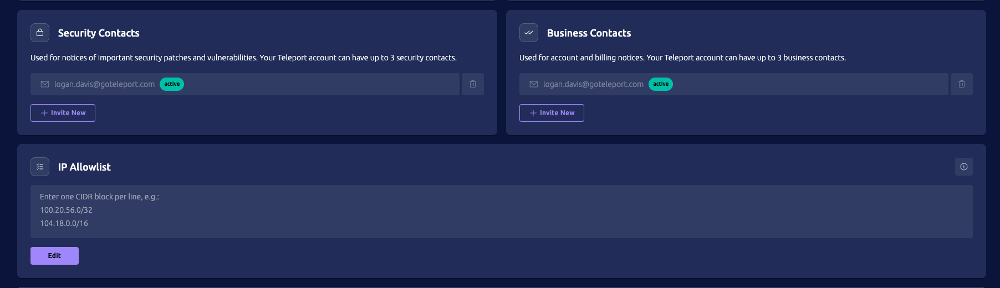

**Client IP Allowlist** restricts access to your Teleport Cloud cluster, allowing traffic only from the specified network ranges (CIDR blocks).

## How to enable
This feature is currently opt-in only. Please contact your account executive or [customer support](https://goteleport.com/support/) to enable client IP restrictions for your tenant.

## Adding CIDR blocks to the IP Allowlist

Log in to your Teleport Cloud account. Open the user dropdown menu on the top right of the navigation bar, and select "Help & Support," then scroll down until you see the IP Allowlist section.
Once you add a CIDR, it will take effect in 5-20 minutes and will terminate existing connections. Changes to the allowlist are recorded in the audit log.

Managing CIDR blocks is governed by Teleport’s existing RBAC system.
A new resource type is introduced: `client_ip_restriction`.
To see the current allowlist, the user must have the  `list` verb enabled.

To update the allowlist, `create` and `update` are required.

By default, the `editor` role can **read and write** CIDR allowlists.

## Limitations

### Misconfiguration
Misconfiguration can block all access to your cluster. Make sure to include your current network before saving changes. 

### Third-party service ranges
Teleport does not auto-add third-party service ranges. You must add all required CIDRs explicitly. 

### Network security
The allowlist applies to Teleport Cloud access; it does not replace your organization’s network/firewall policies.

### Sync time
The Client IP Restriction allowlist may take up to 20 minutes before it is fully synced. 

## FAQ

### How many CIDRs can you configure?

By default, up to 256 CIDR blocks can be configured. Please contact your account executive or customer support to increase the limit. 

### Do you support a denylist?

Teleport Cloud client IP restrictions do not currently support a denylist. 
