This guide describes how to configure popular graphical database clients to
work with Teleport.

## Setting up your Teleport environment

### Prerequisites

- A running Teleport cluster. If you want to get started with Teleport, [sign
  up](https://goteleport.com/signup) for a free trial or [set up a demo
  environment](../linux-demo.mdx).

- The `tsh` client tool. Visit [Installation](../installation.mdx) for instructions on downloading
  `tsh`. See the [Using Teleport Connect](./teleport-connect.mdx) guide for a graphical desktop client
  that includes `tsh`.

- To check that you can connect to your Teleport cluster, sign in with `tsh login`. For example:

  ```code
  $ tsh login --proxy=teleport.example.com --user=myuser@example.com
  ```

- The Teleport Database Service configured to access a database. See one of our
  [guides](../enroll-resources/database-access/guides/guides.mdx) for how to set up the Teleport
  Database Service for your database.

### Get connection information

Get information about the host and port where your database is available so you
can configure your GUI client to access the database.

#### Using a local proxy server

Use the `tsh proxy db` command to start a local TLS proxy your GUI database
client will be connecting to. This command requires that you use Teleport
Enterprise (Cloud) or, if self-hosting Teleport, have enabled [TLS
routing](../admin-guides/management/operations/tls-routing.mdx) mode.

Run a command similar to the following::

```code
$ tsh proxy db <database-name>
Started DB proxy on 127.0.0.1:61740

Use following credentials to connect to the <database-name> proxy:
  ca_file=/Users/r0mant/.tsh/keys/root.gravitational.io/certs.pem
  cert_file=/Users/r0mant/.tsh/keys/root.gravitational.io/alice-db/root/<database-name>-x509.pem
  key_file=/Users/r0mant/.tsh/keys/root.gravitational.io/alice
```

Use the displayed local proxy host/port and credentials paths when configuring
your GUI client below. When entering the hostname, use `localhost` rather than
`127.0.0.1`.

Starting the local database proxy with the `--tunnel` flag will create an
authenticated tunnel that you can use to connect to your database instances.
You won't need to configure any credentials when connecting to this tunnel.

Here is an example on how to start the proxy:

```code
# Start the local proxy.
$ tsh proxy db --tunnel <database-name>
Started authenticated tunnel for the <engine> database "<database-name>" in cluster "<cluster-name>" on 127.0.0.1:62652.
```

You can optionally specify the database name and the user to use by default
when connecting to the database:

```code
$ tsh proxy db --db-user=my-database-user --db-name=my-schema --tunnel <database-name>
```

Now, you can connect to the address the proxy command returns. In our example it
is `127.0.0.1:62652`.

#### Using a remote host and port

If you are self-hosting Teleport and not using [TLS
routing](../admin-guides/management/operations/tls-routing.mdx), run the
following command to see the database connection information:

```code
# View configuration for the database you're logged in to.
$ tsh db config
# View configuration for the specific database when you're logged into multiple.
$ tsh db config example
```

It will display the path to your locally cached certificate and key files:

```
Name:      example
Host:      teleport.example.com
Port:      3080
User:      postgres
Database:  postgres
CA:        /Users/alice/.tsh/keys/teleport.example.com/certs.pem
Cert:      /Users/alice/.tsh/keys/teleport.example.com/alice-db/root/example-x509.pem
Key:       /Users/alice/.tsh/keys/teleport.example.com/alice
```

The displayed `CA`, `Cert`, and `Key` files are used to connect through pgAdmin
4, MySQL Workbench, and other graphical database clients that support mutual
TLS authentication.

## MongoDB Compass

[Compass](https://www.mongodb.com/products/compass) is the official MongoDB
graphical client.

On the "New Connection" panel, click on "Fill in connection fields individually".

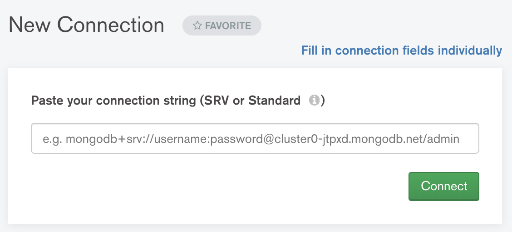

On the "Hostname" tab, enter the hostname and port of the proxy you will use to
access the database (see
[Get connection information](./gui-clients.mdx#get-connection-information)).
Leave "Authentication" as None.

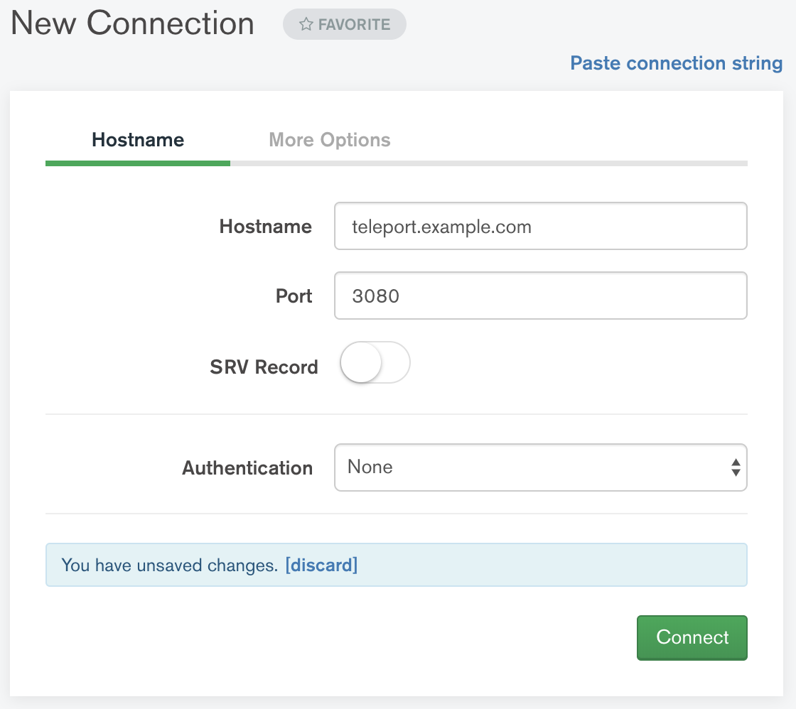

On the "More Options" tab, set SSL to "Client and Server Validation" and set the
CA as well as the client key and certificate. Note that a CA path must be
provided and be able to validate the certificate presented by your Teleport
Proxy Service's web endpoint.

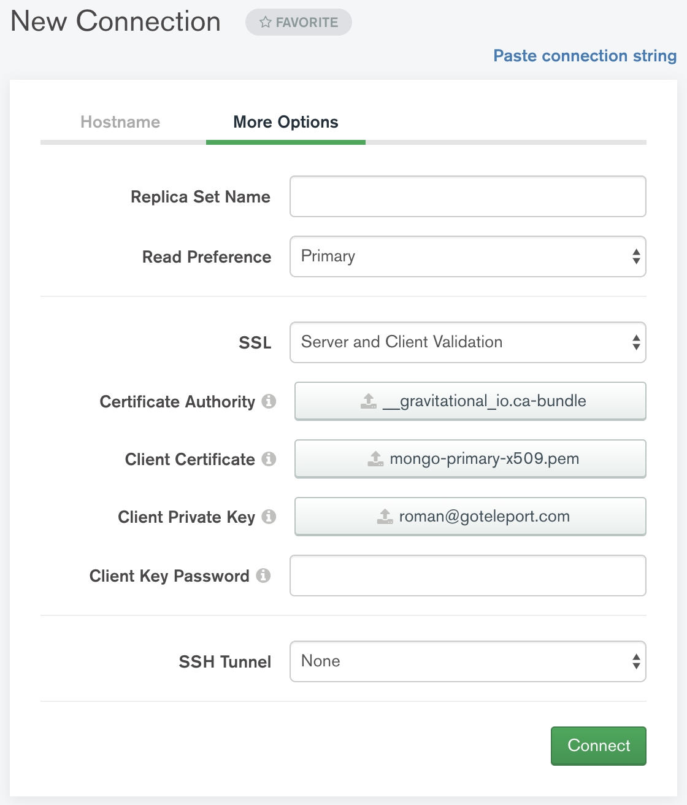

The following fields in the More Options tab must correspond to paths printed by
the `tsh proxy db` command you ran earlier:

|Field|Path|
|---|---|
|Certificate Authority|`ca_file`|
|Client Certificate|`cert_file`|
|Client Private Key|`key_file`|

Click on the "Connect" button.

## MySQL DBeaver

Right-click in the "Database Navigator" menu in the main view and select Create > Connection:

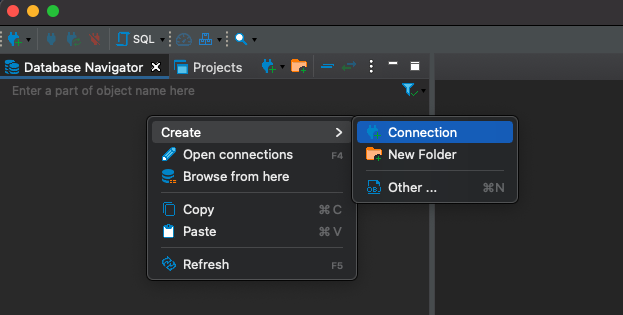

In the search bar of the "Connect to a database" window that opens up, type "mysql", select the MySQL driver, and click "Next":

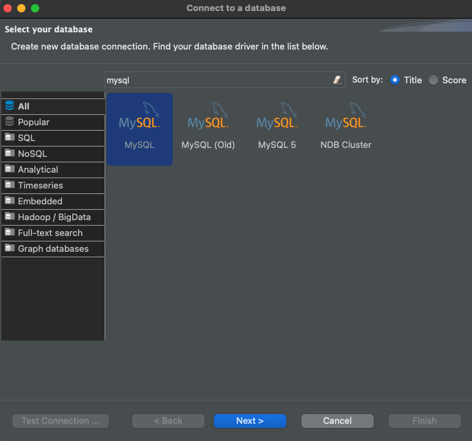

In the newly-opened "Connection Settings" tab, use the Host as `localhost` and
Port as the one returned by the proxy command (`62652` in the example above):

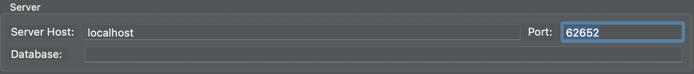

In that same tab, set the username to match the one that you are connecting to
using Teleport and uncheck the "Save password locally" box:

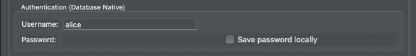

Click the "Edit Driver Settings" button on the "Main" tab, check the "No
Authentication" box, and click "Ok" to save:

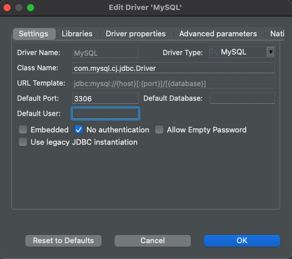

Once you are back in the "Connection Settings" window, click "Ok" to finish and
DBeaver should connect to the remote MySQL server automatically.

## MySQL Workbench

[MySQL Workbench](https://www.mysql.com/products/workbench/) is a GUI
application that provides comprehensive MySQL administration and SQL development
tools.

In the MySQL Workbench "Setup New Connection" dialog, fill out "Connection
Name", "Hostname", "Port", and "Username":


In the "SSL" tab, set "Use SSL" to `Require and Verify Identity` and enter the
paths to your CA, certificate, and private key files (see
[Get connection information](./gui-clients.mdx#get-connection-information)):

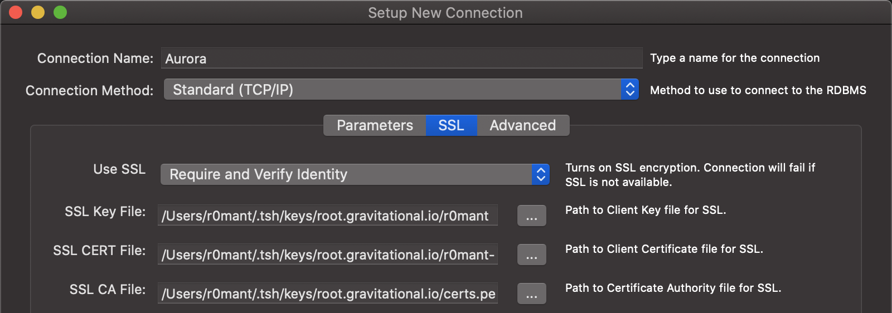

The following fields in the SSL tab must correspond to paths printed by the `tsh
proxy db` command you ran earlier:

|Field|Path|
|---|---|
|SSL Key File|`key_file`|
|SSL CERT File|`cert_file`|
|SSL CA File|`ca_file`|

Optionally, click "Test Connection" to verify connectivity:

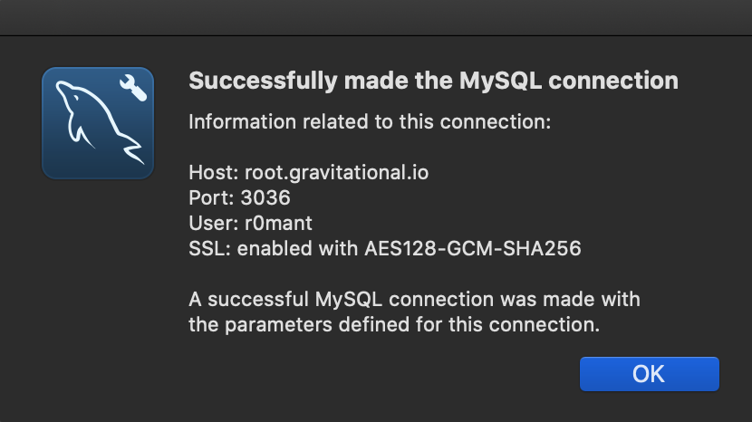

Save the connection and connect to the database.

## NoSQL Workbench

From the NoSQL Workbench launch screen, click **Launch** next to **Amazon DynamoDB**.
From the left-side menu select **Operation builder**, then **+ Add connection**.
Choose the **DynamoDB local** tab, and point to your proxy's endpoint. This is
`localhost:62652` in the example above. (See
[Get connection information](./gui-clients.mdx#get-connection-information) for
more information.)

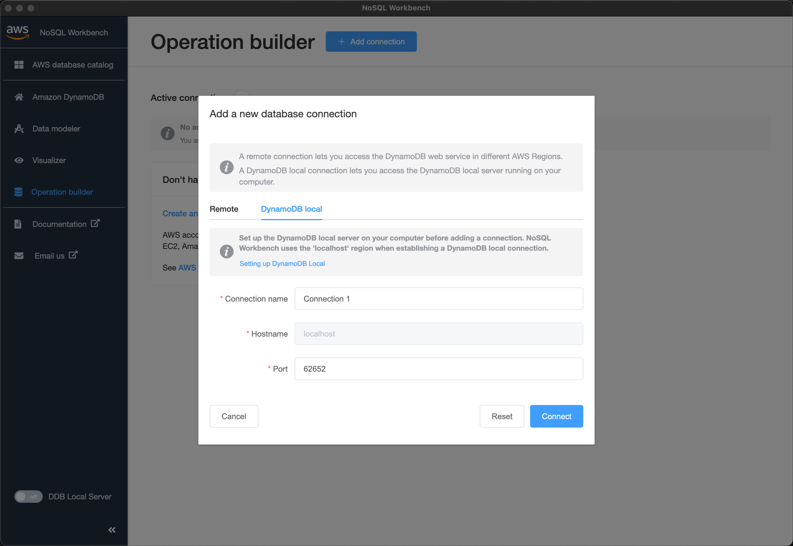

## SQL Server with Azure Data Studio

In Azure Data Studio create a connection using your proxy's endpoint. This is
`localhost,62652` in the example above. On a Windows machine, using an address in
 the format `127.0.0.1,62652` could be required instead of `localhost`. (See
[Get connection information](./gui-clients.mdx#get-connection-information) for
more information.)

Create a connection with Microsoft SQL Server with these settings:

|Connection Detail|Value|
|---|---|
|Server|`host`,`port` of proxy endpoint|
|Authentication Type|SQL Login|
|Password|empty|
|Encrypt|`False`|

Example:
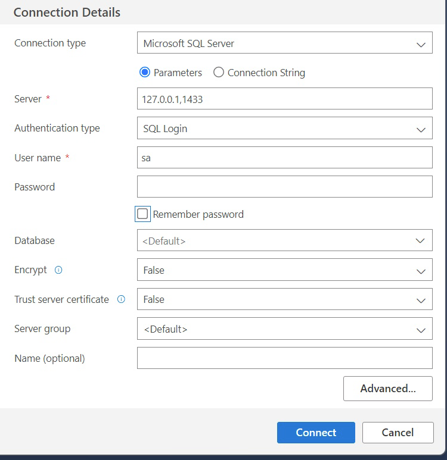

Click **Connect** to connect.

## PostgreSQL DBeaver

To connect to your PostgreSQL instance, use the authenticated proxy address.
This is `127.0.0.1:62652` in the example above (see the “Authenticated Proxy”
section on [Get connection information](./gui-clients.mdx#get-connection-information)
for more information).

Use the "Database native" authentication with an empty password:


Clicking on "Test connection" should return a connection success message. Then,
click on "Finish" to save the configuration.

## PostgreSQL pgAdmin 4

[pgAdmin 4](https://www.pgadmin.org/) is a popular graphical client for
PostgreSQL servers.

To configure a new connection, right-click on "Servers" in the main browser view
and create a new server:

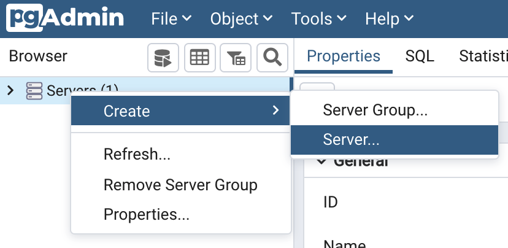

In the "General" tab of the new server dialog, enter the server connection name:

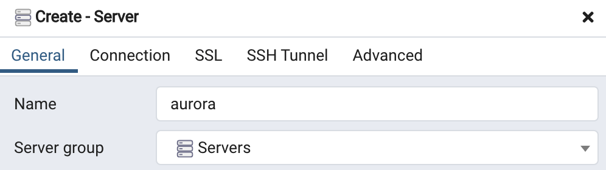

In the "Connection" tab, fill in the hostname, port, user and database name from
the configuration above:

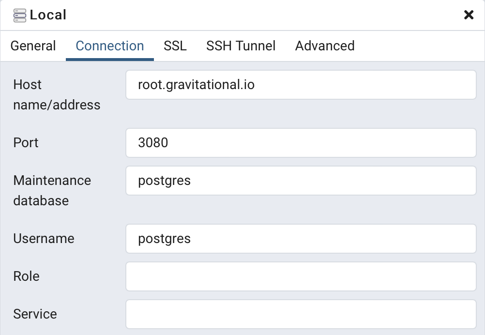

In the "SSL" tab, set "SSL Mode" to `Verify-Full` and fill in paths for client
certificate, key and root certificate from the configuration above:

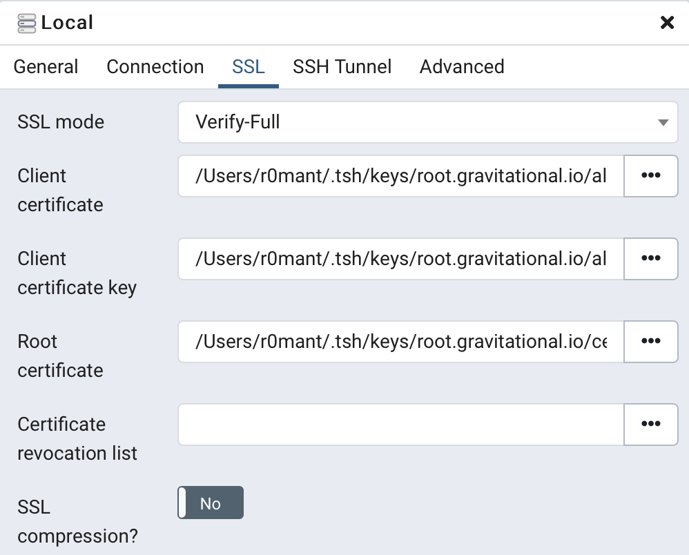

The following fields in the SSL tab must correspond to paths printed by the `tsh
proxy db` command you ran earlier:

|Field|Path|
|---|---|
|Client certificate|`cert_file`|
|Client certificate key|`key_file`|
|Root certificate|`ca_file`|

Click "Save", and pgAdmin should immediately connect. If pgAdmin prompts you
for password, leave the password field empty and click OK.

## Microsoft SQL Server Management Studio

In Microsoft SQL Server Management Studio connect to a database engine using
your proxy's endpoint. This is `localhost,62652` in the example above. Using
the IP `127.0.0.1,62652` connection could be required on a Windows machine
instead of `localhost`. (See [Get connection information](./gui-clients.mdx#get-connection-information) for
more information.)

Create a connection with Microsoft SQL Server with these settings:

|Connection Detail|Value|
|---|---|
|Server type|Database Engine|
|Server name|`host`,`port` of proxy endpoint|
|Authentication|SQL Server Authentication|
|Password|empty|
|Encryption|do not enable|

Example:
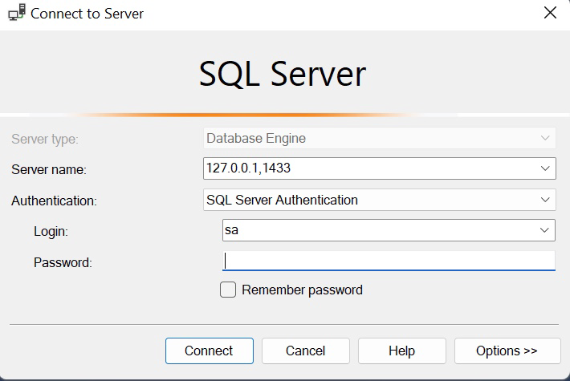
  
Click Connect to connect.

## Redis Insight

<Admonition type="note">
  Teleport's Redis Insight integration only supports Redis standalone instances.
</Admonition>

After opening Redis Insight click `ADD REDIS DATABASE`.

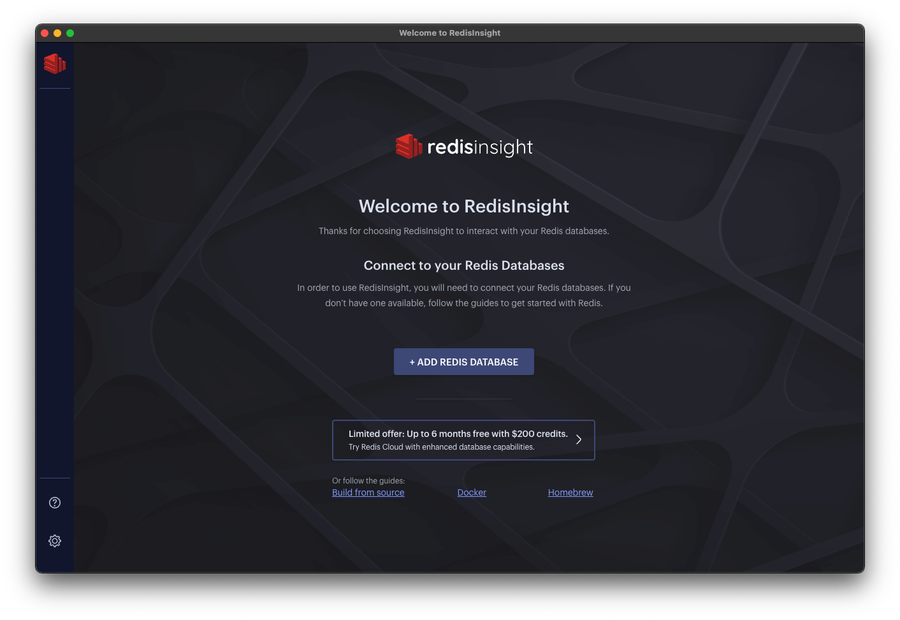

Now start a local proxy to your Redis instance:

`tsh proxy db --db-user=alice redis-db-name`.

Click `Add Database Manually`. Use `127.0.0.1` as the `Host`. Use the port printed by
the `tsh` command you ran in [Get connection information](#get-connection-information).

Provide your Redis username as `Username` and password as `Password`.

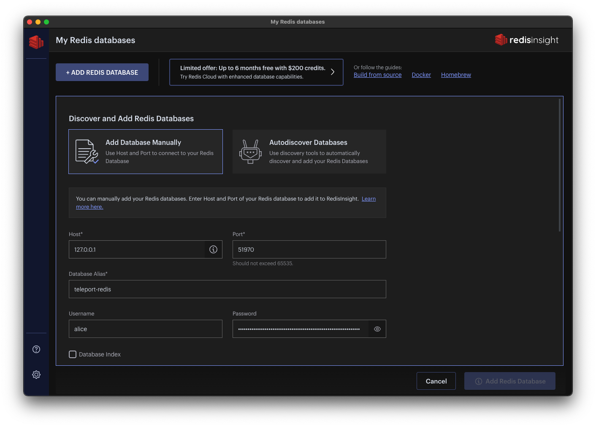

Next, check the `Use TLS` and `Verify TLS Certificates` boxes. Copy the contents
of the files at the paths returned by the `tsh proxy db` command you ran earlier
and paste them into their corresponding fields. See the table below for the
Redis Insight fields that correspond to each path:

|Field|Path|
|---|---|
|CA Certificate|`ca_file`|
|Client Certificate|`cert_file`|
|Private Key|`key_file`|

Click `Add Redis Database`.

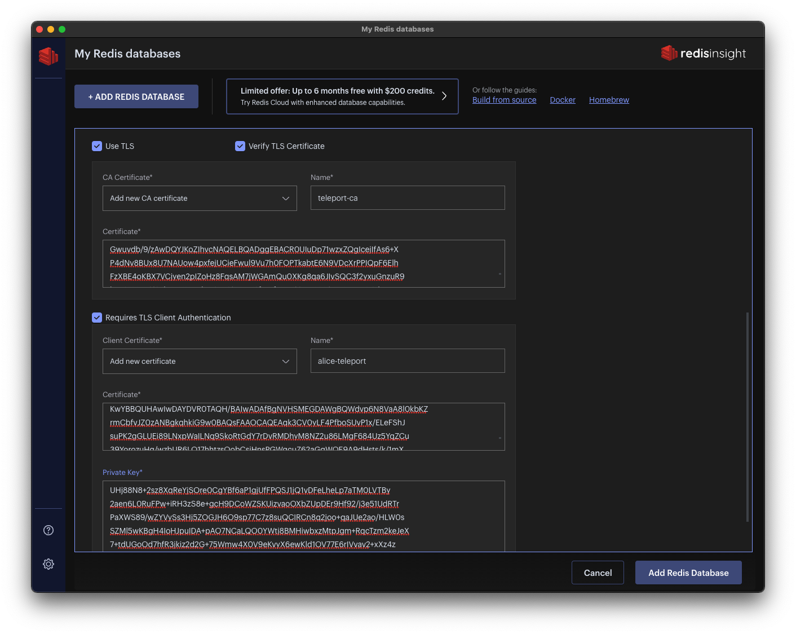

Congratulations! You have just connected to your Redis instance.

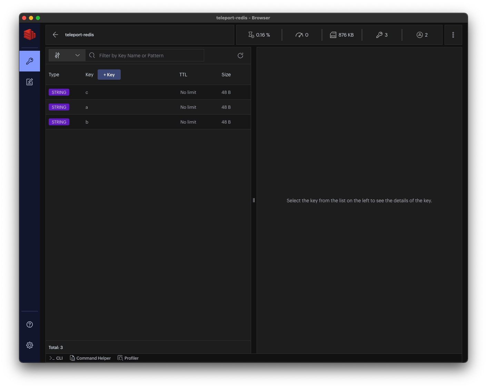

## Snowflake: DBeaver

The Snowflake integration works only in the authenticated proxy mode. Start a local proxy for connections to your Snowflake database by using the command below:
```
tsh proxy db --tunnel --port 2000 snowflake
```

Add a new database by clicking the "add" icon in the top-left corner:

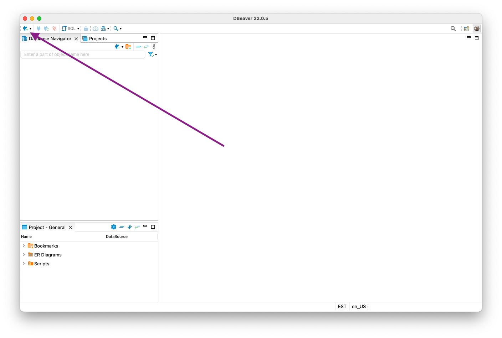

In the search bar of the "Connect to a database" window that opens up, type "snowflake", select the Snowflake driver, and click "Next":

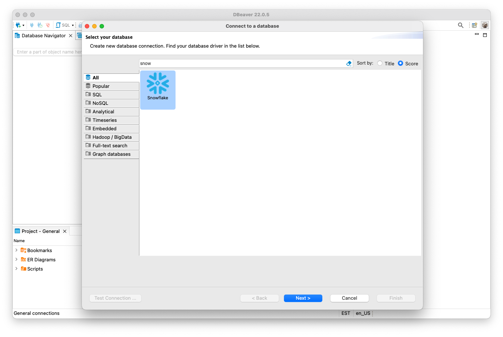

Set "Host" to `localhost` and "Port" to the port returned by the `tsh proxy db` command you ran earlier (`2000` in the example above).
In the "Authentication" section set the "Username" to match the database username passed to Teleport with `--db-user`
and enter any value (e.g., "teleport") in the "Password" field (the value of
 "Password" will be ignored when establishing a connection but is required by DBeaver to register your database):

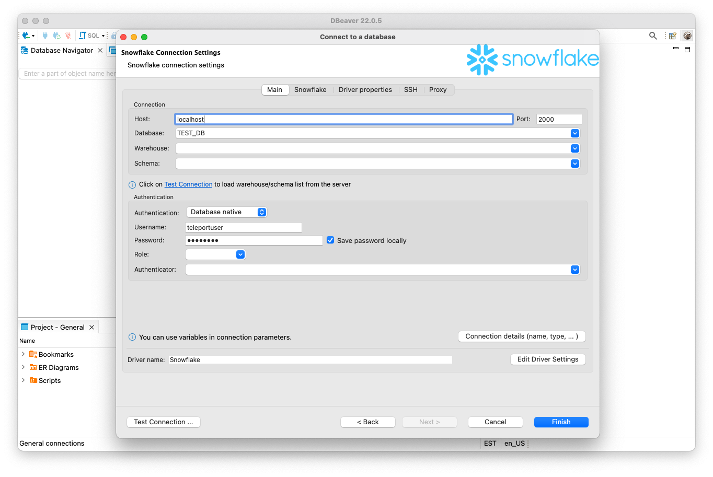

Next, click the "Driver properties" tab and set "account" to any value (e.g., "teleport"; as with "Password", the value of
 "account" will be ignored when establishing a connection but is required by DBeaver to register your database). In "User properties", set "ssl" to `off`:

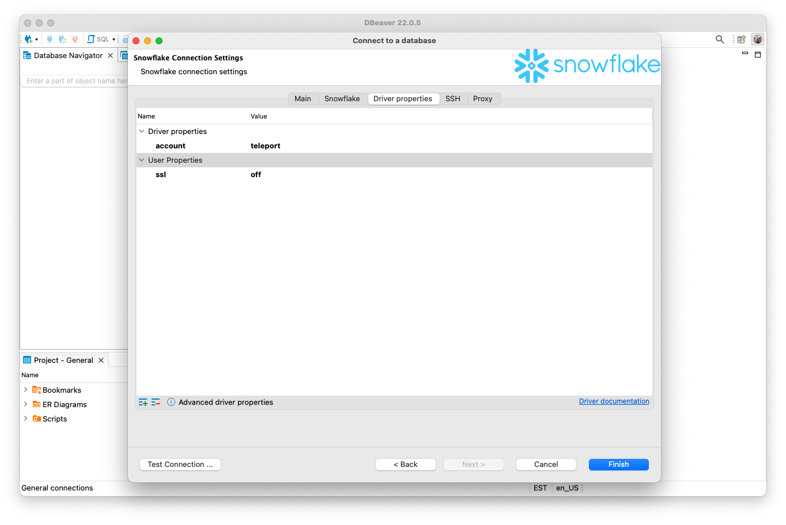

Teleport ignores the provided password and the account name as internally it uses values from the Database Agent configuration.
SSL set to `off` disables only encryption on local machine. Connection to Snowflake is encrypted by Teleport.

Now you can click on "Test Connection..." in the bottom-left corner:

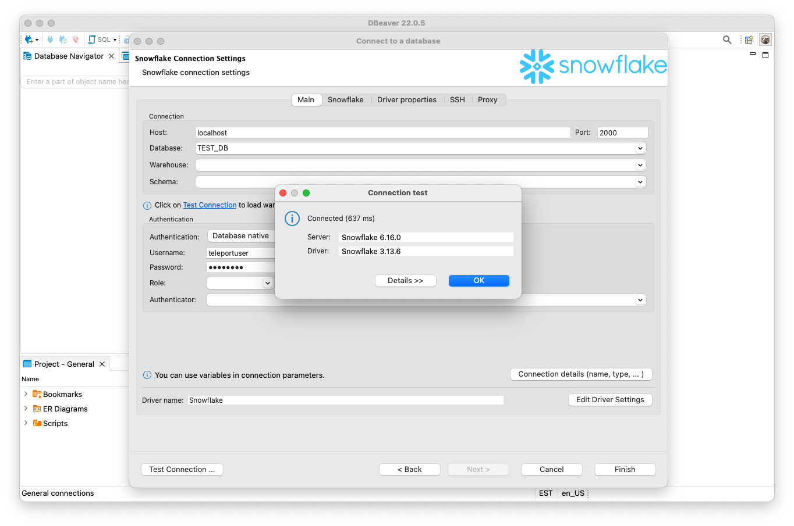

Congratulations! You have just connected to your Snowflake instance.

## Snowflake: JetBrains (IntelliJ, Goland, DataGrip, PyCharm, etc.)

The Snowflake integration works only in the authenticated proxy mode. Start a local proxy for connections to your Snowflake database by using the command below:
```
tsh proxy db --tunnel --port 2000 snowflake
```

In "Database Explorer" click the "add" button, pick "Data Source", and then pick "Snowflake":

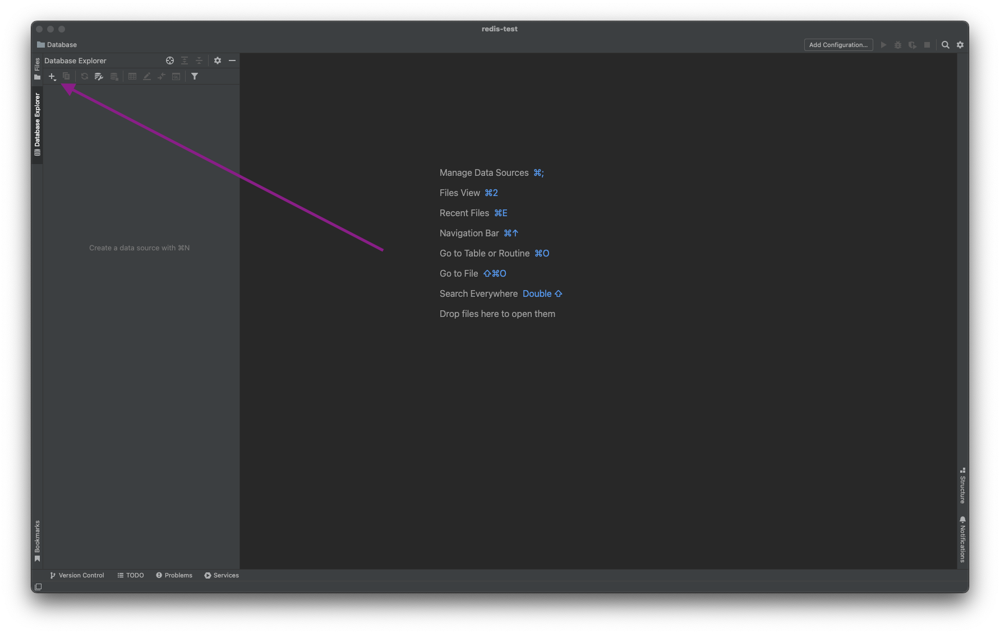

Next, set "Host" to `localhost` and "Port" to the port returned by the `tsh proxy db` command you ran earlier (`2000` in the example above).
Set the "Username" to match the one that you are assuming when you connect to Snowflake
 via Teleport and enter any value (e.g., "teleport") in the "Password" field (the value of
 "Password" will be ignored but is required to create a data source in your IDE):

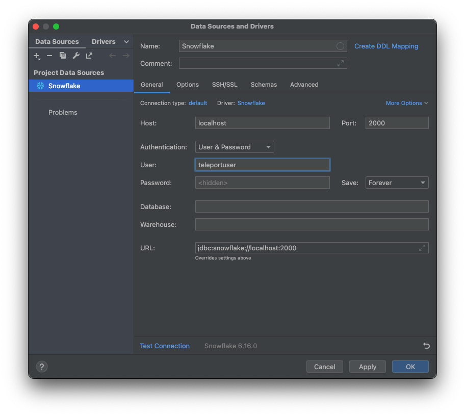

Switch to the "Advanced" tab, set any value (e.g., "teleport") for "account", and add a new record named `ssl` with value `off` (as with "Password", "account" is ignored while establishing the connection but required by your IDE):

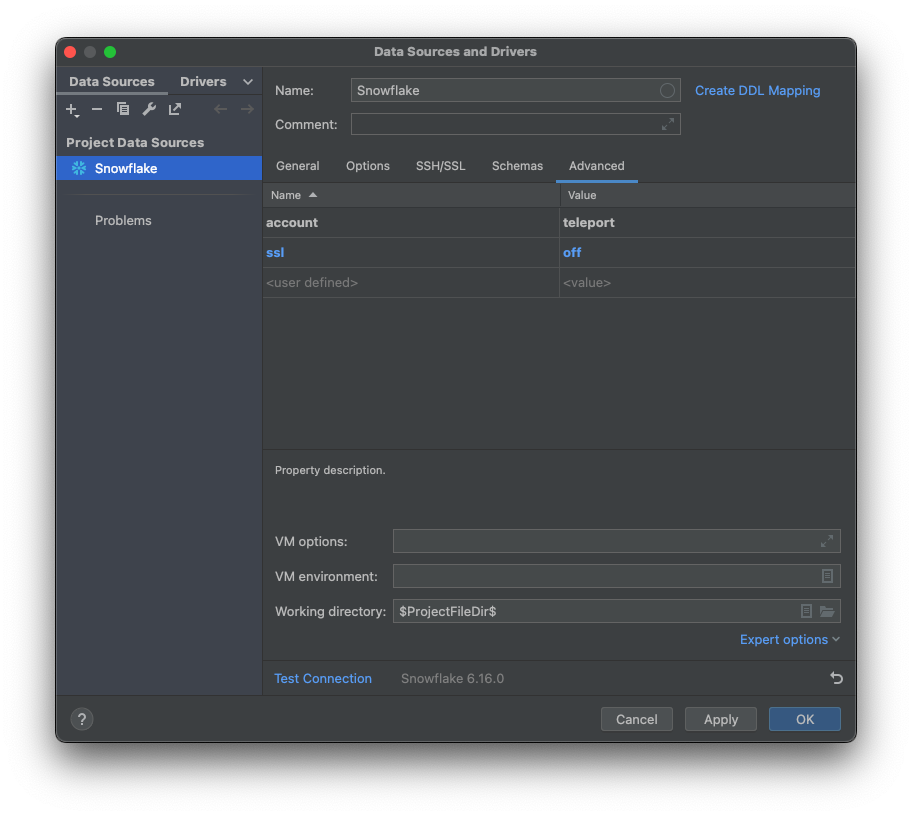

Teleport ignores the provided password and the account name as internally it uses values from the Database Agent configuration.
Setting "SSL" to `off` only disables encryption on your local machine. The connection to Snowflake is encrypted by Teleport.

Now you can click "Test Connection" to check your configuration.

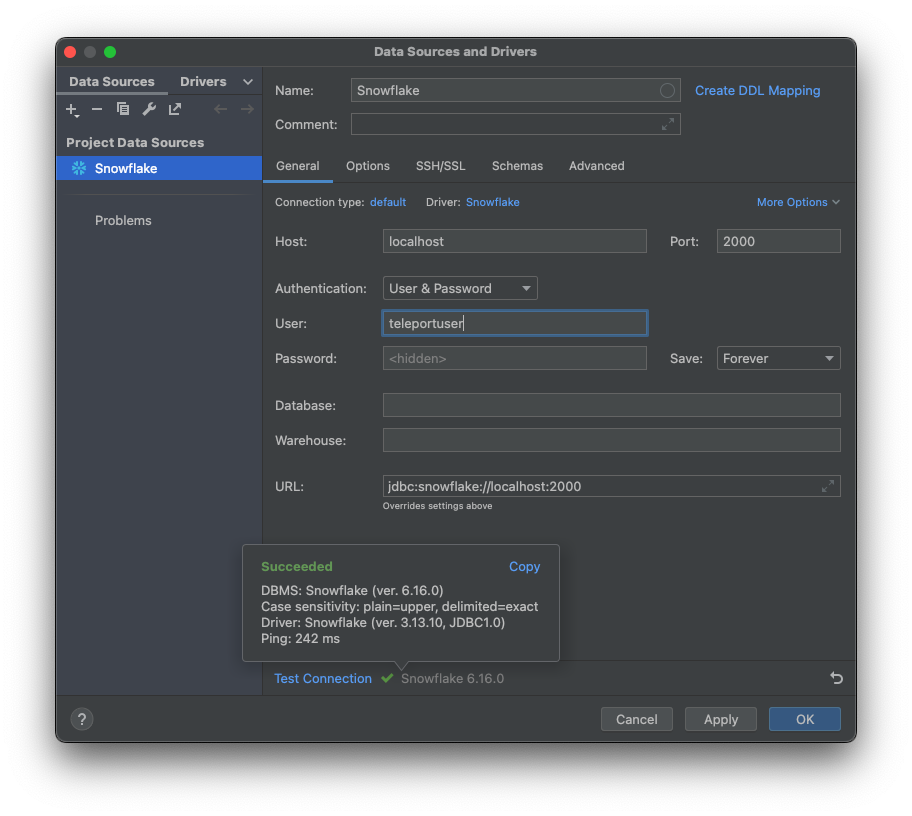

Congratulations! You have just connected to your Snowflake instance.

## SQL Server DataGrip

In the DataGrip connection configuration menu, use your proxy's endpoint. This
is `localhost:4242` in the example below. (See
[Get connection information](./gui-clients.mdx#get-connection-information) for
more information.)

Select the "User & Password" authentication option and keep the "Password" field
empty:

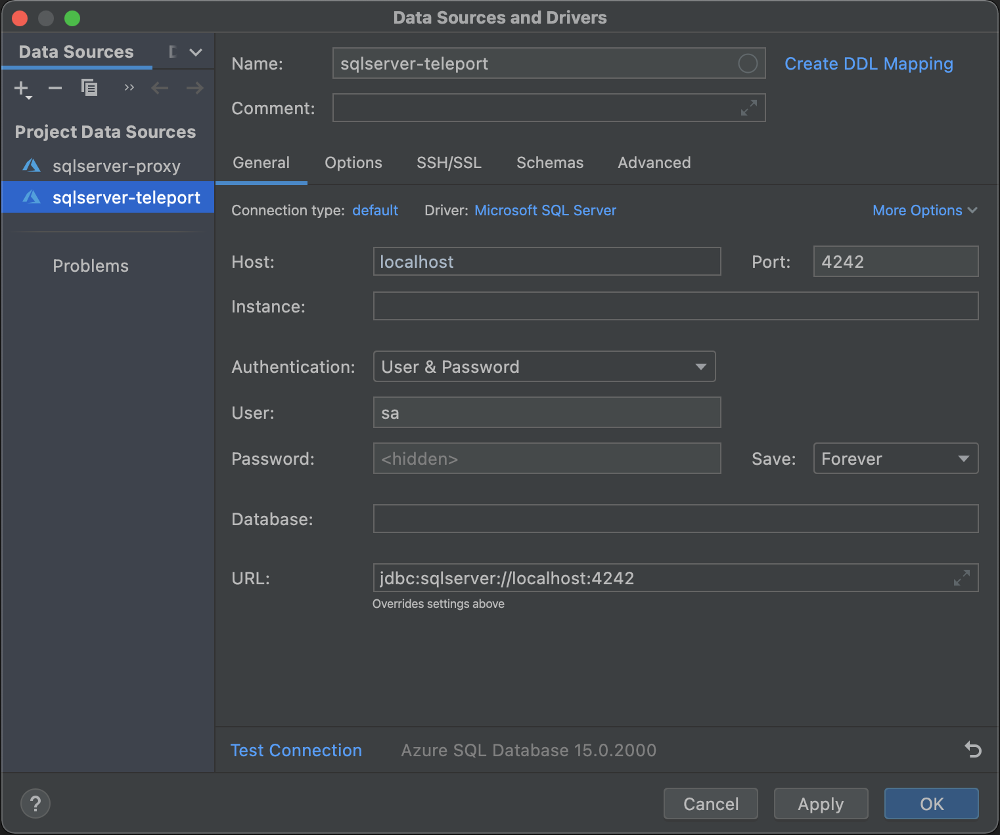

Click "OK" to connect.

## SQL Server DBeaver

In the DBeaver connection configuration menu, use your proxy's endpoint. This is
`localhost:62652` in the example above. (See
[Get connection information](./gui-clients.mdx#get-connection-information) for
more information.)

Use the SQL Server Authentication option and keep the Password field empty:

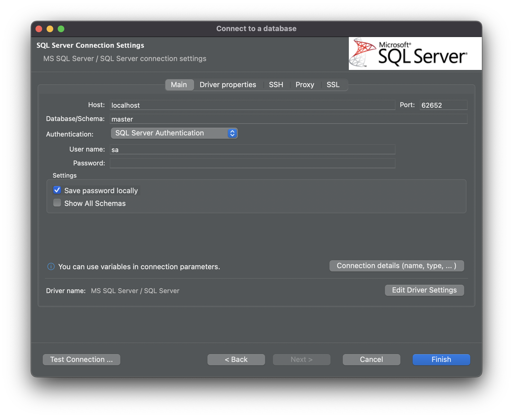

Click OK to connect.

## Cloud Spanner DataGrip

(!docs/pages/includes/database-access/gui-clients/spanner-local-proxy.mdx!)

From the DataGrip menu, click "File > New > Data Source from URL", then copy and
paste the JDBC URL that was output by `tsh proxy db`:

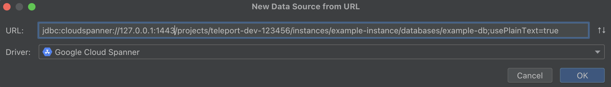

The "Google Cloud Spanner" driver should be automatically selected.
Click "Ok".

DataGrip does not need GCP credentials - those are already provided by Teleport.
On the "General" tab of the new data source, select the "Authentication"
dropdown setting and choose "No auth":

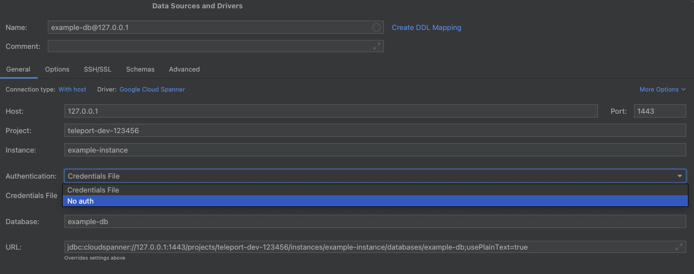

Click "Test connection" to ensure the connection is configured correctly, then
click "Ok" to create the data source.

(!docs/pages/includes/database-access/gui-clients/spanner-reuse-port-note.mdx!)

## Cloud Spanner DBeaver

(!docs/pages/includes/database-access/gui-clients/spanner-local-proxy.mdx!)

From the menu, click "Database > Driver Manager":

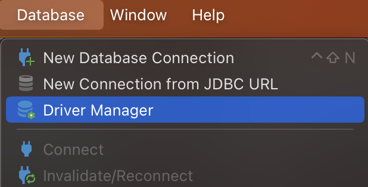

Search for the "Google Cloud Spanner" driver, select it, and click the "Copy"
button to make a custom driver configuration:

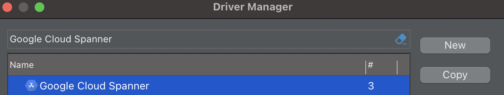

Give the custom driver a name, e.g. "Teleport Spanner", then set "URL Template"
to this pattern string:

```code
jdbc:cloudspanner://127.0.0.1:{port}/projects/{server}/instances/{host}/databases/{database};usePlainText=true
```

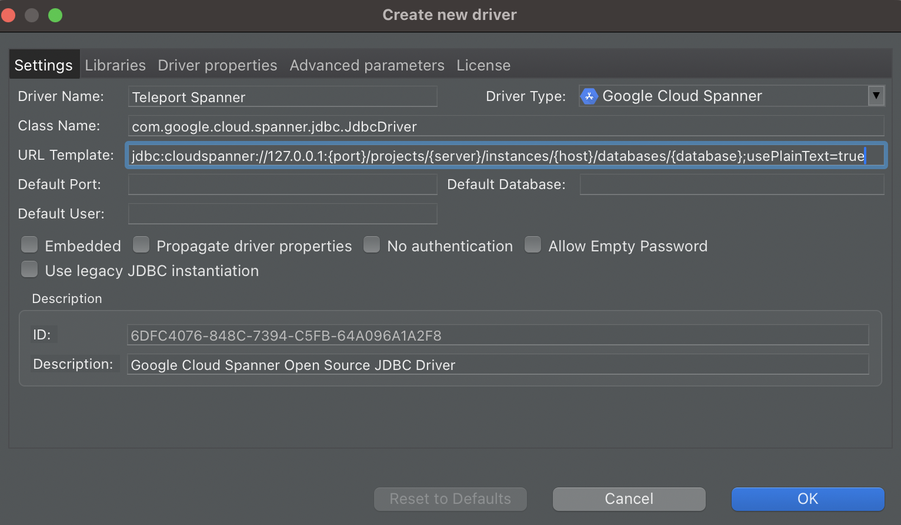

Click "Ok", then click "Close"

From the menu, click "Database > New Connection from JDBC URL":

Now copy the JDBC URL that was output by `tsh proxy db` and paste it:

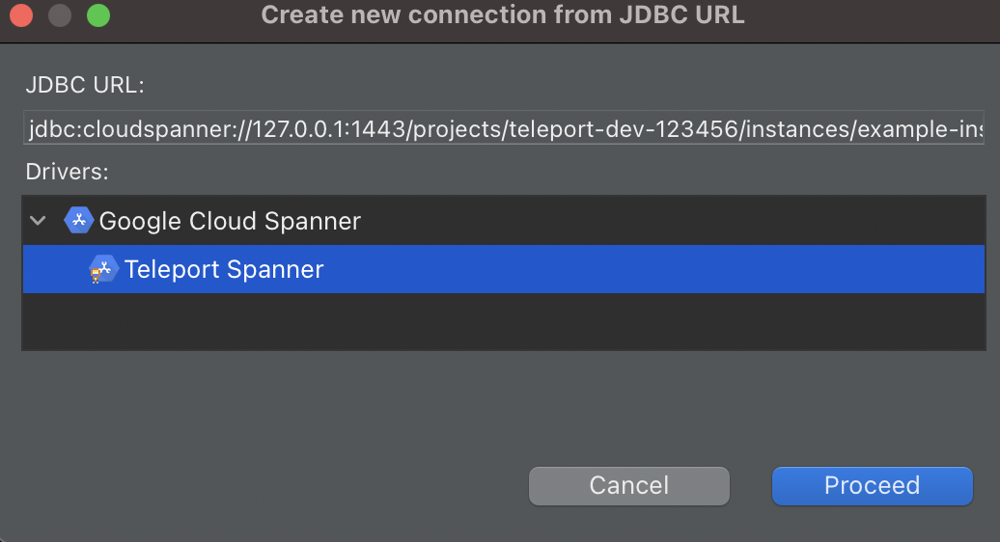

Click "Proceed", then click "Finish".

(!docs/pages/includes/database-access/gui-clients/spanner-reuse-port-note.mdx!)

## Oracle graphical clients

The Oracle integration works only in the authenticated proxy mode. Start a local proxy for connections to your Oracle database by using the command below:

```
> tsh proxy db --tunnel --port 11555 --db-user=<user> --db-name=<db-name> oracle

Started authenticated tunnel for the Oracle database "oracle" in cluster "teleport.example.com" on 127.0.0.1:11555.
```

<Admonition type="tip">
The command above uses the local port 11555, but you can choose any available port. Leaving `--port` empty will cause `tsh` to pick a random one.
</Admonition>

The local proxy supports TCP and TCPS modes. Different clients prefer different modes.

TCP:
- requires no username or password
- generally easier to configure

TCPS:
- requires no username or password
- depends on automatically created wallet
- uses JDBC URL for configuration

<Admonition type="warning">
Teleport versions earlier than 17.2.0 support only a limited range of clients and only offer TCPS mode. `tsh` will automatically detect this situation and warn the user. We recommend updating to the latest version of Teleport to access full client support and additional connection options.
</Admonition>

### Oracle SQL Developer (standalone)

In "Connections" click the "+" button for a new database connection:

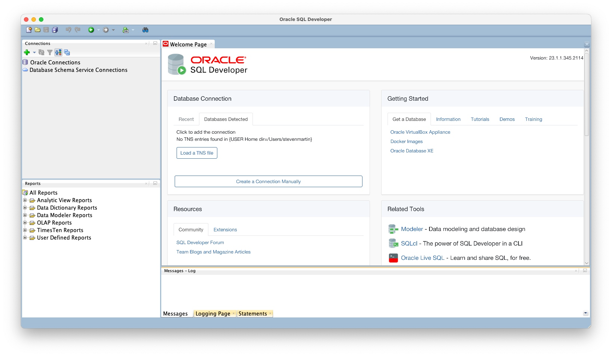

Next, set the name and username from the `--db-user` parameter. Set connection type to "Custom JDBC" and 
set the "Custom JDBC URL" from the `tsh proxy db` command.

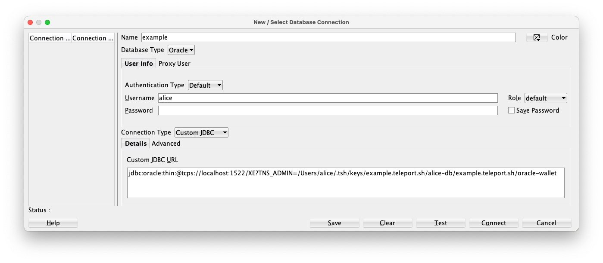

Now you can click "Test" to check your configuration.

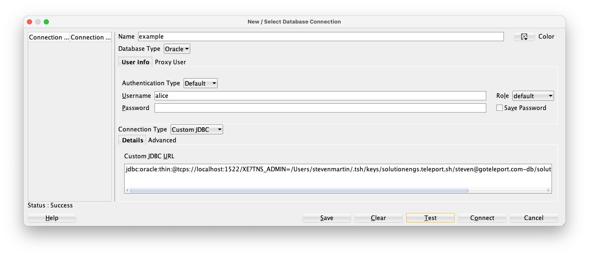

### Oracle SQL Developer (VS Code extension)

Install the extension from [VS Code Marketplace](https://marketplace.visualstudio.com/items?itemName=Oracle.sql-developer).

Both TCP and TCPS modes can be used.

<Tabs>
<TabItem label="TCP">

Open the extension toolbar and click on "Create Connection" button.

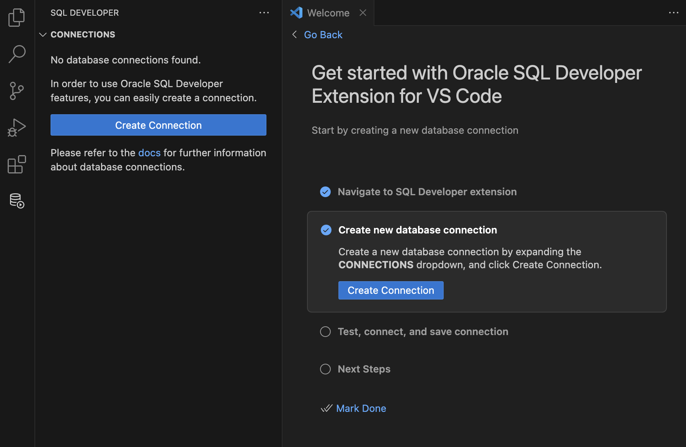

Enter the following connection details:

| Field           | Value                  |
|-----------------|------------------------|
| Connection name | Choose unique name     |
| User name       | `/`                    |
| Password        | `/`                    |
| Save Password   | Mark checkbox          |
| Connection type | Basic                  |
| Host name       | `localhost`            |
| Port number     | `--port` flag value    |
| Type            | Service Name           |
| Service name    | `--db-name` flag value |

Test and create the connection.

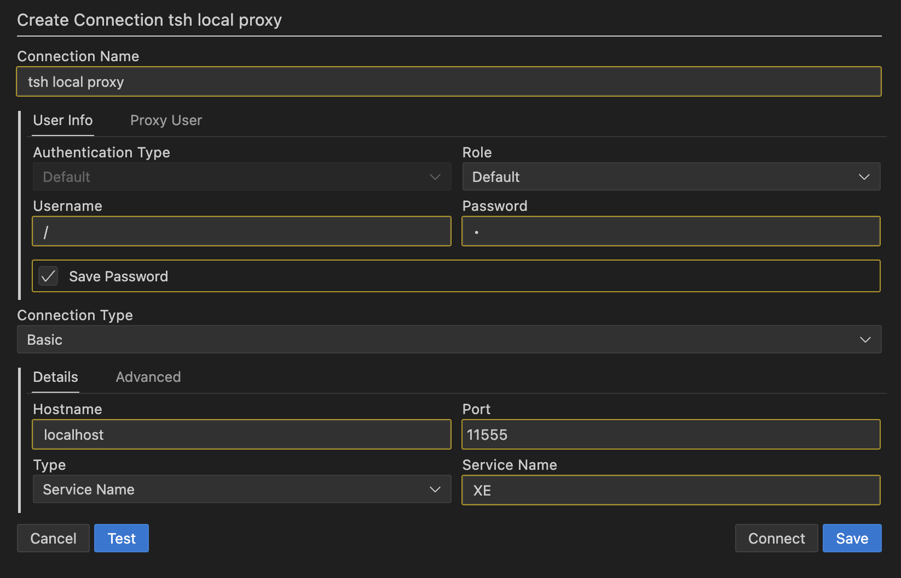

The new connection should appear on the list.


</TabItem>

<TabItem label="TCPS">

Open the extension toolbar and click on "Create Connection" button.


Enter the following connection details:

| Field            | Value                           |
|------------------|---------------------------------|
| Connection name  | (choose per your preference)    |
| User name        | `/`                             |
| Password         | `/`                             |
| Save Password    | Mark the checkbox               |
| Connection type  | "Custom JDBC"                   |
| Custom JDBC URL  | Copy from `tsh proxy db` output |

Test and create the connection.

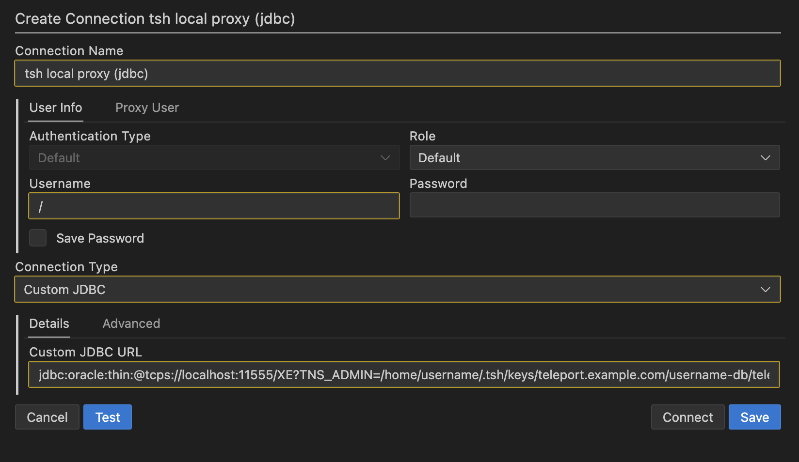

The new connection should appear on the list.

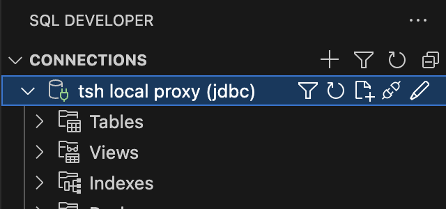


</TabItem>
</Tabs>

### Toad

Add new login record in the logins dialog.

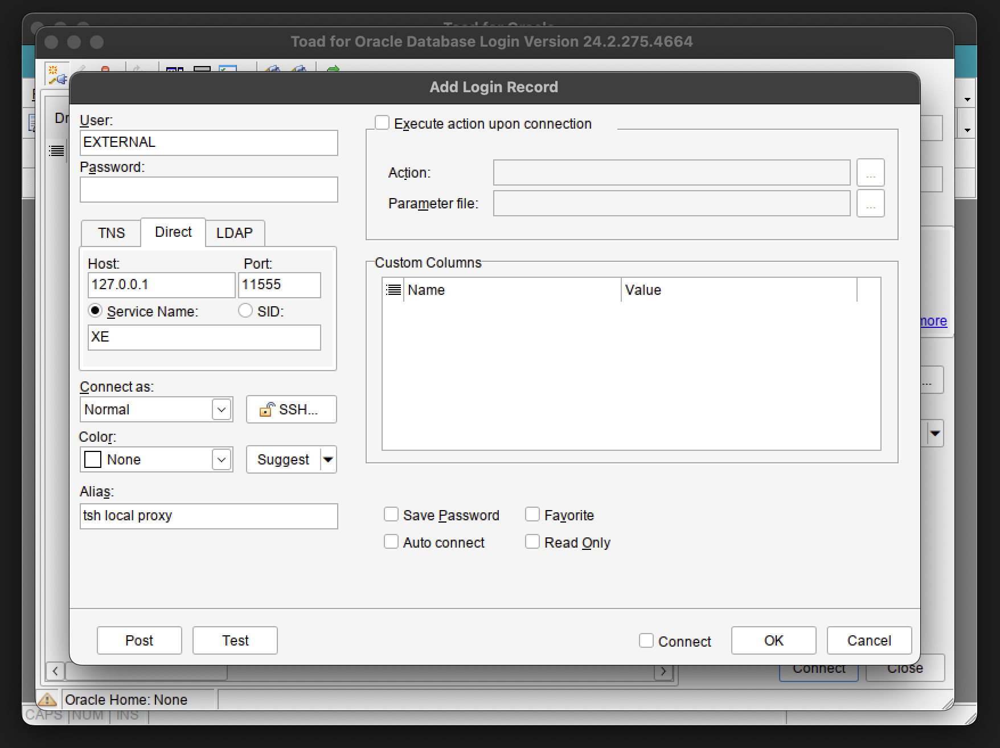

Enter the connection details in "Direct" tab:

| Field           | Value                        |
|-----------------|------------------------------|
| Host name       | `127.0.0.1`                  |
| Port number     | `--port` flag value          |
| Service name    | `--db-name` flag value       |
| User name       | `EXTERNAL`                   |
| Password        | (leave empty)                |
| Connection name | (choose per your preference) |

Test the connection to verify the setup.

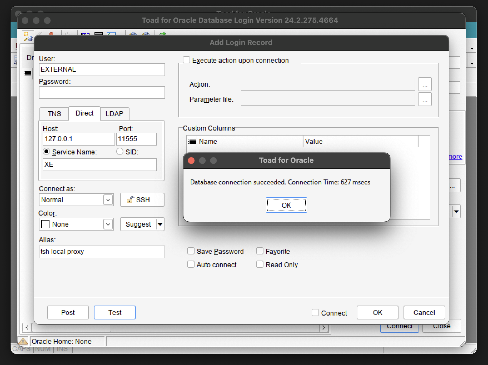

The newly added login should appear on the login list.

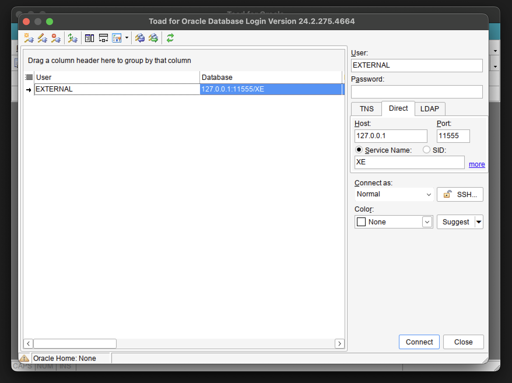

<Admonition type="tip">
You can also configure Toad to use an external Oracle client. Both native and external clients are supported.
</Admonition>

### DBeaver

Click on the "New Database Connection" button.

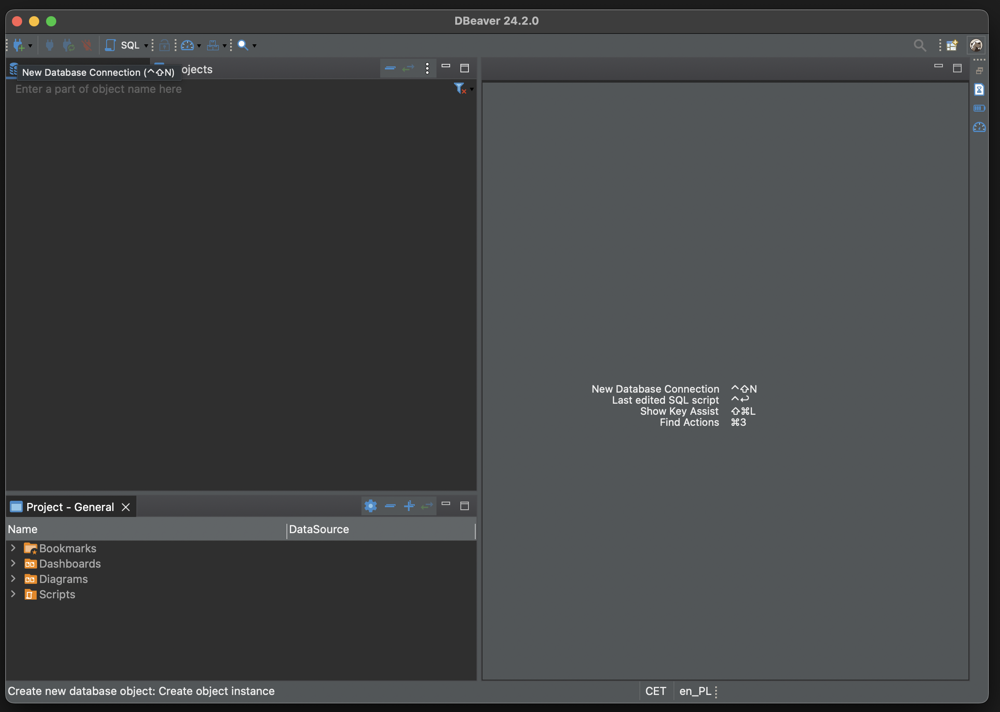

Select "Oracle" from the driver list. You may use the search toolbar to narrow down the list.
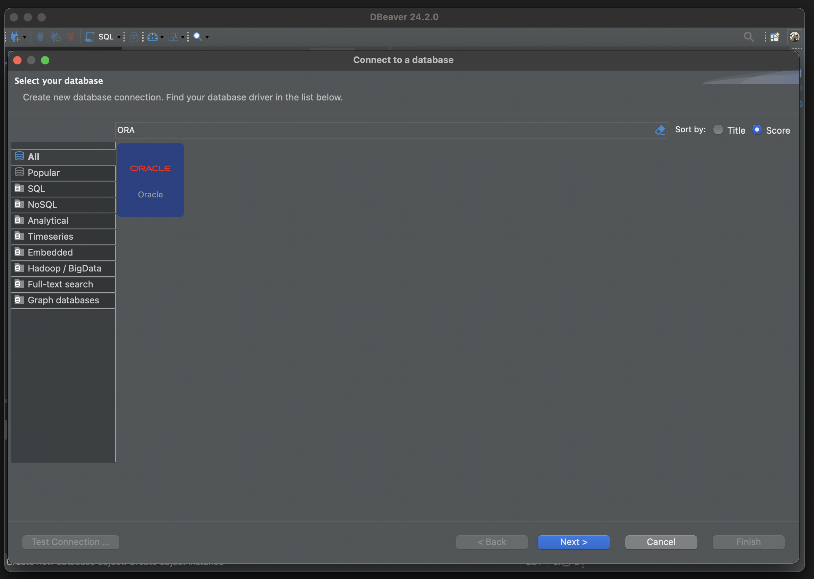

Choose "Custom" connection type and paste the JDBC connection string printed by `tsh proxy db`.


Test the connection to verify the setup. Finalize by clicking "Finish".

